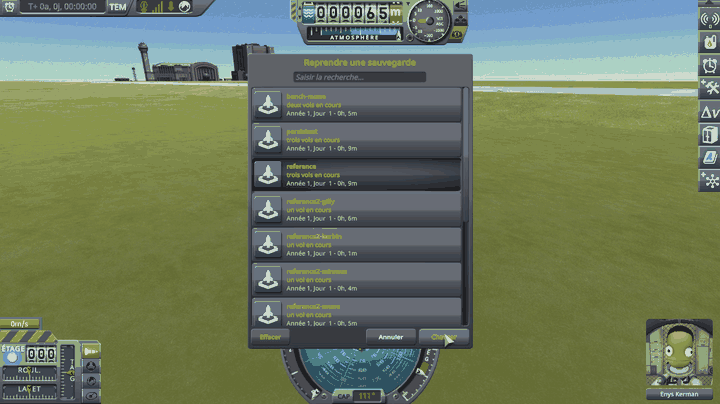

# Terrain Precision Fix

**⚠️ Work in progress.** This is an active investigation, not a finished mod. The figures, the code and the conclusions on this page can still change, and several questions are still open — they are listed in [Limits and solutions](docs/limits-and-solutions.md).

A fix for stock KSP 1.12, meant as a proposal for
[KSP Community Fixes](https://github.com/KSPModdingLibs/KSPCommunityFixes) and kept as small as
possible for that reason: two Harmony patches, in one source file. Here is what they fix:

> **The ground KSP builds under you is never built at the same height twice.** Load the same save five
> times, and the surface your craft is standing on comes back a little higher or a little lower each
> time — a few centimetres apart on Kerbin, less on smaller worlds.

**How this was made.** The investigation and the code were written with Claude, Anthropic's AI
assistant. Everything here was reviewed and validated by a human — me — who very much enjoyed
learning along the way how KSP builds the ground you land on. I am saying so up front, because
contributions made with an AI deserve a closer look than others, and because some people would
rather stop reading here. That look is what this page is built for: every figure on it comes from an
in-game measurement, the instrument behind the headline figures is public and runs on a stock
install, the stock code quoted here is a handful of lines anyone can check, and the fix fits in one
file you can read in a few minutes.

## Why the moving ground matters

Every time you load, it is a coin toss between two outcomes.

**The ground comes back lower than it was when you saved.** Your craft is now hovering a couple of
centimetres above it, so it drops those two centimetres. You never notice, and nothing breaks.

**The ground comes back higher than it was when you saved.** Your craft is now *inside* the ground —
and the physics engine will not leave two solid things overlapping. It pushes them apart, hard, in
the only direction available: up. Your craft gets launched.

*KSP 1.12 without this mod, with [KSP Community Fixes](https://github.com/KSPModdingLibs/KSPCommunityFixes)
as the only mod installed. A pod on an empty fuel tank, parked in the grass at the KSC, saved, then reloaded
from the pause menu, several times if needed — nothing touched in between.*

That second case is the symptom everybody already knows. The lander that twitches, hops or flips the
moment the scene finishes loading. The base that sat perfectly flush yesterday and is buried up to
the hatches today. The big base that tears itself apart the very first time you load it, and never
again afterwards. A craft with many parts spread over a wide area gives the coin toss more chances
to land the wrong way up.

**Loading is not the only time the coin is tossed.** A landed craft you fly towards is loaded long
before you reach it, but held still at the position it was left at; its physics only starts once you
are within 200 m. The ground under it was not built when that position was recorded, so the same toss
happens there. From 200 m away you see much less of it — and it does just as much damage.

Both can be repeated at will — reload the same save, or drive away from a craft left parked and come
back to it — and both are measured on this page.

### Disclaimer: it is not the only cause

The ground moving is one cause among several, and this page does not claim it is the only one. Plenty
of other things move a craft when a scene opens. Two well-known examples, among others:

- **suspensions.** Landing legs and wheels come back fully extended, because that is the only state
  KSP can restore them to. They then compress under the weight of the craft, and the craft moves
  while they do.
- **a craft bent to fit the ground.** While you play, physics twists the joints between parts so the
  craft settles onto the shape of the ground beneath it. That twisting is not saved. On loading, the
  craft comes back in its original, unbent shape — and if the ground is not flat, part of it really
  *is* underground, with no measurement error involved.

This mod removes that one cause, and only that one: a lander that hops because its legs are still
unfolding will go on hopping once it is installed. What it takes away is the part that should never
have been there at all — a surface that is not where the game's own formulas say it is, and is not in
the same place twice. It takes it away down to a hundredth of a millimetre, measured below.

## The culprit

Stock places a terrain quad, and every vertex inside it, through a Unity `Transform`: a vector 600 km
long stored in a float, where a step is 62.5 mm. Each value is rounded on its own. What draws a new set
of roundings at every load is the frame they go through, whose rotation and translation both move while
you play.

**→ Full chapter: [The culprit](docs/the-culprit.md)**

## Checking the culprit

A craft is put back onto the ground in two ways: when a save hands it back, and when you come close
enough for its physics to start again, in the middle of a flight with nothing loaded at all. Both are
measured, before anything is changed and again with this mod installed, with two instruments: one
reads the landed craft, the other the ground itself. A third protocol takes the first way apart.

**Loading the same save**, six times over, on Kerbin, the Mun, Minmus and Gilly. On Kerbin the craft
comes to rest over a spread of 134.5 mm without this mod and 0.004 mm with it, and the collision
surface under it, read against the height KSP computes for that same spot, over 108.1 mm without it
and 0.004 mm with it.

**→ Full chapter: [Checking the culprit: loading the same save](docs/checking-the-culprit-loading.md)**

**Coming back to a craft left parked**, six round trips in a single flight on Kerbin: the craft comes
to rest over a spread of 21.8 mm without this mod and 0.094 mm with it, and the ground under it comes
back over 21.8 mm without it and 0.011 mm with it.

**→ Full chapter: [Checking the culprit: coming back to a craft left parked](docs/checking-the-culprit-approach.md)**

**Switching to a craft far away**: the save loaded while the craft is two kilometres from the one being
flown, then the game's *switch vessel* key pressed to fly it, six times on Kerbin. The ground under it
is built when the save is loaded, and the switch does not move it: the craft comes to rest on it over
a spread of 104.5 mm without this mod and 0.022 mm with it, the ground spreads over 120.4 mm without
it and 0.003 mm with it.

**→ Full chapter: [Checking the culprit: switching to a craft far away](docs/checking-the-culprit-switching.md)**

## What moves the frame

The culprit explains the rounding, and the measurements above show it drawn anew every time. What
draws it anew is the frame the ground is converted through — how the body is turned in Unity's world,
and where it sits in it — which does not stay put. Knowing how it moves is what rules out the obvious
remedy, putting it back in place when a save is loaded ([why, in The fix this mod
proposes](docs/the-fix-this-mod-proposes.md#two-ways-out-one-taken)).

That frame is read on a stock install by a third instrument,
[Terrain Precision Fix Diag 3](https://github.com/lhervier/KSP-TerrainPrecisionFixDiag3).
Its measurements show it moving in situations every player meets, none of which the save records. At
every load, its angle comes back off by the time played since the save. On the way to orbit and back,
it keeps turning with the planet above the altitude where the rotating frame is left. And on the
ground, it moves each time the floating origin shifts under a craft being driven — except while
another landed craft is loaded nearby: the origin then stays put however far you go, and catches up
all at once when that craft is unloaded.

**→ Full chapter: [What the measurements show](https://github.com/lhervier/KSP-TerrainPrecisionFixDiag3/blob/master/docs/what-the-measurements-show.md), on the page of Diag 3**

## The fix this mod proposes

Two Harmony patches redo in double the two placements that go through a float at planet scale: the
origin of each quad, and each vertex inside it. The two 600 km vectors cancel before anything reaches a
float, which is then only asked to hold a distance within the quad. Only the quads a craft can stand on
are touched, a correction larger than 1 m is refused, and if one patch fails to install none of them
does anything.

**→ Full chapter: [The fix this mod proposes](docs/the-fix-this-mod-proposes.md)**

## Performance

Measured with [PQS Bench](https://github.com/lhervier/KSP-PQSBench), against stock and against
stock with its two `Transform`s read once per quad: the fix places a vertex in about 110 ns where stock
takes about 290 ns in the same run, 183 ns less on average, 2.7× faster. A little more than half of that
saving is the double-precision arithmetic, the rest the work done once per quad instead of once per
vertex. Timed frame by frame with [KSPProfiler](https://github.com/KSPModdingLibs/KSPProfiler), the
three configurations cannot be told apart.

**→ Full chapter: [Performance](docs/performance.md)**

## Limits and solutions

Everything that stands on the ground, or is placed from it, has to be checked against this fix, one
case at a time — a work in progress, with a chapter per case saying where it stands: checked, affected,
or still to be tested. The cases go from other mods (KSP Community Fixes, Kopernicus and planet packs,
Parallax, Kerbal Konstructs, Deferred…) to what stock itself places on the ground (scatter, the KSC
statics, Breaking Ground) and to situations (rescaled systems such as Real Solar System, slopes,
existing saves, the map view…). Each affected case says what changes there and, where there is one,
what solves it; each untested one says how it will be tested.

**→ Full chapter: [Limits and solutions](docs/limits-and-solutions.md)**

## Install

Requires KSP 1.12 and [HarmonyKSP](https://github.com/KSPModdingLibs/HarmonyKSP) (the usual
`GameData/000_Harmony`, also installed by KSP Community Fixes).

Copy `GameData/TerrainPrecisionFixMod` into the `GameData` of KSP. Nothing is written to your saves:
removing the folder gives you the stock terrain back.

## Settings

`GameData/TerrainPrecisionFixMod/PluginData/settings.cfg` holds a single value, read when KSP starts:

| `logLevel` | what goes to `KSP.log` |
|---|---|
| `Info` (default) | one line at startup, then one line per body the first time its terrain is corrected |
| `Debug` | adds one line per quad placed, with how far it was moved |
| `Trace` | adds, per quad, how far its vertices were moved within it — slower, meant for measuring |

`Error` and `Warning` are accepted too. To change it: quit KSP, edit the file, start KSP again.

## Build

Set `KSPDIR` to your KSP install folder, which must contain `GameData/000_Harmony`, and run `build.bat`.
It needs the .NET SDK, and produces `GameData/TerrainPrecisionFixMod/TerrainPrecisionFixMod.dll`.

## License

MIT
