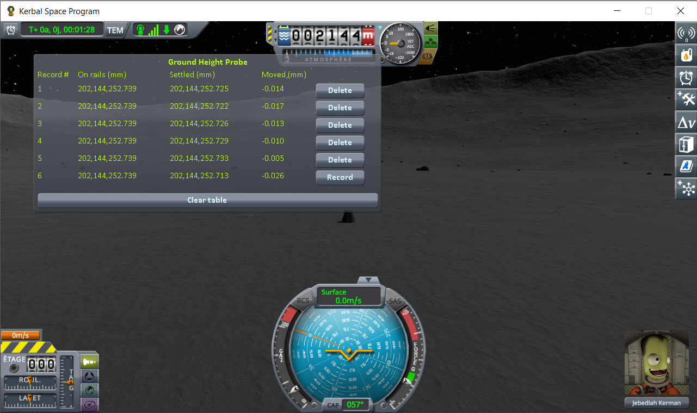
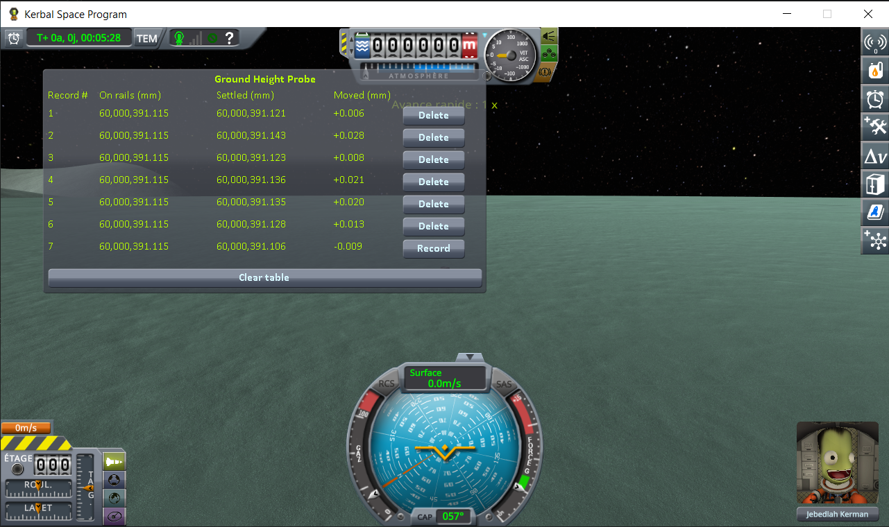
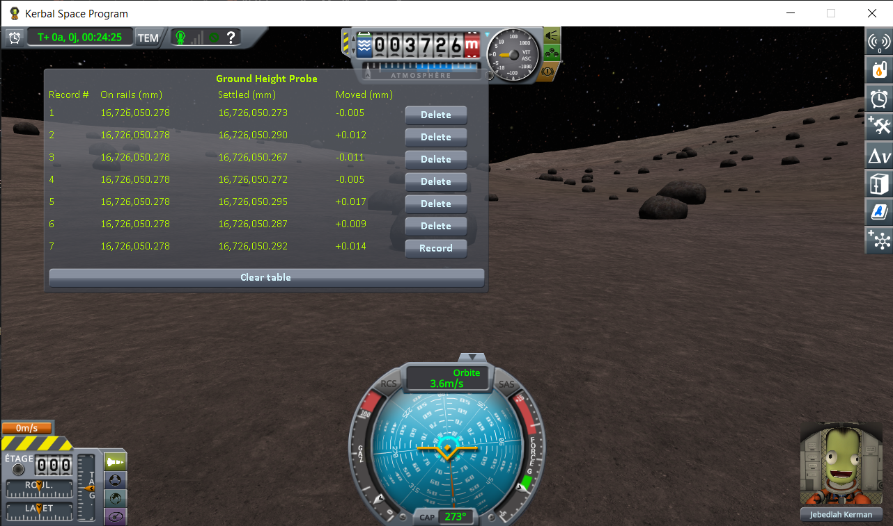
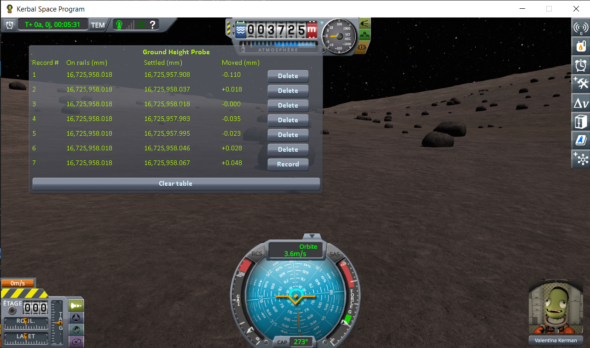

# Terrain Precision Fix

A fix for stock KSP 1.12: every time a scene loads, the terrain is built a few centimetres higher or
lower than the time before. With this mod it comes back at the same place, to a tenth of a millimetre.

It is meant as a proposal for [KSP Community Fixes](https://github.com/KSPModdingLibs/KSPCommunityFixes),
and kept as small as possible for that reason: two Harmony patches, in one source file.

## The problem

[Ground Height Probe](https://github.com/lhervier/KSP-GroundFix-Mod1) shows it on a stock install. It
reloads the same save several times, and measures the distance from a landed capsule to the centre of
the body twice per load: as the save hands the capsule back, and once it has settled on the ground. The
first value is the same on every load, to the micrometre. The second is not:

| body | spread of the settled height, over 6 loads of the same save |
|---|---|
| Kerbin | 135.5 mm |
| Mun | 18.1 mm |
| Minmus | 3.9 mm |
| Gilly | 1.2 mm |

The capsule is put back at the same place every time, and still comes to rest somewhere else: the
ground under it has moved. Nothing but Squad and the probe was installed.

That is enough to cause familiar symptoms: a landed craft that hops as the scene loads, a base that sat
flush on one load and is half buried on the next, a large base that tears itself apart on its first
load but not after a reload.

## Why it happens

Four observations, all made with values any mod can read, point to a single cause.

**1. The spread follows the precision of a float at that distance from the centre of the body.** A
single precision float holding 600 km can only change in steps of 62.5 mm; holding 60 km, in steps of
3.9 mm. From one body to the next the spread varies a hundredfold, but counted in those steps it stays
between one and three:

| series | distance to the centre | float step there | spread | in steps |
|---|---|---|---|---|
| Kerbin, capsule | 600.1 km | 62.5 mm | 135.5 mm | 2.2 |
| Kerbin, 2 parts | 600.1 km | 62.5 mm | 129.9 mm | 2.1 |
| Mun, capsule | 204.1 km | 15.6 mm | 18.1 mm | 1.2 |
| Mun, 2 parts | 204.1 km | 15.6 mm | 43.4 mm | 2.8 |
| Minmus, capsule | 60.0 km | 3.9 mm | 3.9 mm | 1.0 |
| Minmus, 2 parts | 60.0 km | 3.9 mm | 7.3 mm | 1.9 |
| Gilly, capsule | 15.9 km | 0.98 mm | 1.2 mm | 1.2 |
| Gilly, 2 parts | 16.6 km | 1.95 mm | 2.3 mm | 1.2 |

That alone is only a hint. The next two observations are direct.

**2. Terrain quads are not where their own coordinates say.** Each terrain quad exposes its origin,
relative to the centre of the body, in double precision: `PQ.positionPlanet`. The altitude it gives
never changes (64.7851 m under a craft landed near the KSC). The altitude of the quad's transform, the
one the mesh actually hangs from, does:

- six loads without quitting KSP: +27.8, +18.4, +7.3, +18.6, −87.8, −4.0 mm;
- five separate launches of KSP: −74.4, +68.2, −36.4, +78.4, +145.7 mm.

It is the same quad, at the same subdivision level, on every load: this is not a level of detail
change.

**3. The mesh is deformed, not only moved.** Three points 100 m apart on that quad hit the same
triangles on every load, yet the height differences between them change from load to load, by −7 to
+53 mm. The vertices are rounded independently of each other.

**4. What differs between two loads is the orientation of the world frame.** The rotation angle of
the body is identical on every load of the same save. The angle of KSP's world frame,
`Planetarium.InverseRotAngle`, never is, not even after restarting KSP. A rounding depends on the exact
value being rounded, and terrain positions expressed in that frame are different values on each load.
The two launches with the closest angles (0.075° apart) gave the closest offsets (+78.4 and +68.2 mm).

### Where it happens

The stock code, decompiled from KSP 1.12.5, shows exactly where. This is how every terrain vertex is
placed, in `PQS.BuildVertexSurfaceRelative` (`vertRel` and `planetRel` are `Vector3d` fields):

```csharp
private void BuildVertexSurfaceRelative(VertexBuildData data)
{
    vertRel = vbData.directionFromCenter * vbData.vertHeight;
    planetRel = base.transform.TransformPoint(vertRel);
    verts[vertexIndex] = vertRel;
    buildQuad.verts[vertexIndex] = buildQuad.transform.InverseTransformPoint(planetRel);
}
```

`vertRel` is the vertex relative to the centre of the body, computed in double: a vector 600 km long
on Kerbin. `TransformPoint` turns it into a world position, which in KSP is close to the craft. To get
there, it adds that 600 km vector to the position of the centre of the body, another vector of about
600 km pointing the other way, and keeps the difference. A `Transform` works in `float`, so both go
through a float on the way, rounded to the nearest 62.5 mm, and what is left once they cancel out is
off by centimetres. `InverseTransformPoint` then expresses that point relative to the quad, whose own
position was obtained the same way:

```csharp
// PQ.SetupQuad and PQ.PreciseUpdateSubQuadsPosition — positionPlanet is a Vector3d
quadTransform.localPosition = positionPlanet;
```

A 600 km double stored in a float `localPosition`, under a parent that sits at the centre of the body.

That explains observations 2 and 3, the origin and the vertices. Observation 4 explains why the result
differs at every load: the rounding depends on the exact values rounded, and those values change with
the orientation of the world frame. The last proof is the fix itself: it changes nothing but the order
of the arithmetic, and the spread disappears.

## What the fix does

The two stock placements that go through a float at planet scale are redone in double, on the quads
of the highest subdivision level. Those are the ones craft stand on, the only ones with a collider as
far as every measurement so far goes (see [TODO.md](TODO.md)), and the only ones that can keep a
precise position: stock moves them to a container of their
own, outside the body's hierarchy. Every other quad hangs from the body's terrain sphere, whose origin
is the centre of the body, so Unity would store any position given to it as a 600 km float again.
Those are left exactly as stock builds them.

- **The origin of each quad.** After `PQ.SetupQuad` and `PQ.PreciseUpdateSubQuadsPosition`, the quad
  is moved to `body.rotation * positionPlanet + body.position`, computed with `QuaternionD` and
  `Vector3d`. The result is a world position, relative to the floating origin: near the craft it is a
  short vector, which a float holds precisely.
- **Each vertex, inside its quad.** `PQS.BuildVertexSurfaceRelative` is replaced by the same
  computation with the subtraction done first: the vertex minus the quad origin, both doubles relative
  to the centre of the body, then rotated into the quad's frame. What reaches a float is a distance
  within the quad, a couple of kilometres at most, instead of 600 km: a resolution of about 0.1 mm
  instead of 62.5 mm.

This is not a new way of placing the terrain. It is the stock placement, evaluated in an order that
does not throw away its own significant digits.

Two frames look like more obvious choices, and both are wrong. `PQS.GetWorldPosition` misses by about
750 km on the body being flown over. The rotation of the body's transform is the same rotation as
`body.rotation`, but in float: on a 600 km vector, that alone is worth 36 mm.

Two safeguards:

- a correction larger than 1 m is refused, quad by quad, and that quad is left as stock builds it: if
  the frame is ever not the expected one, the terrain stays where KSP puts it instead of going
  somewhere else;
- if any patch fails to install, none of them does anything.

## Results

The same test as on the [Ground Height Probe](https://github.com/lhervier/KSP-GroundFix-Mod1) page,
with this mod installed: a lone capsule on the same four worlds, stock KSP 1.12.5 with Harmony and
ModuleManager, the same save loaded five or six times per world.








(The bottom line of each table is the loading in progress, still live. It is not counted below.)

| world | loadings | spread of **Settled**, stock | spread of **Settled**, with this mod |
|---|---|---|---|
| Kerbin | 6 | 135.5 mm | 0.069 mm |
| Mun | 5 | 18.1 mm | 0.011 mm |
| Minmus | 6 | 3.9 mm | 0.022 mm |
| Gilly | 6 | 1.2 mm | 0.028 mm |

On Kerbin, the spread is about two thousand times smaller. What is left is a few hundredths of a
millimetre on every world, far below the float step at any of these distances. **On rails** is
identical on every line of every series, so KSP put the capsule back at the same place every time, and
the capsule now comes to rest at the same place every time too.

Each series uses its own spot, chosen by the probe's rules: flat bare ground, no `Moving Vessel` line in
`KSP.log`, and a capsule that does not slide.

### With two parts

The same capsule sitting on a small flat fuel tank, as on the probe page:




| world | loadings | spread of **Settled**, stock | spread of **Settled**, with this mod |
|---|---|---|---|
| Kerbin | 6 | 129.9 mm | 0.036 mm |
| Mun | 5 | 43.4 mm | 0.068 mm |
| Minmus | 6 | 7.3 mm | 0.012 mm |
| Gilly | 6 | 2.3 mm | 0.138 mm |

### What happens underneath

Measured on Kerbin, same save loaded six times, with the fix (before it was extracted from the larger
mod it was written in, whose other features do not touch the terrain):

| under a landed craft | measured |
|---|---|
| quad origin, compared with its double position | 0.00 mm on all six loads (−87.8 to +145.7 mm without the fix, above) |
| altitude of the collision surface, found by raycast | 64.7794 m on all six loads |
| collision surface minus the analytic terrain height (`CelestialBody.TerrainAltitude`) | −5.49 to −5.54 mm |

The remaining −5.5 mm is not an error: a flat triangle passes below the curved surface it approximates,
by L²/8R, which is 5.8 mm for 167 m triangles on a 600 km radius. It is the same on every load.

On the Mun, the quad origin matched its double position to 0.00 mm on six loads too.

### Rocks, grass and trees

The fix does not move terrain scatter, and does not fix it either. A second instrument,
[Rock Offset Probe](https://github.com/lhervier/KSP-GroundFix-Mod2), measures it: for every object of
the terrain quad nearest to the craft, the height of its lowest point above the ground right under it.

In stock, scatter is already not placed exactly on the ground. The objects of a quad hang from a holder
that `PQSMod_LandClassScatterQuad.Setup` places under the terrain sphere, at
`localPosition = quad.positionPlanet`: a vector hundreds of kilometres long, in a float. Unity draws the
holder with its local to world matrix, and the translation of that matrix differs from the holder's own
transform position by whole float steps. The objects are drawn that much above or below the ground,
differently on each quad and on each load. With this fix the ground is placed in double precision and
the holders are not, so the stock error on the quad origin adds to that one.

Kerbin, next to the KSC, the same save loaded six times per series, over the 118 holders of 64 quads:

| offset of the scatter from the ground | stock | with this mod |
|---|---|---|
| range | −85.5 to +64.7 mm | −66.3 to +152.0 mm |
| standard deviation | 29.7 mm | 44.4 mm |

The same kind of error, about one and a half times wider. On the quad nearest to the craft, the height
of the objects minus those two errors is the same on every load of both series, to 1.5 mm: nothing else
moves them. Stock scatter has no collider, so this is visual only. No fix is planned for it (see
[TODO.md](TODO.md)).

## What has not been checked

- Only measured on stock KSP 1.12.5 (plus Harmony and ModuleManager): the probe on Kerbin, the Mun,
  Minmus and Gilly, with one part and with two; the quad origins on Kerbin and the Mun.
- Not measured yet: flight at speed and the map view, where quads are built and destroyed all the
  time; the cost of the vertex patch, which runs for every vertex of every quad built; Kopernicus and
  Parallax, which work on the same terrain pipeline. Kopernicus compatibility is a requirement before
  this goes anywhere (see [TODO.md](TODO.md)).
- Parallax scatters: according to its source, they should follow the corrected ground. Their positions
  and colliders are expressed relative to the quad, and a collider is a child of its quad, so they move
  with it. Not measured yet (see [TODO.md](TODO.md)).
- Not covered yet, and listed in [TODO.md](TODO.md): everything else that is placed on the ground the
  same way.
  - Breaking Ground's surface features: they are placed like the rocks above, but they have
    colliders. Where they are drawn is covered by the rock measurement; where the physics puts their
    colliders has not been measured.
  - The KSC buildings, runway and launchpad: `PQSCity` and `PQSCity2` both do
    `base.transform.localPosition = planetRelativePosition;`, where `planetRelativePosition` is a
    `Vector3d` measured from the centre of the body. A capsule parked on the runway spreads over 117 mm
    on six loads, as on the grass next to it; whether that comes from the runway itself or from the
    terrain underneath has not been separated yet.

## Install

Requires KSP 1.12 and [HarmonyKSP](https://github.com/KSPModdingLibs/HarmonyKSP) (the usual
`GameData/000_Harmony`, also installed by KSP Community Fixes).

Copy `GameData/TerrainPrecisionFix` into the `GameData` of KSP. Nothing is written to your saves:
removing the folder gives you the stock terrain back.

## Settings

`GameData/TerrainPrecisionFix/PluginData/settings.cfg` holds a single value, read when KSP starts:

| `logLevel` | what goes to `KSP.log` |
|---|---|
| `Info` (default) | one line at startup, then one line per body the first time its terrain is corrected |
| `Debug` | adds one line per quad placed, with how far it was moved |
| `Trace` | adds, per quad, how far its vertices were moved within it — slower, meant for measuring |

`Error` and `Warning` are accepted too. To change it: quit KSP, edit the file, start KSP again.

## Build

Set `KSPDIR` to your KSP install folder, which must contain `GameData/000_Harmony`, and run `build.bat`.
It needs the .NET SDK, and produces `GameData/TerrainPrecisionFix/TerrainPrecisionFix.dll`.

## How this was made

The investigation and the code were done together with Claude, Anthropic's AI assistant: measurement
campaigns in game, and reading the decompiled stock code to find where the precision is lost. I am
saying so because it is true, and because contributions made with an AI deserve a closer look than
others. That look is what this page is built for: every figure on it comes from an in-game measurement,
the instrument behind the headline figures is public and runs on a stock install, the stock code quoted
here is a handful of lines anyone can check in a decompiler, and the fix fits in one file you can read
in a few minutes.

## License

MIT
