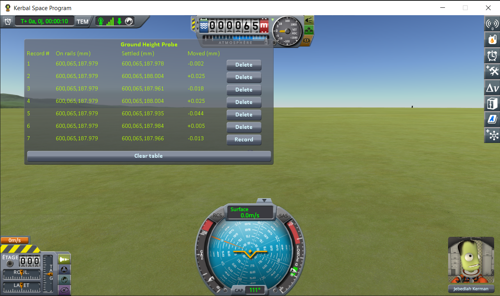
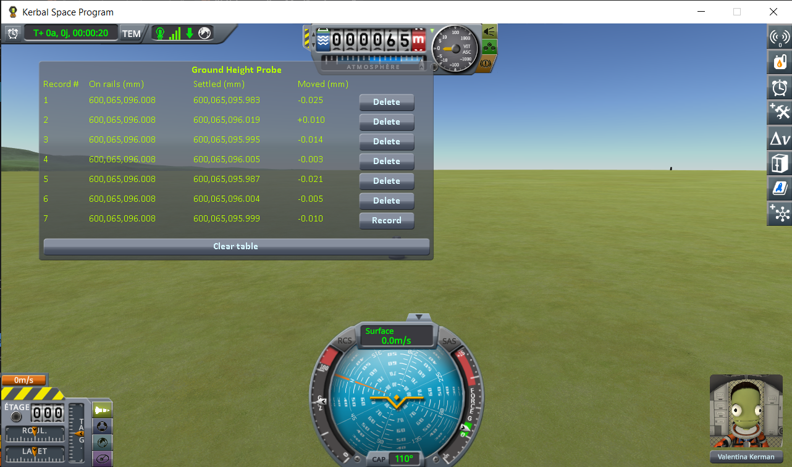
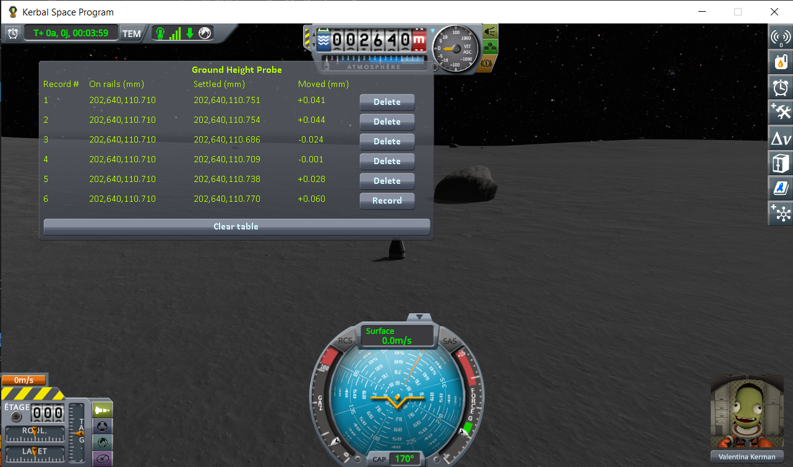
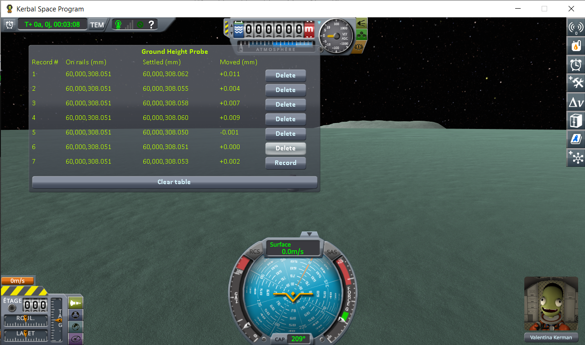
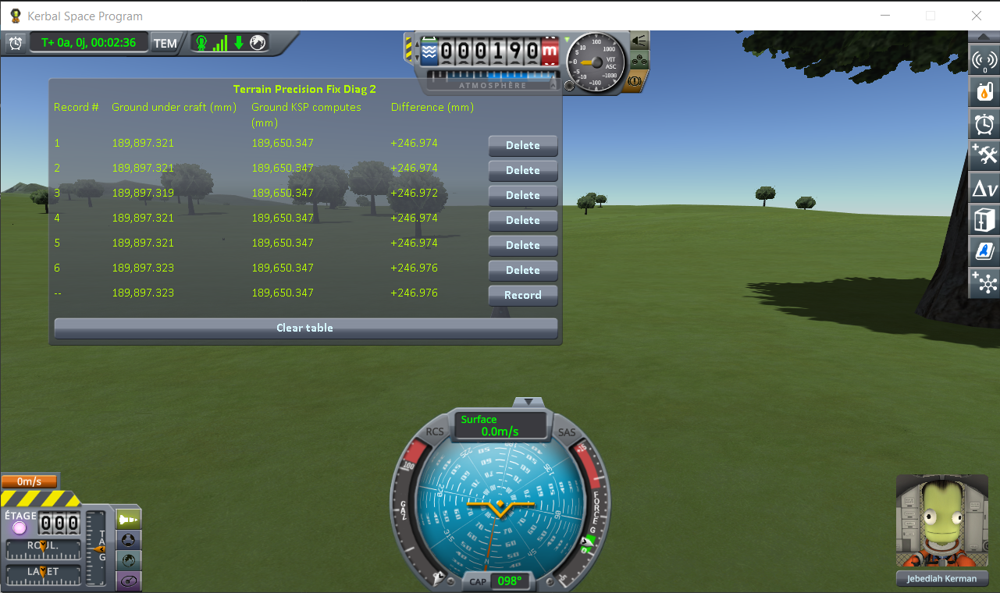
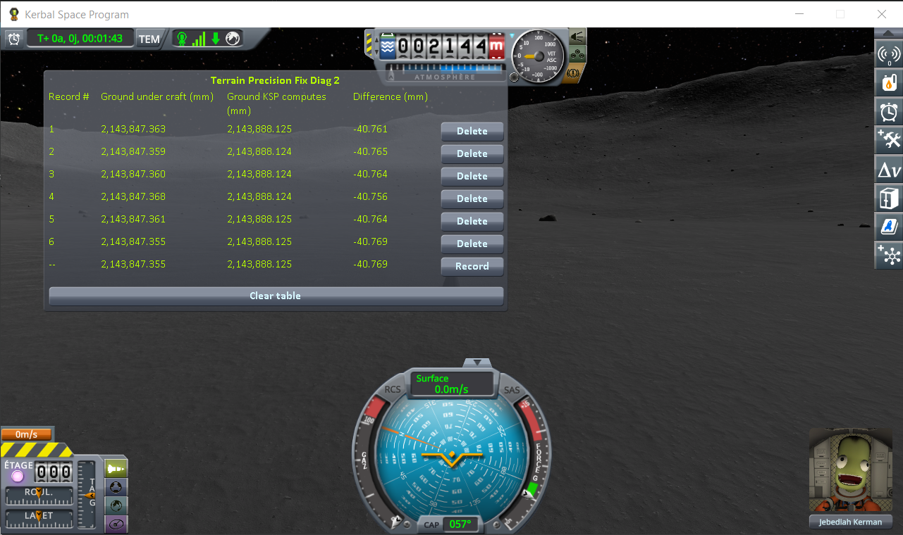
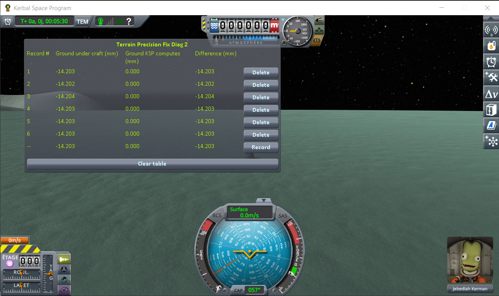
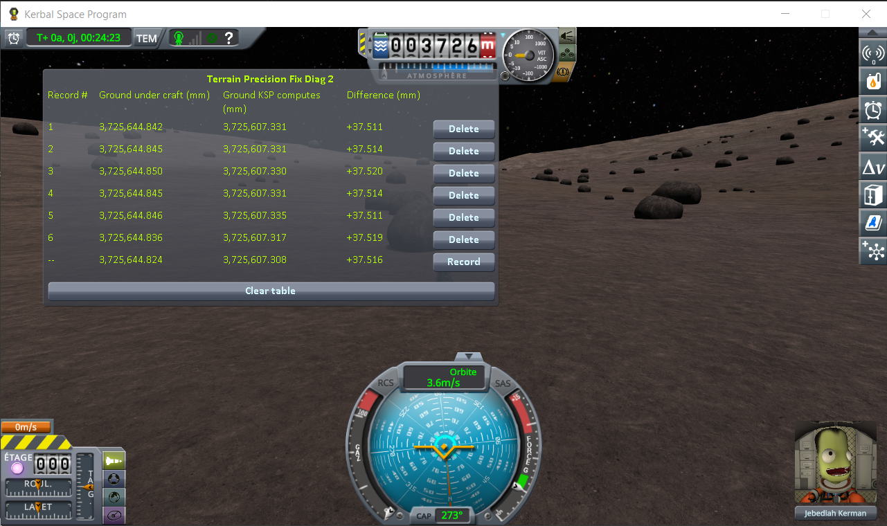

# Terrain Precision Fix

A fix for stock KSP 1.12, meant as a proposal for
[KSP Community Fixes](https://github.com/KSPModdingLibs/KSPCommunityFixes) and kept as small as
possible for that reason: two Harmony patches, in one source file. Here is what they fix:

> **The ground KSP builds under you is never built at the same height twice.** Load the same save five
> times, and the surface your craft is standing on comes back a little higher or a little lower each
> time — a few centimetres apart on Kerbin, less on smaller worlds.

## Why it matters

Every time you load, it is a coin toss between two outcomes.

**The ground comes back lower than it was when you saved.** Your craft is now hovering a couple of
centimetres above it, so it drops those two centimetres. You never notice, and nothing breaks.

**The ground comes back higher than it was when you saved.** Your craft is now *inside* the ground —
and the physics engine will not leave two solid things overlapping. It pushes them apart, hard, in
the only direction available: up. Your craft gets launched.

That second case is the symptom everybody already knows. The lander that twitches, hops or flips the
moment the scene finishes loading. The base that sat perfectly flush yesterday and is buried up to
the hatches today. The big base that tears itself apart the very first time you load it, and never
again afterwards. A craft with many parts spread over a wide area gives the coin toss more chances
to land the wrong way up.

### Disclaimer: it is not the only cause

The ground moving is one cause among several, and this page does not claim it is the only one. Plenty
of other things move a craft when a scene opens. Two well-known examples, among others:

- **suspensions.** Landing legs and wheels come back fully extended, because that is the only state
  KSP can restore them to. They then compress under the weight of the craft, and the craft moves
  while they do.
- **a craft bent to fit the ground.** While you play, physics twists the joints between parts so the
  craft settles onto the shape of the ground beneath it. That twisting is not saved. On loading, the
  craft comes back in its original, unbent shape — and if the ground is not flat, part of it really
  *is* underground, with no measurement error involved.

This mod removes that one cause, and only that one: a lander that hops because its legs are still
unfolding will go on hopping once it is installed. What it takes away is the part that should never
have been there at all — a surface that is not where the game's own formulas say it is, and is not in
the same place twice. It takes it away down to a hundredth of a millimetre, measured below.

## The problem

[Terrain Precision Fix Diag](https://github.com/lhervier/KSP-TerrainPrecisionFixDiag) shows it on a
stock install. It reloads the same save several times, and measures the distance from a landed capsule
to the centre of the body twice per load: as the save hands the capsule back, and once it has settled on
the ground. The first value is the same on every load, to the micrometre. The second is not:

| body | spread of the settled height, over 6 loads of the same save |
|---|---|
| Kerbin | 135.5 mm |
| Mun | 18.1 mm |
| Minmus | 3.9 mm |
| Gilly | 1.2 mm |

The capsule is put back at the same place every time, and still does not come to rest in the same
place. Nothing but Terrain Precision Fix Diag was installed.

That measurement shows the craft moving, which is not by itself proof that the ground moved under it.
The instrument that measures the ground, with no craft in the reading at all, is
[Terrain Precision Fix Diag 2](https://github.com/lhervier/KSP-TerrainPrecisionFixDiag2): it reads the
surface a ray hits against the height KSP computes for that same spot, and on stock the two drift apart
by a different amount on every loading. Both instruments, before and after this fix, are further down
under [Results](#results).

## Why it happens

Four observations, all made with values any mod can read. The first three point to a single cause; the
fourth suggests why its effect changes at every load.

**1. The spread follows the precision of a float at that distance from the centre of the body.** A
single precision float holding 600 km can only change in steps of 62.5 mm; holding 60 km, in steps of
3.9 mm. From one body to the next the spread varies a hundredfold, but counted in those steps it stays
between one and three:

| series | distance to the centre | float step there | spread | in steps |
|---|---|---|---|---|
| Kerbin, capsule | 600.1 km | 62.5 mm | 135.5 mm | 2.2 |
| Kerbin, 2 parts | 600.1 km | 62.5 mm | 129.9 mm | 2.1 |
| Mun, capsule | 204.1 km | 15.6 mm | 18.1 mm | 1.2 |
| Mun, 2 parts | 204.1 km | 15.6 mm | 43.4 mm | 2.8 |
| Minmus, capsule | 60.0 km | 3.9 mm | 3.9 mm | 1.0 |
| Minmus, 2 parts | 60.0 km | 3.9 mm | 7.3 mm | 1.9 |
| Gilly, capsule | 15.9 km | 0.98 mm | 1.2 mm | 1.2 |
| Gilly, 2 parts | 16.6 km | 1.95 mm | 2.3 mm | 1.2 |

That alone is only a hint. The next two observations are direct.

**2. Terrain quads are not where their own coordinates say.** Each terrain quad exposes its origin,
relative to the centre of the body, in double precision: `PQ.positionPlanet`. The altitude it gives
never changes (64.7851 m under a craft landed near the KSC). The altitude of the quad's transform, the
one the mesh actually hangs from, does:

- six loads without quitting KSP: +27.8, +18.4, +7.3, +18.6, −87.8, −4.0 mm;
- five separate launches of KSP: −74.4, +68.2, −36.4, +78.4, +145.7 mm.

It is the same quad, at the same subdivision level, on every load: this is not a level of detail
change.

**3. The mesh is deformed, not only moved.** Three points 100 m apart on that quad hit the same
triangles on every load, yet the height differences between them change from load to load, by −7 to
+53 mm. The vertices are rounded independently of each other.

**4. What differs between two loads is probably the orientation of the world frame.** The rotation
angle of the body is identical on every load of the same save. The angle of KSP's world frame,
`Planetarium.InverseRotAngle`, never is, not even after restarting KSP. A rounding depends on the exact
value being rounded, and terrain positions expressed in that frame are different values on each load.
At 600 km, even 0.075° (the smallest gap between two of those launches) moves a point by about 785 m
in that frame, some 12,000 float steps: any change of angle is enough to draw a new rounding. That much
is measured. That this angle is what draws a new rounding on each load, and the only thing that does,
is a hypothesis read from the stock code, not tested: see
[Another lead, not followed](#another-lead-not-followed).

### Where it happens

The stock code, decompiled from KSP 1.12.5, shows exactly where. This is how every terrain vertex is
placed, in `PQS.BuildVertexSurfaceRelative` (`vertRel` and `planetRel` are `Vector3d` fields):

```csharp
private void BuildVertexSurfaceRelative(VertexBuildData data)
{
    vertRel = vbData.directionFromCenter * vbData.vertHeight;
    planetRel = base.transform.TransformPoint(vertRel);
    verts[vertexIndex] = vertRel;
    buildQuad.verts[vertexIndex] = buildQuad.transform.InverseTransformPoint(planetRel);
}
```

`vertRel` is the vertex relative to the centre of the body, computed in double: a vector 600 km long
on Kerbin. `TransformPoint` turns it into a world position, which in KSP is close to the craft. To get
there, it adds that 600 km vector to the position of the centre of the body, another vector of about
600 km pointing the other way, and keeps the difference. A `Transform` works in `float`, so both go
through a float on the way, rounded to the nearest 62.5 mm, and what is left once they cancel out is
off by centimetres. `InverseTransformPoint` then expresses that point relative to the quad, whose own
position was obtained the same way:

```csharp
// PQ.SetupQuad and PQ.PreciseUpdateSubQuadsPosition — positionPlanet is a Vector3d
quadTransform.localPosition = positionPlanet;
```

A 600 km double stored in a float `localPosition`, under a parent that sits at the centre of the body.

That explains observations 2 and 3, the origin and the vertices. If observation 4 holds, it explains
why the result differs at every load: the rounding depends on the exact values rounded, and those
values change with the orientation of the world frame. The last proof is the fix itself: it changes
nothing but the order of the arithmetic, and the spread disappears.

## What the fix does

The two stock placements that go through a float at planet scale are redone in double, on the quads
of the highest subdivision level. Those are the ones craft stand on, the only ones with a collider on
Kerbin and on the Mun where `PQSMod_QuadMeshColliders.maxLevelOffset` has been read in flight and is 0
(see [TODO.md](TODO.md)), and the only ones that can keep a precise position: stock moves them to a container of their
own, outside the body's hierarchy. Every other quad hangs from the body's terrain sphere, whose origin
is the centre of the body, so Unity would store any position given to it as a 600 km float again.
Those are left exactly as stock builds them.

- **The origin of each quad.** After `PQ.SetupQuad` and `PQ.PreciseUpdateSubQuadsPosition`, the quad
  is moved to `body.rotation * positionPlanet + body.position`, computed with `QuaternionD` and
  `Vector3d`. The result is a world position, relative to the floating origin: near the craft it is a
  short vector, which a float holds precisely.
- **Each vertex, inside its quad.** `PQS.BuildVertexSurfaceRelative` is replaced by the same
  computation with the subtraction done first: the vertex minus the quad origin, both doubles relative
  to the centre of the body, then rotated into the quad's frame. What reaches a float is a distance
  within the quad, a couple of kilometres at most, instead of 600 km: a resolution of about 0.1 mm
  instead of 62.5 mm.

This is not a new way of placing the terrain. It is the stock placement, evaluated in an order that
does not throw away its own significant digits.

Two frames look like more obvious choices, and both are wrong. `PQS.GetWorldPosition` misses by about
750 km on the body being flown over. The rotation of the body's transform is the same rotation as
`body.rotation`, but in float: on a 600 km vector, that alone is worth 36 mm.

Two safeguards:

- a correction larger than 1 m is refused, quad by quad, and that quad is left as stock builds it: if
  the frame is ever not the expected one, the terrain stays where KSP puts it instead of going
  somewhere else;
- if any patch fails to install, none of them does anything.

## Results

The same test as on the [Terrain Precision Fix Diag](https://github.com/lhervier/KSP-TerrainPrecisionFixDiag)
page, with this mod installed: a lone capsule on the same four worlds, stock KSP 1.12.5 with Harmony and
ModuleManager, the same save loaded five or six times per world.




(The bottom line of each table is the loading in progress, still live. It is not counted below.)

| world | loadings | spread of **Settled**, stock | spread of **Settled**, with this mod |
|---|---|---|---|
| Kerbin | 6 | 135.5 mm | 0.069 mm |
| Mun | 5 | 18.1 mm | 0.011 mm |
| Minmus | 6 | 3.9 mm | 0.022 mm |
| Gilly | 6 | 1.2 mm | 0.028 mm |

On Kerbin, the spread is about two thousand times smaller. What is left is a few hundredths of a
millimetre on every world, far below the float step at any of these distances. **On rails** is
identical on every line of every series, so KSP put the capsule back at the same place every time, and
the capsule now comes to rest at the same place every time too.

Each series uses its own spot, chosen by the rules of Terrain Precision Fix Diag: flat bare ground, no
`Moving Vessel` line in `KSP.log`, and a capsule that does not slide.

### With two parts

The same capsule sitting on a small flat fuel tank, as on the Terrain Precision Fix Diag page:








| world | loadings | spread of **Settled**, stock | spread of **Settled**, with this mod |
|---|---|---|---|
| Kerbin | 6 | 129.9 mm | 0.036 mm |
| Mun | 5 | 43.4 mm | 0.068 mm |
| Minmus | 6 | 7.3 mm | 0.012 mm |
| Gilly | 6 | 2.3 mm | 0.138 mm |

### What happens underneath

Measured on Kerbin, same save loaded six times, with the fix:

| under a landed craft | measured |
|---|---|
| quad origin, compared with its double position | 0.00 mm on all six loads (−87.8 to +145.7 mm without the fix, above) |
| altitude of the collision surface, found by raycast | 64.7794 m on all six loads |
| collision surface minus the analytic terrain height (`CelestialBody.TerrainAltitude`) | −5.49 to −5.54 mm |

The remaining −5.5 mm is not an error: a flat triangle passes below the curved surface it approximates,
by L²/8R, which is 5.8 mm for 167 m triangles on a 600 km radius. It is the same on every load.

On the Mun, the quad origin matched its double position to 0.00 mm on six loads too.

### The ground itself

Terrain Precision Fix Diag measures the craft, and a craft coming to rest elsewhere is only a hint
about the ground under it. [Terrain Precision Fix Diag 2](https://github.com/lhervier/KSP-TerrainPrecisionFixDiag2)
measures the ground itself, and is the one that names the culprit: two readings of the same spot, side
by side, one line per loading — the collision surface found by a ray pointed straight down, and the
height KSP computes for that same latitude and longitude. The second is what the world is made of and
never moves; the first is what your landing legs touch.

The four campaigns on its page were run on stock. Here are the same four saves, loaded six times each,
with this mod installed:









(As before, the bottom line of each table is the loading in progress, still live, and is not counted
below.)

| world | *Difference*, stock | *Difference*, with this mod | spread, stock | spread, with this mod |
|---|---|---|---|---|
| Kerbin | −28.477 to +78.164 mm | −1.407 to −1.421 mm | 106.6 mm | 0.014 mm |
| Mun | −35.570 to −44.363 mm | −40.742 to −40.769 mm | 8.8 mm | 0.027 mm |
| Minmus | −13.431 to −16.567 mm | −14.200 to −14.203 mm | 3.1 mm | 0.003 mm |
| Gilly | +36.422 to +40.115 mm | +37.507 to +37.518 mm | 3.7 mm | 0.011 mm |

The stock columns are read off the Terrain Precision Fix Diag 2 page, the others off the four
screenshots above. Three things to read in them.

**The column stops varying**, by a factor of three hundred on the Mun and Gilly, a thousand on Minmus,
seven thousand on Kerbin. On Kerbin the surface under the craft came back somewhere else over a range
of ten centimetres; it now comes back within fourteen thousandths of a millimetre.

**It stops at a value the stock readings were already scattered around.** On all four worlds the fixed
reading falls inside the stock range, and well away from its edges on the Mun, on Minmus and on Gilly.
This mod does not choose a better number for that patch of ground; it stops drawing a new one at every
loading.

**What is left is no longer the ground.** *Ground KSP computes* is what says these are the same four
spots as the stock campaign: 64,784.952 mm on Kerbin, the same eight digits, and `0.000` on the Minmus
flats. On the Mun and on Gilly, where the ground is not level, that column wanders a little by itself —
0.072 mm over the six Mun loadings — because a craft settling a hair to one side asks for the height of
a slightly different point. On the Mun that is more than the spread of *Difference* under it, 0.027 mm:
both columns follow the sample point together, and most of the wobble cancels between them. What
remains is the craft, not the terrain.

One number in the Kerbin table deserves a word: *Difference* settles at −1.41 mm, where the section
above reads −5.5 mm. Both are the same flat triangle sagging inside the curve of the world, read at two
points that are not the same one — the probe above stops the collision surface at 64.7794 m, this ray
at 64.7835 m, four millimetres apart on the mesh. That sag is deepest in the middle of a triangle,
5.8 mm on Kerbin, and fades to nothing towards a corner; anywhere in between reads anywhere in between.
What matters is not which value comes out, but that the same one comes out on every loading.

### Measuring it yourself

Install Terrain Precision Fix Diag 2 next to this mod, load the same save five or six times, and you
get a table like the four above. Here is how to read it — and what *not* to expect.

**Do not expect *Difference* to get smaller.** It will not, and it is not supposed to. Stock KSP drew
somewhere between −35.6 and −44.4 mm on that Mun save; with this mod it reads −40.76 mm every time.
Put the single stock loading that landed on −35.570 next to a fixed −40.765 and the fix looks like it
made things worse. It did not: that stock line was luck, and the worst line of the same campaign was
−44.363. You would be comparing two numbers neither of which was the point.

**Expect the *Difference* column to stop varying.** That is the fix, and that is all of it: read the
table above by its last two columns, not its first two. Tens of millimetres of spread on stock,
hundredths of a millimetre with this mod, on every world — and it does not depend on drawing a lucky
loading.

**And expect whatever is left to stay.** It is not a leftover error to be chased: on flat ground it is
the few millimetres of a flat triangle sagging inside a curve, and on rougher ground it is whatever the
terrain does between two corners of the collision mesh — the +37.5 mm of that Gilly slope, and it is
the same +37.5 mm on all six loadings. Removing it would mean giving that mesh more triangles, which
costs frames, for a gap nobody can feel. This mod puts the mesh where it belongs; what a flat piece
misses of a curve is geometry, and geometry stays.

### With KSP Community Fixes installed

This fix is meant for [KSP Community Fixes](https://github.com/KSPModdingLibs/KSPCommunityFixes), so
every campaign above was run a second time in an install that has it. The screenshots are here, and
they are not tabulated: [`imgs/Diag1-KSPCF`](imgs/Diag1-KSPCF) for the craft, eight series as above,
and [`imgs/Diag2-KSPCF`](imgs/Diag2-KSPCF) for the ground, four campaigns on the same four spots as
the stock ones. Each Diag page carries the matching campaigns run under KSPCF **without** this fix, so
both halves of the comparison exist in that install.

They say the same thing as the tables above, on every world: hundredths of a millimetre where stock
spreads over millimetres or centimetres. The analysis stays on the stock readings on purpose — a
measurement meant to show what bare KSP does, and what changes when one computation is reordered, is
worth more taken where nothing else is installed. What these add is that nothing about the defect, or
about the fix, changes in the install this patch is aimed at.

### Rocks, grass and trees

This mod does not move terrain scatter. Another instrument,
[Rock Precision Fix Diag](https://github.com/lhervier/KSP-RockPrecisionFixDiag), measures where it is
drawn: for every object of the terrain quad nearest to the craft, the height of its lowest point above
the ground right under it.

The offset exists in stock: scatter is already not drawn exactly on the ground. The objects of a quad
are built from the quad's vertices, in the quad's own coordinates, and hang from a holder that
`PQSMod_LandClassScatterQuad.Setup` places under the terrain sphere, at
`localPosition = quad.positionPlanet`: a vector hundreds of kilometres long, in a float. Unity draws the
holder with its local to world matrix, and the translation of that matrix differs from the holder's own
transform position by whole float steps. The objects are drawn that much above or below the ground,
differently on each quad and on each load. This mod inherits that offset and widens it: the ground is
now placed in double precision and the holders are not, so the stock error on the quad origin adds to
the stock error of the holder.

Kerbin, next to the KSC, the same save loaded six times per series, over the 118 holders of 64 quads:

| offset of the scatter from the ground | stock | with this mod |
|---|---|---|
| range | −85.5 to +64.7 mm | −66.3 to +152.0 mm |
| standard deviation | 29.7 mm | 44.4 mm |

The same kind of error, about one and a half times wider. On the quad nearest to the craft, the height
of the objects minus those two errors is the same on every load of both series, to 1.5 mm: nothing else
moves them. Stock scatter has no collider, so the offset, with or without this mod, is visual only.

[Rock Precision Fix](https://github.com/lhervier/KSP-RockPrecisionFix) is a separate mod that corrects
the stock placement of scatter: it hangs each holder from its own terrain quad, so that the objects are
drawn in the frame they were built in. It works with or without this mod. It has not been measured yet.

## Performance

The vertex part of the fix replaces a computation that stock runs for every vertex of every terrain quad
it builds, so it sits on a path the game uses continuously while flying, not only when a scene loads.
**It places a vertex in half the time stock takes.**

### What a vertex costs

Both placements were replayed over the vertices of a quad the game had just built, one quad in
thirty-two, inside the frame that built it, alternating which one ran first. A craft in a 5 km circular
orbit of the Mun, where the game builds six or seven of the quads this fix touches every second.

| | per vertex |
|---|---|
| stock | 167.3 ns |
| this fix | **82.7 ns** |

Stock does two calls into the native engine per vertex, `Transform.TransformPoint` and
`Transform.InverseTransformPoint`. The replacement is managed arithmetic on doubles, with no native call
at all, and everything that depends on the quad rather than on the vertex — whether the fix applies, the
frame the quad hangs in, the inverse of its rotation — is worked out once for its 225 vertices.

That last part is not a detail. Before it was, the same measurement read **500.4 ns**, three times stock:
reading a handful of Unity transforms again for every vertex costs far more than the arithmetic the fix
exists for. The figure above is what the fix does today; the one before it is why it is written that way.

Stock was measured at 167.3, 168.6 and 172.2 ns in three separate KSP sessions, within 1.5 % of each
other, which is what this method's reproducibility is worth.

Placing a vertex is a small part of building one: a quad takes 2.7 ms to build, about 12 µs per vertex,
nearly all of it spent in the `PQSMod`s that compute height and colour. The 85 ns are 0.7 % of that.

### In flight

The same save, the same stretch of orbit, the same build of the mod, twice: the correction on, then
off.

| | fix | stock |
|---|---|---|
| frames per second | 114.6 | 114.2 |
| quads built per second | 16.38 | 16.55 |
| of which the fix acts on | 6.39 | 6.40 |
| ms per quad the fix acts on | 2.743 | 2.786 |
| terrain per frame | 0.938 ms | 0.958 ms |
| terrain share of real time | 10.75 % | 10.94 % |

The two flights built 2 442 and 2 484 quads, 1.7 % apart, of which 952 and 960 were ones the fix acts
on — the craft is on rails, so loading the same save twice covers the same ground twice.

The fix is ahead on every line, and that is not a 1.5 % gain: the calibration above puts the saving at
19.0 µs per quad, 0.7 % of 2.786 ms, half of what separates these two columns. What this pair shows is
a bound rather than a difference — at the scale of a frame, nothing degrades, and what is left is the
noise between two runs of the game.

### Where it runs at all

Only the highest subdivision level is corrected, and the game only builds that level close to the
ground: below 6 250 m over the Mun, 9 375 m over Kerbin, as its own `PQS` settings give it. Higher up,
the patched code decides once per quad that it does not apply, and each vertex is left with a reference
comparison before stock runs untouched.

The logs these figures come from are in [perfs/](perfs/), with the procedure that produces them: it
takes a command pod, the debug menu's Set Orbit, and three flights of a few minutes.

## Side effects

What this fix can make worse:

- **Where terrain scatter is drawn.** Rocks, grass and trees are already drawn off the ground in stock;
  with this fix the offset is about one and a half times wider (measured, see
  [Rocks, grass and trees](#rocks-grass-and-trees)). Visual only. The stock offset and this widening
  are what [Rock Precision Fix](https://github.com/lhervier/KSP-RockPrecisionFix) addresses, not
  measured yet.
- **Scatter objects that have a collider**: Breaking Ground's surface features, and Kopernicus scatter
  with `scatterColliders`. Their holders are placed the same way, so the offset would be physical
  there: wider than in stock if the physics takes the holder's pose from the same matrix the
  renderer uses, new if it takes it from the transform position, which matches the stock ground. Not
  measured.

## Another lead, not followed

If observation 4 is right, there is a second way to attack the problem: give the world frame the same
orientation relative to the body on every load. The float roundings would stay, but they would be the
same every time: the terrain would still be off by a few centimetres, but always by the same amount at
the same place. A craft's position is a double resting on ground built in float; if that ground came
back identical, the craft would come back on it, instead of inside or above it.

We have not followed it through. What we know of it comes from reading the stock code
(`CelestialBody.CBUpdate`, where the rotation of the body is shared between the body and the world
frame), not from a measurement. Points still open:

- pinning `Planetarium.InverseRotAngle` alone would not be enough: the orientation of the body in the
  world frame also depends on the date of the save, so it is that orientation that would need a fixed
  value;
- the angle may not be the only input: the position of the body in the world frame also changes with
  the floating origin, and according to the stock code, landed quads are placed again, the same way,
  at every floating origin shift. That would be a new rounding without any reload. Not measured;
- a fixed error is still an error: the mesh would stay deformed (observation 3), only always the same
  way.

This mod corrects the conversion from double to float instead: it is simpler, it is where the precision
is actually lost, and it removes the error rather than freezing it. Anyone who wants to explore the
other lead is welcome to.

## What has not been checked

- Only measured on stock KSP 1.12.5 (plus Harmony and ModuleManager): Terrain Precision Fix Diag on
  Kerbin, the Mun, Minmus and Gilly, with one part and with two; Terrain Precision Fix Diag 2 on the
  same four worlds; the quad origins on Kerbin and the Mun; and what both placements cost, in a 5 km
  orbit of the Mun where the game builds terrain continuously.
- Not measured yet: the map view, where quads are built and destroyed all the time; Kopernicus and
  Parallax, which work on the same terrain pipeline. Kopernicus compatibility is a requirement before
  this goes anywhere (see [TODO.md](TODO.md)). If Kopernicus places the quads in another frame, the
  1 m safeguard should leave its terrain as stock builds it, with one warning per body in the log.
- Colliders below the highest subdivision level: `PQSMod_QuadMeshColliders` gives a collider to every
  quad at or above `maxLevel - |maxLevelOffset|`, and with an offset other than 0 the fix would leave
  those lower quads uncorrected. Read in flight on Kerbin and on the Mun: the offset is **0** on both,
  so only the highest level carries a collider and the fix covers every quad a craft can stand on. Not
  read on the other bodies yet (see [TODO.md](TODO.md)).
- Parallax scatters: according to its source, they should follow the corrected ground. Their positions
  and colliders are expressed relative to the quad, and a collider is a child of its quad, so they move
  with it. Not measured yet (see [TODO.md](TODO.md)).
- Breaking Ground's deployed experiments are vessels, positioned in double like any craft, so they
  should sit on the corrected ground like one. Not measured yet.
- Not covered yet, and listed in [TODO.md](TODO.md): everything else that is placed on the ground the
  same way.
  - Breaking Ground's surface features: they are placed like the rocks above, but they have
    colliders. Where they are drawn is covered by the rock measurement; where the physics puts their
    colliders has not been measured.
  - Kopernicus scatter with colliders (`scatterColliders`): Kopernicus keeps the stock placement of the
    holder, so the same open question as the surface features.
  - The KSC buildings, runway and launchpad: `PQSCity` and `PQSCity2` both do
    `base.transform.localPosition = planetRelativePosition;`, where `planetRelativePosition` is a
    `Vector3d` measured from the centre of the body. A capsule parked on the runway spreads over 117 mm
    on six loads, as on the grass next to it; whether that comes from the runway itself or from the
    terrain underneath has not been separated yet.

## Install

Requires KSP 1.12 and [HarmonyKSP](https://github.com/KSPModdingLibs/HarmonyKSP) (the usual
`GameData/000_Harmony`, also installed by KSP Community Fixes).

Copy `GameData/TerrainPrecisionFixMod` into the `GameData` of KSP. Nothing is written to your saves:
removing the folder gives you the stock terrain back.

## Settings

`GameData/TerrainPrecisionFixMod/PluginData/settings.cfg` holds a single value, read when KSP starts:

| `logLevel` | what goes to `KSP.log` |
|---|---|
| `Info` (default) | one line at startup, then one line per body the first time its terrain is corrected |
| `Debug` | adds one line per quad placed, with how far it was moved |
| `Trace` | adds, per quad, how far its vertices were moved within it — slower, meant for measuring |

`Error` and `Warning` are accepted too. To change it: quit KSP, edit the file, start KSP again.

## Build

Set `KSPDIR` to your KSP install folder, which must contain `GameData/000_Harmony`, and run `build.bat`.
It needs the .NET SDK, and produces `GameData/TerrainPrecisionFixMod/TerrainPrecisionFixMod.dll`.

## How this was made

The investigation and the code were done together with Claude, Anthropic's AI assistant: measurement
campaigns in game, and reading the decompiled stock code to find where the precision is lost. I am
saying so because it is true, and because contributions made with an AI deserve a closer look than
others. That look is what this page is built for: every figure on it comes from an in-game measurement,
the instrument behind the headline figures is public and runs on a stock install, the stock code quoted
here is a handful of lines anyone can check in a decompiler, and the fix fits in one file you can read
in a few minutes.

## License

MIT
