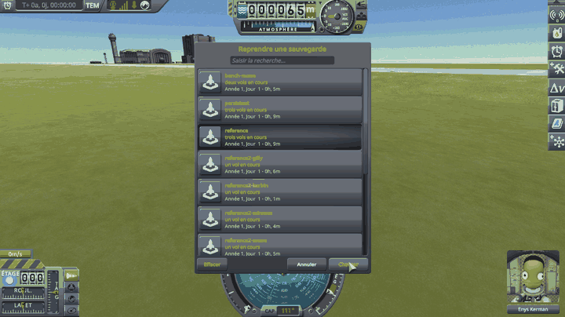

# Terrain Precision Fix

**⚠️ Work in progress.** This is an active investigation, not a finished mod. The figures, the code and the conclusions on this page can still change, and several questions are still open — they are listed in [Work in progress](#work-in-progress).

A fix for stock KSP 1.12, kept as small as possible: a handful of Harmony patches, in a few short source
files. It is a mod of its own, built and measured on top of
[KSP Community Fixes](https://github.com/KSPModdingLibs/KSPCommunityFixes), the base most players run.
Here is what it fixes, on the ground and on the runways, launchpads and buildings that stand on it:

> **The ground KSP builds under you is never built at the same height twice, and neither are the
> runways and buildings it places on it.** Load a save, come back to a craft left parked, drive a few
> hundred metres: each time the ground is built again, the surface your craft is standing on comes back
> a little higher or a little lower — a few centimetres apart on Kerbin, less on smaller worlds, and up
> to seventy on Earth in Real Solar System.

**How this was made.** The investigation and the code were written with Claude, Anthropic's AI
assistant. Everything here was reviewed and validated by a human — me — who very much enjoyed
learning along the way how KSP builds the ground you land on. I am saying so up front, because
contributions made with an AI deserve a closer look than others, and because some people would
rather stop reading here. That look is what this page is built for: every figure on it comes from an
in-game measurement, the instrument behind the headline figures is public and runs on a stock
install, the stock code quoted here is a handful of lines anyone can check, and the fix is a few short
files you can read in one sitting.

## Why the moving ground matters

KSP does not keep the ground it built: it builds it again, over and over, while you play. And every
time it does, the surface lands at a slightly different height — a little higher or a little lower,
at random, a few centimetres on Kerbin and up to seventy on Earth in Real Solar System. The runway, the
launchpad and the buildings of the KSC, and the bases a mod such as Kerbal Konstructs plants on a body,
are placed the same way, each at a height of its own, apart from the ground beside it. Loading a save
is only the moment everybody notices. It happens just as well:

- **when a save is loaded**, or the scene changes: the whole ground is built anew, and every runway and
  building is placed again;
- **when you come back to a craft left parked.** Its position was recorded while it rested on the
  ground as it stood then. As you fly back towards it, KSP builds that ground again, at a different
  height, and puts the craft back at its recorded position — on a ground that is no longer the one it
  was resting on;
- **when you switch to a craft far away**, which is put down the same way, on a ground it was not
  standing on when it was left;
- **while you drive.** Every 500 m the craft you fly travels, KSP moves its whole world back onto it,
  builds the ground under you again, and moves the runway beside you with it — in the middle of the
  drive, with nothing loaded and no scene changed.

Each time, it is a coin toss between two outcomes.

**The ground comes back lower than it was.** Your craft is now hovering a couple of centimetres above
it, so it drops those two centimetres. You never notice, and nothing breaks.

**The ground comes back higher than it was.** Your craft is now *inside* the ground — and the physics
engine will not leave two solid things overlapping. It pushes them apart, hard, in the only direction
available: up. Your craft gets launched.

*KSP 1.12 without this mod, with [KSP Community Fixes](https://github.com/KSPModdingLibs/KSPCommunityFixes)
as the only mod installed. A pod on an empty fuel tank, parked in the grass at the KSC, saved, then reloaded
from the pause menu, several times if needed — nothing touched in between.*

That second case is the symptom everybody already knows. The lander that twitches, hops or flips the
moment the scene finishes loading. The base that sat perfectly flush yesterday and is buried up to
the hatches today. The big base that tears itself apart the very first time you load it, and never
again afterwards. A craft with many parts spread over a wide area gives the coin toss more chances
to land the wrong way up. The other moments do the same damage, only less visibly: from 200 m away you
see little of a parked craft jumping, and a rover that hops while driving looks like a bump in the
road — on Earth, it was seen to jump when the ground rose under it.

Every one of these moments can be repeated at will — reload the same save, drive away from a craft left
parked and come back to it, switch to a craft far away, drive past a few shifts of the world — and each
is measured on this page, on the ground, and on a runway as well when a save is loaded and while you
drive.

### Disclaimer: it is not the only cause

The ground moving is one cause among several, and this page does not claim it is the only one. Plenty
of other things move a craft when a scene opens. Two well-known examples, among others:

- **suspensions.** Landing legs and wheels come back fully extended, because that is the only state
  KSP can restore them to. They then compress under the weight of the craft, and the craft moves
  while they do.
- **a craft bent to fit the ground.** While you play, physics twists the joints between parts so the
  craft settles onto the shape of the ground beneath it. That twisting is not saved. On loading, the
  craft comes back in its original, unbent shape — and if the ground is not flat, part of it really
  *is* underground, with no measurement error involved.

This mod removes that one cause, and only that one: a lander that hops because its legs are still
unfolding will go on hopping once it is installed. What it takes away is the part that should never
have been there at all — a surface that is not where the game's own formulas say it is, and is not in
the same place twice. It takes it away down to a hundredth of a millimetre on the ground, and two tenths
on the runway of the KSC, measured below.

## The culprits

**The ground.** Stock places a terrain quad, and every vertex inside it, through a Unity `Transform`: a
vector 600 km long stored in a float, where a step is 62.5 mm. Each value is rounded on its own. What
draws a new set of roundings at every load is the frame they go through, whose rotation and translation
both move while you play.

**→ Full chapter: [The culprit: the ground](docs/the-culprit-ground.md)**

**The statics.** The runway, the launchpad and the buildings of the KSC, the launch sites of the Making
History expansion, and the bases a mod such as Kerbal Konstructs plants anywhere on a body. `PQSCity`
and `PQSCity2` place them the same way, a 600 km vector in a float `Transform` hanging from the body,
through the same frame. Unlike the quads a craft stands on,
stock gives them no place outside the body where a precise position would be kept.

**→ Full chapter: [The culprit: the statics](docs/the-culprit-statics.md)**

**The scatter.** The rocks, and around the KSC the grass and the trees, are built from the vertices of
their quad, but hang from a *holder* that stays under the body, at the same 600 km vector in a float. The
quad is drawn where its position says, the holder where its matrix says, and the two need not round the
same way. Stock scatter has no collider, so this is visual — unless a mod gives it one.

**→ Full chapter: [The culprit: the scatter](docs/the-culprit-scatter.md)**

## What moves the frame

The rounding is drawn anew because the frame the ground is built in — how the body is turned in
Unity's world, and where its terrain sphere sits in it — does not stay put.
[KSP Diag - Floating Origin](https://github.com/lhervier/KSP-Diag-FloatingOrigin) shows the
values of KSP's floating origin, on a stock install. Its measurements show that a save does not give
that frame back, and that it changes during a flight with nothing loaded.

**→ On the pages of Diag FloatingOrigin: [loading the same save](https://github.com/lhervier/KSP-Diag-FloatingOrigin/blob/main/docs/what-the-measurements-show-loading.md),
[leaving the rotating frame](https://github.com/lhervier/KSP-Diag-FloatingOrigin/blob/main/docs/what-the-measurements-show-rotating-frame.md),
[a rover driven 2 km and back](https://github.com/lhervier/KSP-Diag-FloatingOrigin/blob/main/docs/what-the-measurements-show-driving.md)**

## The fix this mod proposes

**The ground.** Two Harmony patches redo in double the two placements that go through a float at planet
scale: the origin of each quad, and each vertex inside it. The two 600 km vectors cancel before anything
reaches a float, which is then only asked to hold a distance within the quad. Only the quads a craft can
stand on are touched.

**→ Full chapter: [The fix: the ground](docs/the-fix-ground.md)**

**The statics.** A static cannot hold a precise position under its sphere, so it is taken out of it in
flight, while a craft is near it, and placed in double in the same frame. It follows its body, and it
goes back exactly where stock left it before every scene change, and whenever stock code that expects it
there runs. A launch pad of Making History is also taken out for the moment it measures the ground to
set itself on it. Kerbal Konstructs and Kopernicus each look for a static under its sphere once in flight: **this
mod has to patch both**, below.

**→ Full chapter: [The fix: the statics](docs/the-fix-statics.md)**

**The scatter, off by default.** Two Harmony patches hang each holder from its own quad, at no offset,
and hang it back in its pool when the quad goes: the stock scatter is then drawn with the very matrix of
the ground it was built on. It is off by default: it moves stock objects other mods may look for, against
a gap nobody sees on a stock install. With a mod that gives the scatter colliders, the gap is a real one,
and turning it on is yours to weigh.

**→ Full chapter: [The fix: the scatter](docs/the-fix-scatter.md)**

**The patches to other mods.** Two mods look for a static where the statics fix no longer leaves it in
flight. Each patch, on by default, stands for a small change these mods could make themselves, given as a
diff to apply to their source.

- **Kopernicus, its flag fix.** Without the patch, nothing goes wrong in the game. It only spares an
  error in the log whose stack trace names Kopernicus, where this mod is the cause — a bug its
  maintainers would be asked about for nothing.

  **→ Full chapter: [Kopernicus: the flag fix](docs/limits-and-solutions/kopernicus/the-flag-fix.md)**

- **Kerbal Konstructs, its group editor.** This patch is indispensable, and the most serious problem
  this mod has met so far: without it, a group moved with the gizmo of the editor, in flight, would be
  sent elsewhere on its body, and saved there.

  **→ Full chapter: [Kerbal Konstructs: the group editor](docs/limits-and-solutions/kerbal-konstructs/the-group-editor.md)**

## Checking the culprit

Each situation where a craft meets the ground is measured twice, without this mod and with it: one
instrument reads the landed craft, another the ground itself, and in flight a third reads the quads the
ground is made of. In each summary below, the first figure is without this mod, the second with it. A
fourth instrument reads the scatter, once more with the scatter fix on.

**Loading the same save**, six times, on the four stock worlds and the Moon and Earth of
[Real Solar System](https://github.com/KSP-RO/RealSolarSystem): the ground comes back over 43.6 mm on
Kerbin and 292.3 mm on Earth, within 0.3 mm with this mod. The runway of the KSC comes back over
116.5 mm, and 0.177 mm with this mod. Over twelve loads, half of the points measured on the scatter
of Kerbin come back more than 94 mm apart against the ground, 130 mm with this mod as installed by
default; with its scatter fix on, none more than 0.125 mm.

**→ Full chapter: [Checking the culprit: loading the same save](docs/checking-the-culprit-loading.md)**

**Coming back to a craft left parked**, driving away until it unloads, then back, six times in one
flight: its ground comes back over 49.3 mm, and over 0.010 mm with this mod.

**→ Full chapter: [Checking the culprit: coming back to a craft left parked](docs/checking-the-culprit-approach.md)**

**Switching to a craft far away**, six loadings: its ground spreads over 112.1 mm, and 0.002 mm with this
mod; the switch itself moves nothing.

**→ Full chapter: [Checking the culprit: switching to a craft far away](docs/checking-the-culprit-switching.md)**

**Driving on while the world moves**, every 500 m a rover drives: the ground under it jumps by about
25 mm on Kerbin and up to 243 mm on Earth, and the runway beside it with it; with this mod, no jump is
left.

**→ Full chapter: [Checking the culprit: driving on while the world moves](docs/checking-the-culprit-driving.md)**

**Launching from a launch pad of Making History**, the Desert Launch Site, in six sessions of the game:
the deck the craft stands on spreads over 592.8 mm, and 0.001 mm with this mod; its feet stand on the
ground either way.

**→ Full chapter: [Checking the culprit: launching from a launch pad of Making History](docs/checking-the-culprit-launch-pad.md)**

**In flight**, a rocket from the launchpad to the sea, its quads written about once a second: two
quads of the highest level built at different moments step by up to 22.5 mm where they meet on Kerbin
and 289 mm on Earth, and by 0.67 mm and 2.1 mm at most with this mod. Over the Mun, the scatter is drawn
up to 26.5 mm off its quads without the scatter fix, and exactly on them with it.

**→ Full chapter: [Checking the culprit: in flight](docs/checking-the-culprit-flight.md)**

## Non-regression tests

Checking the culprit shows what this mod fixes. These tests check the other side, one mod at a time:
what works without this mod still works with it. Only what has been checked is listed; each test is
played in game with this mod, and compared with the game without it where the two have to be told apart.

**Stock.** Existing saves go through one more draw of the ground, always the same one. Over loadings, an
orbit and a return to the space centre, the KSC keeps every building registered, and a craft launched
from the VAB or the SPH stands on the launchpad or the runway. Through every scene change, the KSC comes
back to the same place. With the scatter fix on, every scatter holder goes back to its pool.

**KSP Community Fixes.** None of its patches places the terrain, and every measurement on these pages
was taken with it installed.

**Kopernicus.** The ground is as stable under Kopernicus as without it, and the KSC it moves to Cape
Canaveral for Real Solar System is placed where it puts it. The rocks it can give a collider are hit
where they are drawn with the scatter fix on.

**Real Solar System.** Its two workarounds for this defect, one for a landed craft and one for the
runway, have nothing left to correct with this mod, and its CommNet ground stations keep relaying.

**Deferred.** It draws the ground wherever this mod places it, and the craft and the ground come back as
they do without it.

**→ Full chapter: [Non-regression tests](docs/non-regression.md)**

## Performance

**The fix does not slow the game down.** Timed frame by frame with
[KSPProfiler](https://github.com/KSPModdingLibs/KSPProfiler), on the same flight, every run of the fix
came out a little cheaper than every run of stock on the coroutines the terrain is updated in — by more
than the fix's own saving can explain, so not a gain to claim, but no cost. Measured vertex by vertex with
[PQS Bench](https://github.com/lhervier/KSP-PQSBench), the fix even places a vertex faster than stock, but
that saving is about 0.04 % of the time played, too small for a frame to show. Turned on, the scatter fix
shows no cost these runs can resolve. What the statics fix costs with statics near a craft is not
measured yet.

**→ Full chapter: [Performance](docs/performance.md)**

## Limits and solutions

What this mod makes worse, or would break without a patch of its own, with the solution to each. **The
statics fix is the riskier of the two fixes on by default**: it takes a static out of the place where stock, and any
mod, expects to find it.

**Stock.** This mod widens two visual gaps stock already has: the rocks, grass and trees against the
ground, which a third fix of this mod closes, off by default; and the crack where the corrected quads
meet coarser ones, with no solution yet.

**Kopernicus and Kerbal Konstructs.** Each looks for a static under its sphere once in flight, and this
mod patches both, each patch standing for a small change these mods could make themselves, given as a
diff of their source.

**→ Full chapter: [Limits and solutions](docs/limits-and-solutions.md)**

## Work in progress

What is still to check, one mod at a time, with what is already known and the test planned for it. In
progress: the last tests on Real Solar System. Planned: the rest of stock, from slopes to time warp,
Kerbal Konstructs, a body from a planet pack, Principia, Parallax, Tilt'Em, KAS, and other mods that
look for a static under its sphere.

**→ Full chapter: [Work in progress](docs/work-in-progress.md)**

## Install

Requires KSP 1.12 and [HarmonyKSP](https://github.com/KSPModdingLibs/HarmonyKSP) (the usual
`GameData/000_Harmony`, also installed by KSP Community Fixes).

Copy `GameData/TerrainPrecisionFixMod` into the `GameData` of KSP. Nothing is written to your saves:
removing the folder gives you the stock terrain, statics and scatter back.

## Settings

`GameData/TerrainPrecisionFixMod/PluginData/settings.cfg` holds six values, read when KSP starts. To
change one: quit KSP, edit the file, start KSP again.

| setting | what it does |
|---|---|
| `fixTerrain` | `true` (default) places the terrain in double precision; `false` leaves it as stock builds it |
| `fixStatics` | `true` (default) places the statics in double precision; `false` leaves them where stock places them |
| `fixScatter` | `false` (default) leaves the terrain scatter where stock draws it; `true` draws it from the terrain quads it was built on. Off by default because it moves stock objects other mods may look for, against a gap nobody sees on a stock install: see [Off by default: should you turn it on?](docs/the-fix-scatter.md#off-by-default-should-you-turn-it-on) |
| `patchKopernicus` | `true` (default) patches Kopernicus, when installed, to cope with the statics fix. With `false` and the statics fix on, Kopernicus' flag fix throws when a facility is upgraded in flight near the KSC, which only a Making History mission does: an error in the log whose stack trace names Kopernicus, and nothing else, since the statics fix keeps the flags steady there. Meant only to see what the patch is for |
| `patchKerbalKonstructs` | `true` (default) patches Kerbal Konstructs, when installed, to cope with the statics fix. With `false` and the statics fix on, moving a group with its group editor in flight sends it elsewhere on its body, and saves it there: meant only to see what the patch is for |
| `logLevel` | what goes to `KSP.log`, below |

| `logLevel` | what goes to `KSP.log` |
|---|---|
| `Info` (default) | a few lines at startup, then one line per body the first time its terrain, then its statics, then its scatter, are corrected |
| `Debug` | adds one line per quad placed, with how far it was moved, one line per static taken out of its sphere or put back under it, and one line per scatter holder hung from its quad |
| `Trace` | adds, per quad, how far its vertices were moved within it, and one line per scatter holder handed back to its pool — slower, meant for measuring |

`Error` and `Warning` are accepted too.

## Build

Set `KSPDIR` to your KSP install folder, which must contain `GameData/000_Harmony`, and run `build.bat`.
It needs the .NET SDK, and produces `GameData/TerrainPrecisionFixMod/TerrainPrecisionFixMod.dll`.

## License

MIT
