# Checking the culprit: anchoring a base

Part of [Terrain Precision Fix](../README.md): the measurements that check [the ground anchor](the-culprit-ground-anchor.md), an anchor placed alone and an anchor with a battery on it, on stock, with the model fix of this mod alone, and with this mod.

Two instruments take the readings, and both read the target when one is set, here the anchor.
[KSP Diag - Landed Vessel](https://github.com/lhervier/KSP-Diag-LandedVessel) reads the vessel:
*Settled*, the distance from the centre of the body to the vessel's origin once physics runs; *On rails*,
where the load put it before; *Moved*, the difference. [KSP Diag - Terrain Height](https://github.com/lhervier/KSP-Diag-TerrainHeight)
reads the ground under it: *Ground under craft*, the collider the vessel rests on; *Ground KSP computes*,
the height the game computes for the terrain; *Difference*, the first minus the second. Each has its own
page, with its method. The height of the anchor above the ground, in the tables below, is *Settled*, less
the radius of Kerbin, 600,000,000 mm, less *Ground under craft*.

This fix is built on top of [KSP Community Fixes](https://github.com/KSPModdingLibs/KSPCommunityFixes),
the base most players run, so the campaign on this page is run in an install that has it: KSP 1.12.5 with
Harmony, ModuleManager, KSP Community Fixes 1.41.1, the two instruments — and this mod, or not. *On
stock*, below, means that install without this mod.

## The protocol

Copy [`ground-anchor-kerbin.sfs`](../diag/ground-anchor-kerbin.sfs) into the folder of a sandbox game and
load it: Bill Kerman on EVA on the desert of Kerbin, with a ground anchor in his inventory, beside the
rover of [`Diag3-Rover.craft`](../diag/craft/Diag3-Rover.craft). Then, by hand:

1. in EVA construction, Bill places the anchor on the ground; wait until its screws have gone in;
2. for the anchor with a battery: Bill takes one of the rover's batteries off, and attaches it on top of
   the anchor;
3. set the anchor as target, and *Record* in both instruments;
4. quicksave, quickload, *Record*;
5. quicksave, quickload, *Record*.

| | |
|---|---|
| 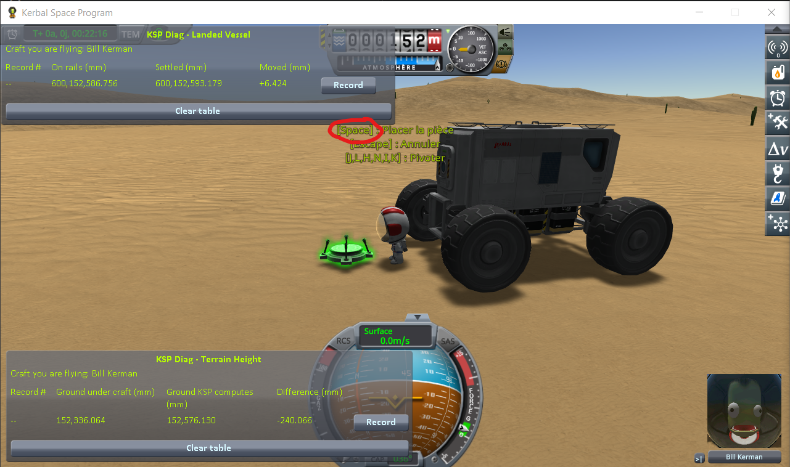 | 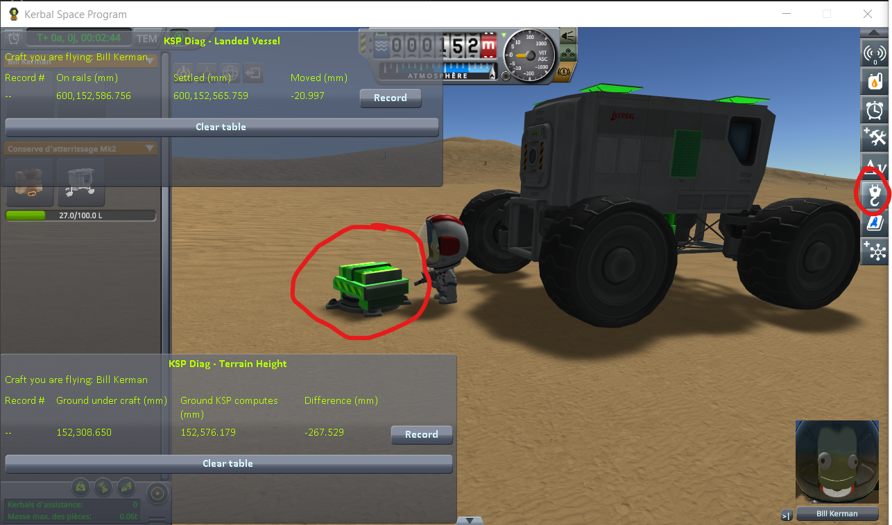 |
| placing the anchor | the battery on top of it |

Two cases, because KSP treats them differently: an anchor alone is a vessel of one part, which it puts
back on the ground at every load; with a battery, it is a vessel of two, which it puts back at the first
load only. Each is played three times, from the same save: on stock; with this mod and
`fixGroundAnchorLoad = false`, which leaves [the model fix](the-fix-ground-anchor.md#the-anchors-model)
alone; and with this mod as installed. The sessions are logged in
[`diag/runs/ground-anchor-kerbin-without-this-mod.log`](../diag/runs/ground-anchor-kerbin-without-this-mod.log),
[`ground-anchor-kerbin-model-fix.log`](../diag/runs/ground-anchor-kerbin-model-fix.log) and
[`ground-anchor-kerbin-fix.log`](../diag/runs/ground-anchor-kerbin-fix.log).

## The anchor alone

Heights in mm; *Settled*, *On rails* and *Ground under craft* less the radius of Kerbin. The readings of
the second load were taken from the screenshots, on the line the instruments were still measuring, not
recorded.

| | | *On rails* | *Settled* | *Moved* | *Ground under craft* | anchor above the ground |
|---|---|---|---|---|---|---|
| **on stock** | placed | | 152,312.551 | | 152,333.388 | −20.837 |
| | 1st load | 152,587.362 | 152,314.115 | −273.247 | 152,293.655 | +20.460 |
| | 2nd load | 152,587.362 | 152,380.891 | −206.471 | 152,360.115 | +20.776 |
| **model fix alone** | placed | | 152,313.357 | | 152,313.357 | 0.000 |
| | 1st load | 152,587.246 | 152,313.446 | −273.800 | 152,313.376 | +0.070 |
| | 2nd load | 152,587.246 | 152,313.385 | −273.861 | 152,313.362 | +0.023 |
| **with this mod** | placed | | 152,313.380 | | 152,313.388 | −0.008 |
| | 1st load | 152,313.380 | 152,313.443 | +0.063 | 152,313.371 | +0.072 |
| | 2nd load | 152,313.443 | 152,313.354 | −0.089 | 152,313.375 | −0.021 |

*Ground KSP computes* reads 152,586.391 mm on stock, 152,586.275 mm with the model fix alone and
152,586.310 mm with this mod, the anchor not being placed at exactly the same spot each time. *Difference*
is −253.0 mm at placement on stock, then −292.7 and −226.3 mm; −272.9 mm at every reading with the model
fix alone and with this mod.

On stock and with the model fix alone, `KSP.log` holds a `Moving Vessel` line of
`Vessel.CheckGroundCollision` at each load: `down -0.273m` then `down -0.206m` on stock, `down -0.274m`
twice with the model fix alone. With this mod, the same line reads `0.000m`, next to a line of this mod at
each load: the anchor loaded at its saved altitude, where stock would have raised it by 273.9 then
273.8 mm.

| | placed | 1st load | 2nd load |
|---|---|---|---|
| **on stock** | 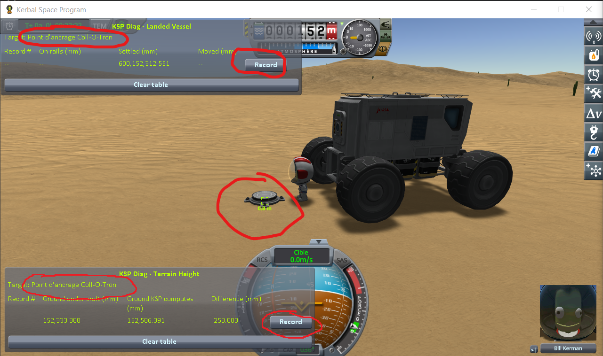 | 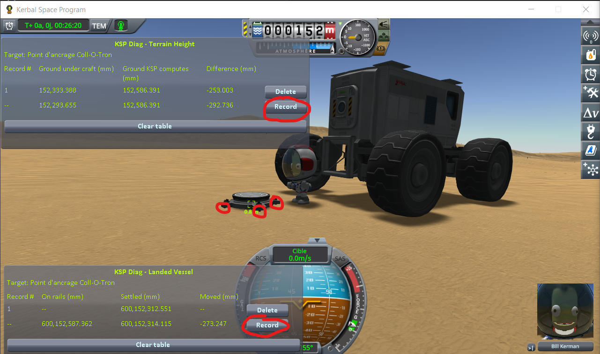 | 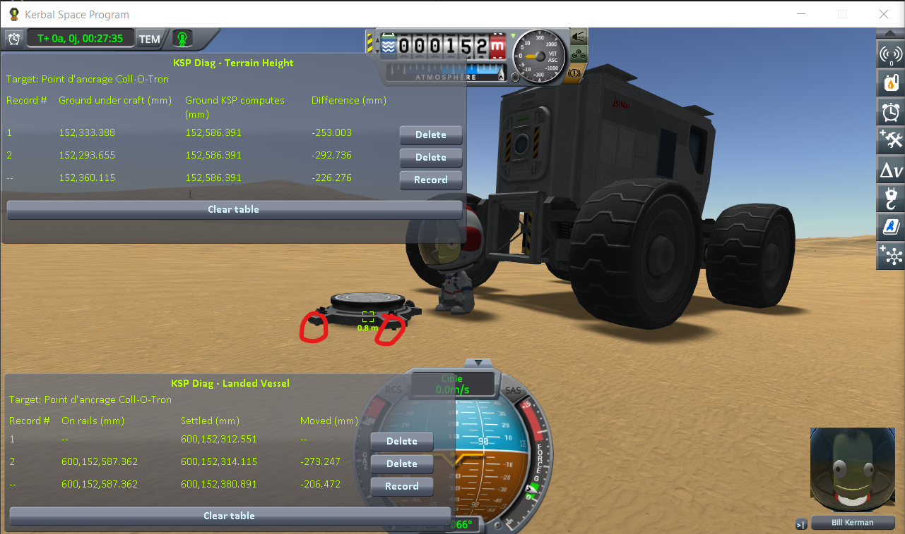 |
| **model fix alone** | 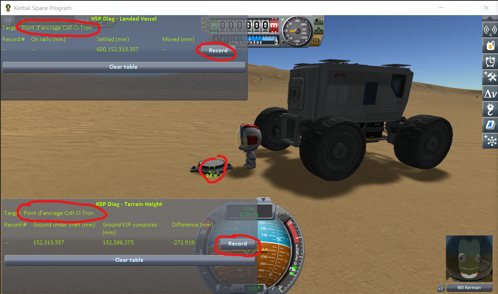 | 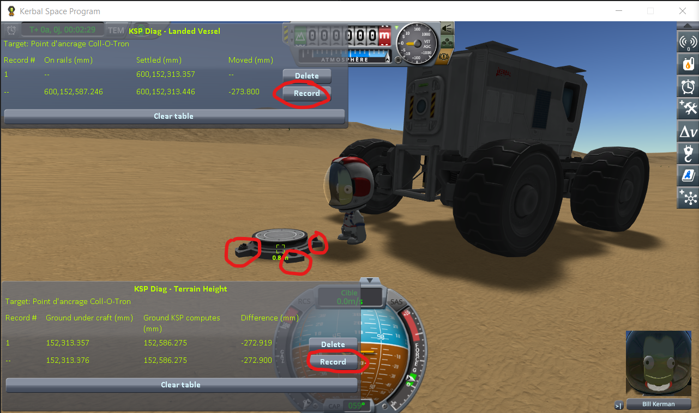 | 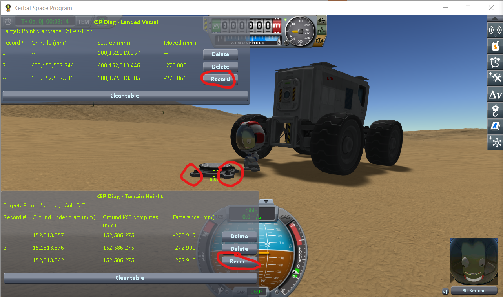 |
| **with this mod** | 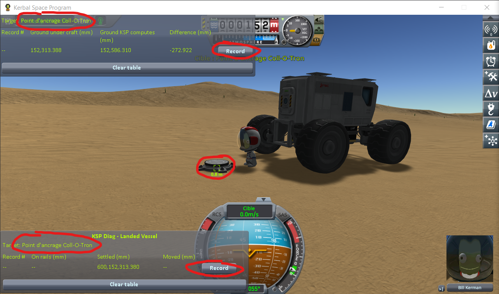 | 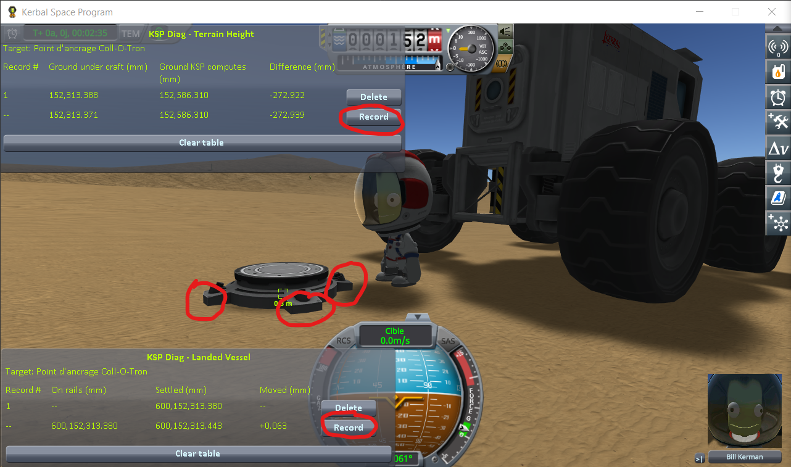 | 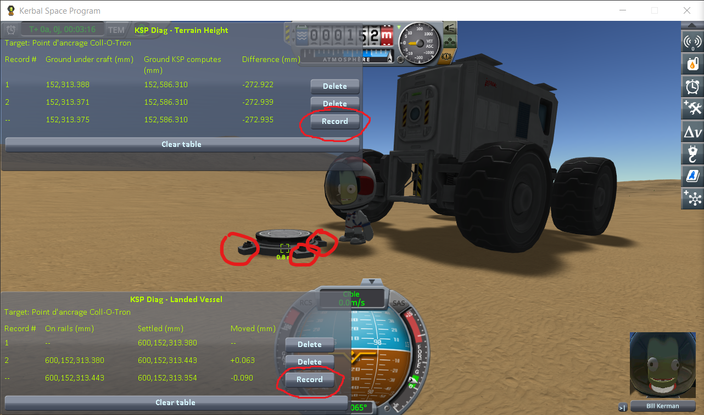 |

## The anchor with a battery

Heights in mm, as above. The readings of the second load, and of the first load with the model fix
alone, were taken from the screenshots, not recorded.

| | | *On rails* | *Settled* | *Moved* | *Ground under craft* | anchor above the ground |
|---|---|---|---|---|---|---|
| **on stock** | placed | | 152,284.762 | | 152,305.599 | −20.837 |
| | 1st load | 152,587.401 | 152,323.684 | −263.717 | 152,303.471 | +20.213 |
| | 2nd load | 152,587.401 | 152,587.401 | 0.000 | 152,324.022 | **+263.379** |
| **model fix alone** | placed | | 152,313.369 | | 152,313.377 | −0.008 |
| | 1st load | 152,587.273 | 152,313.380 | −273.893 | 152,313.375 | +0.005 |
| | 2nd load | 152,587.273 | 152,587.273 | 0.000 | 152,313.363 | **+273.910** |
| **with this mod** | placed | | 152,313.364 | | 152,313.371 | −0.007 |
| | 1st load | 152,313.364 | 152,313.365 | +0.001 | 152,313.369 | −0.004 |
| | 2nd load | 152,313.365 | 152,313.365 | 0.000 | 152,313.374 | −0.009 |

On stock and with the model fix alone, `KSP.log` holds a `Moving Vessel` line at the first load, `down
-0.264m` and `down -0.274m`, and none at the second. With this mod, it reads `up 0.000m` at the first load
and is absent at the second, and the line of this mod is there at both, with 273.9 mm.

| | placed | 1st load | 2nd load |
|---|---|---|---|
| **on stock** | 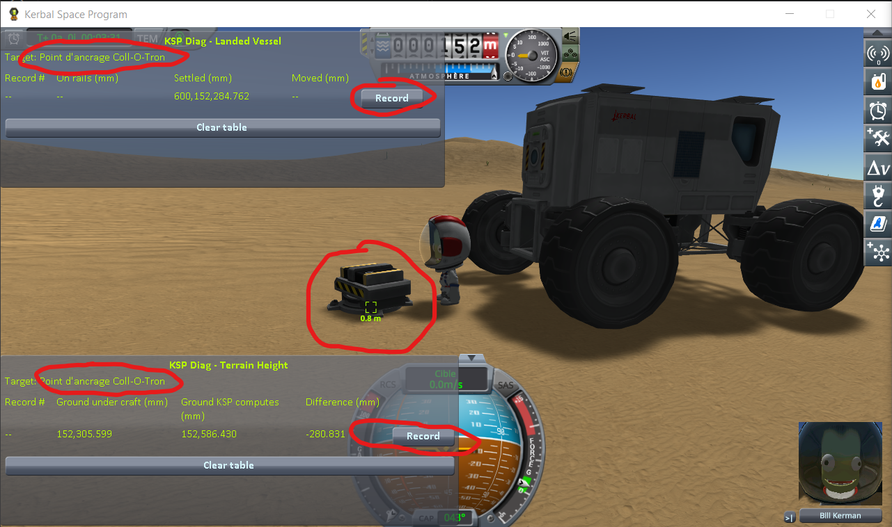 | 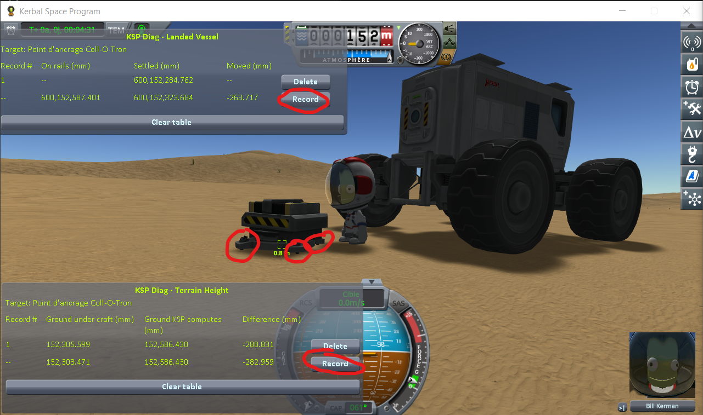 | 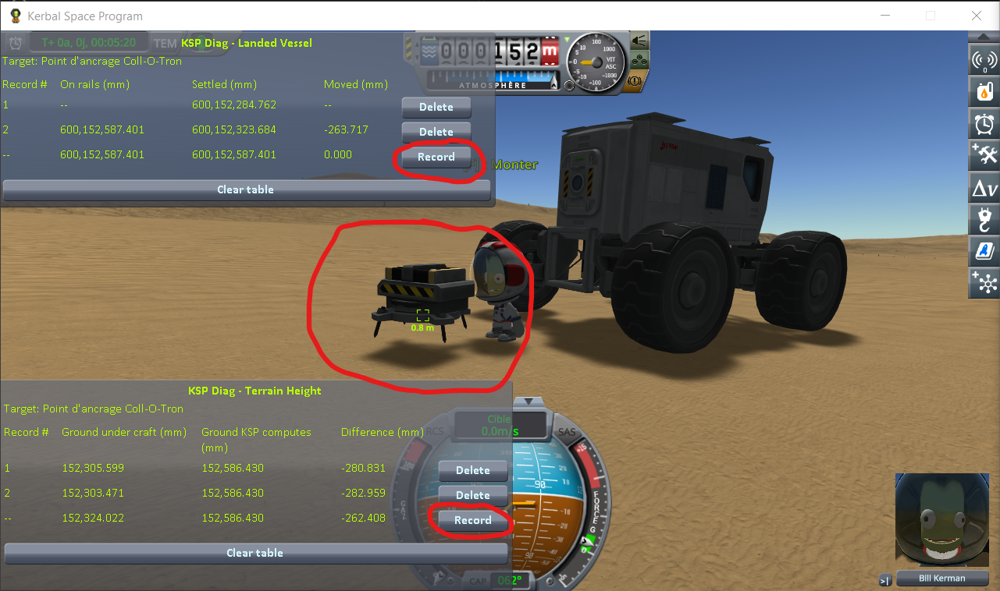 |
| **model fix alone** | 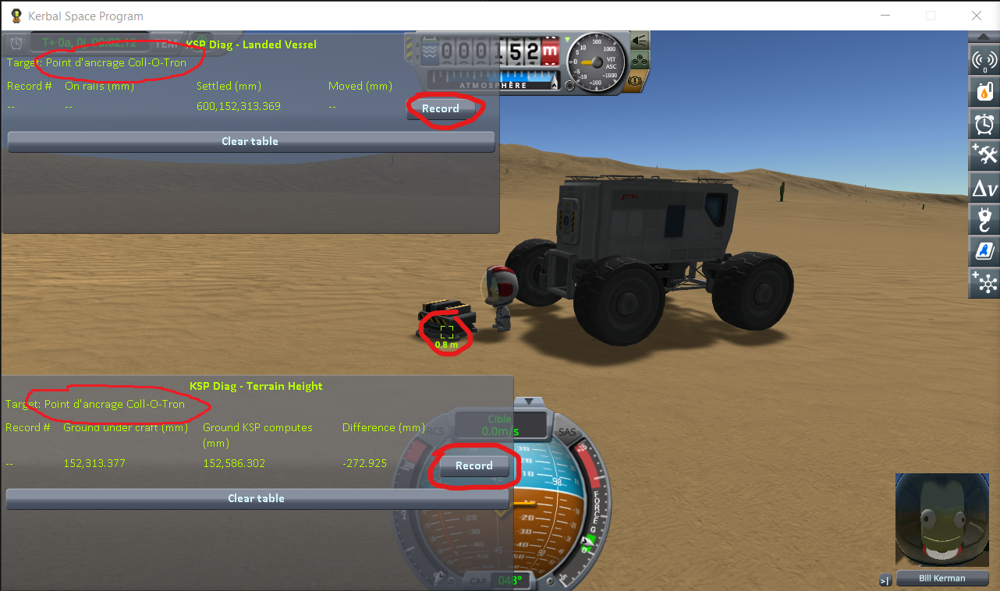 |  | 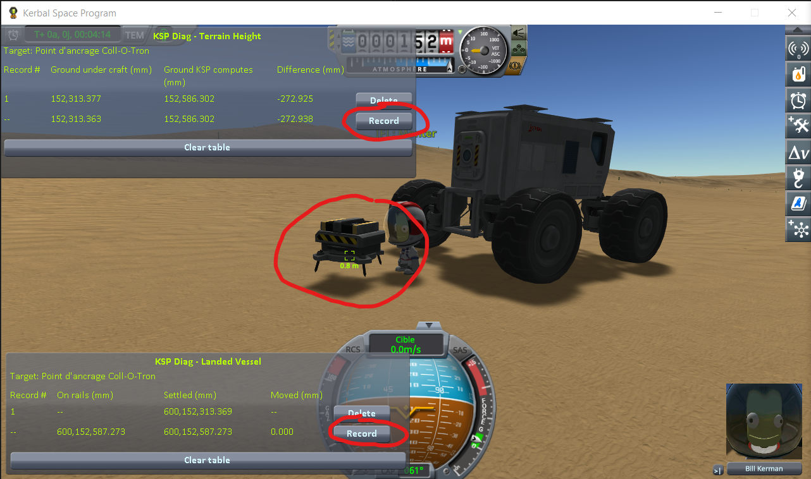 |
| **with this mod** | 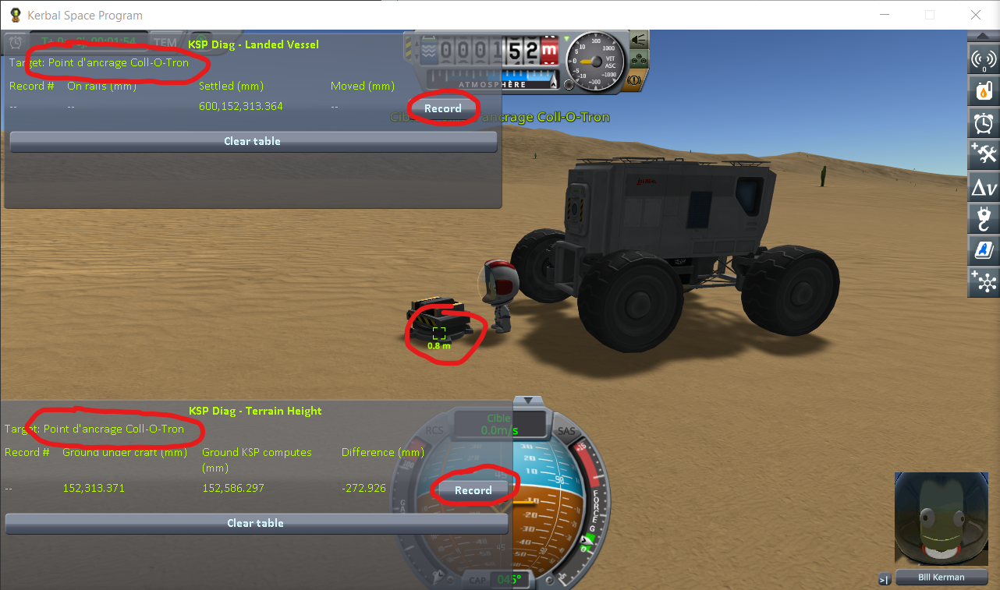 | 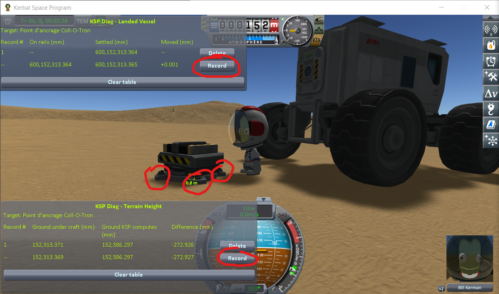 | 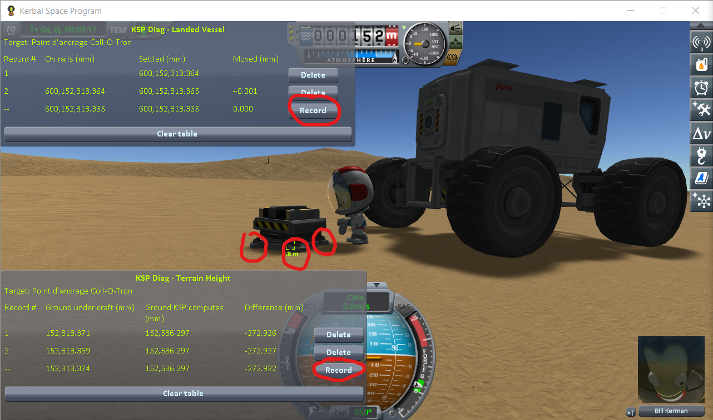 |

## What the measurements say

**On stock, a load puts the anchor 4.1 cm higher than it was placed.** Placed, it rests on its collider,
its origin 20.8 mm under the ground; loaded, its origin is 20.2 to 20.8 mm above it. That is
[the anchor's model](the-culprit-ground-anchor.md#the-anchors-model): its collider's 20.8 mm, counted the
wrong way. An anchor alone stays there at every load, 20.8 mm above a ground that itself comes back 66 mm
apart between the three readings, the other culprit of this mod. That is the case KSP Community Fixes'
issue [#214](https://github.com/KSPModdingLibs/KSPCommunityFixes/issues/214) reports, an anchor alone.

**On stock, every load first raises the anchor to the height KSP computes.** *On rails* is that height at
each load, 23 to 29 cm above the collider, and *Moved* is the pass of `CheckGroundCollision` putting it
back down. For an anchor alone, the pass runs at every load. For the anchor with a battery, it runs at the
first load only: at the second, *Moved* is zero, and the base stays where the load raised it, 26.3 cm above
the ground, its screws in the air. That is
[the height KSP computes](the-culprit-ground-anchor.md#the-height-ksp-computes): it looks very much like
the issue, only higher.

**The model fix alone takes the 4 cm away, not the rest.** The anchor is placed with its origin on the
ground, and loaded there, within 0.07 mm. But the base still goes up at its second load, by 27.4 cm, the
whole gap between the collider and the computed height here.

**With this mod, the anchor and the base stay where they were placed.** *On rails* is the altitude saved,
not the computed height, and every reading is within 0.08 mm of the ground, alone or with the battery, at
both loads. The ground under the anchor comes back within 0.02 mm, the terrain fix of this mod.
