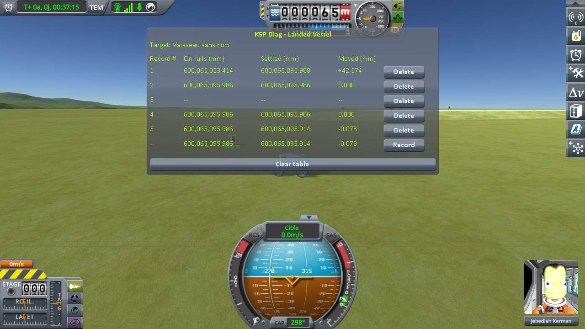
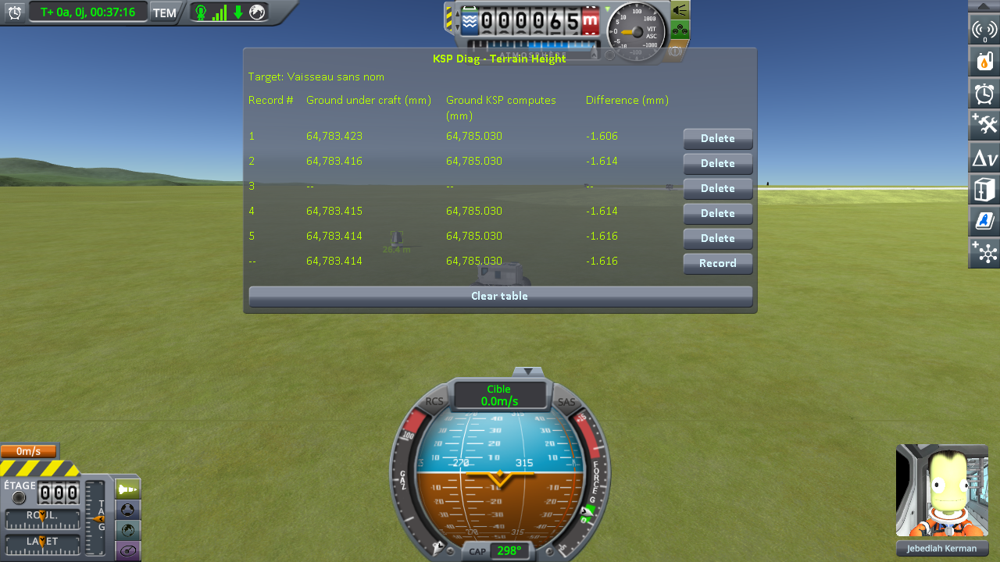

# Checking the culprit: coming back to a craft left parked

Part of [Terrain Precision Fix](../README.md): the measurements that check [the culprit](the-culprit-ground.md) on a craft left parked and come back to, in the middle of a flight, on stock and with this mod.

Two instruments take the readings:
[KSP Diag - Landed Vessel](https://github.com/lhervier/KSP-Diag-LandedVessel) measures the craft, and
[KSP Diag - Terrain Height](https://github.com/lhervier/KSP-Diag-TerrainHeight) measures the ground. Each has its own page, with
its method and its protocol.

This fix is built on top of [KSP Community Fixes](https://github.com/KSPModdingLibs/KSPCommunityFixes),
the base most players run, so every campaign on this page is run in an install that has it: KSP 1.12.5 with Harmony, ModuleManager,
KSP Community Fixes 1.41.1, both instruments, and [KSP-MCPServer](https://github.com/lhervier/KSP-MCPServer),
which drives the rover — and this mod, or not. *On stock*, below, means that install without this mod.

The way a craft meets the ground that you cannot avoid by never quitting: a craft is left
parked while a rover drives away from it, past 2500 m, where the game unloads it — then comes back
within 200 m, where physics takes the parked craft over again. No save is loaded at any point and the
scene is never changed: one single flight, six round trips in a row, on Kerbin. It is
[the approach protocol](https://github.com/lhervier/KSP-Diag-LandedVessel/blob/main/docs/the-protocol-approach.md)
of both instruments, on the save they publish, `approach-kerbin.sfs`, played by its script,
[`run-approach.py`](https://github.com/lhervier/KSP-Diag-LandedVessel/blob/main/docs/the-protocol-approach.md#played-by-a-script),
once without this mod and once with it, both instruments recording at the same moments. The session
with this mod is logged in [`approach-fix.log`](../diag/checking-the-culprit-approach/approach-fix.log); what the
script printed is in [`approach-fix-script.txt`](../diag/checking-the-culprit-approach/approach-fix-script.txt), and every line
it recorded in [`approach-fix-lines.json`](../diag/checking-the-culprit-approach/approach-fix-lines.json).

## The craft, over six round trips

**On stock**
([the readings](https://github.com/lhervier/KSP-Diag-LandedVessel/blob/main/docs/the-measurements-approach.md)).
*Moved* — how far the craft ends up from the height it was handed back at — reads:

| round trip | 1 | 2 | 3 | 4 | 5 | 6 |
|---|---|---|---|---|---|---|
| *Moved* | −28.752 mm | +6.619 mm | −24.666 mm | +34.263 mm | +6.758 mm | −37.177 mm |

Over the whole series — where the craft started, and where each of the six round trips left it — it
comes to rest across a spread of 46.8 mm. The height it is handed back at, read before each round trip
and after it, never moves by more than a thousandth of a millimetre.

**With this mod**, in that same install, on that same save, with this mod as the only difference. One
screenshot per round trip, the table cleared between them:

The five others are in [`imgs/checking-the-culprit-approach/landed-vessel`](../imgs/checking-the-culprit-approach/landed-vessel).

| round trip | 1 | 2 | 3 | 4 | 5 | 6 |
|---|---|---|---|---|---|---|
| *Moved*, without this mod | −28.752 mm | +6.619 mm | −24.666 mm | +34.263 mm | +6.758 mm | −37.177 mm |
| *Moved*, with this mod | −0.073 mm | +0.032 mm | −0.036 mm | −0.027 mm | +0.015 mm | +0.050 mm |

Over the whole series, the craft comes to rest across a spread of 46.8 mm without this mod and
0.103 mm with it.

## The ground, over six round trips

**On stock**
([the readings](https://github.com/lhervier/KSP-Diag-TerrainHeight/blob/main/docs/the-measurements-approach.md)).
The height KSP computes reads the same digits on every line of the six round trips. *Difference*,
across each round trip:

| round trip | 1 | 2 | 3 | 4 | 5 | 6 |
|---|---|---|---|---|---|---|
| *Difference* moved by | −28.722 mm | +6.495 mm | −24.546 mm | +28.226 mm | +6.381 mm | −37.167 mm |

Over the whole series, *Difference* spreads over 49.3 mm. From the moment the craft is back in range,
still packed, to the moment physics takes it over, it moves by 0.023 mm at most.

**With this mod**, in that same install, the same session:

The five others are in [`imgs/checking-the-culprit-approach/terrain-height`](../imgs/checking-the-culprit-approach/terrain-height).

| round trip | 1 | 2 | 3 | 4 | 5 | 6 |
|---|---|---|---|---|---|---|
| *Difference* moved by, without this mod | −28.722 mm | +6.495 mm | −24.546 mm | +28.226 mm | +6.381 mm | −37.167 mm |
| *Difference* moved by, with this mod | −0.002 mm | +0.008 mm | −0.001 mm | −0.001 mm | 0.000 mm | −0.008 mm |

Over the whole series, the ground comes back within a spread of 49.3 mm without this mod, and
0.010 mm with it.

## What the measurements say

**The craft is handed back at the same place, and does not come to rest there.** Same craft, same spot,
same flight: 6.6 to 37.2 mm every time, upwards as often as downwards, and never the same twice, while
the height it is handed back at never moves by more than a thousandth of a millimetre. What changes
is what it settles onto. Over the series, 46.8 mm: less than a float step, of the same order as six
loads of a save on Kerbin.

**It is the ground that moves, and it has moved before the craft comes back.** The ground itself comes
back somewhere else on every round trip, by as much as the craft, to within a few tenths of a
millimetre on five of the six — 6.0 mm apart on the fourth — and it has already moved by the time the
craft is back in range, while it is still packed: from then to the moment physics takes the craft
over, it moves by 0.023 mm at most.

**With this mod, the ground stays where it is while the craft is away.** The craft comes to rest across
0.103 mm and the ground across 0.010 mm: hundredths of a millimetre, of the same order as after a load,
against a float step of 62.5 mm there.

In other words: reload the same save as many times as you like, or leave a craft parked and come back
to it in the middle of a flight — either way it comes back to the same place, on ground that is in the
same place. The coin toss of
[Why the moving ground matters](../README.md#why-the-moving-ground-matters) is gone — there is nothing
left to push the craft out of.
