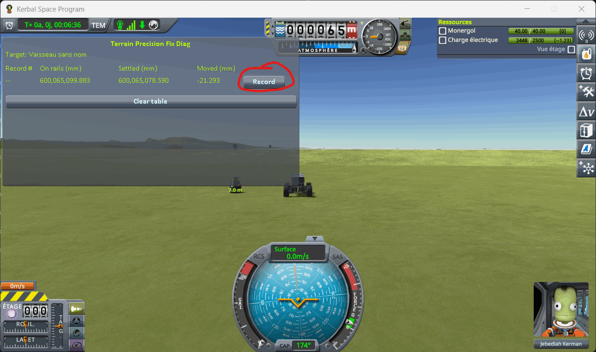
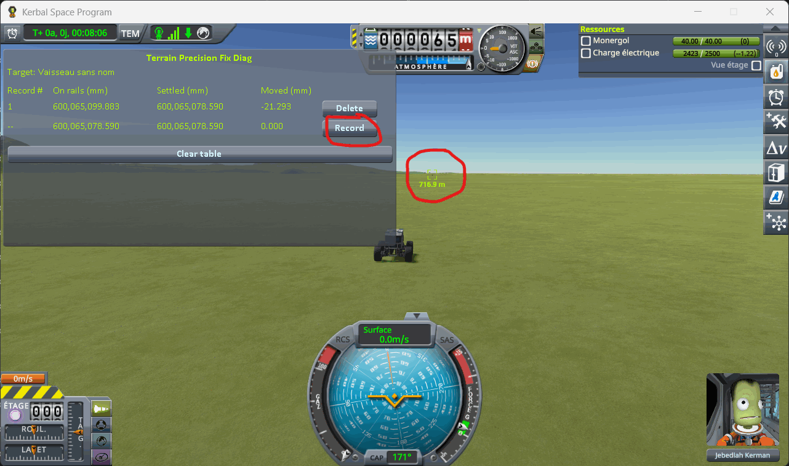
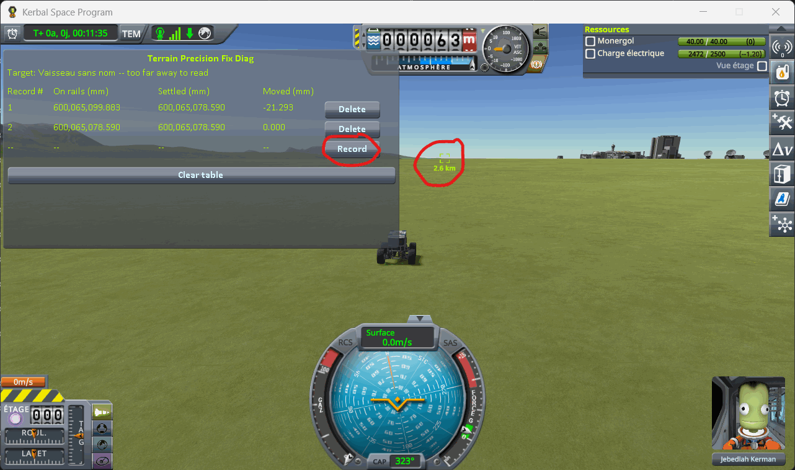
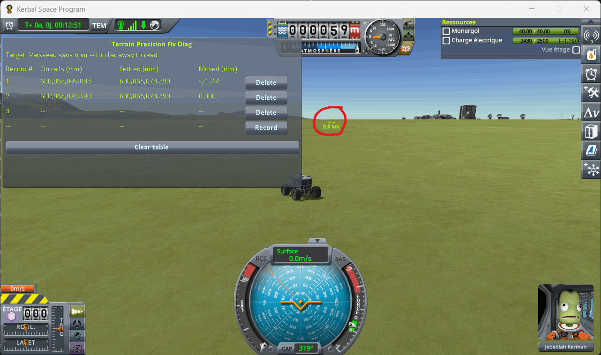
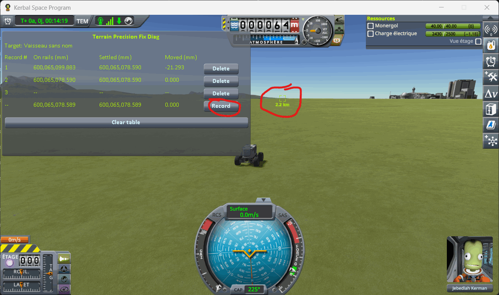
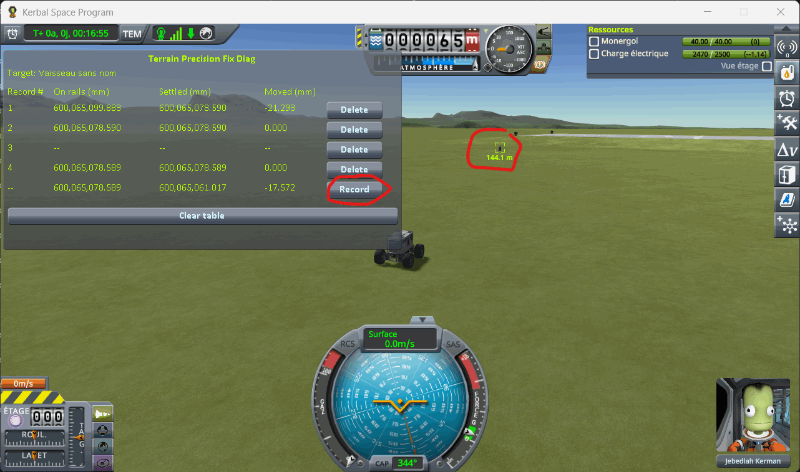

# The protocol: coming back to a craft left parked

Part of [Terrain Precision Fix](../../README.md), for
[Checking the culprit: coming back to a craft left parked](../checking-the-culprit-approach.md): how a
craft loaded into a scene already running is read, step by step, by
[KSP Diag - Landed Vessel](https://github.com/lhervier/KSP-Diag-LandedVessel). Nothing is loaded here —
from the first line to the last, it is one single flight. The columns it fills are in
[its window](https://github.com/lhervier/KSP-Diag-LandedVessel/blob/main/docs/the-window.md).
[KSP Diag - Terrain Height](https://github.com/lhervier/KSP-Diag-TerrainHeight), installed alongside,
records at the same moments; what it adds is in
[its own page of the protocol](https://github.com/lhervier/KSP-Diag-TerrainHeight/blob/main/docs/the-protocol-approach.md).
The protocol is the same without this mod and with it.

A craft is parked on bare ground. A rover drives far enough for the game to unload it, then comes
back, and the window follows the parked craft throughout.

## The save

[`approach-kerbin.sfs`](../../diag/checking-the-culprit-approach/approach-kerbin.sfs), a sandbox game
of KSP 1.12.5. Copy it into the folder of a sandbox game and load it from that game. It holds two
craft, 26 m apart on the flat grass west of the KSC:

- **the craft the readings are about**: a Mk1 command pod on an FL-T100 tank, landed at latitude
  −0.0610°, longitude −74.7395°. It is already the target of the other one, so the window follows it
  from the moment the scene opens, and you have nothing to set;
- **the rover you drive**: a crewed rover on four wheels, with batteries and solar panels to recharge
  them.

You can of course build your own two craft instead. The parked one must meet the same conditions as
[the craft of the loading protocol](../checking-the-culprit-loading/making-the-save.md): a spot where
it does not slide, no suspension.

## The distances that decide everything

They are the game's own, from the `VesselRanges` of `Physics.cfg`. A landed craft is **unloaded at
2500 m**, **loaded again at 2250 m**, **packed at 350 m**, and **handed over to physics at 200 m**.

Unloaded and loaded again are not the same distance on purpose, so that a craft sitting right at the
limit does not load and unload over and over. Coming back, the numbers reappear at 2250 m — not at
2500 m, where they went away.

## The protocol

Load the save and **do not change scene again** — no save, no load, no trip back to the space centre.
Everything below happens in one flight, and that is the whole point of these readings.

Then, per round trip, five records.

**1. Next to it.** Press *Record* without moving.

**2. A few hundred metres away.** Drive off, past 350 m, and press *Record*.

**3. Out of range.** Keep going past 2500 m, until the line reads `too far away to read`, and press
*Record* on the empty line.

**4. Turn round.** Stop beyond 3 km, turn, and drive back. Nothing to record here.

**5. Back in range.** Once the numbers come back, press *Record*.

**6. Back beside it.** Come within 200 m, give it three to five seconds to settle, and press *Record*.

## What the five lines are worth

| line | where | what the game is doing to the parked craft | what the line is worth |
|---|---|---|---|
| 1 | beside it | loaded, physics running on it | where the previous round trip left it |
| 2 | ~600 m | packed again, still loaded | `0.000`, by construction: a packed craft is held where it is |
| 3 | past 2500 m | unloaded | nothing to read — it is the proof the round trip really happened |
| 4 | back under 2250 m | loaded again, still packed | the height the game hands back |
| 5 | under 200 m | handed over to physics | **the measurement** |

Lines 2 and 4 measure nothing: a packed craft cannot move, so both columns carry the same number.
They prove something instead — that the height the game holds the craft at did not drift while it was
away. Everything happens between line 4 and line 5.

Line 3 cannot be recorded from anywhere else: the window only has nothing to show while the craft is
out of range. An empty line in the middle of the table is what tells a reader that the two records
around it really are separated by a trip out of range, and not by two readings taken on the spot.

⚠️ **Wait before recording line 5.** The craft is still settling for a second or two after physics
takes it over, by a few hundredths of a millimetre. Waiting the same three to five seconds every time
costs nothing and keeps the lines comparable.

⚠️ **Do not save while the round trips are running.** Saving would write the craft's current height
into the save, and the next reading would be taken against that instead of the one you started from.

**Then do it again.** One round trip says nothing: the size of the reading is not the same twice, and
a round trip can come back within a millimetre. It is the series that is worth reading, not a line.

## Played by a script

[`diag/automation/run-approach.py`](../../diag/automation/run-approach.py) plays the protocol above,
round trip after round trip, and takes the screenshots. It drives KSP through
[KSP-MCPServer](https://github.com/lhervier/KSP-MCPServer), a mod that answers requests sent to it over
HTTP, from the computer KSP runs on only; and it needs nothing but Python 3 — no AI, no package to
install. Anyone can read it top to bottom: it follows the steps above in the same order.

1. Install KSP-MCPServer next to both instruments — and this mod, for the series with it: the script
   records in both windows at the same moment, and waits on the reading of KSP Diag - Terrain Height to
   know the parked craft has settled. Copy
   [the save](../../diag/checking-the-culprit-approach/approach-kerbin.sfs) into a sandbox game, start
   KSP and wait for the main menu.
2. Run `python run-approach.py --folder <your sandbox game> --trips 6 --out screenshots`.

It loads the save once and never changes scene. It first turns on the cheat *Infinite Electricity*
(`Alt+F12`), for the rover: six round trips of more than six kilometres empty its batteries faster
than its panels fill them; it changes nothing on the parked craft. Then, for each round trip, it
records beside the craft; drives south to about 700 m and records; on to about 2600 m, out of range,
and records the empty line; on beyond 3 km, turns round, drives back to 2000 m and records; then back
to the rover's starting spot, waits four seconds and for the digits to stop moving (within half a
thousandth of a millimetre over two seconds), and records. After each round trip it takes a screenshot
of each table and clears both, so that each screenshot holds one round trip. It prints every line it
records, writes them to `lines.json` next to the screenshots, and quits KSP at the end — give it
`--keep-running` to leave KSP open. Save `KSP.log` before starting KSP again: KSP writes it anew at
every start.
