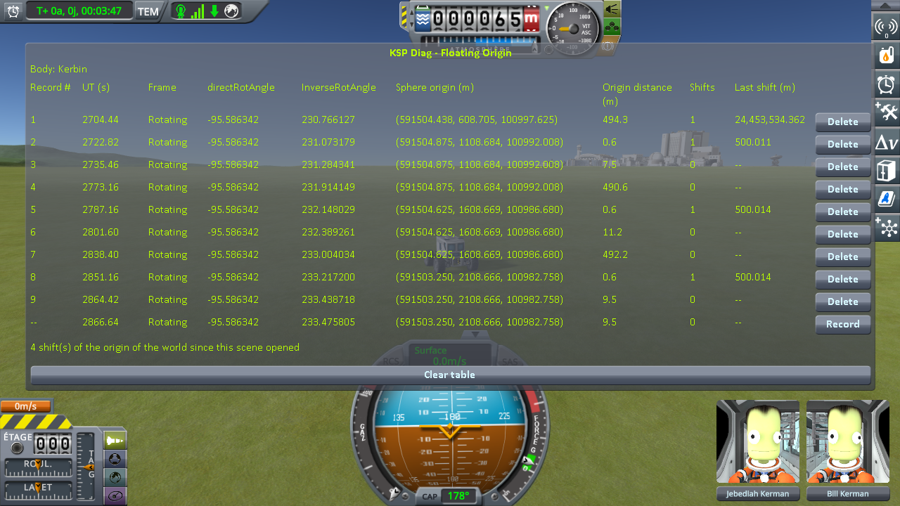
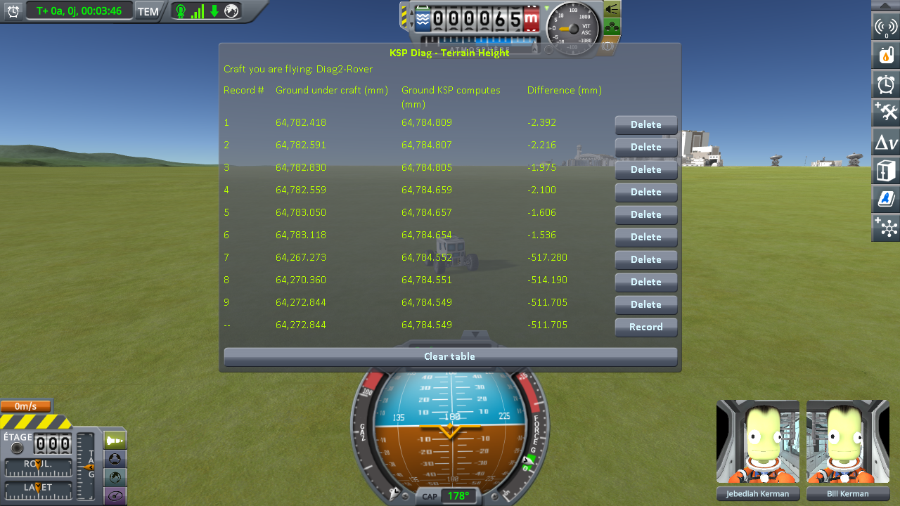
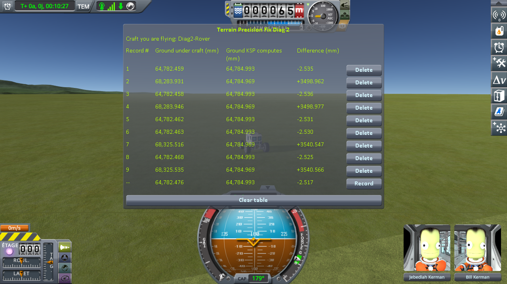
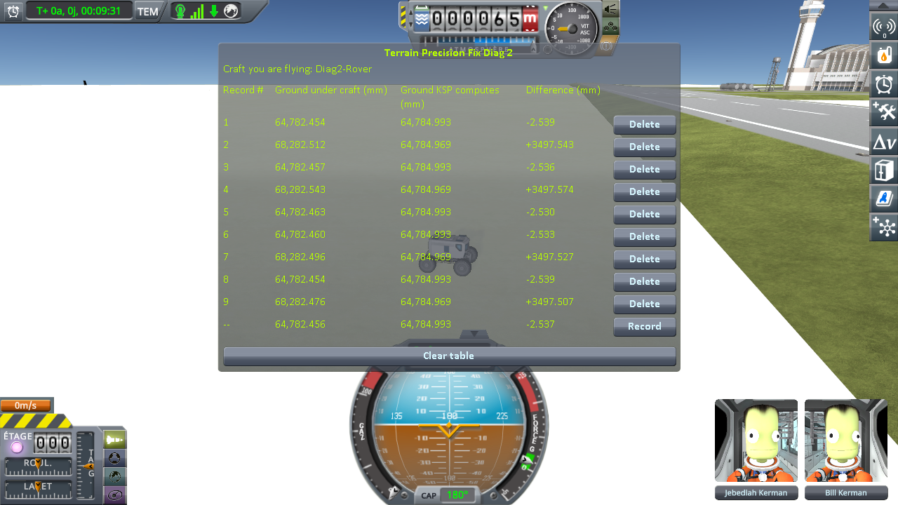
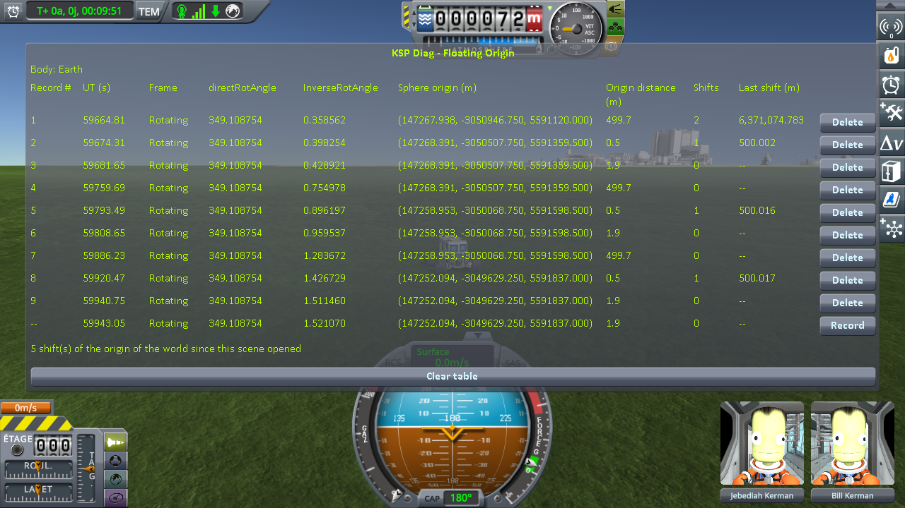
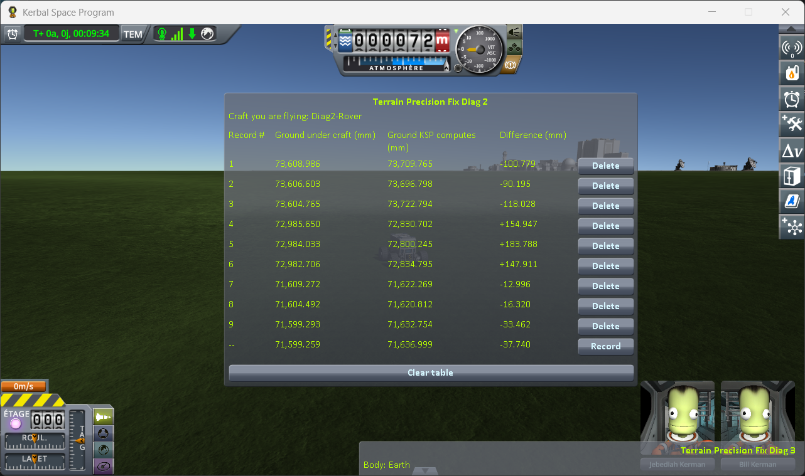
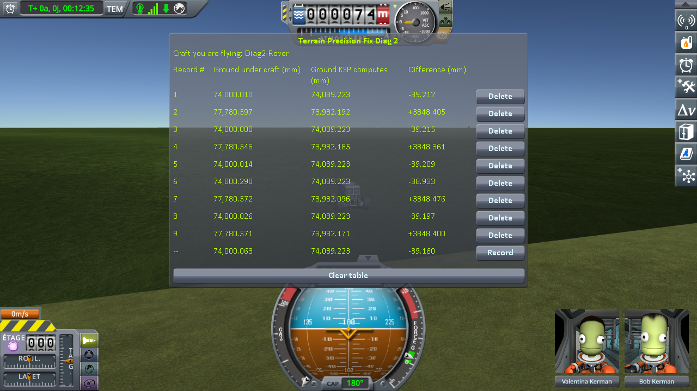

# Checking the culprit: driving on while the world moves

Part of [Terrain Precision Fix](../README.md): the measurements that check the two culprits, [the ground](the-culprit-ground.md) and [the statics](the-culprit-statics.md), under a rover that keeps driving, while the game moves its whole world, on stock and with this mod, on Kerbin and on Earth in Real Solar System: on the grass, and on the runway of the KSC with the grass beside it.

The ground under a craft the game sets down is measured in [Loading the same save](checking-the-culprit-loading.md), [Coming back to a craft left parked](checking-the-culprit-approach.md) and [Switching to a craft far away](checking-the-culprit-switching.md).

[Terrain Precision Fix Diag 2](https://github.com/lhervier/KSP-TerrainPrecisionFixDiag2) measures the
ground, and [Terrain Precision Fix Diag 3](https://github.com/lhervier/KSP-TerrainPrecisionFixDiag3),
which only reads, says when the world moves. Each has its own page, with its method.

This fix is built on top of [KSP Community Fixes](https://github.com/KSPModdingLibs/KSPCommunityFixes),
the base most players run, so every campaign on this page is run in an install that has it: KSP 1.12.5
with Harmony, ModuleManager, KSP Community Fixes 1.41.1 and the two instruments — and this mod, or not;
on Earth, [Real Solar System](https://github.com/KSP-RO/RealSolarSystem) 20.1.3.0 and what it requires
as well. *On stock*, below, means that install without this mod.

Every 500 m the craft you fly travels, KSP moves the floating origin back onto it, and with it the
terrain sphere: the translation of the frame the ground is converted through
([Why it is different at every load](the-culprit-ground.md#why-it-is-different-at-every-load)). Stock places the landed quads again at each of
those shifts (`CelestialBody.PreciseUpdateQuadPositions`), through that new frame. A rover alone on the
grass south of the runway of the KSC drives due south; at each shift, three lines: just before it, a few
metres after it, and the same few metres farther on with no shift, which measures what the few metres
do on their own. A shift counts when the first change is at least three times the second. It is
[the driving protocol](https://github.com/lhervier/KSP-TerrainPrecisionFixDiag2/blob/master/docs/the-protocol-driving.md)
of Terrain Precision Fix Diag 2, on the two saves it publishes.

The terrain sphere carries the runway of the KSC too. A rover alone by it reads a spot on the grass, G,
and a spot on the deck, P, two or three times each before a move of the origin and twice after it, nine
lines a move. A script drives the rover through
[KSP-MCPServer](https://github.com/lhervier/KSP-MCPServer) and parks it on the same spots to within a
centimetre. It is the
[protocol of the runway and the grass while the world moves](https://github.com/lhervier/KSP-TerrainPrecisionFixDiag2/blob/master/docs/the-protocol-driving-runway.md)
of Terrain Precision Fix Diag 2, on the saves it publishes, in the install above with KSP-MCPServer
added; on Earth, Real Solar System is built without its runway fix, which keeps the floating origin from
moving at 500 m once a craft has rolled onto the deck
([`rss-20.1.3-without-its-runway-fix.diff`](../diag/rss-runway-fix/rss-20.1.3-without-its-runway-fix.diff);
see [Real Solar System: the runway fix](limits-and-solutions/rss/the-runway-fix.md)). This mod corrects
the terrain and the statics separately, each with its own setting (`fixTerrain`, `fixStatics`), so on
Kerbin the runway is read three ways: on stock, with the terrain fix alone, and with both. On Earth, on
stock and with this mod as it is installed. Across each move, the mean of the lines after minus the mean
of the lines before.

## On Kerbin

**On stock**, two runs
([the readings](https://github.com/lhervier/KSP-TerrainPrecisionFixDiag2/blob/master/docs/the-measurements-driving.md#on-kerbin)).
*Difference* — the ground under the rover minus the height KSP computes for that spot — changes, in
millimetres, across the five shifts kept:

| run, shift | across the shift | same distance, no shift |
|---|---|---|
| 1, 1 | **−4.197** | +1.166 |
| 1, 2 | **−11.692** | −0.740 |
| 1, 3 | **+9.588** | +0.009 |
| 2, 1 | **−11.782** | −0.228 |
| 2, 2 | **+10.749** | −0.476 |

**With this mod**, in that same install, on that same save, with this mod as the only difference. The
session is logged in [`diag/runs/driving-diag2-fix.log`](../diag/runs/driving-diag2-fix.log). On the
three lines of each shift below, **Ground KSP computes** reads the same digits to within six
thousandths of a millimetre, and Diag 3 reads one shift of 500.0 m, to within five centimetres, on each
line taken just after a shift, and none on each line taken with no shift. In *Difference*, in
millimetres:

| shift | just before | just after | same distance again | across the shift | same distance, no shift |
|---|---|---|---|---|---|
| 1 | −2.349 | −2.134 | −1.776 | **+0.215** | +0.358 |
| 2 | −1.725 | −1.494 | −1.272 | **+0.231** | +0.222 |

The third shift is in the screenshots and not in the table: *Difference* changes by +4.427 mm across
it and by +5.193 mm over the same few metres with no shift. That is the same spot, about a kilometre and
a half south of the runway, that left out a shift of the second run on stock; see
[What the measurements say](#what-the-measurements-say).

**By the runway of the KSC.** Across each move, in millimetres:

| | move | the grass, G | the deck, P | the step, P − G | spread at a spot, at most |
|---|---|---|---|---|---|
| on stock | 1 | **−8.843** | **−8.851** | −0.008 | 0.044 |
| | 2 | **+48.506** | **+48.471** | −0.035 | 0.044 |
| with the terrain fix alone | 1 | +0.006 | **+41.587** | **+41.581** | 0.019 |
| | 2 | +0.004 | **−22.311** | **−22.315** | 0.017 |
| with both fixes | 1 | −0.001 | −0.042 | −0.040 | 0.031 |
| | 2 | +0.005 | −0.002 | −0.006 | 0.007 |
| | 3 | −0.003 | +0.001 | +0.004 | 0.028 |

**On stock**
([the readings](https://github.com/lhervier/KSP-TerrainPrecisionFixDiag2/blob/master/docs/the-measurements-driving-runway.md)),
one run, a third move left out where the grass is no longer flat.

**With the terrain fix alone**, `fixStatics = false` in this mod's settings, the only line changed. The
session is logged in
[`diag/runs/driving-runway-diag2-fix-terrain-only.log`](../diag/runs/driving-runway-diag2-fix-terrain-only.log),
what the script printed in
[`driving-runway-diag2-fix-terrain-only-script.txt`](../diag/runs/driving-runway-diag2-fix-terrain-only-script.txt)
and every line it recorded in
[`driving-runway-diag2-fix-terrain-only-lines.json`](../diag/runs/driving-runway-diag2-fix-terrain-only-lines.json).
At the second move, the rover stalled against the lip of the deck on its way to P and stopped 0.79 m
from the spot, at the same place each time: its readings there agree to 0.017 mm. On the last visit to
P, after the move, it stopped 9.7 m away, and that line is left out: P has one line after that move.

**With both fixes**, this mod as it is installed. The session is logged in
[`diag/runs/driving-runway-diag2-fix.log`](../diag/runs/driving-runway-diag2-fix.log), what the script
printed in [`driving-runway-diag2-fix-script.txt`](../diag/runs/driving-runway-diag2-fix-script.txt) and
every line it recorded in
[`driving-runway-diag2-fix-lines.json`](../diag/runs/driving-runway-diag2-fix-lines.json). It was played
with an earlier version of the script, which parked G 359 to 480 m from the origin before each move,
all three on flat grass.

## On Earth

The ground around the KSC of Real Solar System is not flat to the millimetre: the height KSP computes
changes by about a centimetre per metre, so the rover stops within two metres of each shift, and again
two metres on.

**On stock**, two runs
([the readings](https://github.com/lhervier/KSP-TerrainPrecisionFixDiag2/blob/master/docs/the-measurements-driving.md#on-earth)).
Across the three shifts kept, in millimetres:

| run, shift | across the shift | same distance, no shift |
|---|---|---|
| 1, 1 | **−420.508** | −14.697 |
| 2, 1 | **−301.646** | −11.094 |
| 2, 2 | **−141.789** | +7.346 |

**With this mod**, in that same install, on that same save. The session is logged in
[`diag/runs/driving-earth-rss-diag2-fix.log`](../diag/runs/driving-earth-rss-diag2-fix.log). Diag 3
reads one shift of 500.0 m, to within five millimetres, on each line taken just after a shift, and none
on each line taken with no shift; its first line reads two, the moves the game makes as the scene opens
on Earth. In *Difference*, in millimetres:

| shift | just before | just after | same distance again | across the shift | same distance, no shift |
|---|---|---|---|---|---|
| 1 | −100.779 | −90.195 | −118.028 | **+10.584** | −27.833 |
| 2 | +154.947 | +183.788 | +147.911 | **+28.841** | −35.877 |
| 3 | −12.996 | −16.320 | −33.462 | **−3.324** | −17.142 |

None of the three shifts counts: each changes *Difference* less than the same few metres do with no
shift. On that slope, the rover also slid a little where it stood, and the height KSP computes changes
between the lines by 1.5 to 35 mm.

**By the runway of the KSC at Cape Canaveral.** Across each move, in millimetres:

| | move | the grass, G | the deck, P | the step, P − G | spread at a spot, at most |
|---|---|---|---|---|---|
| on stock | 1 | **−375.905** | **−375.888** | +0.017 | 0.120 |
| | 2 | **+45.637** | **+45.685** | +0.049 | 0.051 |
| with this mod | 1 | +0.147 | +0.055 | −0.092 | 0.264 |
| | 2 | +0.101 | −0.014 | −0.115 | 0.203 |

**On stock**
([the readings](https://github.com/lhervier/KSP-TerrainPrecisionFixDiag2/blob/master/docs/the-measurements-driving-runway.md#on-earth)),
one run, two moves.

**With this mod**, on the same save. The session is logged in
[`diag/runs/driving-runway-earth-rss-diag2-fix.log`](../diag/runs/driving-runway-earth-rss-diag2-fix.log),
what the script printed in
[`driving-runway-earth-rss-diag2-fix-script.txt`](../diag/runs/driving-runway-earth-rss-diag2-fix-script.txt)
and every line it recorded in
[`driving-runway-earth-rss-diag2-fix-lines.json`](../diag/runs/driving-runway-earth-rss-diag2-fix-lines.json).
The rover stopped 13 to 16 cm from each spot, and G stood 476 to 479 m from the origin before each move;
Diag 3 reads a move of 500.0 m, to within five centimetres, on the first line after each. The log shows
this mod taking the KSC out of its sphere once, as the save loads, and holding it there through both
moves.

The screenshots of every move by the runway, on Kerbin and on Earth, read by both instruments, are in
[`imgs/Diag2/on-driving-runway/`](../imgs/Diag2/on-driving-runway/).

## What the measurements say

**On stock, the ground moves under a rover in the middle of a drive.** Across a shift of the floating
origin, *Difference* changes by 4.2 to 11.8 mm on Kerbin, five shifts kept out of seven, and by 142 to
421 mm on Earth, three kept out of six; across the same few metres with no shift, by 1.2 mm and 15 mm at
most. Nothing is loaded and the scene does not change: the quads under the rover are placed again
through a new rounding of the frame, and land somewhere else. On Earth, the rover was seen to jump when
the ground rose under it.

**With this mod, a shift moves nothing.** On Kerbin, across the two shifts read, *Difference* changes by
0.215 and 0.231 mm, no more than over the same few metres with no shift, 0.358 and 0.222 mm. On Earth,
by 3 to 29 mm, less than over the same few metres with no shift, 17 to 36 mm, on a slope where the rover
slid: no shift stands out from what the few metres do. The logs show this mod placing the quads again at
every shift, a burst of 128 to 152 quads within the same second on Kerbin, about 184 on Earth, which stock
would have placed somewhere else.

**The runway moves too, and correcting the terrain is not enough.** On stock, at every move of the
floating origin, the deck of the KSC moves — by −8.85 and +48.47 mm on Kerbin — together with the grass
beside it, to within four hundredths of a millimetre: both hang from the terrain sphere, whose position
is written in float anew at each move, and both are carried by that same new rounding. With the terrain
fix alone, the grass holds, within six thousandths of a millimetre, and the deck still moves on its own,
by +41.59 and −22.31 mm: the terrain fix does not reach a static. With both fixes, neither moves, within
four hundredths of a millimetre on the deck over three moves: the statics fix holds the runway through a
move of the origin as it does through a loading.

**On Earth, where a float's step is eight times larger, the same.** On stock, the deck and the grass
move together, by −375.89 and +45.69 mm: a rover rolling on the runway is no better off than one on the
grass, which moves by up to 421 mm across a move. With this mod, the deck moves by 0.055 mm at most, and
the grass by 0.147 mm, within the spread of the lines taken at the same spot, 0.264 mm: the origin
moves, and nothing under the rover does.

**On flat grass, the ground with this mod reads 1.3 to 2.3 mm below the height KSP computes**, where on
stock it reads 36 to 111 mm above it. That remainder is geometry, not a rounding: the collision mesh is
made of flat triangles, which miss what the ground does between two vertices
([Terrain Precision Fix Diag 2 explains why a correct reading is not zero](https://github.com/lhervier/KSP-TerrainPrecisionFixDiag2/blob/master/docs/this-mods-demonstration.md#why-a-correct-reading-is-not-zero)).

**One spot on Kerbin, about a kilometre and a half south of the runway, reads far below the computed
height**, on stock (−292.7 and −284.9 mm in the two runs) and with this mod (−508.8 mm), and a few metres
change the reading there by up to 20 mm with no shift. The computed height is flat there, to a few
thousandths of a millimetre. Where that comes from is not established yet; it is not a shift of the
origin, and the shifts read there are left out.
