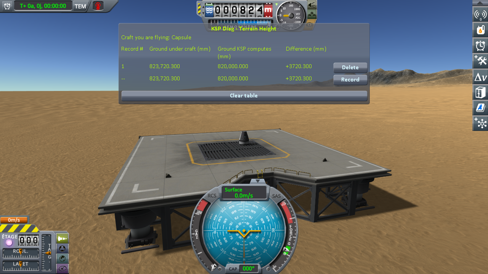
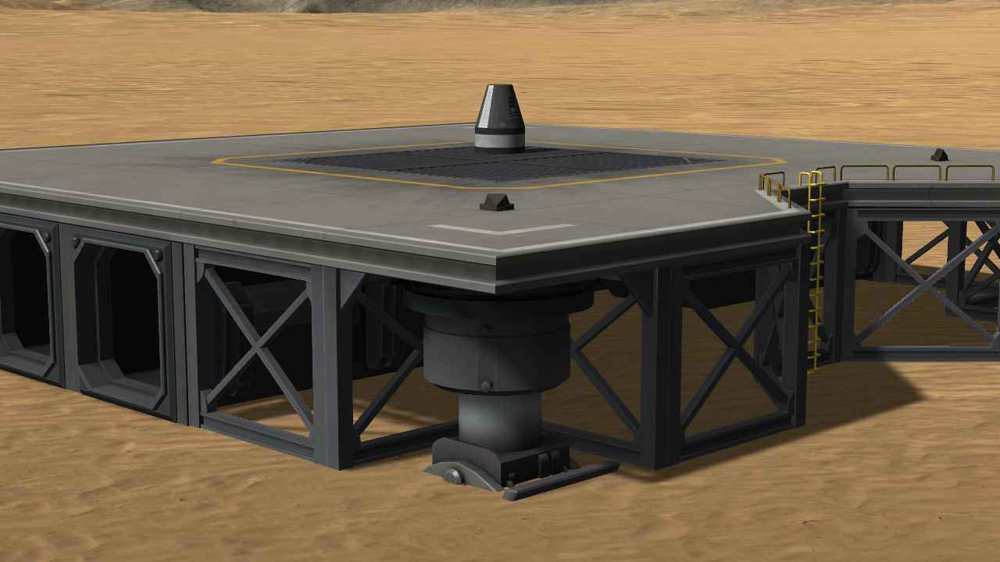
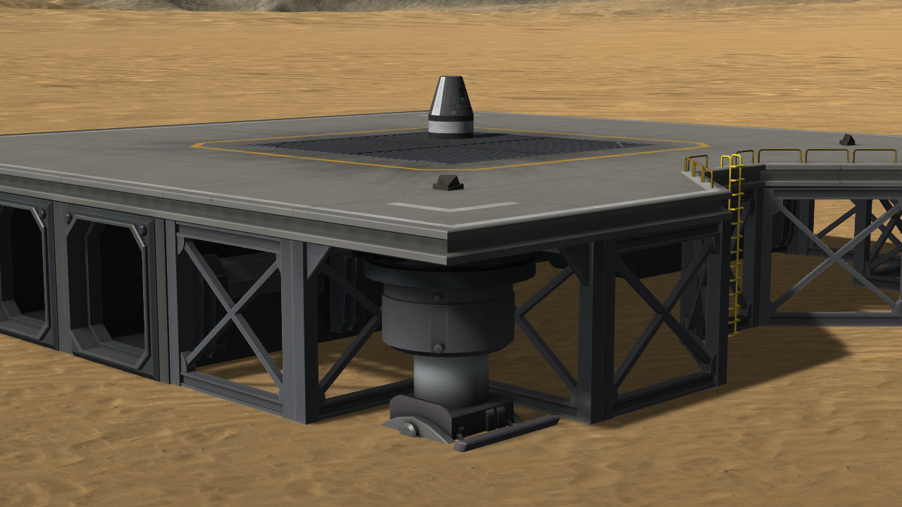
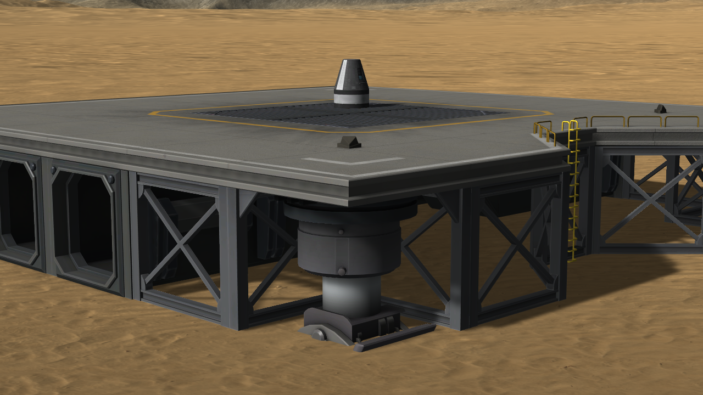
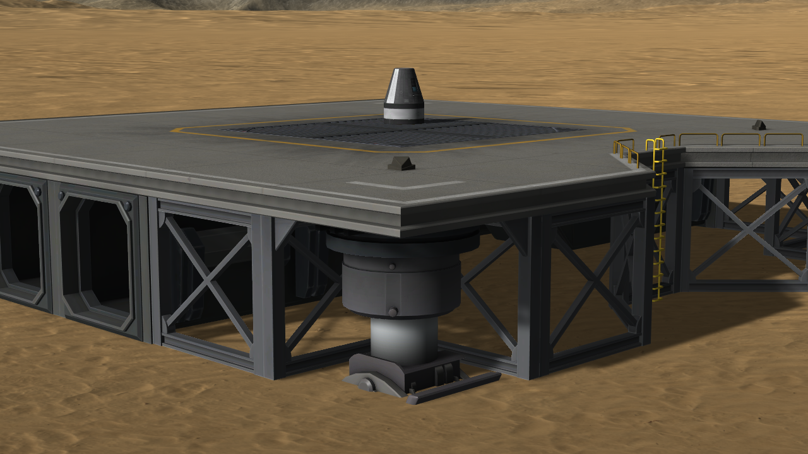
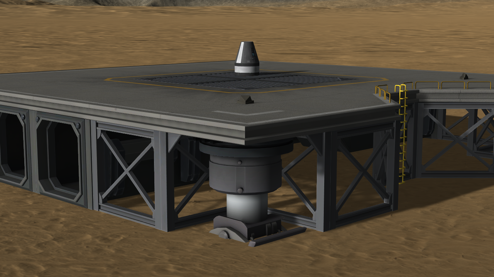

# Checking the culprit: launching from a launch pad of Making History

Part of [Terrain Precision Fix](../README.md): the measurements that check [the statics](the-culprit-statics.md) on a launch pad of the Making History expansion, the Desert Launch Site, on stock and with this mod.

[KSP Diag - Terrain Height](https://github.com/lhervier/KSP-Diag-TerrainHeight) takes the readings: it
measures the ground under a craft, here the deck of the launch pad the craft stands on. It has its own
page, with its method and its protocol.

This fix is built on top of [KSP Community Fixes](https://github.com/KSPModdingLibs/KSPCommunityFixes),
the base most players run, so the campaign on this page is run in an install that has it: KSP 1.12.5
with the Making History expansion, Harmony, ModuleManager, KSP Community Fixes 1.41.1, the instrument,
and [KSP-MCPServer](https://github.com/lhervier/KSP-MCPServer), which plays the protocol — and this mod,
or not. *On stock*, below, means that install without this mod.

The Desert Launch Site is a deck on four legs, placed by `PQSCity2` like a static of the KSC. The game
sets it on the ground once in a session of the game, when a craft is first launched from it: it lifts
itself if one of its feet is under the ground, then stretches its legs down to the ground
([Measuring a launch pad against the ground](the-fix-statics.md#measuring-a-launch-pad-against-the-ground)).
So a capsule is launched from it in six sessions, one launch each, and the deck under it is read each
time. It is [the launch pad protocol](https://github.com/lhervier/KSP-Diag-TerrainHeight/blob/main/docs/the-protocol-launch-pad.md)
of the instrument, played by its script,
[`run-launch-pad.py`](https://github.com/lhervier/KSP-Diag-TerrainHeight/blob/main/docs/the-protocol-launch-pad.md#played-by-a-script),
once without this mod and once with it. The sessions with this mod are logged in
[`launch-pad-fix-1.log`](../diag/checking-the-culprit-launch-pad/launch-pad-fix-1.log) to
[`launch-pad-fix-6.log`](../diag/checking-the-culprit-launch-pad/launch-pad-fix-6.log); what the script printed is in
[`launch-pad-fix-script.txt`](../diag/checking-the-culprit-launch-pad/launch-pad-fix-script.txt), and every line it recorded in
[`launch-pad-fix-lines.json`](../diag/checking-the-culprit-launch-pad/launch-pad-fix-lines.json).

## The deck, over six launches

**On stock**
([the readings](https://github.com/lhervier/KSP-Diag-TerrainHeight/blob/main/docs/the-measurements-launch-pad.md)).
The height KSP computes reads 820,000.000 mm at all twelve launches, the ground the game flattens around
the launch site. *Difference*, the deck the capsule stands on above that ground:

| launch | 1 | 2 | 3 | 4 | 5 | 6 |
|---|---|---|---|---|---|---|
| *Difference*, without this mod | +4,329.019 mm | +4,329.019 mm | +4,260.216 mm | +4,329.019 mm | +3,736.212 mm | +4,329.019 mm |
| *Difference*, with this mod | +3,720.300 mm | +3,720.300 mm | +3,720.300 mm | +3,720.300 mm | +3,720.300 mm | +3,720.299 mm |

Without this mod, `KSP.log` holds a line written by the launch pad in every session but the fifth, saying
it moved itself up *so legs are above ground*. With this mod, it holds no such line in any session, and
one line of this mod in each: the launch pad taken out of its terrain sphere while its legs are measured.

**With this mod**, in that same install, with this mod as the only difference, the first launch:

The deck spreads over 592.8 mm without this mod, and 0.001 mm with it.

## The feet, over six launches

With this mod, the foot of the launch pad nearest the camera, from the south-west of the capsule, at
each launch; the same view without this mod is in
[the readings of the instrument](https://github.com/lhervier/KSP-Diag-TerrainHeight/blob/main/docs/the-measurements-launch-pad.md):

| | |
|---|---|
|  |  |
| launch 1 | launch 2 |
|  |  |
| launch 3 | launch 4 |
|  |  |
| launch 5 | launch 6 |

## What the measurements say

**On stock, the launch pad measures the ground from a rounded position.** It sets itself on the ground
while the craft is being launched, hanging from its terrain sphere, so from a position rounded to a
float step ([The culprit: the statics](the-culprit-statics.md)), different from one session to the next.
When the rounding takes one of its feet under the ground, it lifts itself; when it does not, it stays
where it is. On these six sessions, it lifted itself five times, by different amounts, and its deck
spreads over 592.8 mm.

**With this mod, the launch pad is in the same place at every launch.** It measures the ground from a
position in double ([Measuring a launch pad against the ground](the-fix-statics.md#measuring-a-launch-pad-against-the-ground)):
none of its feet comes out under the ground, it never lifts itself, and its deck reads the same height at
all six launches, within a thousandth of a millimetre.

**Its feet stand on the ground at every launch, with this mod and without it.** The launch pad stretches
its legs down to the ground in either case; what changes on stock is the height of everything above the
feet, the deck the craft stands on included.

**With this mod, the launch pad stands lower than stock usually sets it.** Its deck reads 3,720.300 mm
above the ground, where stock set it 540 to 609 mm higher in the five sessions it lifted itself, and
3,736.212 mm in the one it did not, within a float step of this mod. It is not a new place: it is the
one stock gives the launch pad whenever the rounding leaves its feet above the ground.
