# Checking the culprit: loading the same save

Part of [Terrain Precision Fix](../README.md): the measurements that check the two culprits, [the ground](the-culprit-ground.md) and [the statics](the-culprit-statics.md), on a craft handed back by a save, on stock and with this mod: on bare ground, and on a runway with the ground beside it.

The two other ways a craft is put back onto the ground are measured in [Coming back to a craft left parked](checking-the-culprit-approach.md) and [Switching to a craft far away](checking-the-culprit-switching.md).

Two instruments take the readings:
[Terrain Precision Fix Diag 1](https://github.com/lhervier/KSP-TerrainPrecisionFixDiag) measures the craft, and
[Terrain Precision Fix Diag 2](https://github.com/lhervier/KSP-TerrainPrecisionFixDiag2) measures the ground. Each has its own page, with
its method and its protocol.

This fix is built on top of [KSP Community Fixes](https://github.com/KSPModdingLibs/KSPCommunityFixes),
the base most players run, so every campaign on this page is run in an install that has it: KSP 1.12.5 with Harmony, ModuleManager,
KSP Community Fixes 1.41.1 and one of the two instruments — and this mod, or not. *On stock*, below,
means that install without this mod.

The culprit predicts a spread of one or two float steps, and a float's step doubles each time the
distance to the centre of the body crosses a power of two. So besides the four stock worlds, the same
test is run on the Moon and on Earth of [Real Solar System](https://github.com/KSP-RO/RealSolarSystem),
which replaces the planets with the real ones, much larger. There, the install is the one above plus
its release 20.1.3.0, and what it requires (Kopernicus, Modular Flight Integrator,
KSPTextureLoader, the RSS textures), with one instrument or both.

A craft is set down on bare ground, saved once, and that same save is loaded six times over. The
craft never changes, the spot never changes, and nothing is touched between two loads.

The statics are checked on a runway. Two identical craft, one on a runway and one on the ground beside
it. The save is loaded, a line is recorded on the craft on the ground, then the game's *switch vessel*
key flies the craft on the runway and a second line is recorded there. Six loadings of the same save,
two lines each. It is the runway protocol of both instruments —
[Terrain Precision Fix Diag 1](https://github.com/lhervier/KSP-TerrainPrecisionFixDiag/blob/main/docs/the-protocol-runway.md)
and [Terrain Precision Fix Diag 2](https://github.com/lhervier/KSP-TerrainPrecisionFixDiag2/blob/master/docs/the-protocol-runway.md)
— on the two saves they publish:

- **on Kerbin**, the runway of the KSC and the grass beside it, 152 m apart;
- **on the Mun**, a runway placed by [Kerbal Konstructs](https://github.com/KSP-RO/Kerbal-Konstructs) —
  the model of the KSC's runway it offers — and the ground 42 m from it. The runway hangs from a group
  of Kerbal Konstructs, itself a `PQSCity` of its own: the second culprit, placed by a mod. The ground
  there is not flat, so the step between the two spots is not the height of the deck; it does not need
  to be, as long as it does not move. The install has Kerbal Konstructs 1.12.3 and
  CustomPreLaunchChecks 1.8.1, which it requires, as well.

## The craft, over six loads

Terrain Precision Fix Diag 1 measures the distance from a landed capsule to the centre of the body,
twice per load: as the save hands the capsule back (*On rails*), and once it has settled on the ground
(*Settled*). How, and why those two readings, is in
[This mod's demonstration](https://github.com/lhervier/KSP-TerrainPrecisionFixDiag#this-mods-demonstration).

**On stock.** Its campaigns, detailed in
[The measurements: loading the same save](https://github.com/lhervier/KSP-TerrainPrecisionFixDiag/blob/main/docs/the-measurements-loading.md).
On each of the four stock worlds, a lone capsule, then the same capsule sitting on a small flat fuel
tank; on the Moon and Earth, the capsule on its tank. Each series is saved once and loaded six times,
and uses its own spot, chosen by the rules of
[its protocol](https://github.com/lhervier/KSP-TerrainPrecisionFixDiag/blob/main/docs/the-protocol-loading.md):
no `Moving Vessel` line in `KSP.log`, and a craft that does not slide.

*On rails* is the same on every load, to within three micrometres: KSP puts the craft back at the same
place. *Settled* is not. Here is its spread, set against the step of a float at that distance from the
centre of the body:

| series | loads | distance to the centre | float step there | spread of *Settled* | in steps |
|---|---|---|---|---|---|
| Kerbin, capsule | 6 | 600.2 km | 62.5 mm | 134.5 mm | 2.2 |
| Kerbin, 2 parts | 6 | 600.1 km | 62.5 mm | 124.7 mm | 2.0 |
| Mun, capsule | 6 | 202.1 km | 15.6 mm | 20.7 mm | 1.3 |
| Mun, 2 parts | 6 | 202.6 km | 15.6 mm | 11.8 mm | 0.8 |
| Minmus, capsule | 6 | 60.0 km | 3.9 mm | 6.7 mm | 1.7 |
| Minmus, 2 parts | 6 | 60.0 km | 3.9 mm | 4.8 mm | 1.2 |
| Gilly, capsule | 6 | 16.7 km | 1.95 mm | 3.3 mm | 1.7 |
| Gilly, 2 parts | 6 | 16.7 km | 1.95 mm | 2.5 mm | 1.3 |
| the Moon, 2 parts | 6 | 1 744.4 km | 125 mm | 262.6 mm | 2.1 |
| Earth, 2 parts | 6 | 6 371.1 km | 500 mm | 740.0 mm | 1.5 |

On the Moon and Earth, the first rule of the protocol cannot be kept: the craft came back more than
10 cm off the ground and was moved onto it before its physics started, at three of the six loads on the
Moon, by Real Solar System's workaround, always up, and at five on Earth, by stock's own pass, three
times up and twice down, since the craft is in *prelaunch* there (see
[Real Solar System's own workaround](limits-and-solutions/rss/the-ground-workaround.md)).
*Settled* is read all the same, as a player gets it. The Moon series loads `reload-moon-rss.sfs`, the
Earth series `reload-earth-rss-resave.sfs`, both in
[Diag 1's `diag` folder](https://github.com/lhervier/KSP-TerrainPrecisionFixDiag/tree/main/diag).

**With this mod.** The same test, in the same installs, on the same six worlds, with the same craft,
loaded six times per series. On the Moon, the series loads the same save taken again once with this mod,
`reload-moon-rss-resave.sfs` (see [Existing saves](limits-and-solutions/existing-saves.md)). In each
screenshot, the bottom line is the loading in progress, still live, and is not counted.

The lone capsule:

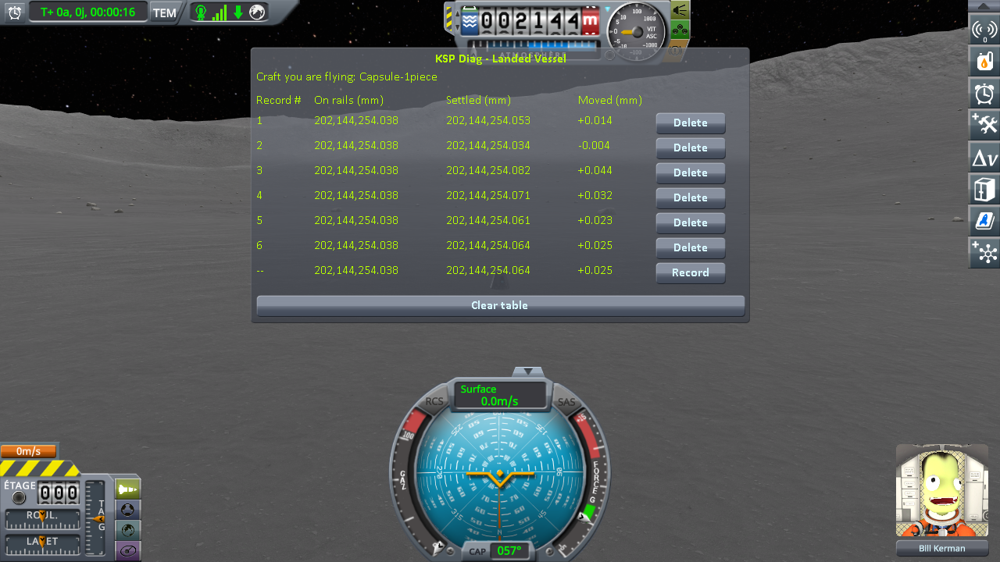

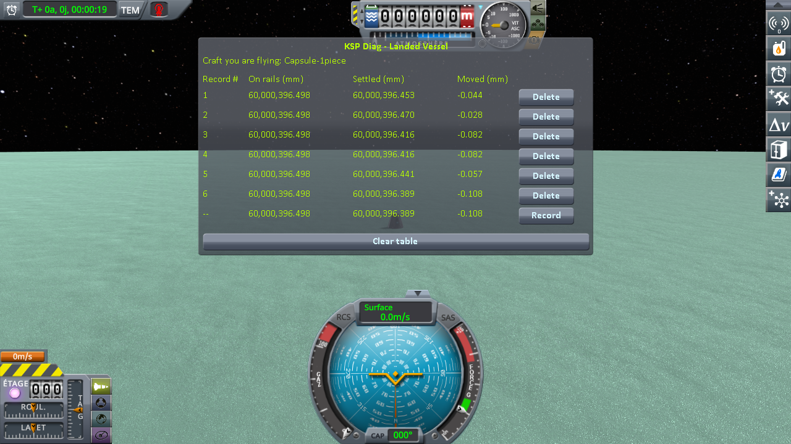

The capsule on its tank:

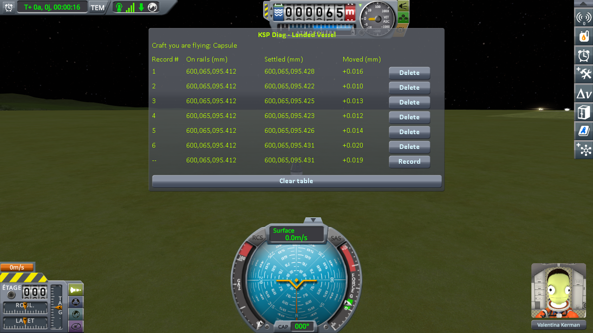

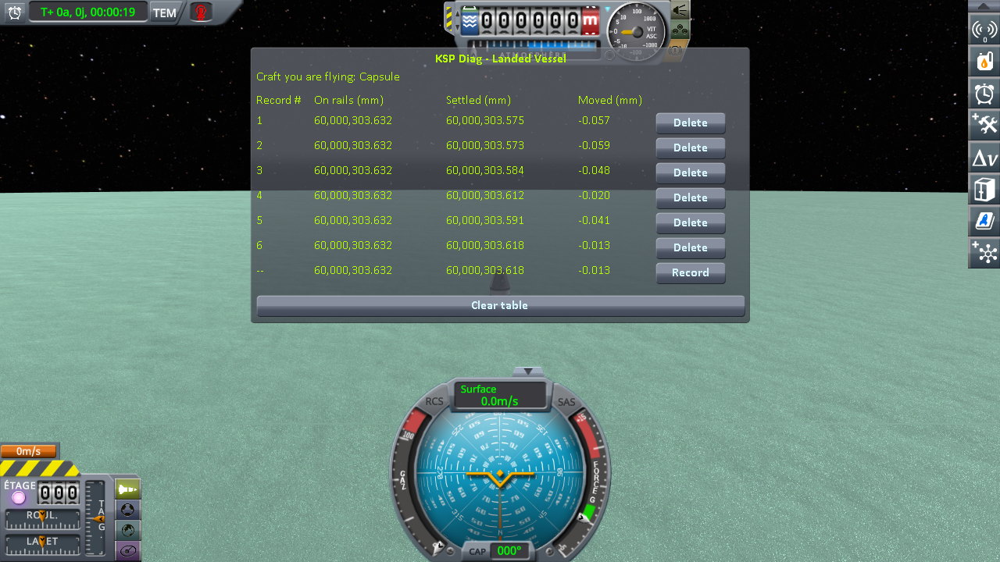

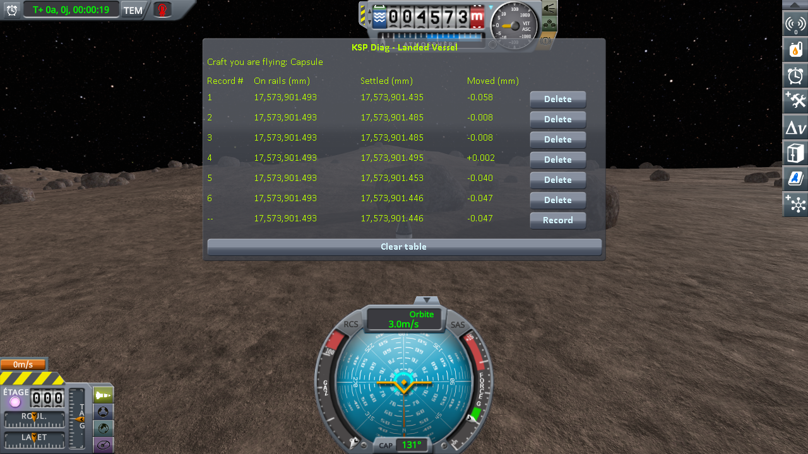

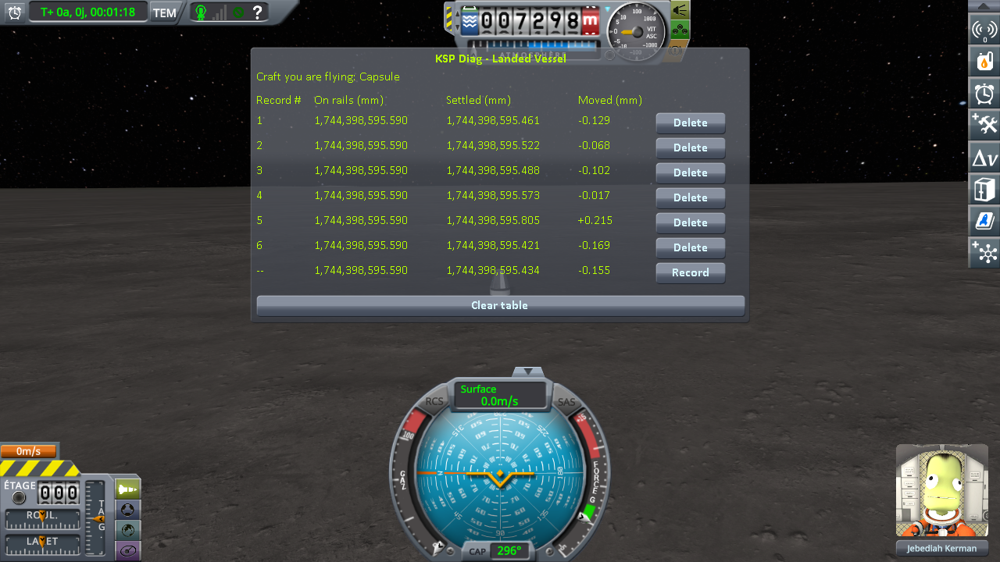

*The craft never jumped, and owes nothing to Real Solar System's own workaround: it ran at every load and never had to move the craft, no `Moving Vessel` line — see [Real Solar System's own workaround](limits-and-solutions/rss/the-ground-workaround.md).*

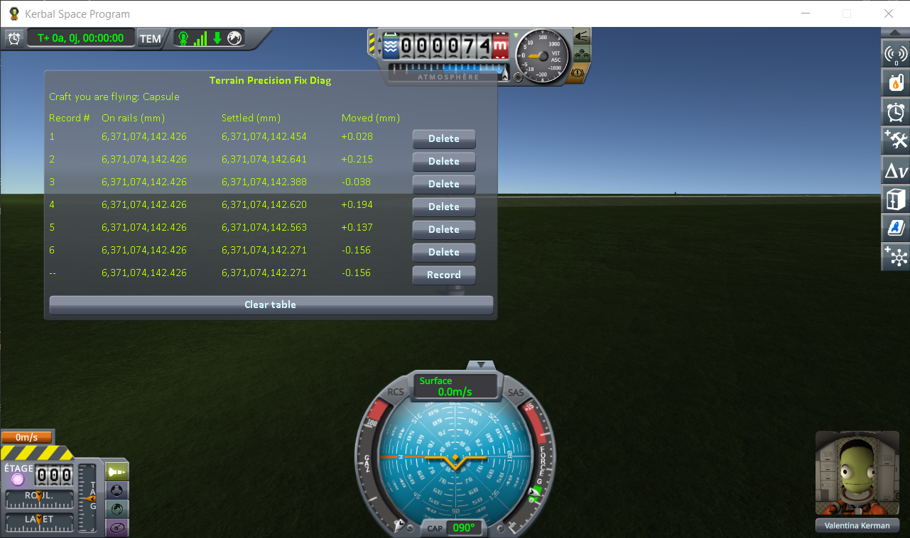

*The craft never jumped, and owes nothing to Real Solar System's own workaround: the craft is in prelaunch, where stock runs the same pass at every load, and it never had to move the craft, no `Moving Vessel` line — see [Real Solar System's own workaround](limits-and-solutions/rss/the-ground-workaround.md).*

The ten series, read off those screenshots:

| series | spread of *Settled*, without this mod | spread of *Settled*, with this mod |
|---|---|---|
| Kerbin, capsule | 134.5 mm | 0.004 mm |
| Kerbin, 2 parts | 124.7 mm | 0.025 mm |
| Mun, capsule | 20.7 mm | 0.031 mm |
| Mun, 2 parts | 11.8 mm | 0.085 mm |
| Minmus, capsule | 6.7 mm | 0.038 mm |
| Minmus, 2 parts | 4.8 mm | 0.023 mm |
| Gilly, capsule | 3.3 mm | 0.058 mm |
| Gilly, 2 parts | 2.5 mm | 0.208 mm |
| the Moon, 2 parts | 262.6 mm | 0.395 mm |
| Earth, 2 parts | 740.0 mm | 0.370 mm |

With this mod, no load of the Moon or Earth series has a `Moving Vessel` line.

The logs of every series with this mod on the Moon and Earth are in
[`diag/runs`](../diag/README.md#on-real-solar-system); the spots of the saves, and what this mod
corrected there, in
[Rescaled systems: Real Solar System](limits-and-solutions/rescaled-systems-real-solar-system.md).

**On a runway, and on the ground beside it, on stock**
([the readings](https://github.com/lhervier/KSP-TerrainPrecisionFixDiag/blob/main/docs/the-measurements-runway.md)).
*On rails* reads the same height on all six loadings, under every craft, within two thousandths of a
millimetre. *Moved*, once physics has the craft:

| loading | 1 | 2 | 3 | 4 | 5 | 6 |
|---|---|---|---|---|---|---|
| Kerbin, on the grass, without this mod | +69.549 mm | −18.707 mm | +68.185 mm | +51.623 mm | +43.103 mm | +38.207 mm |
| Kerbin, on the grass, with this mod | +29.385 mm | +29.387 mm | +29.403 mm | +29.359 mm | +29.408 mm | +29.358 mm |
| Kerbin, on the runway, without this mod | +37.876 mm | −47.685 mm | +26.195 mm | +82.590 mm | −7.586 mm | +12.720 mm |
| Kerbin, on the runway, with this mod | +6.228 mm | +6.241 mm | +6.263 mm | +6.308 mm | +6.385 mm | +6.397 mm |
| Mun, on the ground, without this mod | −64.377 mm | −46.294 mm | −70.422 mm | −65.027 mm | −56.567 mm | −61.993 mm |
| Mun, on the ground, with this mod | −68.167 mm | −68.195 mm | −68.140 mm | −68.131 mm | −68.129 mm | −68.111 mm |
| Mun, on the Kerbal Konstructs runway, without this mod | +9.061 mm | −15.782 mm | −19.165 mm | −24.447 mm | −20.167 mm | −19.594 mm |
| Mun, on the Kerbal Konstructs runway, with this mod | **−3.709 mm** | −25.029 mm | −25.028 mm | −25.038 mm | −25.027 mm | −25.042 mm |

**On a runway, with this mod**, in that same install, on those same saves, with this mod as the only
difference. The sessions are logged in [`diag/runs/runway-diag1-fix.log`](../diag/runs/runway-diag1-fix.log) and
[`runway-mun-kk-diag1-fix.log`](../diag/runs/runway-mun-kk-diag1-fix.log). *On rails* still reads the
same height, within two thousandths of a millimetre. The odd lines are on the ground, the even lines on
the runway, after switching to it; the bottom line is the reading in progress, not a record.

On Kerbin, on the runway of the KSC:

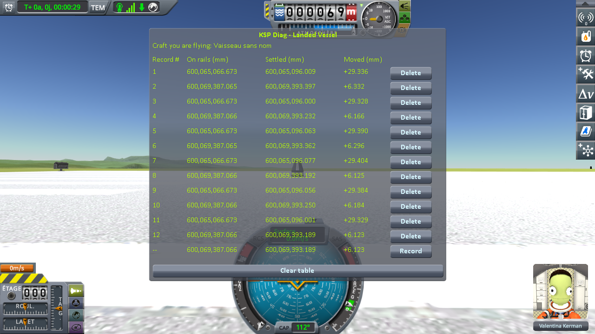

On the Mun, on a runway placed by Kerbal Konstructs:

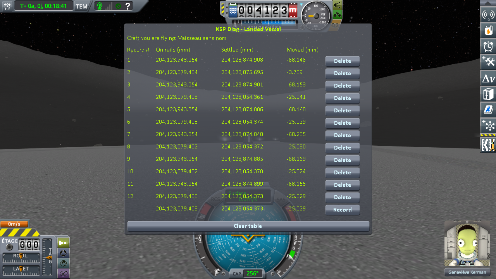

On Kerbin, the craft on the grass comes to rest across a spread of 88.3 mm without this mod, and
0.051 mm with it; the craft on the runway, 130.3 mm without it, and 0.170 mm with it; the step between
the two, 81.7 mm without it, 0.198 mm with it. On the Mun, the craft on the ground, 24.1 mm without this
mod, and 0.084 mm with it; the craft on the runway, 33.5 mm without it; with it, 0.015 mm from the second
loading to the sixth, the first loading apart.

## The ground, over six loads

Terrain Precision Fix Diag 2 measures the ground, with no craft in the reading at all: the collision
surface a ray pointed straight down hits, against the height KSP computes for that same spot. The second
never moves; the first is what your landing legs touch. *Difference* is the first minus the second. How
both are read is in [This mod's demonstration](https://github.com/lhervier/KSP-TerrainPrecisionFixDiag2/blob/master/docs/this-mods-demonstration.md).

**On stock.** Its campaigns, detailed in [The measurements: loading the same save](https://github.com/lhervier/KSP-TerrainPrecisionFixDiag2/blob/master/docs/the-measurements-loading.md):
the same installs, with that instrument; one save on each of the six worlds, loaded six times,
following [its protocol](https://github.com/lhervier/KSP-TerrainPrecisionFixDiag2/blob/master/docs/the-protocol-loading.md).
On the Moon, the save is `reload-moon-rss-resave.sfs`; on Earth, `reload-earth-rss-resave.sfs`. Over those six loads:

| world | spread of *Difference* | spread of the height KSP computes |
|---|---|---|
| Kerbin | 108.1 mm | 0.039 mm |
| Mun | 15.0 mm | 0.015 mm |
| Minmus | 4.1 mm | 0.000 mm |
| Gilly | 3.0 mm | 0.018 mm |
| the Moon | 247.3 mm | 10.184 mm |
| Earth | 693.1 mm | 0.994 mm |

On the Moon, the craft tipped over at one of the six loads, which Real Solar System's own workaround
does not always prevent (see [its limits](limits-and-solutions/rss/the-ground-workaround.md#its-limits)).
That load is read where the craft came to rest, and accounts for the spread of the height KSP computes:
the five others spread it over 0.035 mm. Its *Difference* falls between the lowest and the highest of
the five others, so the spread of *Difference* is the same with it or without it.

**With this mod.** The same installs, the same saves, on the same spots, loaded six times; this mod
is the only difference.

As before, the bottom line of each screenshot is the loading in progress, and is not counted:

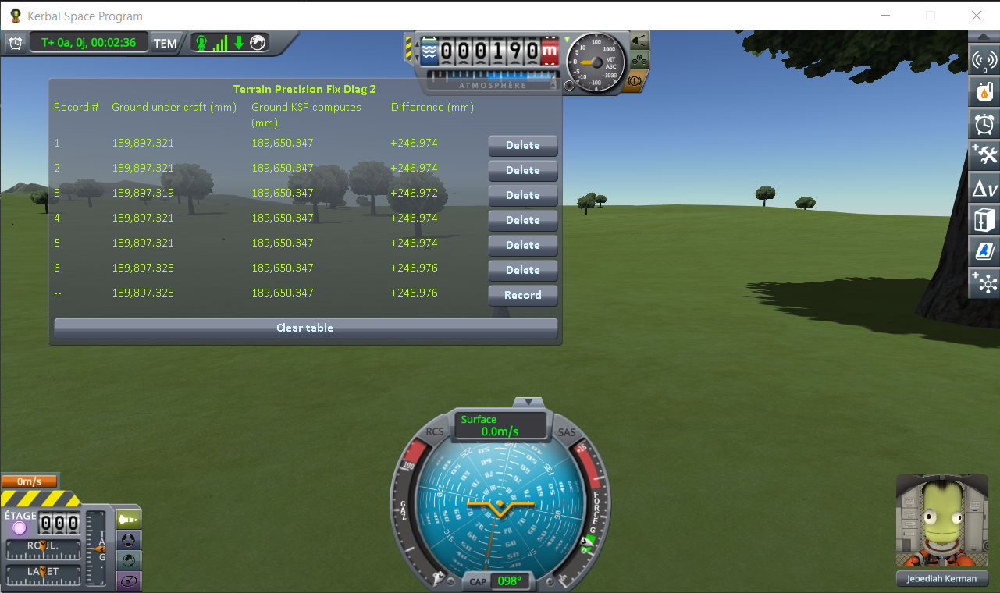

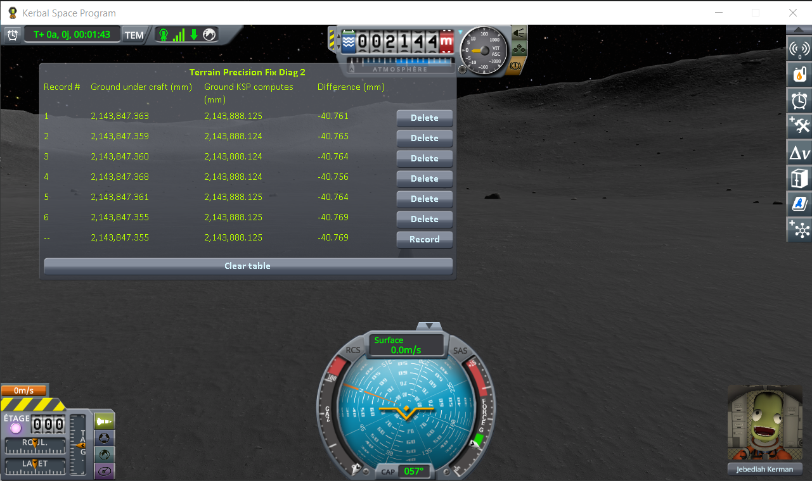

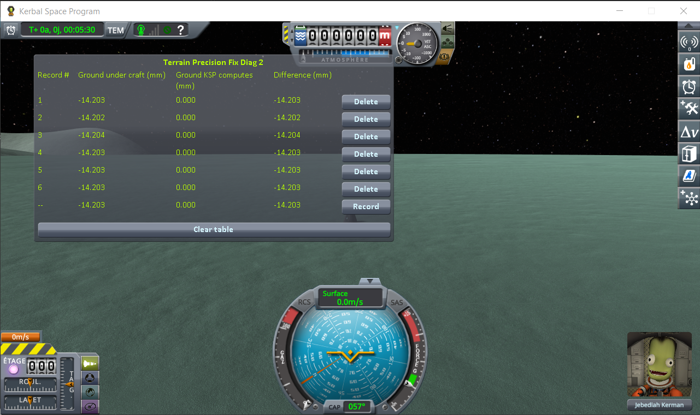

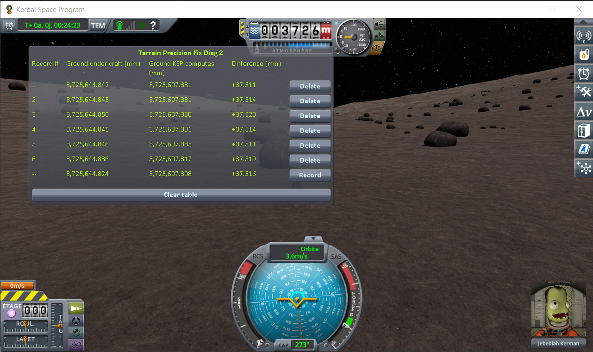

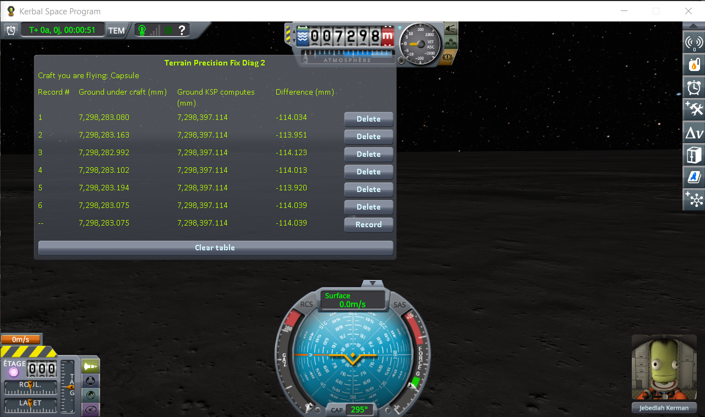

*The craft never jumped, and owes nothing to Real Solar System's own workaround: it ran at every load and never had to move the craft, no `Moving Vessel` line — see [Real Solar System's own workaround](limits-and-solutions/rss/the-ground-workaround.md).*

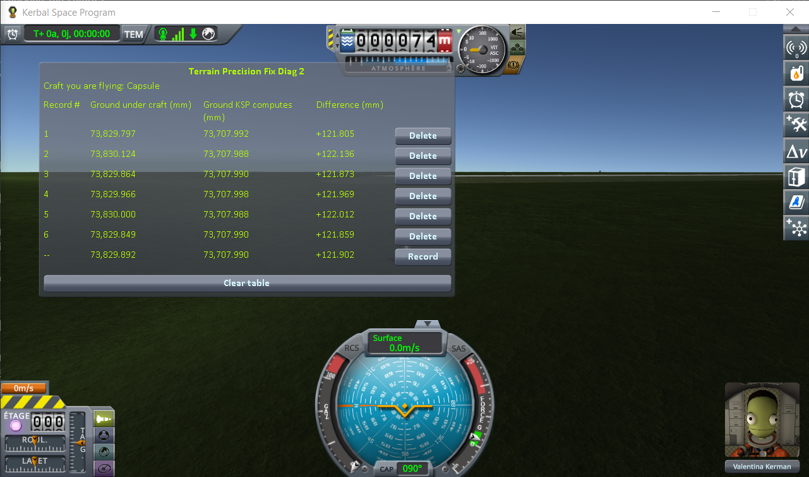

*The craft never jumped, and owes nothing to Real Solar System's own workaround: the craft is in prelaunch, where stock runs the same pass at every load, and it never had to move the craft, no `Moving Vessel` line — see [Real Solar System's own workaround](limits-and-solutions/rss/the-ground-workaround.md).*

Read off those screenshots:

| world | *Difference*, without this mod | *Difference*, with this mod | spread, without | spread, with |
|---|---|---|---|---|
| Kerbin | +199.797 to +307.930 mm | +246.972 to +246.976 mm | 108.1 mm | 0.004 mm |
| Mun | −23.958 to −38.925 mm | −40.756 to −40.769 mm | 15.0 mm | 0.013 mm |
| Minmus | −12.291 to −16.351 mm | −14.202 to −14.204 mm | 4.1 mm | 0.002 mm |
| Gilly | +37.426 to +40.391 mm | +37.511 to +37.520 mm | 3.0 mm | 0.009 mm |
| the Moon | −146.273 to +101.023 mm | −114.123 to −113.920 mm | 247.3 mm | 0.203 mm |
| Earth | +105.929 to +798.985 mm | +121.805 to +122.136 mm | 693.1 mm | 0.331 mm |

**On a runway, and on the ground beside it, on stock**
([the readings](https://github.com/lhervier/KSP-TerrainPrecisionFixDiag2/blob/master/docs/the-measurements-runway.md)).
The height KSP computes reads the same under each craft at every loading: 64,784.990 mm on the grass of
Kerbin and 64,785.047 mm under its runway, within four hundredths of a millimetre on the Mun. On a
runway, the ray meets the deck, above that height. *Ground under craft*:

| loading | 1 | 2 | 3 | 4 | 5 | 6 |
|---|---|---|---|---|---|---|
| Kerbin, on the grass, without this mod | 64,823.702 mm | 64,735.423 mm | 64,822.326 mm | 64,805.632 mm | 64,797.256 mm | 64,791.809 mm |
| Kerbin, on the grass, with this mod | 64,783.381 mm | 64,783.383 mm | 64,783.367 mm | 64,783.387 mm | 64,783.392 mm | 64,783.354 mm |
| Kerbin, on the runway, without this mod | 69,112.013 mm | 69,026.819 mm | 69,100.574 mm | 69,156.869 mm | 69,066.837 mm | 69,087.149 mm |
| Kerbin, on the runway, with this mod | 69,080.733 mm | 69,080.756 mm | 69,080.842 mm | 69,080.660 mm | 69,080.759 mm | 69,080.626 mm |
| Mun, on the ground, without this mod | 4,123,565.650 mm | 4,123,583.842 mm | 4,123,559.661 mm | 4,123,565.046 mm | 4,123,573.493 mm | 4,123,568.004 mm |
| Mun, on the ground, with this mod | 4,123,561.868 mm | 4,123,561.832 mm | 4,123,561.862 mm | 4,123,561.842 mm | 4,123,561.859 mm | 4,123,561.857 mm |
| Mun, on the Kerbal Konstructs runway, without this mod | 4,122,775.969 mm | 4,122,751.151 mm | 4,122,747.749 mm | 4,122,742.457 mm | 4,122,746.736 mm | 4,122,747.327 mm |
| Mun, on the Kerbal Konstructs runway, with this mod | **4,122,763.202 mm** | 4,122,741.872 mm | 4,122,741.879 mm | 4,122,741.877 mm | 4,122,741.870 mm | 4,122,741.877 mm |

**On a runway, with this mod**, in that same install. The sessions are logged in
[`diag/runs/runway-diag2-fix.log`](../diag/runs/runway-diag2-fix.log) and
[`runway-mun-kk-diag2-fix.log`](../diag/runs/runway-mun-kk-diag2-fix.log). The height KSP computes reads
the same digits as on stock.

On Kerbin, on the runway of the KSC:

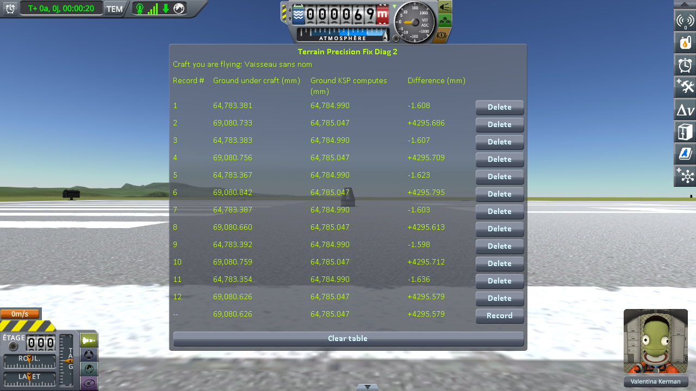

On the Mun, on a runway placed by Kerbal Konstructs:

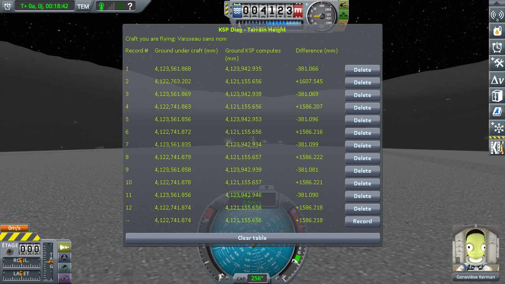

On Kerbin, the grass spreads over 88.3 mm without this mod, and 0.038 mm with it; the deck of the runway,
over 130.1 mm without it, and 0.216 mm with it; the step between the two, over 81.7 mm without it, and
0.203 mm with it. On the Mun, the ground, over 24.2 mm without this mod, and 0.036 mm with it; the deck,
over 33.5 mm without it; with it, over 0.009 mm from the second loading to the sixth — and the first
loading stands 21.3 mm above them, as with Diag 1.

## What the measurements say

**KSP puts the craft back at the same place, and the craft does not come to rest there.** *On rails* is
the same on every load of every series, to within three micrometres; *Settled* is not, once, on any of
the six bodies.

**The spread is the size the culprit predicts.** From Gilly to Earth it goes from 2.5 mm to 740.0 mm,
more than two hundredfold, but counted in float steps at that distance from the centre of the body it
stays around one or two: 0.8 to 2.2 steps, series after series.

**It is the ground that moves, not only the craft.** The craft never moved and the spot never changed,
yet the height KSP computes held still while the collision surface wandered: by up to eleven
centimetres on Kerbin, nearly seventy on Earth in Real Solar System. The ground itself is not built in the same
place twice. The full readings, and what else they show, are in
[What the numbers say](https://github.com/lhervier/KSP-TerrainPrecisionFixDiag2/blob/master/docs/the-measurements-loading.md#what-the-numbers-say).

**With this mod, both stop moving.** On Kerbin, the craft's spread goes from more than twelve
centimetres to a few hundredths of a millimetre at most; on the other stock worlds too, what is left
stays in the hundredths of a millimetre, two tenths at worst, and on the Moon and Earth of Real Solar
System within a few tenths, at most 0.3 % of a float step there — far below the float step at any of
these distances. *On rails* is still
identical on every line, so KSP put the craft back at the same place every time, and the craft now
comes to rest at the same place every time too. Under the craft, the ground reading does the same.
Three things to read in its column, *Difference*:

- **It stops varying**, by a factor of three hundred on Gilly, a thousand on the Mun and on the Moon, two
  thousand on Minmus and on Earth, and more than twenty thousand on Kerbin. On Kerbin the surface under
  the craft came back somewhere else over a range of eleven centimetres; it now comes back within four
  thousandths of a millimetre. That is the fix, and that is all of it.
- **It does not get smaller, and it is not supposed to.** It stops at a value the stock draws are
  scattered around. On Kerbin and on Minmus the fixed reading falls well inside the range of the six
  loadings without this mod, on the Moon inside it, and on Gilly and on Earth just inside it. On the Mun it falls just
  below: six draws are few for a spread that wide, and a seventh could as well have landed under
  −40.76 mm. Put the loading that landed on −23.958 next to a fixed −40.765 and the fix looks like it
  made things worse; it did not, that line was luck. This mod does not choose a better number for that
  patch of ground; it stops drawing a new one at every loading.
- **What is left is no longer the ground, and it stays.** *Ground KSP computes* is what says the same
  spot was read every time: 189,650.347 mm on all six Kerbin lines, and `0.000` on the Minmus flats. On
  the Mun and on Gilly, where the ground is not level, that column wanders a little by itself — 0.018 mm
  over the six Gilly loadings — because a craft settling a hair to one side asks for the height of a
  slightly different point; on Real Solar System, without this mod, a craft pushed out of the ground
  lands elsewhere, and the column follows. On Gilly that is more than the spread of *Difference* under
  it, 0.009 mm: both columns follow the sample point together, and most of the wobble cancels between
  them. What remains of the spread is the craft, not the terrain. What remains of *Difference* itself is
  geometry: the collision mesh is made of flat triangles, and they miss what the ground does between two
  corners —
  [Terrain Precision Fix Diag 2 explains why a correct reading is not zero](https://github.com/lhervier/KSP-TerrainPrecisionFixDiag2/blob/master/docs/this-mods-demonstration.md#why-a-correct-reading-is-not-zero).
  On that Gilly slope it is +37.5 mm, on that Kerbin slope +247.0 mm, on the Moon −114.0 mm, on Earth
  +122.0 mm, the same on every loading. Removing it would mean giving that mesh more triangles, which
  costs frames, for a gap nobody can feel.

**A runway moves on its own, and this mod stops it.** On stock, the step between the deck and the ground
beside it changes by up to 81.7 mm on Kerbin and 43.0 mm on the Mun from one loading to the next: the
runway does not follow the ground, it draws a rounding of its own. That is the second culprit, a static
placed through a float at planet scale — by the game on Kerbin, by Kerbal Konstructs on the Mun. With
this mod, the deck of the KSC comes back within 0.216 mm, and the step within 0.203 mm.

**On the runway, both instruments agree.** The craft on the runway of the KSC comes to rest within
0.170 mm, the deck under it comes back within 0.216 mm: the craft rests on the deck, and the deck no
longer moves.

**The runway of the KSC keeps a larger remainder than the grass.** About two tenths of a millimetre on
the runway, four to five hundredths on the grass, with both instruments. Where that remainder comes from
is not established yet. It is still several hundred times smaller than what stock does.

**On the Mun, the first loading reads another surface.** Listing every collider under each craft at each
loading ([`diag/runs/runway-mun-kk-colliders-fix.log`](../diag/runs/runway-mun-kk-colliders-fix.log),
four loadings with this mod): at the first loading of the session, one more collider of the runway is
active under the craft, a section of the deck, `Section3_Mesh`, 21.3 mm above the deck's own
`runway_collider`; from the second loading on, it is gone, and the craft rests on `runway_collider`,
which comes back within eight thousandths of a millimetre at every loading, the first one included. The
group of Kerbal Konstructs the runway hangs from comes back at the same height every time too, within a
few micrometres. This is not a rounding, and this mod does not touch it: on stock, the first loading
stands apart as well, 24.8 mm above the highest of the five others. Why that section is only there at
the first loading is not established; on the runway of the KSC on Kerbin, nothing of the kind shows.

**This is also the last proof that the culprit is the right one.** The fix changes where a subtraction
happens, and nothing else about the values placed; were the cause elsewhere, reordering that
subtraction would have left the spread untouched.
