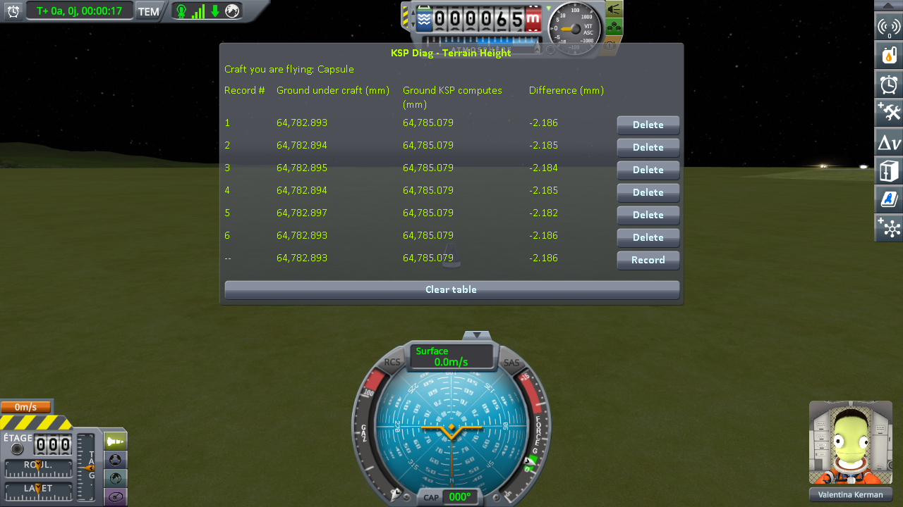
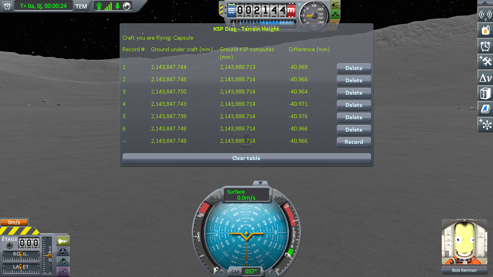
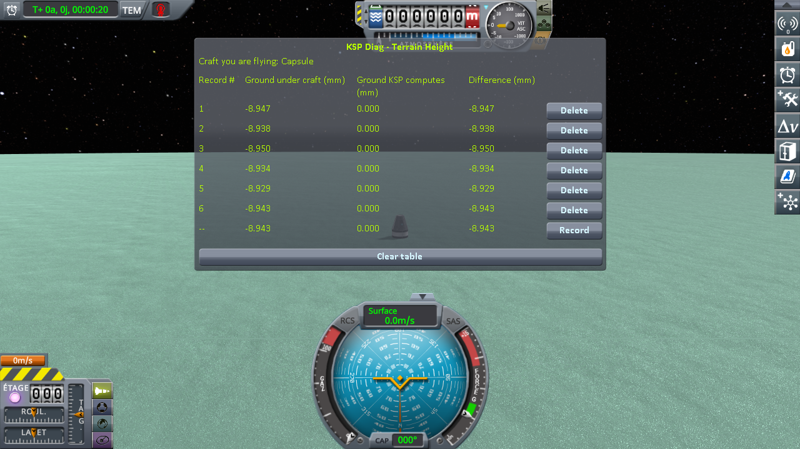
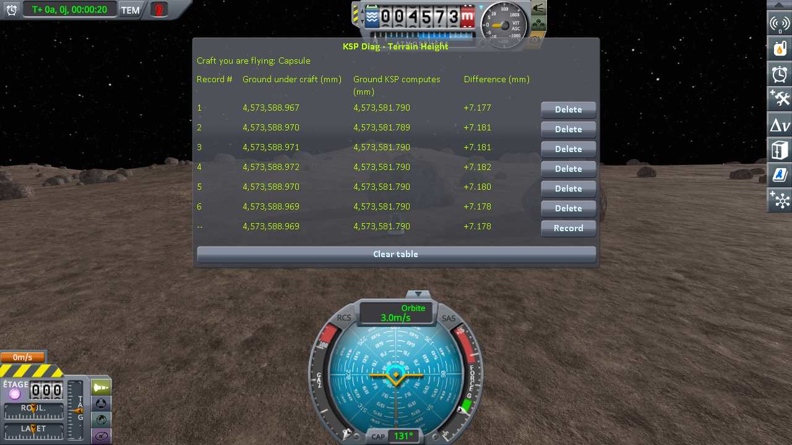
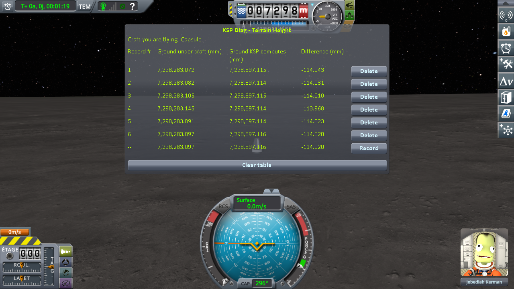
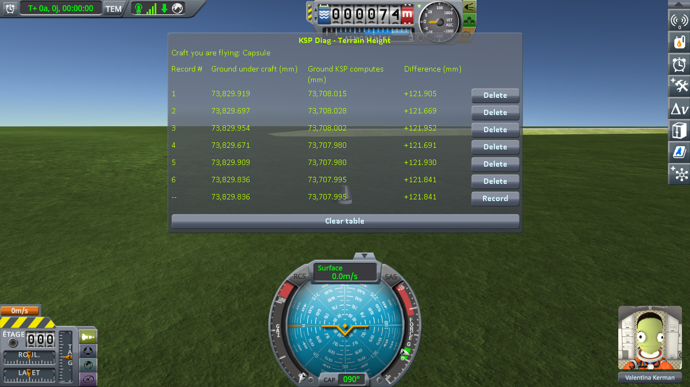

# Checking the culprit: loading the same save

Part of [Terrain Precision Fix](../README.md): the measurements that check the three culprits, [the ground](the-culprit-ground.md), [the statics](the-culprit-statics.md) and [the scatter](the-culprit-scatter.md), on a craft handed back by a save, on stock and with this mod: on bare ground, on a runway with the ground beside it, and among the rocks, the grass and the trees.

Two instruments take the readings:
[KSP Diag - Landed Vessel](https://github.com/lhervier/KSP-Diag-LandedVessel) measures the craft, and
[KSP Diag - Terrain Height](https://github.com/lhervier/KSP-Diag-TerrainHeight) measures the ground. Each has its own page, with
its method and its protocol. The scatter has an instrument of its own, described in
[The scatter, over twelve loads](#the-scatter-over-twelve-loads).

This fix is built on top of [KSP Community Fixes](https://github.com/KSPModdingLibs/KSPCommunityFixes),
the base most players run, so every campaign on this page is run in an install that has it: KSP 1.12.5 with Harmony, ModuleManager,
KSP Community Fixes 1.41.1, both instruments, and [KSP-MCPServer](https://github.com/lhervier/KSP-MCPServer),
which plays the protocols — and this mod, or not. *On stock*, below, means that install without this mod.
Every series is played by the script of its protocol, published with the protocol by the instruments,
once without this mod and once with it, both instruments recording at the same moments.

The culprit predicts a spread of up to one or two float steps, and a float's step doubles each time the
distance to the centre of the body crosses a power of two. So besides the four stock worlds, the same
test is run on the Moon and on Earth of [Real Solar System](https://github.com/KSP-RO/RealSolarSystem),
which replaces the planets with the real ones, much larger. There, the install is the one above plus
its release 20.1.3.0, and what it requires (Kopernicus 248, Modular Flight Integrator,
KSPTextureLoader, the RSS textures).

A craft is set down on bare ground, saved once, and that same save is loaded six times over. The
craft never changes, the spot never changes, and nothing is touched between two loads. It is the
loading protocol of both instruments, played by its script,
[`run-loading.py`](https://github.com/lhervier/KSP-Diag-LandedVessel/blob/main/docs/the-protocol-loading.md#played-by-a-script), on the saves they publish.

The statics are checked on a runway. Two identical craft, one on a runway and one on the ground beside
it. The save is loaded, a line is recorded on the craft on the ground, then the game's *switch vessel*
key flies the craft on the runway and a second line is recorded there. Six loadings of the same save,
two lines each. It is the runway protocol of both instruments —
[KSP Diag - Landed Vessel](https://github.com/lhervier/KSP-Diag-LandedVessel/blob/main/docs/the-protocol-runway.md)
and [KSP Diag - Terrain Height](https://github.com/lhervier/KSP-Diag-TerrainHeight/blob/main/docs/the-protocol-runway.md)
— on the two saves they publish, played by its script,
[`run-runway.py`](https://github.com/lhervier/KSP-Diag-LandedVessel/blob/main/docs/the-protocol-runway.md#played-by-a-script):

- **on Kerbin**, the runway of the KSC and the grass beside it, 152 m apart;
- **on the Mun**, a runway placed by [Kerbal Konstructs](https://github.com/KSP-RO/Kerbal-Konstructs) —
  the model of the KSC's runway it offers — and the ground 42 m from it. The runway hangs from a group
  of Kerbal Konstructs, itself a `PQSCity` of its own: the second culprit, placed by a mod. The ground
  there is not flat, so the step between the two spots is not the height of the deck; it does not need
  to be, as long as it does not move. The install has Kerbal Konstructs 1.12.3 and
  CustomPreLaunchChecks 1.8.1, which it requires, as well.

## The craft, over six loads

KSP Diag - Landed Vessel measures the distance from a landed capsule to the centre of the body,
twice per load: as the save hands the capsule back (*On rails*), and once it has settled on the ground
(*Settled*). How, and why those two readings, is in
[This mod's demonstration](https://github.com/lhervier/KSP-Diag-LandedVessel#this-mods-demonstration).

**On stock.** Its campaigns, detailed in
[The measurements: loading the same save](https://github.com/lhervier/KSP-Diag-LandedVessel/blob/main/docs/the-measurements-loading.md).
On each of the four stock worlds and on the Moon and Earth, a capsule sitting on a small flat fuel
tank: two parts, because KSP sets a craft of a single part back onto the ground itself at every load.
Each series is saved once and loaded six times, and uses its own spot, chosen by the rules of
[its protocol](https://github.com/lhervier/KSP-Diag-LandedVessel/blob/main/docs/the-protocol-loading.md):
no `Moving Vessel` line in `KSP.log`, and a craft that does not slide.

*On rails* reads the same digits on every load: KSP puts the craft back at the same place. *Settled* is not. Here is its spread, set against the step of a float at that distance from the
centre of the body:

| series | loads | distance to the centre | float step there | spread of *Settled* | in steps |
|---|---|---|---|---|---|
| Kerbin | 6 | 600.1 km | 62.5 mm | 43.7 mm | 0.7 |
| Mun | 6 | 202.1 km | 15.6 mm | 18.2 mm | 1.2 |
| Minmus | 6 | 60.0 km | 3.9 mm | 7.3 mm | 1.9 |
| Gilly | 6 | 17.6 km | 1.95 mm | 2.3 mm | 1.2 |
| the Moon | 6 | 1 744.4 km | 125 mm | 49.2 mm | 0.4 |
| Earth | 6 | 6 371.1 km | 500 mm | 292.4 mm | 0.6 |

On Earth, the first rule of the protocol cannot be kept: the craft came back more than 10 cm off the
ground at three of the six loads and was moved onto it before its physics started, by stock's own pass,
twice down and once up, since the craft is in *prelaunch* there (see
[Real Solar System's own workaround](non-regression/real-solar-system/the-ground-workaround.md)). On the Moon,
Real Solar System's workaround ran at every load and never had to move the craft: it came back inside
the ground by 18 to 67 mm each time, under the 10 cm the workaround acts on, and was pushed out by the
physics engine. *Settled* is read all the same, as a player gets it. The Moon series loads
`reload-moon-rss-resave.sfs`, the Earth series `reload-earth-rss-resave.sfs`, both in
[Diag LandedVessel's `diag` folder](https://github.com/lhervier/KSP-Diag-LandedVessel/tree/main/diag).

**With this mod.** The same test, in the same installs, on the same six worlds, with the same craft and
the same saves, loaded six times per series. In each screenshot, the bottom line is the loading in
progress, still live, and is not counted. The sessions, what the script printed and every line it
recorded are in [`diag/runs`](../diag/README.md#the-loading-protocol).

*Real Solar System's own workaround ran at every load and never had to move the craft: no `Moving Vessel` line — see [Real Solar System's own workaround](non-regression/real-solar-system/the-ground-workaround.md).*

*The craft is in prelaunch, where stock runs the same pass at every load, and it never had to move the craft: no `Moving Vessel` line — see [Real Solar System's own workaround](non-regression/real-solar-system/the-ground-workaround.md).*

The six series, read off those screenshots:

| series | spread of *Settled*, without this mod | spread of *Settled*, with this mod |
|---|---|---|
| Kerbin | 43.7 mm | 0.010 mm |
| Mun | 18.2 mm | 0.060 mm |
| Minmus | 7.3 mm | 0.045 mm |
| Gilly | 2.3 mm | 0.060 mm |
| the Moon | 49.2 mm | 0.384 mm |
| Earth | 292.4 mm | 0.189 mm |

With this mod, no load of the Moon or Earth series has a `Moving Vessel` line.

The spots of the saves on the Moon and Earth, and what this mod corrected there, are in
[Non-regression tests: Real Solar System](non-regression.md#real-solar-system).

**On a runway, and on the ground beside it, on stock**
([the readings](https://github.com/lhervier/KSP-Diag-LandedVessel/blob/main/docs/the-measurements-runway.md)).
*On rails* reads the same height on all six loadings, under every craft, within two thousandths of a
millimetre. *Moved*, once physics has the craft:

| loading | 1 | 2 | 3 | 4 | 5 | 6 |
|---|---|---|---|---|---|---|
| Kerbin, on the grass, without this mod | +37.766 mm | +11.618 mm | +73.166 mm | +43.310 mm | −16.362 mm | +16.911 mm |
| Kerbin, on the grass, with this mod | +29.336 mm | +29.328 mm | +29.390 mm | +29.404 mm | +29.384 mm | +29.329 mm |
| Kerbin, on the runway, without this mod | −1.136 mm | −13.077 mm | +52.109 mm | +11.705 mm | −64.696 mm | +7.102 mm |
| Kerbin, on the runway, with this mod | +6.332 mm | +6.166 mm | +6.296 mm | +6.125 mm | +6.184 mm | +6.123 mm |
| Mun, on the ground, without this mod | −80.543 mm | −62.243 mm | −58.011 mm | −71.268 mm | −54.641 mm | −59.333 mm |
| Mun, on the ground, with this mod | −68.146 mm | −68.153 mm | −68.168 mm | −68.205 mm | −68.169 mm | −68.155 mm |
| Mun, on the Kerbal Konstructs runway, without this mod | −10.921 mm | −28.604 mm | −12.124 mm | −20.670 mm | −11.045 mm | −17.701 mm |
| Mun, on the Kerbal Konstructs runway, with this mod | **−3.709 mm** | −25.041 mm | −25.029 mm | −25.030 mm | −25.024 mm | −25.029 mm |

**On a runway, with this mod**, in that same install, on those same saves, with this mod as the only
difference. The sessions are logged in [`diag/runs/runway-fix.log`](../diag/runs/runway-fix.log) and
[`runway-mun-kk-fix.log`](../diag/runs/runway-mun-kk-fix.log), with what the script printed and every
line it recorded beside them. *On rails* still reads the same height, within three thousandths of a
millimetre. The odd lines are on the ground, the even lines on the runway, after switching to it; the
bottom line is the reading in progress, not a record.

On Kerbin, on the runway of the KSC:

On the Mun, on a runway placed by Kerbal Konstructs:

On Kerbin, the craft on the grass comes to rest across a spread of 89.5 mm without this mod, and
0.076 mm with it; the craft on the runway, 116.8 mm without it, and 0.208 mm with it; the step between
the two, 38.5 mm without it, 0.274 mm with it. On the Mun, the craft on the ground, 25.9 mm without this
mod, and 0.059 mm with it; the craft on the runway, 17.7 mm without it; with it, 0.017 mm from the second
loading to the sixth, the first loading apart.

## The ground, over six loads

KSP Diag - Terrain Height measures the ground, with no craft in the reading at all: the collision
surface a ray pointed straight down hits, against the height KSP computes for that same spot. The second
never moves; the first is what your landing legs touch. *Difference* is the first minus the second. How
both are read is in [This mod's demonstration](https://github.com/lhervier/KSP-Diag-TerrainHeight/blob/main/docs/this-mods-demonstration.md).

**On stock.** Its campaigns, detailed in [The measurements: loading the same save](https://github.com/lhervier/KSP-Diag-TerrainHeight/blob/main/docs/the-measurements-loading.md):
the same sessions, read at the same moments under the capsule on its tank, following
[its protocol](https://github.com/lhervier/KSP-Diag-TerrainHeight/blob/main/docs/the-protocol-loading.md).
The craft only marks the spot the ray is fired at.
Over those six loads:

| series | spread of *Difference* | spread of the height KSP computes |
|---|---|---|
| Kerbin | 43.6 mm | 0.000 mm |
| Mun | 18.0 mm | 0.136 mm |
| Minmus | 7.3 mm | 0.000 mm |
| Gilly | 2.3 mm | 0.008 mm |
| the Moon | 48.7 mm | 4.985 mm |
| Earth | 292.3 mm | 0.697 mm |

On the Moon, the craft came back inside the ground at every load and was pushed out of it, coming to
rest a little to one side each time; the height KSP computes follows the spot read, which accounts for
its spread there. On Earth, nearly all of it comes from the first load, where the craft was pushed out
the same way: the five others stay within 0.06 mm.

**With this mod.** The same installs, the same saves, on the same spots, loaded six times; this mod
is the only difference.

As before, the bottom line of each screenshot is the loading in progress, and is not counted.

*Real Solar System's own workaround ran at every load and never had to move the craft: no `Moving Vessel` line — see [Real Solar System's own workaround](non-regression/real-solar-system/the-ground-workaround.md).*

*The craft is in prelaunch, where stock runs the same pass at every load, and it never had to move the craft: no `Moving Vessel` line — see [Real Solar System's own workaround](non-regression/real-solar-system/the-ground-workaround.md).*

Read off those screenshots:

| series | *Difference*, without this mod | *Difference*, with this mod | spread, without | spread, with |
|---|---|---|---|---|
| Kerbin | +14.647 to +58.264 mm | −2.186 to −2.182 mm | 43.6 mm | 0.004 mm |
| Mun | −43.858 to −25.814 mm | −40.976 to −40.964 mm | 18.0 mm | 0.012 mm |
| Minmus | −11.222 to −3.905 mm | −8.950 to −8.929 mm | 7.3 mm | 0.022 mm |
| Gilly | +6.919 to +9.236 mm | +7.177 to +7.182 mm | 2.3 mm | 0.005 mm |
| the Moon | −96.777 to −48.070 mm | −114.043 to −113.968 mm | 48.7 mm | 0.074 mm |
| Earth | −43.698 to +248.589 mm | +121.669 to +121.952 mm | 292.3 mm | 0.283 mm |

**On a runway, and on the ground beside it, on stock**
([the readings](https://github.com/lhervier/KSP-Diag-TerrainHeight/blob/main/docs/the-measurements-runway.md)).
The height KSP computes reads the same under each craft at every loading: 64,784.990 mm on the grass of
Kerbin and 64,785.047 mm under its runway, within three hundredths of a millimetre on the Mun. On a
runway, the ray meets the deck, above that height. *Ground under craft*:

| loading | 1 | 2 | 3 | 4 | 5 | 6 |
|---|---|---|---|---|---|---|
| Kerbin, on the grass, without this mod | 64,791.881 mm | 64,765.674 mm | 64,827.271 mm | 64,797.291 mm | 64,737.747 mm | 64,771.056 mm |
| Kerbin, on the grass, with this mod | 64,783.375 mm | 64,783.378 mm | 64,783.366 mm | 64,783.377 mm | 64,783.377 mm | 64,783.379 mm |
| Kerbin, on the runway, without this mod | 69,073.344 mm | 69,061.464 mm | 69,126.356 mm | 69,086.255 mm | 69,009.807 mm | 69,081.451 mm |
| Kerbin, on the runway, with this mod | 69,080.712 mm | 69,080.574 mm | 69,080.738 mm | 69,080.561 mm | 69,080.690 mm | 69,080.586 mm |
| Mun, on the ground, without this mod | 4,123,549.481 mm | 4,123,567.818 mm | 4,123,572.074 mm | 4,123,558.788 mm | 4,123,575.467 mm | 4,123,570.767 mm |
| Mun, on the ground, with this mod | 4,123,561.868 mm | 4,123,561.869 mm | 4,123,561.856 mm | 4,123,561.835 mm | 4,123,561.858 mm | 4,123,561.856 mm |
| Mun, on the Kerbal Konstructs runway, without this mod | 4,122,756.005 mm | 4,122,738.290 mm | 4,122,754.787 mm | 4,122,746.229 mm | 4,122,755.879 mm | 4,122,749.210 mm |
| Mun, on the Kerbal Konstructs runway, with this mod | **4,122,763.202 mm** | 4,122,741.863 mm | 4,122,741.872 mm | 4,122,741.879 mm | 4,122,741.878 mm | 4,122,741.874 mm |

**On a runway, with this mod**, in that same install, the same sessions. The height KSP computes reads
the same digits as on stock.

On Kerbin, on the runway of the KSC:

On the Mun, on a runway placed by Kerbal Konstructs:

On Kerbin, the grass spreads over 89.5 mm without this mod, and 0.013 mm with it; the deck of the runway,
over 116.5 mm without it, and 0.177 mm with it; the step between the two, over 38.3 mm without it, and
0.188 mm with it. On the Mun, the ground, over 26.0 mm without this mod, and 0.034 mm with it; the deck,
over 17.7 mm without it; with it, over 0.015 mm from the second loading to the sixth — and the first
loading stands 21.3 mm above them, as with Diag LandedVessel.

## The scatter, over twelve loads

[KSP Diag - Scatter](https://github.com/lhervier/KSP-Diag-Scatter) measures the terrain scatter against
the ground. Its page carries its method and
[its protocol](https://github.com/lhervier/KSP-Diag-Scatter/blob/main/docs/measuring-the-rocks.md#load-after-load).
For every quad carrying scatter around a landed craft, it reads the height of the quad, of each of its
holders, and of the matrices they are drawn with; for every object of the quad nearest to the craft, the
height above the ground right under them of up to 10 of its vertices, spread over the whole object.
Scatter is sunk into the ground on purpose, so that last height says little by itself: what matters is
whether it comes back the same at every load.

The scatter is measured in three configurations, not two: on stock, with the terrain fix alone — this
mod as installed by default — and with the scatter fix as well, which is off by default
([The fix: the scatter](the-fix-scatter.md)). **The series with the scatter fix were taken when it was a
mod of its own**, Rock Precision Fix 0.1.0, installed next to Terrain Precision Fix 0.1.0: the same two
patches as this mod's scatter fix, which writes the same messages to `KSP.log`. In the logs of these
series, they are tagged `[RockPrecisionFix]` instead of `[TerrainPrecisionFix]`.

Every series uses [the two saves the instrument keeps](https://github.com/lhervier/KSP-Diag-Scatter/blob/main/diag/README.md#the-saves),
each loaded twelve times, in KSP 1.12.5 with Harmony, ModuleManager and KSP Community Fixes 1.41.1:

- a Mk1 command pod landed on Kerbin, about 8 km north-west of the KSC, where the scatter is grass and
  trees: every record holds the same 64 quads and 118 holders, all of them built, and names the same
  nearest quad, `Kerbin Zn3010000130`, with the same 218 objects, 200 `Grass00` and 18 `Tree00`, and 1,780
  measured vertices;
- a Mk1 command pod landed on the Mun, where the scatter is rocks: 128 quads and 128 holders, and the same
  nearest quad, `Mun Zp211333000`, with 20 `Rock00` and 200 measured vertices.

The *range* of a reading is its largest value minus its smallest over the twelve loads.

**On stock.** The stock series and the one with the terrain fix alone are kept, with their logs, on
[the instrument's page](https://github.com/lhervier/KSP-Diag-Scatter/blob/main/docs/what-the-readings-show.md#the-rocks):

- the centre of each holder stands at the height of its quad's centre, to the micrometre;
- the matrix each quad is drawn with stands exactly on its centre: 0.000 mm everywhere, up and across;
- the matrix each holder is drawn with does not: it stands above or below its quad's centre by an amount
  that changes from one holder to the next and from one load to the next, from −92 to +92 mm on Kerbin,
  0.000 mm only 28% of the time; on the Mun, within 0.1 mm of 0 three times out of four, otherwise
  ±15.2 to ±15.4 mm, nothing in between;
- the vertices of the objects of the nearest quad come back at a different height above the ground at
  every load: 94 mm apart over the twelve loads for half of them on Kerbin, 31 mm on the Mun;
- take their holder's offset off, and that range drops to 5.3 mm for half of them on Kerbin, 2.2 mm on
  the Mun.

The holders stand where their quads are, but are not drawn there, and most of what moves the objects
against the ground is that gap. Not all of it: once their holder's offset is taken off, 80 objects out of
218 keep more than 10 mm on Kerbin, up to 119 mm, and 3 rocks out of 20 on the Mun, up to 18.5 mm. In
stock the ground itself moves against the centre of its quad from one load to the next, by 104 mm under
half of the vertices on Kerbin and 27 mm on the Mun: that is the first culprit, which the terrain fix
corrects, and it is why the scatter fix is measured with it.

**With the terrain fix alone**, the quads stop moving: the centre of the nearest quad comes back at the
same height to 0.002 mm on Kerbin, against 131 mm in stock, and to 0.005 mm on the Mun, against 33 mm.
The holders do not follow them:

- their centres no longer stand on their quads': 148 mm apart over the twelve loads for half of the
  holders on Kerbin, up to 227 mm, and 25 mm on the Mun, up to 42 mm;
- the offset of their matrices spans −107 to +110 mm on Kerbin and −27 to +29 mm on the Mun, and is never
  0;
- the vertices of the objects of the nearest quad come back at a different height above the ground at
  every load: 130 mm apart for half of them on Kerbin, 31 mm on the Mun;
- take their holder's offset off, and no vertex moves by more than 6.6 mm on Kerbin, 1.9 mm on the Mun.

The ground is fixed, the holders are not, and now all of what moves the objects is the holders.

**With the scatter fix as well.** The same install and the same two saves, with the scatter fix added to
the terrain fix, each save loaded twelve times in a single session of KSP, one record taken after each
load. The install and the 24 records are in
[`diag/runs`](../diag/README.md#the-scatter-fix-the-rocks-over-twelve-loads).

On Kerbin:

| | with the terrain fix alone | with both fixes |
|---|---|---|
| centre of the nearest quad, range | 0.002 mm | 0.002 mm |
| matrix of each quad against its centre | *up* and *across* 0.000 mm everywhere | the same |
| centre of each holder against its quad's | range 148 mm (median over the holders), up to 227 mm | the same height, to the micrometre |
| *up* of the holders' matrices | −107 to +110 mm, never 0 | 0.000 mm everywhere, and *across* as well |
| each vertex above the ground, range | 130 mm (median over the vertices), from 127 to 134 mm | 0.035 mm (median), 0.125 mm at most |

On the Mun:

| | with the terrain fix alone | with both fixes |
|---|---|---|
| centre of the nearest quad, range | 0.005 mm | 0.004 mm |
| matrix of each quad against its centre | *up* and *across* 0.000 mm everywhere | the same |
| centre of each holder against its quad's | range 25 mm (median over the holders), up to 42 mm | the same height, to the micrometre |
| *up* of the holders' matrices | −27 to +29 mm, never 0 | 0.000 mm everywhere, and *across* as well |
| each vertex above the ground, range | 31 mm (median over the vertices), from 30 to 32 mm | 0.012 mm (median), 0.042 mm at most |

On all 118 holders of Kerbin and 128 of the Mun, at every one of the twelve loads, the centre of the
holder and the matrix it is drawn with stand at the height of its quad's centre, to the micrometre, and
neither is shifted from it, up or across. Every measured vertex of the nearest quad comes back at the same
height against the ground at every load: within 0.035 mm for half of them on Kerbin, 0.125 mm at most, and
within 0.042 mm on the Mun. On average, the lowest vertex of each object's model stands 316.8 mm below the
ground on Kerbin and 1,979.8 mm on the Mun, the same at each of the twelve loads.

In the records taken with the terrain fix alone, a vertex's height above the ground minus its holder's
*up* is where that vertex would stand without the holder's offset. Averaged over the twelve loads of each
series, vertex by vertex, that height and the one measured with both fixes agree to 0.018 mm (median),
1.2 mm at most, on Kerbin, and to 0.080 mm (median), 0.30 mm at most, on the Mun.

## What the measurements say

**KSP puts the craft back at the same place, and the craft does not come to rest there.** *On rails* is
the same on every load of every series, to within three micrometres; *Settled* is not, once, on any of
the six bodies.

**The spread is the size the culprit predicts.** From Gilly to Earth it goes from 2.3 mm to 292.4 mm,
more than a hundredfold, but counted in float steps at that distance from the centre of the body it stays
within two: 0.4 to 1.9 steps, series after series.

**It is the ground that moves, not only the craft.** The craft never moved and the spot never changed,
yet the height KSP computes held still while the collision surface wandered: by more than four
centimetres on Kerbin, nearly thirty on Earth in Real Solar System. The ground itself is not built in the same
place twice. The full readings are in
[The measurements: loading the same save](https://github.com/lhervier/KSP-Diag-TerrainHeight/blob/main/docs/the-measurements-loading.md),
and what else they show in
[What the measurements show: loading the same save](https://github.com/lhervier/KSP-Diag-TerrainHeight/blob/main/docs/what-the-measurements-show-loading.md).

**With this mod, both stop moving.** On Kerbin, the craft's spread goes from several centimetres to a
hundredth of a millimetre; on the other stock worlds too, what is left stays in the hundredths of a
millimetre, 0.060 mm at worst, and on the Moon and Earth of Real Solar System within a few tenths, at
most 0.3 % of a float step there — far below the float step at any of these distances. *On rails* is
still identical on every line, so KSP put the craft back at the same place every time, and the craft
now comes to rest at the same place every time too. Under the craft, the ground reading does the same.
Three things to read in its column, *Difference*:

- **It stops varying**, by a factor of three hundred to fifteen hundred on the Mun, Minmus, Gilly, the
  Moon and Earth, and of more than ten thousand on Kerbin. On Kerbin the surface under the craft came
  back somewhere else over a range of more than four centimetres; it now comes back within four
  thousandths of a millimetre. That is the fix, and that is all of it.
- **It does not get smaller, and it is not supposed to.** It stops at a value the stock draws are
  scattered around. On the Mun, Minmus, Gilly and Earth, the fixed reading falls inside the range of the
  six loadings without this mod. On Kerbin and on the Moon it falls just outside, 16.8 and 17.2 mm below
  the lowest of the six — about a quarter of a float step or less.
  Six draws are few for a spread that wide, and a seventh could as well have landed under the fixed
  value. Put the loading on the Mun that landed on −25.814 next to a fixed −40.970 and the fix looks
  like it made things worse; it did not, that line was luck. This mod does not choose a better number
  for that patch of ground; it stops drawing a new one at every loading.
- **What is left is no longer the ground, and it stays.** *Ground KSP computes* is what says the same
  spot was read every time: 64,785.079 mm on all six Kerbin lines, `0.000` on the Minmus flats, within
  a thousandth of a millimetre on the Mun and on Gilly. Where the ground is not perfectly level, that
  column can wander a little by itself, because a craft settling a hair to one side asks for the height
  of a slightly different point — 0.136 mm on the Mun without this mod; on Real Solar System, without
  this mod, a craft pushed out of the ground lands elsewhere, and the column follows. What remains of the
  spread is the craft, not the terrain. What remains of *Difference* itself is geometry: the collision mesh is made of flat
  triangles, and they miss what the ground does between two corners —
  [KSP Diag - Terrain Height explains why a correct reading is not zero](https://github.com/lhervier/KSP-Diag-TerrainHeight/blob/main/docs/this-mods-demonstration.md#why-a-correct-reading-is-not-zero).
  On the levelled grass of Kerbin it is −2.2 mm, on the Mun −41.0 mm, on Minmus −8.9 mm, on
  Gilly +7.2 mm, on the Moon −114.0 mm, on Earth +121.8 mm, the same on every loading. Removing it would
  mean giving that mesh more triangles, which costs frames, for a gap nobody can feel.

**A runway moves on its own, and this mod stops it.** On stock, the step between the deck and the ground
beside it changes by up to 38.3 mm on Kerbin and 36.1 mm on the Mun from one loading to the next: the
runway does not follow the ground, it draws a rounding of its own. That is the second culprit, a static
placed through a float at planet scale — by the game on Kerbin, by Kerbal Konstructs on the Mun. With
this mod, the deck of the KSC comes back within 0.177 mm, and the step within 0.188 mm.

**On the runway, both instruments agree.** The craft on the runway of the KSC comes to rest within
0.208 mm, the deck under it comes back within 0.177 mm: the craft rests on the deck, and the deck no
longer moves.

**The runway of the KSC keeps a larger remainder than the grass.** About two tenths of a millimetre on
the runway, with both instruments; on the grass, a hundredth of a millimetre for the ground, eight
hundredths for the craft. Where the remainder of the runway comes from is not established yet. It is still several
hundred times smaller than what stock does.

**On the Mun, the first loading reads another surface.** Listing every collider under each craft at each
loading ([`diag/runs/runway-mun-kk-colliders-fix.log`](../diag/runs/runway-mun-kk-colliders-fix.log),
four loadings with this mod): at the first loading of the session, one more collider of the runway is
active under the craft, a section of the deck, `Section3_Mesh`, 21.3 mm above the deck's own
`runway_collider`; from the second loading on, it is gone, and the craft rests on `runway_collider`,
which comes back within eight thousandths of a millimetre at every loading, the first one included. The
group of Kerbal Konstructs the runway hangs from comes back at the same height every time too, within a
few micrometres. This is not a rounding, and this mod does not touch it. On stock, the first loading of
this series does not stand apart from the five others: the deck comes back 0.1 mm above the highest of
them, inside the spread of the stock draws. Why that section is only there at the first loading is not
established; on the runway of the KSC on Kerbin, nothing of the kind shows.

**The scatter is drawn off its quad, and the terrain fix alone widens that on Kerbin.** On stock, the
holders of the scatter stand on their quads but are not drawn there, and the objects come back 94 mm
apart against the ground for half of their vertices on Kerbin; with the terrain fix alone, the ground no
longer moves but the holders do, and that range grows to 130 mm — the limit
[Rocks, grass and trees](limits-and-solutions/stock/rocks-grass-and-trees.md). With the scatter fix as
well, every holder is drawn exactly on its quad, and no vertex moves by more than 0.125 mm: reload the same
save as many times as you like, and the scatter comes back at the same place, on ground that is in the
same place.

**This is also the last proof that the culprit is the right one.** The fix changes where a subtraction
happens, and nothing else about the values placed; were the cause elsewhere, reordering that
subtraction would have left the spread untouched. The same goes for the scatter: the scatter fix changes
the transform a holder hangs from, and nothing about the objects in it, and it removes the holders'
offset and nothing else about where the objects are drawn.
