# Making the save on the Mun

Part of [Terrain Precision Fix](../../README.md), for [the runway protocol](the-runway-protocol.md): how
[`runway-mun-kk.sfs`](../../diag/checking-the-culprit-loading/runway-mun-kk.sfs) was made, two
identical craft on the Mun, one on a runway placed by
[Kerbal Konstructs](https://github.com/KSP-RO/Kerbal-Konstructs) 1.12.3 and one on the ground beside
it. You only need it to make your own; the published save and the two files of the runway are enough
to play the protocol.

The captures were taken in a game set to French.

1. **Launch the craft from the Spaceplane Hangar** and turn SAS on, so that it keeps upright when it is
   moved.

   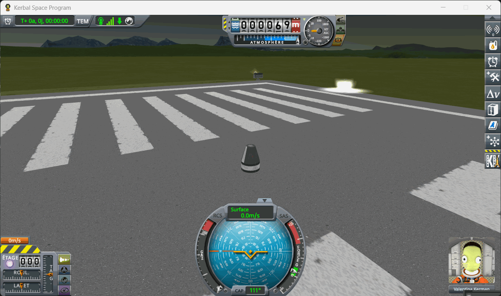

   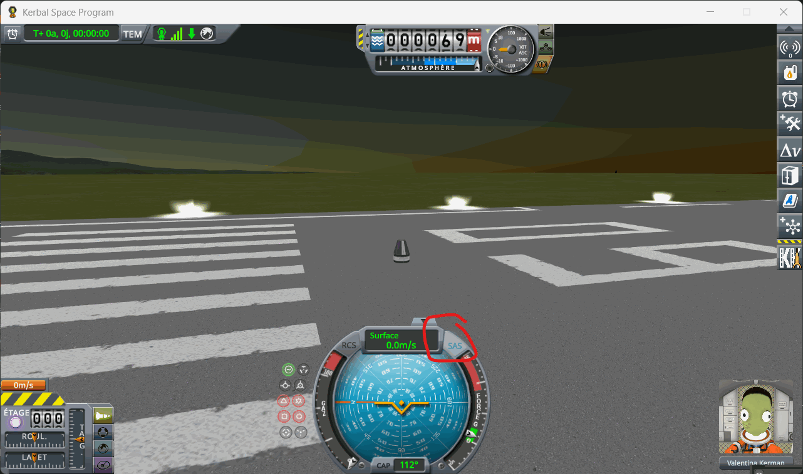

2. **Move it to the Mun** with `Alt+F12 → Cheats → Set Position`: the Mun, latitude −0.23, longitude
   −75, pitch 90, and tick the two boxes that let a middle click set the position and skip the safety
   checks. Once it has landed, turn SAS off.

   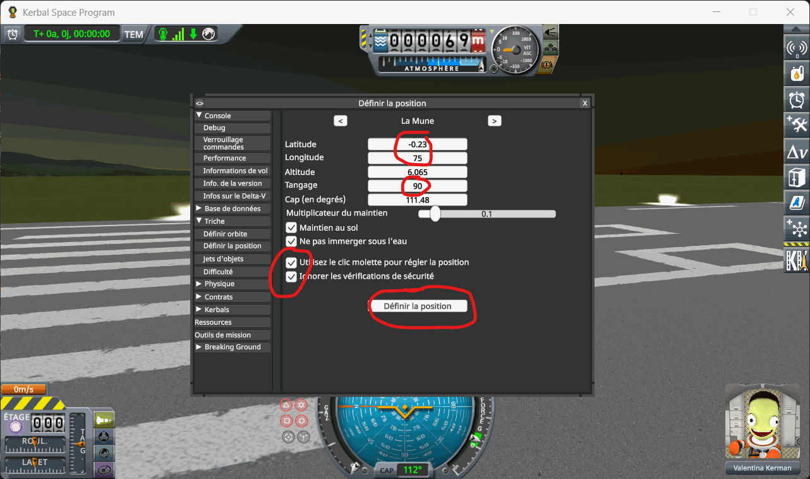

   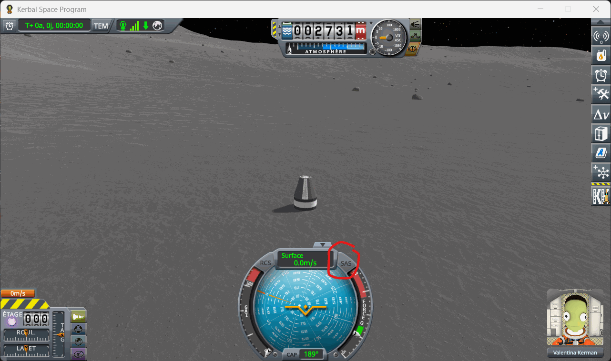

3. **Create a group** where the craft is: open the statics editor of Kerbal Konstructs with `Ctrl+K`,
   then *Edit Groups*, *Spawn new Group*, and *Save&Close* in the *Group Editor* that opens. Make it the
   active group with *Set Active Group*: pick it in the list and press *OK*. That list may open at the
   bottom edge of the screen; drag it up by its title.

   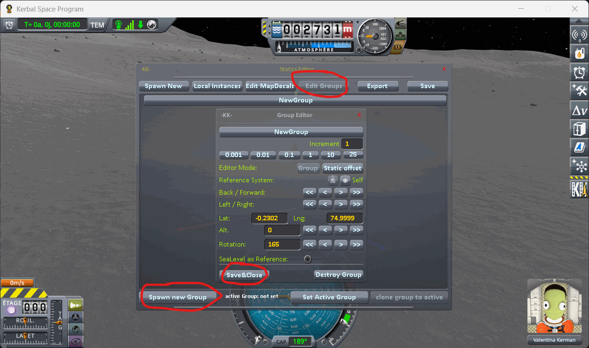

   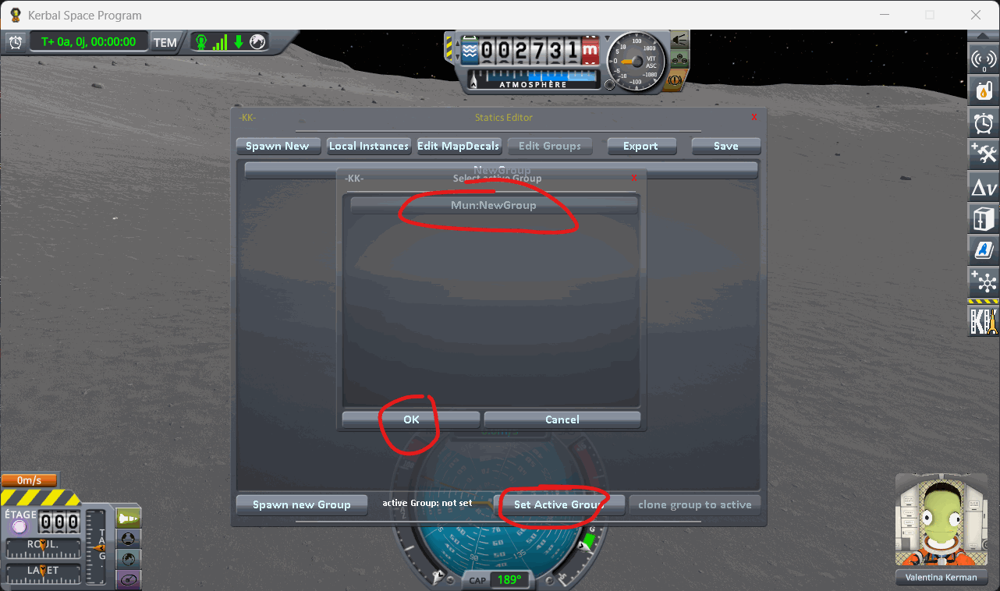

4. **Place the runway**: under *Spawn New*, click the title *KSC Runway lv 3* — the title, not the mesh
   name on the right, which opens the model's own settings. The runway appears on the craft: drag one of
   its arrows until the craft stands on the ground beside it, then *Save&Close*.

   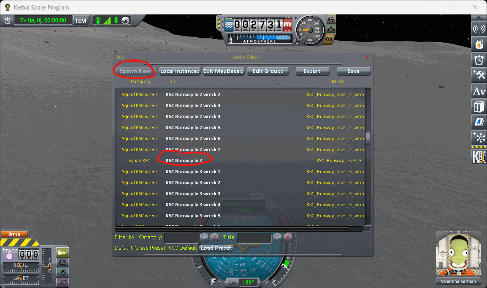

   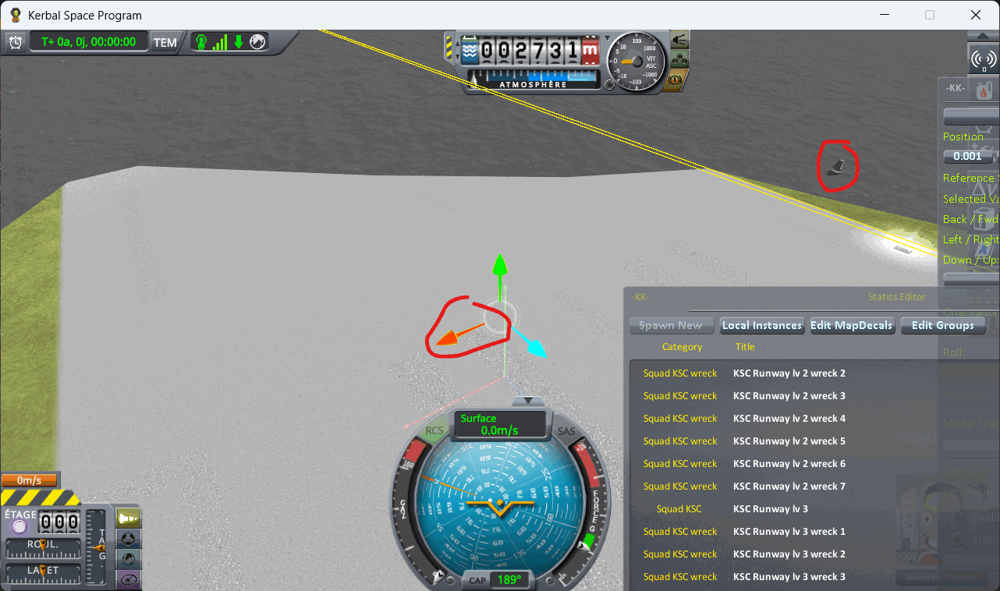

   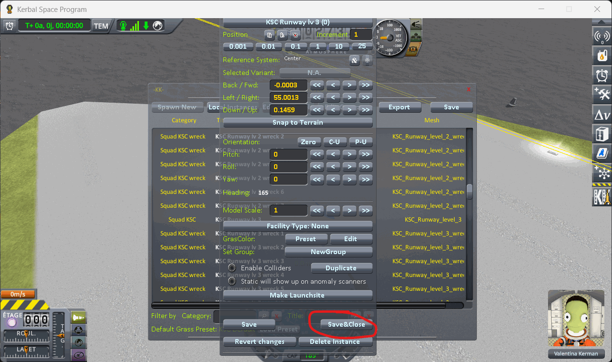

5. **Launch the same craft a second time**: go back to the Space Center from the pause menu, launch it
   from the Spaceplane Hangar again, SAS on, and move it to the Mun with the same latitude and
   longitude. It lands a few kilometres from the runway.

   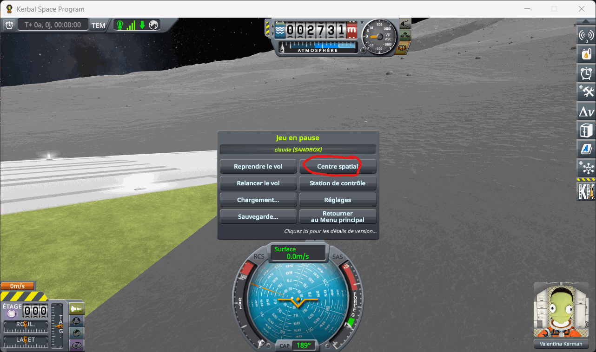

   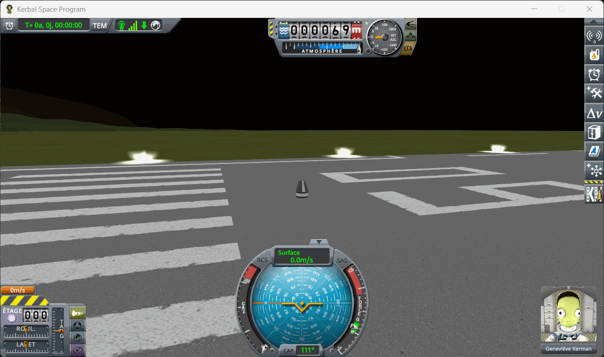

   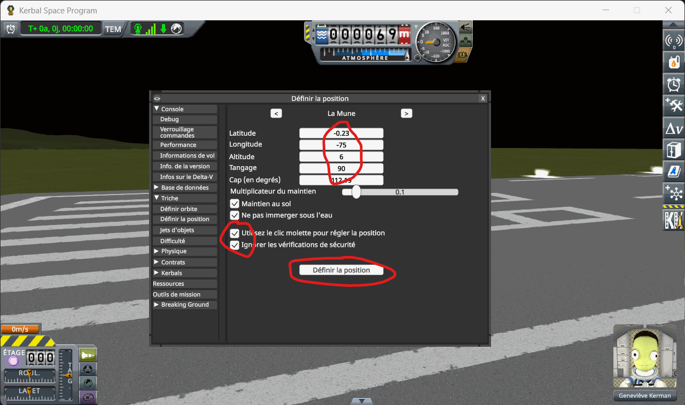

   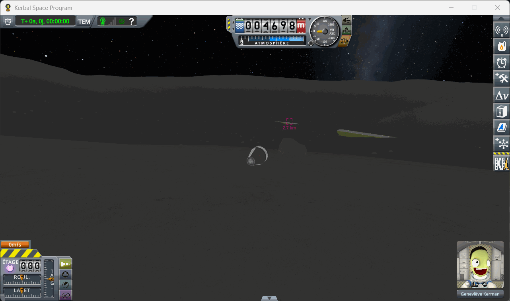

6. **Put it on the runway**: open *Set Position* again and middle-click the runway: latitude and
   longitude now read the spot you clicked. Press *Set Position*.

   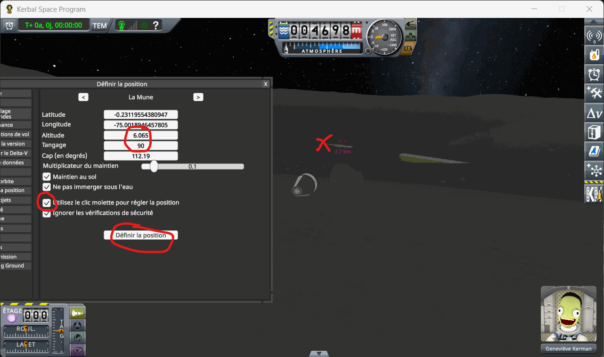

   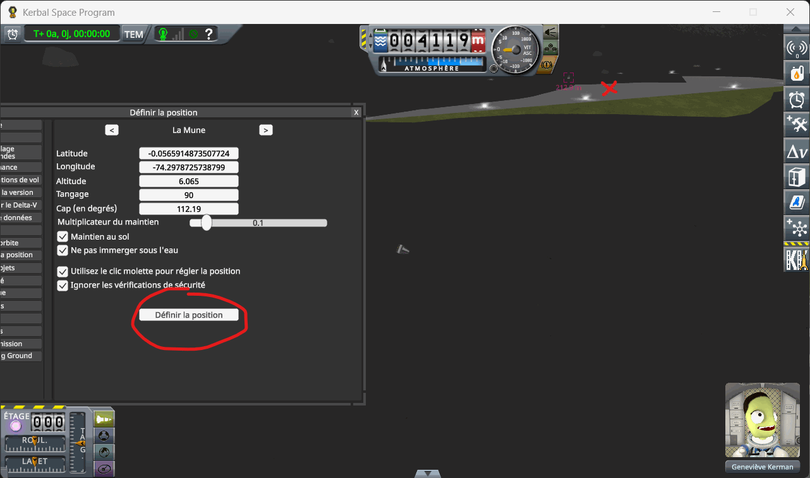

7. **Save once**, from the pause menu, with SAS off.

   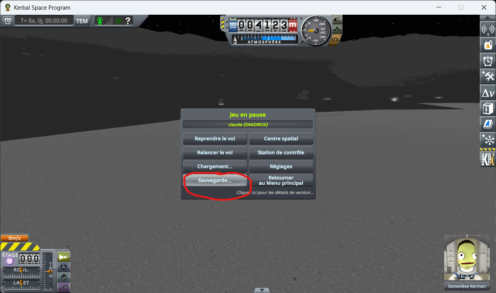
