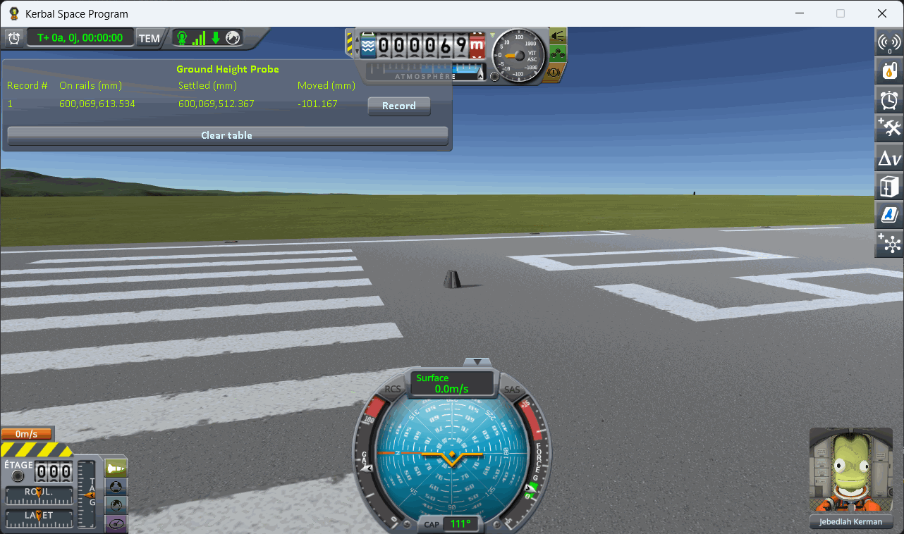
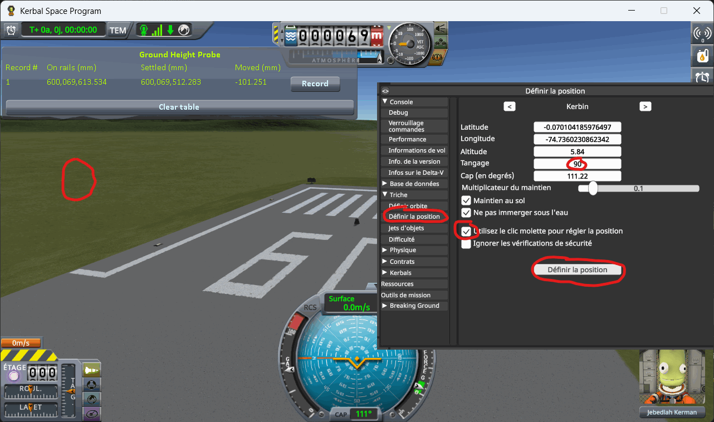
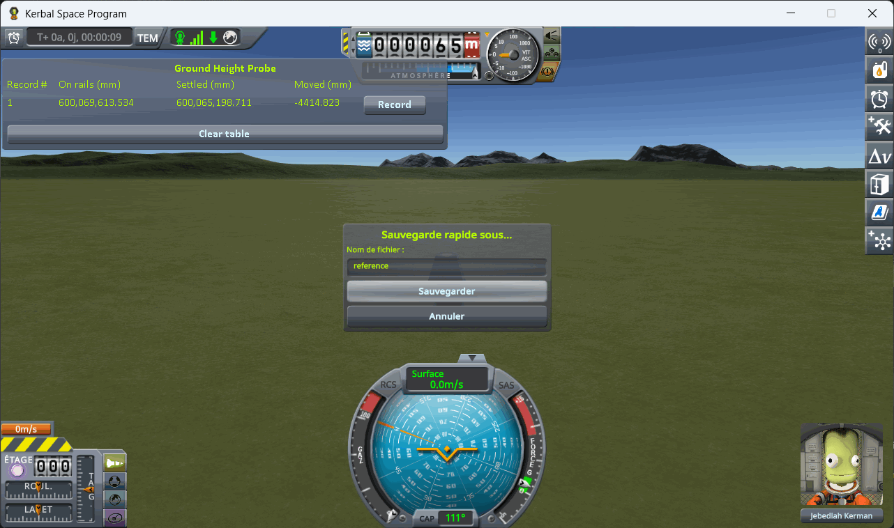

# Making the save

Part of [Terrain Precision Fix](../../README.md), for [the loading protocol](the-protocol.md): how to
make a save of your own to play it on. The saves it was played on are in
[`diag`](../../diag/README.md#the-loading-protocol); you only need this page to make another.

**Two parts at least.** KSP treats a craft made of a single part apart: at every loading, it sets it back
onto the ground itself, and the reading then mixes that move with the ground's. A capsule on a small
flat fuel tank, as in the published saves, is enough. The screenshots of this page were taken with a
lone capsule; the steps are the same.

**1. Launch the craft** — no anchor, no wheels, no landing legs.

(The window of KSP Diag - Landed Vessel is draggable — drop it wherever it does not get in the way.)

**2. Move it off onto bare ground.** `Alt+F12 → Cheats → Set Position`. Tick *Use middle click to set
position*, then middle-click a patch of grass just off the end of the runway. No need to go far — the
KSC apron is conveniently flat — but you do have to be off the tarmac itself.

⚠️ **Not on the launchpad and not on the runway.** It works there too — the numbers move just the
same. The trouble is that they no longer say what moved. The launchpad and the runway are structures,
not ground: KSP puts them in place its own way, and the runway's height has a wobble of its own, which
does not follow the ground's — [The craft on a runway](../checking-the-culprit-loading.md#the-craft-on-a-runway).
A reading taken there is about the structure, not the ground. On bare terrain there is only one thing
under the craft.

⚠️ **And on a spot where it does not slide.** The ground need not be flat: what counts is that the
craft stays put. A craft that slides does so slowly, a fraction of a millimetre per second, and its
height goes down as it slides: **Settled**, on the live line, keeps changing instead of stopping. If
it does, turn SAS on and watch again; holding the craft's attitude can be enough to stop it, and the
save keeps SAS on. If it still slides, pick another spot. Whatever the ground, keep the throttle
closed: open it, even by a few percent, even on a craft with no engine, and the game no longer holds
the craft still. A spot is good if, once the save is loaded, `KSP.log` has no `ground contact! -
error. Moving Vessel` line naming your craft, and **Settled** stops moving once the craft has come to
rest.

Note that on some of the screenshots of this page, the throttle gauge left of the navball is not at zero:
they were taken with Shift+Win+S, and its Shift opened the throttle. Take yours with F1 or Print
Screen, which leave the throttle alone.

**3. Let it settle, and save once.**

If you pressed *Record* before saving — out of curiosity, while placing the craft — delete that line
now. It was taken before the save existed, so its **On rails** value is the launch position and does
not belong in the same column as the others.

Then play [the protocol](the-protocol.md#the-protocol) on that save.
