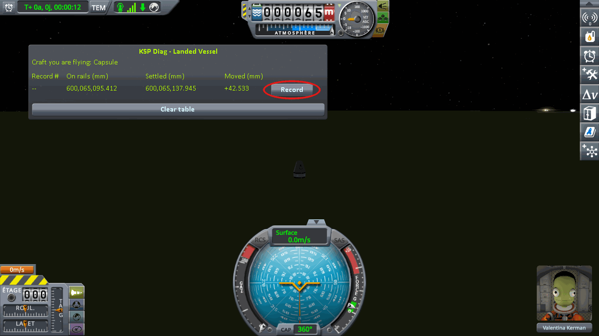
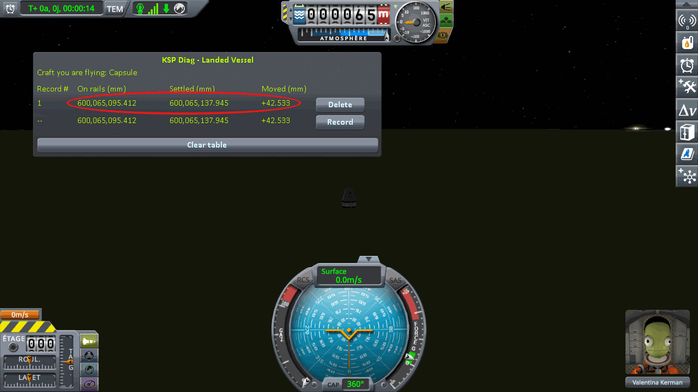
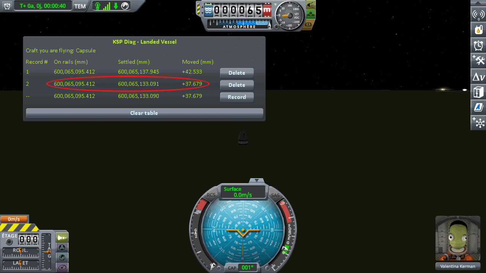
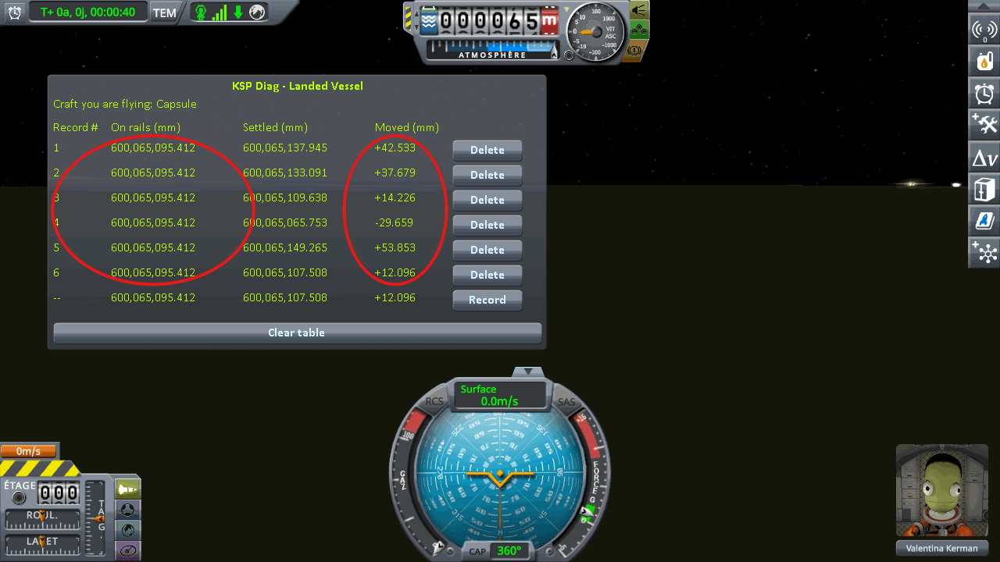

# The protocol: loading the same save

Part of [Terrain Precision Fix](../../README.md), for
[Checking the culprit: loading the same save](../checking-the-culprit-loading.md): how the craft that
comes back with a save is read, step by step, by
[KSP Diag - Landed Vessel](https://github.com/lhervier/KSP-Diag-LandedVessel). The columns it fills are
in [its window](https://github.com/lhervier/KSP-Diag-LandedVessel/blob/main/docs/the-window.md).
[KSP Diag - Terrain Height](https://github.com/lhervier/KSP-Diag-TerrainHeight), installed alongside,
records at the same moments; what it adds is in
[its own page of the protocol](https://github.com/lhervier/KSP-Diag-TerrainHeight/blob/main/docs/the-protocol-loading.md).
The protocol is the same without this mod and with it.

## The save

The protocol loads a save holding one craft landed on bare ground, on a spot where it does not slide,
and nothing else. The saves it was played on are in
[`diag`](../../diag/README.md#the-loading-protocol): a capsule on a small flat fuel tank on each of
the four worlds of stock KSP, `reload-kerbin-2parts.sfs` and the same for `mune`, `minmus` and
`gilly`. Copy one into the folder of a sandbox game and load it from that game.

To make your own, step by step: [Making the save](making-the-save.md).

## The protocol

**1. Load the save, watch the live line until it stops moving, then press *Record* at the end of it.**

The first line appears. **On rails** is the height the save gave back, **Settled** the height the
craft actually came to rest at, and **Moved** the difference.

**2. Load the same save again, let it settle, and record again.** Not a new save: the same one, again.
A second line appears, under the first.

**3. Repeat step 2** until you have six lines.

⚠️ **Never save during the series.** Saving each time would write a new position every time, and you
would be measuring your own round trip on top of the ground.

⚠️ **A loading where KSP moved the craft itself does not count.** At loading, KSP may run a pass that
sets a landed craft back onto the ground before its physics starts. It moves the craft only when it
finds it more than 10 cm off, and then writes a line `ground contact! - error. Moving Vessel` naming
your craft, right before `Unpacking`, in `KSP.log`. The reading then mixes that move with the ground's.

⚠️ **Do not touch the throttle.** A landed craft at rest is held in place by the game, but only while
its throttle is closed. Open it, even by a few percent, and the craft can slide: **Settled** then never
stops moving. The throttle stays where you left it: a single press of Shift is enough, and only `X`
closes it again.

If nothing were wrong, the table would read **On rails** the same value on every line — KSP handing
the craft back exactly where it left it, loading after loading — and **Moved** the same value on every
line too.

## Played by a script

[`diag/automation/run-loading.py`](../../diag/automation/run-loading.py) plays the protocol above, on
[a save already made](../../diag/README.md#the-loading-protocol), and takes the screenshots. It drives
KSP through [KSP-MCPServer](https://github.com/lhervier/KSP-MCPServer), a mod that answers requests
sent to it over HTTP, from the computer KSP runs on only; and it needs nothing but Python 3 — no AI, no
package to install. Anyone can read it top to bottom: it follows the steps above in the same order.

The saves it was played on were made as in [Making the save](making-the-save.md) on each of the four
worlds of stock KSP, a capsule on a small flat fuel tank: `reload-kerbin-2parts.sfs`, and the same for
`mune`, `minmus` and `gilly`. Each was checked against its rules: no `Moving Vessel` line in
`KSP.log`, and a craft that does not slide. On Real Solar System, it was played on the Moon and on
Earth, on `reload-moon-rss-resave.sfs` and `reload-earth-rss-resave.sfs`, a capsule on an empty fuel
tank; these load only on the install described in
[Checking the culprit: loading the same save](../checking-the-culprit-loading.md).

1. Install KSP-MCPServer next to both instruments — and this mod, for the series with it — copy the
   save into a sandbox game, start KSP and wait for the main menu.
2. Run `python run-loading.py --folder <your sandbox game> --save reload-kerbin-2parts --loads 6 --out screenshots`.

For each loading, it loads the save, waits for the digits to stop moving (within half a thousandth of a
millimetre over two seconds), and records in both windows at the same moment. It never saves the game.
After the last loading it takes a screenshot of each table, prints every line it recorded, writes them
to `lines.json` next to the screenshots, and quits KSP — give it `--keep-running` to leave KSP open.
Save `KSP.log` before starting KSP again: KSP writes it anew at every start.
