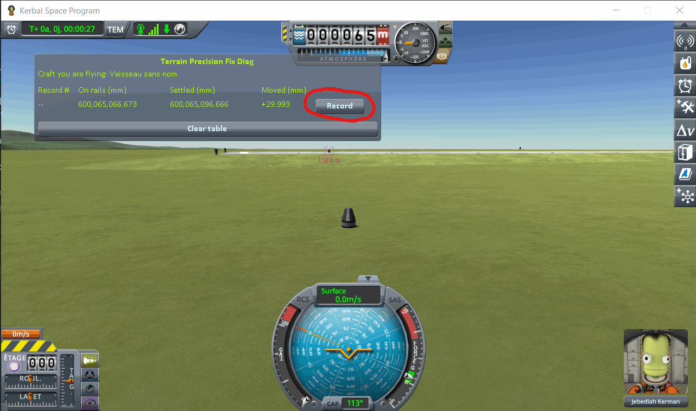
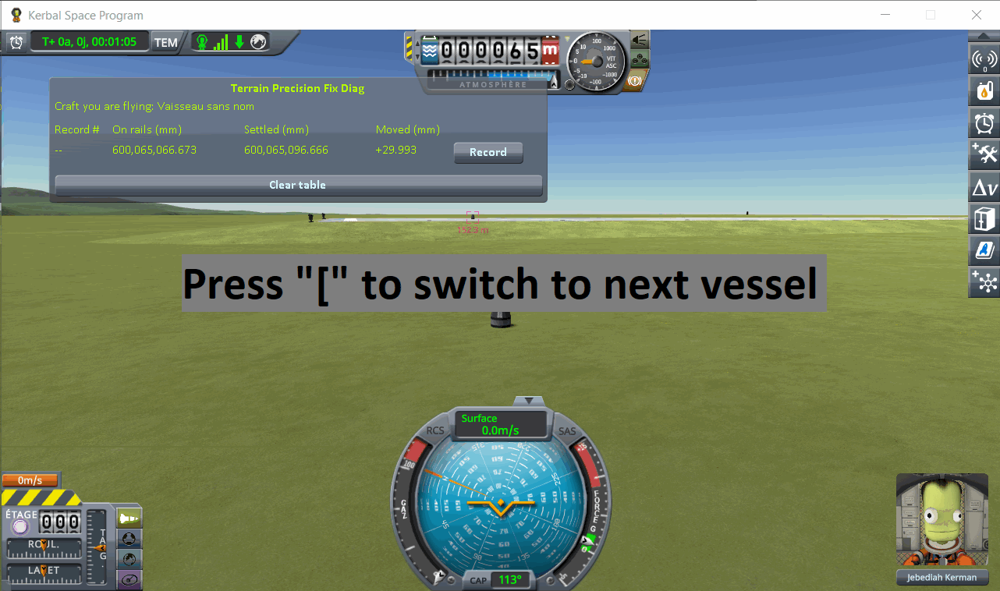
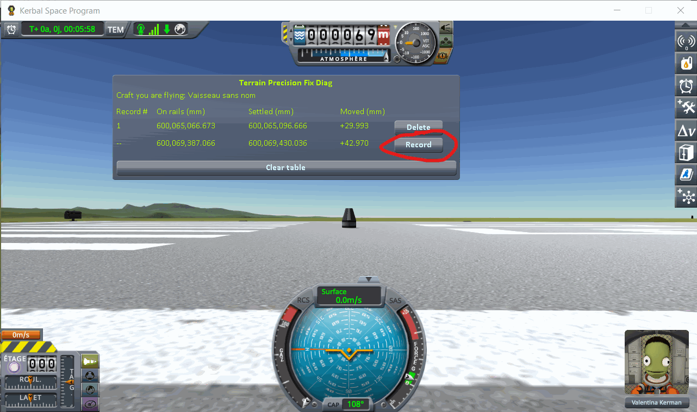

# The protocol: a runway and the ground beside it

Part of [Terrain Precision Fix](../../README.md), for
[Checking the culprit: loading the same save](../checking-the-culprit-loading.md): how a craft parked on
a runway is read, where [the loading protocol](the-protocol.md) tells you not to go, by
[KSP Diag - Landed Vessel](https://github.com/lhervier/KSP-Diag-LandedVessel). The columns it fills
are in [its window](https://github.com/lhervier/KSP-Diag-LandedVessel/blob/main/docs/the-window.md).
[KSP Diag - Terrain Height](https://github.com/lhervier/KSP-Diag-TerrainHeight), installed alongside,
records at the same moments; what it adds is in
[its own page of the protocol](https://github.com/lhervier/KSP-Diag-TerrainHeight/blob/main/docs/the-protocol-runway.md).
The protocol is the same without this mod and with it.

A craft on the runway rests on the runway deck, a structure the game puts in place its own way, not on
the terrain. One craft there would only say that it comes back at a different height at every loading.
So this protocol parks **two identical craft**, one on the runway and one on the grass beside it, and
reads both at every loading. The ground around the KSC is flat, and both craft are the same: once they
have come to rest, the difference between their heights is the step between the grass and the runway
deck. If the runway kept the same height relative to the ground next to it, that step would be the same
at every loading.

## The save

[`runway-kerbin.sfs`](../../diag/checking-the-culprit-loading/runway-kerbin.sfs), a sandbox game of KSP
1.12.5. Copy it into the folder of a sandbox game and load it from that game. It holds two identical
craft, each a Mk1 command pod on an empty FL-T100 tank:

- **on the grass**, landed at latitude −0.0629°, longitude −74.7277°. It is the craft you are flying
  when the save opens;
- **on the runway**, 152 m away, where the game puts a craft launched from the Spaceplane Hangar:
  latitude −0.0488°, longitude −74.7243°.

No target is set. Keep it that way: the window reads the target when there is one, and every line would
then read the same craft.

You can make your own instead: launch the craft from the Spaceplane Hangar, move it onto the grass
beside the runway with `Alt+F12 → Cheats → Set Position`, launch the same craft a second time and leave
it on the runway, then save once. Each craft must meet the conditions of
[the capsule of the loading protocol](making-the-save.md): no suspension, and a spot where it does not
slide.

### The same on the Mun, with a runway placed by a mod

[`runway-mun-kk.sfs`](../../diag/checking-the-culprit-loading/runway-mun-kk.sfs) holds the same two
craft on the Mun, beside a runway placed there by
[Kerbal Konstructs](https://github.com/KSP-RO/Kerbal-Konstructs) 1.12.3, the mod players use to add
bases of their own. The runway is the one of the KSC, which the mod offers as a model.

The save alone does not hold the runway: Kerbal Konstructs keeps it in two files of its own. Install
Kerbal Konstructs and what it requires, copy the `GameData` folder of
[`diag/checking-the-culprit-loading/runway-mun-kk/`](../../diag/checking-the-culprit-loading/runway-mun-kk/GameData/KerbalKonstructs/NewInstances/)
into the folder of KSP so that it merges with the `GameData` there, then copy and load the save as
above. It holds:

- **on the ground**, landed at latitude −0.0662°, longitude −74.2867°. It is the craft you are flying
  when the save opens;
- **on the runway**, 42 m away: latitude −0.0603°, longitude −74.2973°.

The ground there is not flat, so the step between the two craft is not the height of the runway deck.
It does not need to be: it is the same two craft on the same two spots at every loading, and it would
stay the same if nothing moved.

To make your own, step by step: [Making the save on the Mun](making-the-mun-save.md).

## The protocol

**1. Load the save.** You are flying the craft on the grass. Wait for **Settled** to stop moving, then
press *Record*.

**2. Switch to the craft on the runway** with `[`, one of the game's two default *switch vessel* keys.

Give it three to five seconds, then press *Record*.

**3. Load the same save again**, and repeat steps 1 and 2 — six times in all, two lines each time,
always in the same order.

⚠️ **Do not touch the throttle** of either craft. Throttling up frees a landed craft from what holds it
in place, and the next line would be measuring that.

⚠️ **Never save over the save you load.** It is what holds the heights both craft are handed back at,
and every loading must start from those same heights.

One loading says nothing on its own: it is the series that is worth reading, not a line.

On the Mun, do the same with `runway-mun-kk.sfs`, the craft on the ground taking the place of the one
on the grass. Kerbal Konstructs must be installed, and the two files of its runway copied into
`GameData` ([The same on the Mun](#the-same-on-the-mun-with-a-runway-placed-by-a-mod)): the save alone
does not hold the runway.

## Played by a script

[`diag/automation/run-runway.py`](../../diag/automation/run-runway.py) plays the protocol above, step
for step, and takes the screenshots. It drives KSP through
[KSP-MCPServer](https://github.com/lhervier/KSP-MCPServer), a mod that answers requests sent to it over
HTTP, from the computer KSP runs on only; and it needs nothing but Python 3 — no AI, no package to
install. Anyone can read it top to bottom: it follows the three steps above in the same order.

1. Install KSP-MCPServer next to both instruments — and this mod, for the series with it: the script
   records in both windows at the same moment. Copy
   [the save](../../diag/checking-the-culprit-loading/runway-kerbin.sfs) into a sandbox game, start KSP
   and wait for the main menu.
2. Run `python run-runway.py --folder <your sandbox game> --loads 6 --out screenshots`. On the Mun, add
   `--save runway-mun-kk`, with Kerbal Konstructs installed and the two files of its runway copied into
   `GameData` ([The same on the Mun](#the-same-on-the-mun-with-a-runway-placed-by-a-mod)).

For each loading, it loads the save, waits three seconds and for **Settled** to stop moving (within
half a thousandth of a millimetre over two seconds), and records on the craft the save opens on; then
it switches to the other craft, as the switch vessel key does, waits four seconds and for the digits
to stop moving again, and records. It never saves the game. After the last loading it takes a
screenshot of each table, prints every line it recorded, writes them to `lines.json` next to the
screenshots, and quits KSP — give it `--keep-running` to leave KSP open. Save `KSP.log` before starting
KSP again: KSP writes it anew at every start.
