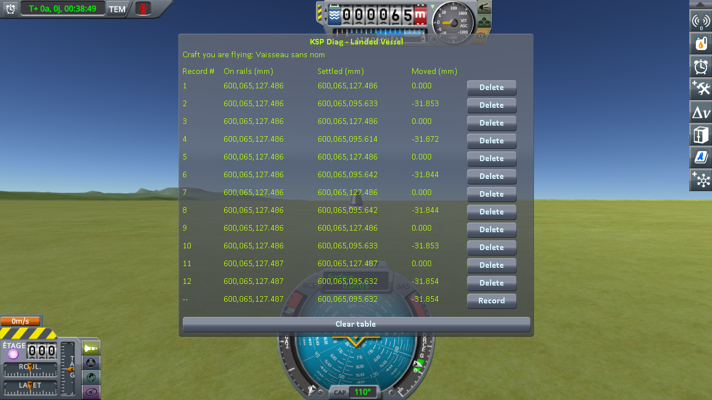
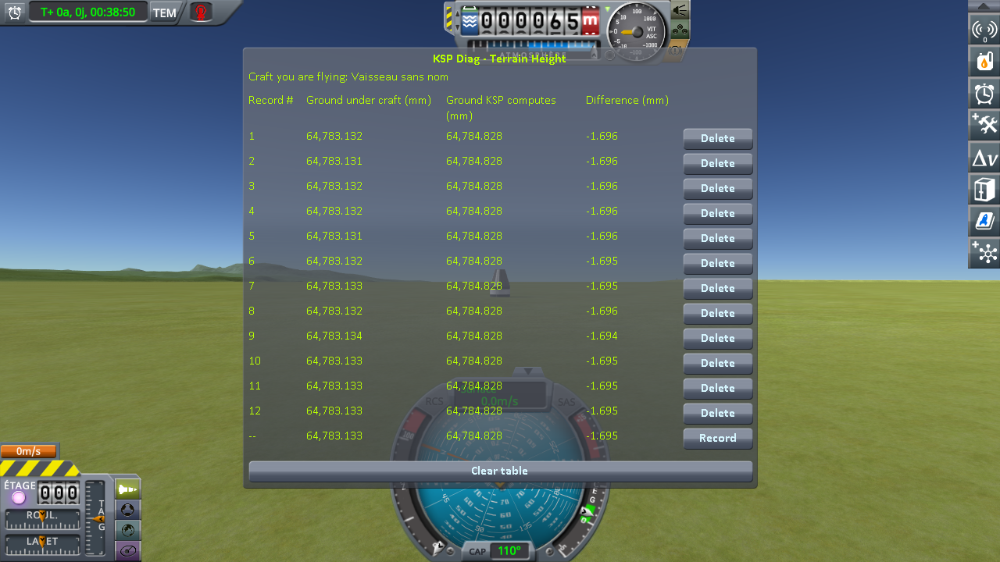

# Checking the culprit: switching to a craft far away

Part of [Terrain Precision Fix](../README.md): the measurements that check [the culprit](the-culprit-ground.md) on a craft switched to from two kilometres away, on stock and with this mod.

Two instruments take the readings:
[KSP Diag - Landed Vessel](https://github.com/lhervier/KSP-Diag-LandedVessel) measures the craft, and
[KSP Diag - Terrain Height](https://github.com/lhervier/KSP-Diag-TerrainHeight) measures the ground. Each has its own page, with
its method and its protocol.

This fix is built on top of [KSP Community Fixes](https://github.com/KSPModdingLibs/KSPCommunityFixes),
the base most players run, so every campaign on this page is run in an install that has it: KSP 1.12.5 with Harmony, ModuleManager,
KSP Community Fixes 1.41.1, both instruments, and [KSP-MCPServer](https://github.com/lhervier/KSP-MCPServer),
which plays the protocol — and this mod, or not. *On stock*, below, means that install without this mod.

Two craft landed 1.97 km apart on Kerbin. The save is loaded while flying the rover: the capsule is
loaded too, but packed, held where the save put it. Then the game's *switch vessel* key flies the
capsule, and physics takes it over. Six rounds, each starting by loading the same save. It is the
switching protocol of both instruments —
[KSP Diag - Landed Vessel](https://github.com/lhervier/KSP-Diag-LandedVessel/blob/main/docs/the-protocol-switching.md)
and [KSP Diag - Terrain Height](https://github.com/lhervier/KSP-Diag-TerrainHeight/blob/main/docs/the-protocol-switching.md) —
with a save made without this mod, played by its script,
[`run-switching.py`](https://github.com/lhervier/KSP-Diag-LandedVessel/blob/main/docs/the-protocol-switching.md#played-by-a-script),
once without this mod and once with it, both instruments recording at the same moments. The session
with this mod is logged in [`switching-fix.log`](../diag/checking-the-culprit-switching/switching-fix.log); what the
script printed is in [`switching-fix-script.txt`](../diag/checking-the-culprit-switching/switching-fix-script.txt), and every
line it recorded in [`switching-fix-lines.json`](../diag/checking-the-culprit-switching/switching-fix-lines.json).

## The craft, over six rounds

**On stock**
([the readings](https://github.com/lhervier/KSP-Diag-LandedVessel/blob/main/docs/the-measurements-switching.md)).
As the save opens, *On rails* reads the same height on all six rounds, within a thousandth of a
millimetre. *Moved*, once the switch has handed the capsule to physics:

| round | 1 | 2 | 3 | 4 | 5 | 6 |
|---|---|---|---|---|---|---|
| *Moved*, without this mod | −20.338 mm | −11.641 mm | +15.987 mm | −96.057 mm | −20.396 mm | −74.584 mm |
| *Moved*, with this mod | −31.853 mm | −31.872 mm | −31.844 mm | −31.844 mm | −31.853 mm | −31.854 mm |

**With this mod**, in that same install, on that same save, with this mod as the only difference. *On
rails* still reads the same height, within a thousandth of a millimetre. The first line of each round
is taken as the save opens, the second after the switch:

The capsule comes to rest across a spread of 112.0 mm without this mod, and 0.028 mm with it.

## The ground, over six rounds

**On stock**
([the readings](https://github.com/lhervier/KSP-Diag-TerrainHeight/blob/main/docs/the-measurements-switching.md)).
The height KSP computes reads 64,784.828 mm on all twelve lines. *Difference*, as the save opens:

| round | 1 | 2 | 3 | 4 | 5 | 6 |
|---|---|---|---|---|---|---|
| *Difference*, without this mod | +9.821 mm | +18.533 mm | +46.138 mm | −65.912 mm | +9.744 mm | −44.427 mm |
| *Difference*, with this mod | −1.696 mm | −1.696 mm | −1.696 mm | −1.695 mm | −1.694 mm | −1.695 mm |

On stock, the line taken after the switch reads the same ground as the line before it, to within two
thousandths of a millimetre.

**With this mod**, in that same install, the same session:

All twelve lines, before and after the switch, read between −1.694 and −1.696 mm.

The ground spreads over 112.1 mm without this mod, and 0.002 mm with it.

## What the measurements say

**The ground is built when the save is loaded, and the switch does not move it.** The line taken after
the switch reads the same ground as the one before, to within two thousandths of a millimetre — the
capsule settling a hair and moving the spot the ray is fired at.

**The capsule comes to rest by as much as the ground moved.** The ground under the capsule is built when
the save is loaded, while the capsule is two kilometres from the craft being flown and not flown itself
— and switching to it does not move it. Meanwhile the capsule is held at the height the save recorded.
So until the switch, it sits inside that ground or above it, and it is when physics takes it over that
it comes to rest on it, by as much as the ground moved: over 112.0 mm for the capsule, 112.1 mm for the
ground. Round by round, the capsule's *Moved* minus the ground's *Difference* after the switch reads
−30.16 mm, to within two hundredths of a millimetre — with this mod as well. With this mod, the ground
is built in the same place at every loading, within 0.002 mm, and the capsule comes to rest by the same
amount every time, within 0.028 mm.

**The −31.85 mm left is the same on every round, so it is not the defect.** The save was made without
this mod: the height it holds the capsule at was taken on one of the grounds stock builds, and this mod
builds the ground in one place every time — not that one. It is the case of
[Existing saves](non-regression/stock/existing-saves.md).
