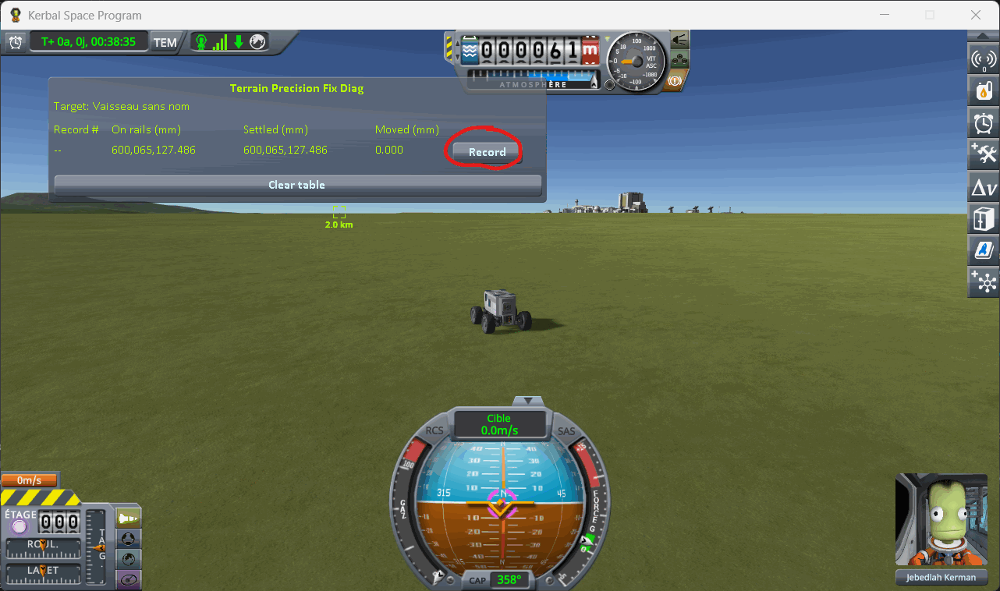
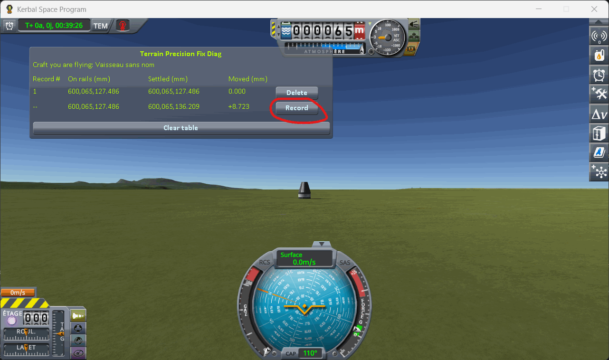

# The protocol: switching to a craft far away

Part of [Terrain Precision Fix](../../README.md), for
[Checking the culprit: switching to a craft far away](../checking-the-culprit-switching.md): how a craft
you switch to is read, without driving anywhere, by
[KSP Diag - Landed Vessel](https://github.com/lhervier/KSP-Diag-LandedVessel). The columns it fills are
in [its window](https://github.com/lhervier/KSP-Diag-LandedVessel/blob/main/docs/the-window.md).
[KSP Diag - Terrain Height](https://github.com/lhervier/KSP-Diag-TerrainHeight), installed alongside,
records at the same moments; what it adds is in
[its own page of the protocol](https://github.com/lhervier/KSP-Diag-TerrainHeight/blob/main/docs/the-protocol-switching.md).
The protocol is the same without this mod and with it.

Two craft are landed about two kilometres apart. You load the save while flying one of them, then
jump to the other with the game's own *switch vessel* key, and the window follows that other craft
throughout.

## The save

[`switch-kerbin.sfs`](../../diag/checking-the-culprit-switching/switch-kerbin.sfs), a sandbox game of
KSP 1.12.5, made without this mod. Copy it into the folder of a sandbox game and load it from that
game. It holds two craft, landed on the flat grass west of the KSC, 1.97 km apart on a north–south
line:

- **the craft the readings are about**: a Mk1 command pod on an FL-T100 tank, landed at latitude
  −0.1299°, longitude −74.7611°;
- **the rover**, 1.97 km to the south, at latitude −0.3180°, longitude −74.7578°. It is the craft you
  are flying when the save opens, and the capsule is already its target.

So the window follows the capsule from the moment the scene opens: as the rover's target first, then,
once you have switched to it, as the craft you are flying. You have nothing to set.

You can of course build your own two craft instead. The capsule must meet the same conditions as
[the capsule of the loading protocol](../checking-the-culprit-loading/making-the-save.md): a spot
where it does not slide, no suspension. The two craft must be more than 500 m apart, and less than
2250 m, so that the game keeps both of them loaded.

## The protocol

**1. Load the save.** You are flying the rover, and the window reads its target, the capsule. Press
*Record*.

**2. Switch to the capsule** with `]` — the game's default *switch to next vessel* key. You are now
flying it. Give it three to five seconds, then press *Record*.

**3. Load the same save again**, and repeat steps 1 and 2 — six times in all, two lines each time.

⚠️ **Do not touch the throttle of the capsule** while you are flying it. Throttling up frees a landed
craft from what holds it in place, and the next line would be measuring that.

⚠️ **Never save over the save you load.** It is what holds the height the capsule is handed back at,
and every round must start from that same height.

One round says nothing on its own: it is the series that is worth reading, not a line.

## Played by a script

[`diag/automation/run-switching.py`](../../diag/automation/run-switching.py) plays the protocol above,
step for step, and takes the screenshots. It drives KSP through
[KSP-MCPServer](https://github.com/lhervier/KSP-MCPServer), a mod that answers requests sent to it over
HTTP, from the computer KSP runs on only; and it needs nothing but Python 3 — no AI, no package to
install. Anyone can read it top to bottom: it follows the three steps above in the same order.

1. Install KSP-MCPServer next to both instruments — and this mod, for the series with it — copy
   [the save](../../diag/checking-the-culprit-switching/switch-kerbin.sfs) into a sandbox game, start
   KSP and wait for the main menu.
2. Run `python run-switching.py --folder <your sandbox game> --rounds 6 --out screenshots`.

For each round, it loads the save, which opens on the rover with the capsule as its target, and
records; then it switches to the capsule as the `]` key does, waits four seconds and for the digits to
stop moving (within half a thousandth of a millimetre over two seconds), and records again, in both
windows at the same moment. It never saves the game. After the last round it takes a screenshot of
each table, prints every line it recorded, writes them to `lines.json` next to the screenshots, and
quits KSP — give it `--keep-running` to leave KSP open. Save `KSP.log` before starting KSP again: KSP
writes it anew at every start.
