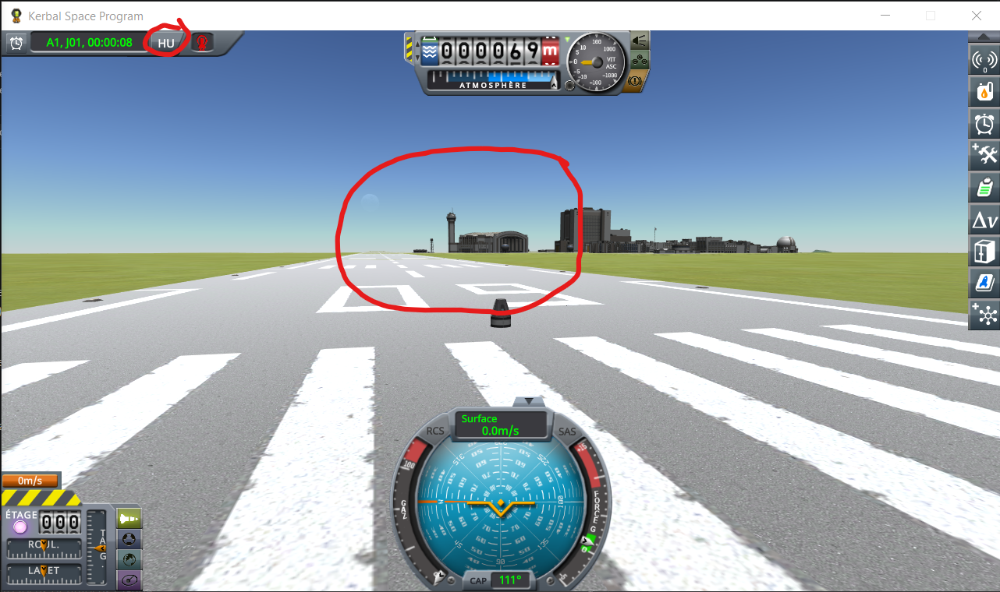
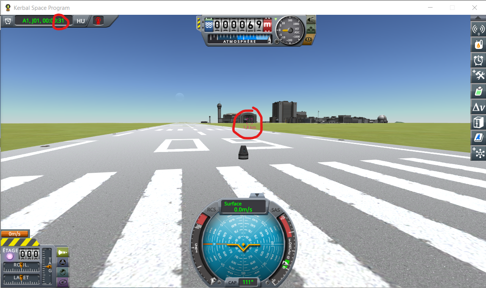
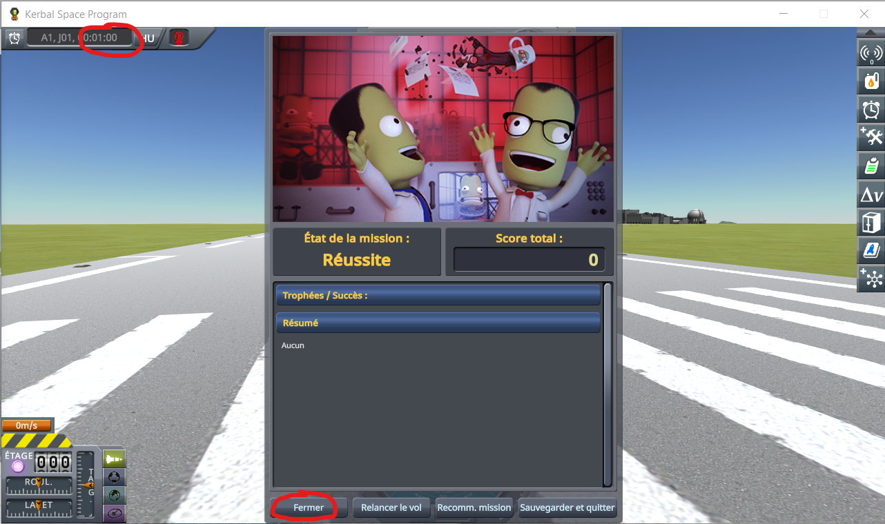
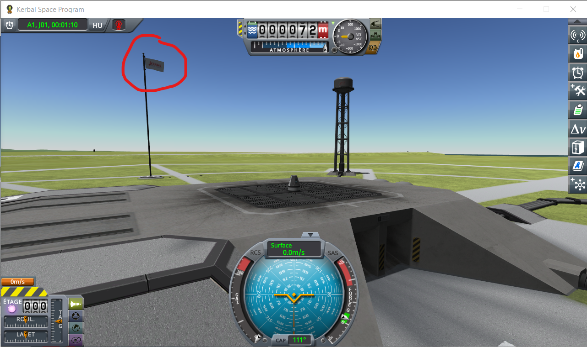

# Kopernicus: the flag fix

Part of [Terrain Precision Fix](../../../README.md), one point of the case [Kopernicus](../kopernicus.md), in [Limits and solutions](../../limits-and-solutions.md).

**Status: checked, no problem — where this mod moves the KSC, its statics fix keeps the flags steady
without Kopernicus' flag fix, which it keeps from running there; everywhere else, Kopernicus' flag fix
runs as before.** To place the KSC in double, this mod takes it out of the home body's terrain sphere
while a craft is near ([The statics](../../the-fix-this-mod-proposes.md#the-statics)), and Kopernicus
looks for it there.

## The flag glitch

Kopernicus comes with a fix for the flag by the launchpad, written for
[Kopernicus issue #349](https://github.com/Kopernicus/Kopernicus/issues/349): a flag that twitched and
left its pole, reported in KSP 1.4 to 1.6, in Real Solar System and on a stock system rescaled ten
times. The glitch is still there in KSP 1.12, and it goes away as soon as the KSC is placed in double
precision: it comes from the KSC hanging from its terrain sphere, as the moving statics do
([A second culprit: the statics](../../the-culprit.md#a-second-culprit-the-statics)).

In KSP 1.12.5 with Harmony, ModuleManager, KSP Community Fixes 1.41.1 and
[Real Solar System](https://github.com/KSP-RO/RealSolarSystem) 20.1.3 with what it requires, Kopernicus
248 built from its sources with its flag fix turned off: the two lines that call it commented out
([`kopernicus-248-without-its-flag-fix.diff`](../../../diag/kopernicus-flag-fix/kopernicus-248-without-its-flag-fix.diff)).
A craft on the launchpad at Cape Canaveral; the flag by the launchpad watched from the flight scene, and,
in the last two runs, from the space centre too. Three runs, each in a KSP started afresh:

| run | the flag by the launchpad | log |
|---|---|---|
| without this mod | twitches, in flight | [`kopernicus-flag-glitch-without-this-mod.log`](../../../diag/runs/kopernicus-flag-glitch-without-this-mod.log) |
| this mod, `patchKopernicus = false`, `logLevel = Debug` | steady in flight, twitches at the space centre | [`kopernicus-flag-glitch-statics-fix.log`](../../../diag/runs/kopernicus-flag-glitch-statics-fix.log) |
| this mod, `fixStatics = false`, `patchKopernicus = false`, `logLevel = Debug` | twitches, in flight and at the space centre | [`kopernicus-flag-glitch-statics-fix-off.log`](../../../diag/runs/kopernicus-flag-glitch-statics-fix-off.log) |

Kopernicus never fixes the flags in these runs. What holds the flag in flight is the statics fix alone:
the second run's log shows the KSC taken out of its sphere three seconds into the flight, and the third
run, the same mod with its statics fix turned off, twitches again.

This mod only moves the KSC in flight, while a craft is near it. At the space centre, in the editors, in
the tracking station, or in flight far from the KSC, Kopernicus' flag fix is still what holds the flag:
in the second run, the flag twitches at the space centre, this mod and its statics fix on.

## Where Kopernicus looks for the KSC

Kopernicus looks the KSC up among the children of the home body's terrain sphere in several places:
while the game loads (`Components/KSC.cs`); when the main menu, the space centre, the tracking station
or an editor opens (`RuntimeUtility/PreciseFloatingOrigin.cs`, `Patches/SpaceCenterCamera2_Start.cs`);
and in its flag fix. All of them but the flag fix run when this mod has put every static back under its
sphere, since it does so before every scene change.

## The patch

**What Kopernicus does.** `RuntimeUtility.FixFlags` binds the flags of the KSC to other bones, a few
frames after every scene opens and whenever a facility is upgraded or repaired — a new level of a
facility brings flags of its own. It looks the KSC up with `GetComponentsInChildren<PQSCity>(true)` on
the home body's terrain sphere, keeps the one named `KSC`, and uses it without checking it was found.

**Why it matters here.** A facility can be upgraded in flight: when a mission of the Making History
expansion spawns a craft at a facility, it places the KSC again and sets that facility's level. If a
craft is near the KSC then, the KSC is out of its sphere, the lookup does not find it, and the flag fix
throws a `NullReferenceException`, which KSP catches and logs. Nothing else goes wrong: out of its
sphere, the KSC keeps its flags steady without the flag fix ([The flag glitch](#the-flag-glitch)).

**What this mod does.** It keeps `FixFlags` from running while the KSC is out of its sphere, the one
time the flag fix is not needed. It runs as before a few frames after every scene opens, when every
static is back under its sphere, and whenever the KSC is under it — always, without this mod's statics
fix. If Kopernicus is installed and has no `FixFlags` without parameters, the patch fails, and the
statics fix stays off. The patch can also be turned off in the settings (`patchKopernicus = false`), to
see what goes wrong without it: the error in the log, in [Seeing the patch](#seeing-the-patch).

**The change in Kopernicus it stands for.** In `FixFlags`, stop when the KSC is not found under the home
body's terrain sphere, as the first version of `FixFlags` did with its `?.` operators.

## Seeing the patch

In KSP 1.12.5 with the Making History expansion, Harmony, ModuleManager, KSP Community Fixes 1.41.1 and
[Real Solar System](https://github.com/KSP-RO/RealSolarSystem) 20.1.3 with what it requires, Kopernicus
248 among them, as released. The screenshots below were taken on the stock system, where the steps are
the same.

The mission [`KSC flag fix`](../../../diag/kopernicus-flag-fix/Missions/): copy the `Missions` folder of
`diag/kopernicus-flag-fix/` into the folder of KSP. It starts with a pod on the runway; 30 seconds
later, it spawns a second pod on the launchpad; 30 seconds after that, it ends.

1. From the main menu, *Missions*, then play *KSC flag fix*. Switch the clock to universal time: a craft
   waiting on the runway keeps its mission elapsed time at zero.

   

2. 30 seconds in, the second pod appears on the launchpad.

   

3. 30 seconds later, the mission ends: close its window.

   

4. Switch to the second pod, and look at the flag by the launchpad.

   

5. Quit KSP, and read `KSP.log`.

Three runs, each in a KSP started afresh:

| run | `settings.cfg` of this mod | in `KSP.log`, when the second pod appears | log |
|---|---|---|---|
| without this mod | — | nothing | [`kopernicus-flag-fix-without-this-mod.log`](../../../diag/runs/kopernicus-flag-fix-without-this-mod.log) |
| this mod, Kopernicus unpatched | `patchKopernicus = false`, `logLevel = Debug` | `Exception handling event OnKSCFacilityUpgraded in class RuntimeUtility:System.NullReferenceException` … `at Kopernicus.RuntimeUtility.RuntimeUtility.FixFlags ()` | [`kopernicus-flag-fix-patch-off.log`](../../../diag/runs/kopernicus-flag-fix-patch-off.log) |
| this mod, Kopernicus patched | `patchKopernicus = true`, `logLevel = Debug` | nothing | [`kopernicus-flag-fix-patch-on.log`](../../../diag/runs/kopernicus-flag-fix-patch-on.log) |

In both runs with this mod, the log shows the KSC taken out of its sphere a few seconds into the
flight, then, at the instant the second pod appears, put back under it and taken out again: the game
placed it again before spawning the pod, and the KSC was out of its sphere when the flag fix ran —
the case the patch covers. At startup, the log says that the patch keeps the flag fix from running
while the KSC is out of its sphere, or, with the patch turned off, warns that Kopernicus' flag fix will
throw. In no run does the flag by the launchpad move.
