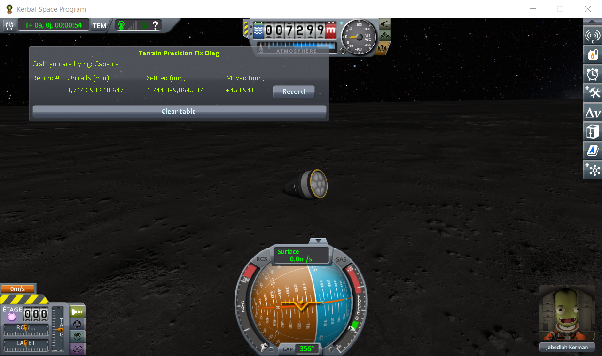
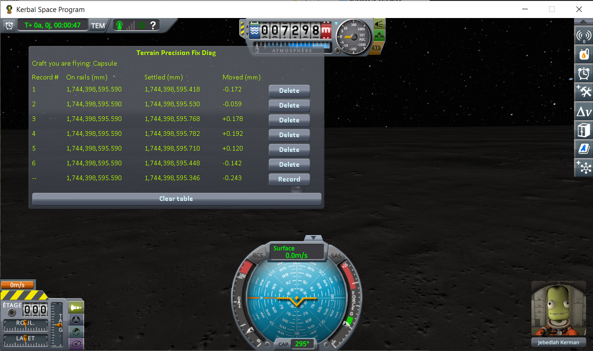
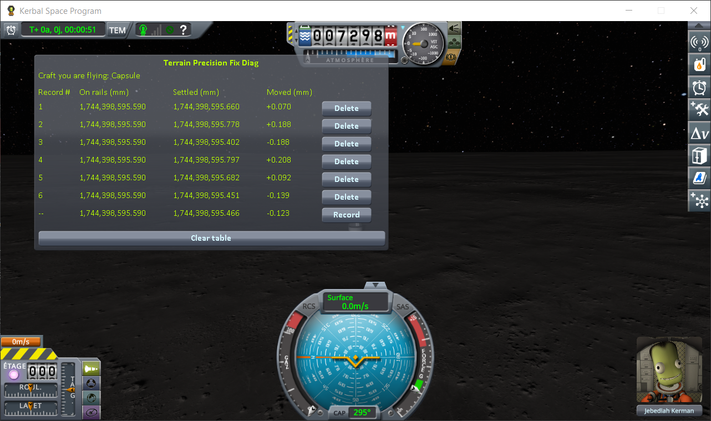
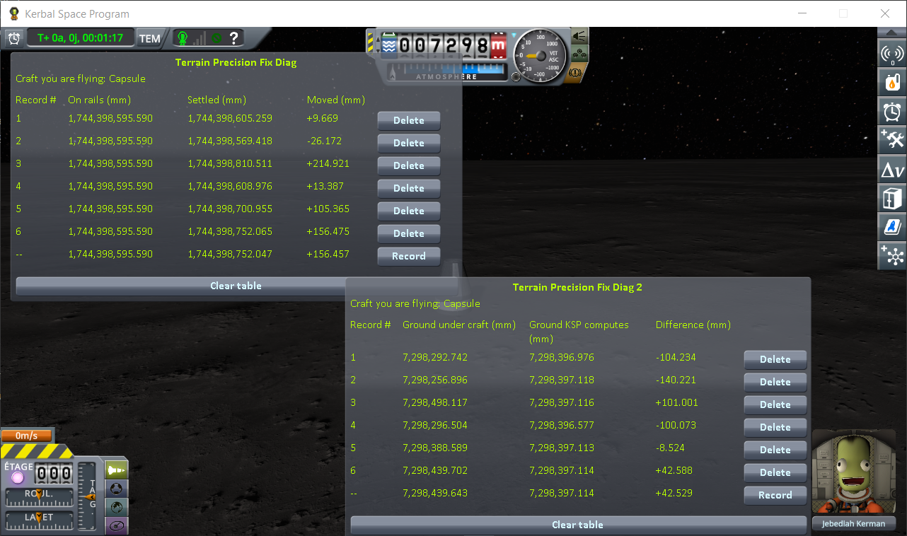
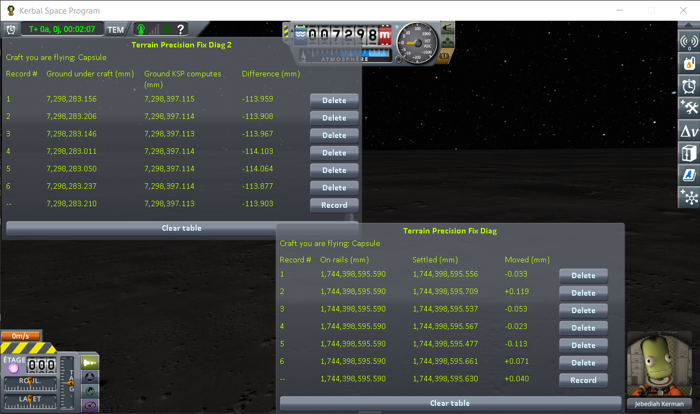
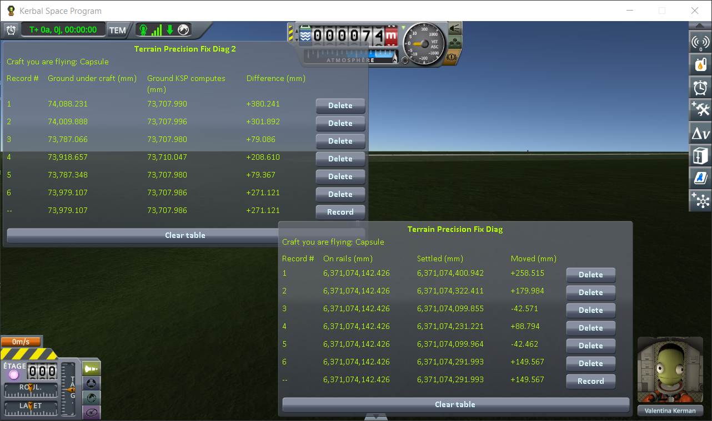
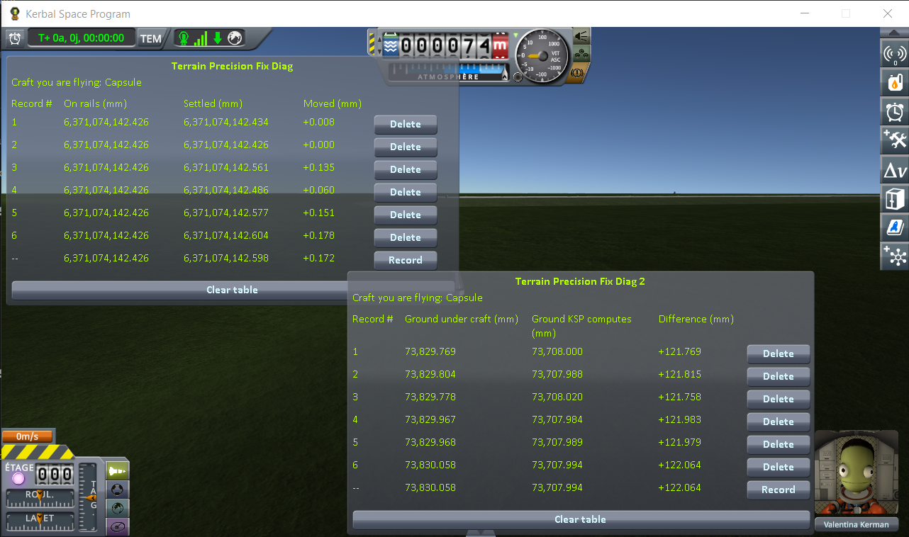
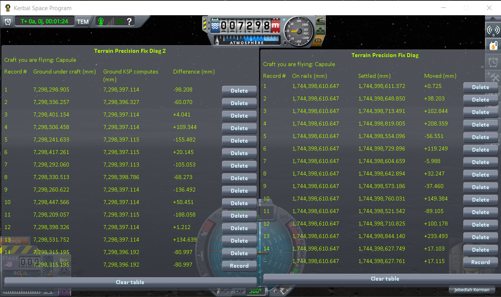

# Rescaled systems: Real Solar System

Part of [Terrain Precision Fix](../../README.md), one case of [Limits and solutions](../limits-and-solutions.md).

**Status: checked, no problem — this mod breaks nothing with Real Solar System, and improves on its own
workaround, measured on the Moon and on Earth.**

The defect grows with the radius of the body. A float's step doubles every time a distance crosses a
power of two, so the rounding this fix removes is not the same size on a rescaled body:

| body | radius | float step at that distance |
|---|---|---|
| Kerbin | 600 000 m | 62.5 mm |
| the Moon, in [Real Solar System](https://github.com/KSP-RO/RealSolarSystem) | 1 737 100 m | 125 mm |
| Earth, in Real Solar System | 6 371 000 m | 500 mm |

On Kerbin, the spreads measured in
[Checking the culprit: loading the same save](../checking-the-culprit-loading.md) are about two steps.
At the same number of steps, the ground of the Moon should move by about 25 cm from one load to the
next, and Earth's by about a metre.

**Real Solar System already works around the symptom.** Its source ships a component of its own,
`VesselGroundPositionEnhancer`
([its source](https://github.com/KSP-RO/RealSolarSystem/blob/master/Source/VesselGroundPositionEnhancer.cs)),
added to *"mostly prevent vessels clipping into the ground and as a result flung into the air"*
([pull request #257](https://github.com/KSP-RO/RealSolarSystem/pull/257)). Whenever a landed craft goes
off rails, it runs the stock `Vessel.CheckGroundCollision`, which moves the craft onto the ground before
its physics starts whenever it is more than 10 cm off, and logs `ground contact! - error. Moving Vessel
up X.XXXm`. A craft that comes back more than 10 cm inside the ground is then not launched but moved,
in one block. Under 10 cm, the stock method leaves the craft where it is, inside the ground or not. The
component turns itself off when an assembly named `WorldStabilizer` is loaded, the mod it was written to
stand in for. The repository also has an option to force it off, which release 20.1.3.0 does not have
yet.

**This fix has a safeguard.** It refuses any correction too large to be a rounding. It counts
**sixteen float steps** at the distance of the quad from the centre of the body: 1 m on Kerbin, 2 m on
the Moon, 8 m on Earth. The sessions on the Moon were run with its first version, a fixed **1 m**
chosen against a rounding of a few centimetres, which a correction of two steps already exceeds on
Earth; the sessions on Earth, with the current one.

## Checking the culprit

**The install.** KSP 1.12.5 with Harmony, ModuleManager and the same release of KSP Community Fixes as
every other campaign, plus Real Solar System 20.1.3.0 and what it requires (Kopernicus 248, Modular
Flight Integrator, KSPTextureLoader, the RSS textures), and
[Terrain Precision Fix Diag 1](https://github.com/lhervier/KSP-TerrainPrecisionFixDiag). Nothing else.
The series marked *RSS's pass off* add an empty assembly named `WorldStabilizer` in `GameData`, with
nothing in it, which is what turns Real Solar System's component off.

**The saves**, in the `diag` folder of each of the three Diags (here, Diag 1's):

- [`reload-moon-rss.sfs`](https://github.com/lhervier/KSP-TerrainPrecisionFixDiag/blob/main/diag/reload-moon-rss.sfs) — the pod on its tank, landed on flat ground on the
  Moon, saved without this mod;
- [`reload-moon-rss-resave.sfs`](https://github.com/lhervier/KSP-TerrainPrecisionFixDiag/blob/main/diag/reload-moon-rss-resave.sfs) — the same craft, after loading the save
  above once with this mod and saving it again;
- [`reload-earth-rss-resave.sfs`](https://github.com/lhervier/KSP-TerrainPrecisionFixDiag/blob/main/diag/reload-earth-rss-resave.sfs) — the pod on its tank, on the grass
  about 1.4 km west of the KSC on Earth, saved with this mod;
- [`reload-earth-rss-landed.sfs`](https://github.com/lhervier/KSP-TerrainPrecisionFixDiag/blob/main/diag/reload-earth-rss-landed.sfs) — the save above, with one line
  changed in the file: the situation of the craft, from `PRELAUNCH` to `LANDED`, the situation in
  which Real Solar System's pass runs.

Copy a save into the folder of a sandbox game and load it from that game.

The readings without this mod, with their screenshots and logs, are also on the instruments' own pages:
[Terrain Precision Fix Diag 1](https://github.com/lhervier/KSP-TerrainPrecisionFixDiag/blob/main/docs/the-measurements-loading.md#on-real-solar-system)
and
[Terrain Precision Fix Diag 2](https://github.com/lhervier/KSP-TerrainPrecisionFixDiag2/blob/master/docs/the-measurements-loading.md#on-real-solar-system).

### Terrain Precision Fix Diag 1, on the Moon

The protocol of
[Terrain Precision Fix Diag 1, over six loads](../checking-the-culprit-loading.md#the-craft-over-six-loads):
a Mk1 pod on an empty FL-T100, on flat ground on the Moon (latitude 28.61°, longitude −80.62°), saved
landed, then loaded six times from the pause menu, each reading recorded once *Settled* has frozen.
The first two rows are `reload-moon-rss.sfs`, the last two `reload-moon-rss-resave.sfs` (see
[Existing saves](existing-saves.md)).

| install | what the craft does | spread of *Settled* over six loads |
|---|---|---|
| without this mod, Real Solar System as released | moved up by RSS's pass at three loads out of six, by 0.111 to 0.169 m | 262.6 mm (2.1 float steps) |
| without this mod, RSS's pass off | tips over at the first load | — |
| with this mod, RSS's pass off | stays put, no `Moving Vessel` line | 0.364 mm |
| with this mod, Real Solar System as released | stays put; RSS's pass runs at every load and never moves it | 0.395 mm |


*Without this mod, Real Solar System as released: six loads of the save, each recorded.*



*Without this mod, RSS's pass off: the first load of the same save.*



*With this mod, RSS's pass off: six loads of the save taken again with this mod.*



*With this mod, Real Solar System as released: six loads of that same save.*

The two sessions without this mod are logged in
[Diag 1's `diag/runs`](https://github.com/lhervier/KSP-TerrainPrecisionFixDiag/tree/main/diag/runs),
files `reload-moon-rss-stock.log` and `reload-moon-rss-vgpeoff-stock.log`; the two sessions with it in
[`diag/runs/reload-moon-rss-fix.log`](../../diag/runs/reload-moon-rss-fix.log) (RSS's pass off) and
[`diag/runs/reload-moon-rss-fix-vgpe-on.log`](../../diag/runs/reload-moon-rss-fix-vgpe-on.log) (as released).

### What this mod corrected

The sessions with this mod ran at `logLevel = Debug`, which logs how far each quad was moved. On the
Moon, 2 464 quads were corrected, by 443 mm at most, 3.5 float steps. Earth's terrain was built too
during those sessions, and the first version of the safeguard, a fixed metre, refused part of it:

```
[TerrainPrecisionFix] Earth: a correction of 1.094 m is too large to be a rounding error, the quads concerned are left as stock builds them
```

With the current safeguard, on Earth: 2 100 quads corrected, by 1 388 mm at most, 2.8 float steps,
and none refused, over the six loads of
[Diag 1 and Diag 2, on Earth](#terrain-precision-fix-diag-1-and-diag-2-on-earth); over the 51 loads
of [Reloading until something happens](#reloading-until-something-happens) on Earth, 12 128
placements of a quad corrected, by 1 992 mm at most, 4.0 float steps, and none refused. That is the
largest correction seen on any body so far, a quarter of the limit.

### Terrain Precision Fix Diag 2, on the Moon

The protocol of
[Terrain Precision Fix Diag 2, over six loads](../checking-the-culprit-loading.md#the-ground-over-six-loads),
which reads the ground itself rather than the craft: a ray straight down under the craft, against the
height KSP computes for that same spot. Same install with
[Terrain Precision Fix Diag 2](https://github.com/lhervier/KSP-TerrainPrecisionFixDiag2) added, Real
Solar System as released, `reload-moon-rss-resave.sfs`, loaded six times.

| install | spread of the ground under the craft over six loads | *Difference* |
|---|---|---|
| without this mod | 241.2 mm (1.9 float steps) | −140.2 to +101.0 mm |
| with this mod | 0.226 mm | −114.10 to −113.88 mm |

Diag 1, read in the same two sessions, agrees: the craft comes back over 241.1 mm without this mod,
moved up by RSS's pass at three loads out of six (0.106 to 0.215 m), and over 0.232 mm with it, never
moved.



*Without this mod, Real Solar System as released: six loads of the save taken again with this mod.*



*With this mod, Real Solar System as released: six loads of the same save.*

The session without this mod is logged in
[Diag 2's `diag/runs`](https://github.com/lhervier/KSP-TerrainPrecisionFixDiag2/tree/master/diag/runs),
file `reload-moon-rss-stock.log`; the session with it in
[`diag/runs/reload-moon-rss-fix-diag2.log`](../../diag/runs/reload-moon-rss-fix-diag2.log).

### Terrain Precision Fix Diag 1 and Diag 2, on Earth

The same two protocols, on the same install with the current safeguard: a Mk1 pod on an empty FL-T100,
on the grass about 1.4 km west of the KSC (latitude 28.611°, longitude −80.619°, 74 m above sea
level), `reload-earth-rss-resave.sfs`, loaded six times with this mod and six times without it. The craft is in
the *prelaunch* situation there, where Real Solar System's pass does not run. Stock KSP runs its own
instead, the same `Vessel.CheckGroundCollision`, at every load: `Vessel.GoOffRails` spares a landed
craft whose saved terrain levels match the current ones, but skips that check for a craft in
*prelaunch*. The pass only shows in the log when it moves the craft by more than 10 cm, which it did
at three of the loads without this mod.

| install | the craft (Diag 1) | the ground (Diag 2) |
|---|---|---|
| without this mod | 301.1 mm; moved up by stock's pass at three loads (0.150 to 0.259 m), **jumped** at one (+88.8 mm) | 301.2 mm |
| with this mod | 0.178 mm, never moved | 0.289 mm |



*Without this mod, Real Solar System as released: six loads of the save made with this mod.*



*With this mod, Real Solar System as released: six loads of the same save.*

The session without this mod is logged in
[Diag 1's `diag/runs`](https://github.com/lhervier/KSP-TerrainPrecisionFixDiag/tree/main/diag/runs),
file `reload-earth-rss-stock.log`; the session with it in
[`diag/runs/reload-earth-rss-fix.log`](../../diag/runs/reload-earth-rss-fix.log).

### Reloading until something happens

No instrument is needed for this one: the same craft, Real Solar System as released, reloaded from the
pause menu again and again, watching whether it jumps or tips over. Real Solar System leaves one line in
`KSP.log` each time the craft goes off rails, which counts the loads: `[RSS-VGPE] CheckGroundCollision()`
for a landed craft, where its pass runs, `[RSS-VGPE] Vessel going off rails in PRELAUNCH` for a craft
in *prelaunch*, where stock's runs instead. A `Moving Vessel` line is added whenever either pass moved
the craft.

**Without this mod**, `reload-moon-rss.sfs`, saved without it, loaded 14 times (both
instruments were open, and read the craft and the ground over a spread of 322.6 mm):

| loads | what the craft does | *Moved*, from Diag 1 |
|---|---|---|
| 3 of 14 | **jumps**: it came back 17 to 38 mm inside the ground, under the 10 cm RSS's pass acts on | +17.1 to +38.2 mm |
| 6 of 14 | moved up by RSS's pass before its physics starts, by 0.101 to 0.234 m | +100.2 to +233.5 mm |
| 5 of 14 | nothing visible: the ground came back lower | −89.1 to +0.7 mm |



*Without this mod, Real Solar System as released: fourteen loads of the save made without it.*

**With this mod**, `reload-moon-rss-resave.sfs`, saved again with it, loaded 24 times with
no instrument installed: the craft never moved, and the log holds 24 `[RSS-VGPE]` lines and no
`Moving Vessel` line.

**On Earth, with this mod**, no instrument installed either, in one session: `reload-earth-rss-landed.sfs`
first, brought into flight 27 times, then, after going back to the space centre,
`reload-earth-rss-resave.sfs`, 24 times. The craft never moved and never jumped, with either pass:

| save | situation of the craft | loads | pass that runs | `Moving Vessel` lines |
|---|---|---|---|---|
| `reload-earth-rss-landed.sfs` | landed | 27 | Real Solar System's (27 `[RSS-VGPE] CheckGroundCollision()` lines) | 0 |
| `reload-earth-rss-resave.sfs` | prelaunch | 24 | stock's (24 `[RSS-VGPE] … in PRELAUNCH` lines) | 0 |

The session without this mod is logged in
[Diag 1's `diag/runs`](https://github.com/lhervier/KSP-TerrainPrecisionFixDiag/tree/main/diag/runs),
file `reload-moon-rss-stock-14loads.log`; the sessions with it in
[`diag/runs/reload-moon-rss-fix-24loads.log`](../../diag/runs/reload-moon-rss-fix-24loads.log) (the
Moon) and [`diag/runs/reload-earth-rss-fix-chain.log`](../../diag/runs/reload-earth-rss-fix-chain.log)
(Earth, the landed save up to the return to the space centre, then the other).

## What the results show

**This mod breaks nothing, and improves the situation.** Real Solar System's own workaround does not
always work: it moves a craft back onto the ground only when it is more than 10 cm off, and lets it jump
below that. With this mod, nothing moves any more. With both installed, as players would have them, the
workaround still runs at every load and, for this defect, never finds anything to correct, without
getting in the way. It may well have other uses, outside the scope of this fix. The rest of this section details why.

**The defect is there, at the size the float step predicts.** Without this mod, the ground of the Moon
comes back over 241.2 mm, and the craft resting on it over 241.1 to 262.6 mm, about two steps of
125 mm: the same number of steps as on Kerbin, on a step twice as large. On Earth, six loads gave
301 mm, 0.6 of a step of 500 mm: a narrow draw, where the Moon's float steps predicted about a metre.
With this mod, the ground comes back over 0.226 mm on the Moon and 0.289 mm on Earth. The *Difference* of about −114 mm that stays is the same at every load: it is how far the
collision mesh lies from the computed height at that spot, not a rounding.

**Real Solar System's pass catches part of it, and hides it.** A craft that comes back more than 10 cm
inside the ground is moved up in one block, here at six loads out of fourteen: nothing is launched, but
a structure resting on several points is lifted by its lowest one. A craft that comes back less than
10 cm inside the ground is left there, and the physics engine pushes it out: three jumps in fourteen
loads, on a save made without this mod. On the Moon, 10 cm is less than one float step, and on Earth a fifth
of one; there, stock's own pass left the craft buried by 9 cm at one load of six, and it jumped. With
the pass off, the craft tips over at the very first load.

**This mod leaves the pass nothing to do for this defect, and does not fight it.** With this mod, the craft stays put over
a few tenths of a millimetre, with the pass off as with it on, and loads in a row did not make it jump
once: 24 on the Moon, 51 on Earth. The pass still runs at every load, and
never has anything to move: the ground comes back within a millimetre, well inside the 10 cm below which
the pass leaves a craft where it is. On Earth this holds for both passes, Real Solar System's on the
landed craft and stock's in *prelaunch*. What is left is wider than on Kerbin's campaigns, and 0.3 % of a
float step at that distance.

**The safeguard grows with the body.** A fixed metre refused corrections of 1.094 m and 1.318 m on
Earth, leaving part of its terrain as stock builds it. Counted in float steps at the quad's distance, it
accepts every correction applied there, up to 1 992 mm, 4.0 steps, and keeps the same meaning — a
correction no rounding can produce — on any body: sixteen steps is four times the largest correction
seen so far, 4.0 steps on Earth, 3.5 on the Moon.

*Still to test:* the other large bodies — Venus, Mars and Mercury, where the float step is 500, 250
and 250 mm — for the largest correction there; and the runway of the KSC on Earth, a static this mod
does not place (see [The KSC buildings, runway and launchpad](the-ksc-buildings-runway-and-launchpad.md)),
where Real Solar System keeps the floating origin from moving while a craft rolls on it.
