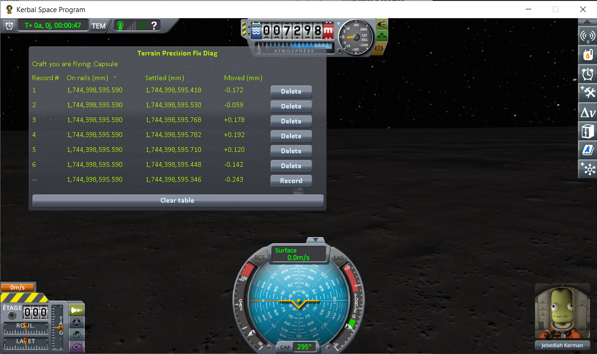

# Rescaled systems: Real Solar System

Part of [Terrain Precision Fix](../../README.md), one case of [Limits and solutions](../limits-and-solutions.md).

**Status: checked, no problem — this mod breaks nothing with Real Solar System, and improves on its own
workaround, measured on the Moon and on Earth.**

[Real Solar System](https://github.com/KSP-RO/RealSolarSystem) is a case of its own for two reasons.
The defect grows with the radius of the body, and there it is at its largest: a float's step is
125 mm at the distance of the Moon's ground and 500 mm at Earth's, against 62.5 mm on Kerbin. And Real
Solar System ships a workaround of its own for the symptom, which moves a landed craft back onto the
ground when it loads, so this mod has to live alongside it.

The measurements are rows of
[Checking the culprit: loading the same save](../checking-the-culprit-loading.md): the Moon and Earth
in the six loads of both instruments, then the reloads in a row of
[Real Solar System's own workaround](../checking-the-culprit-loading.md#real-solar-systems-own-workaround),
which also says what that workaround does. This page holds what is specific to this case: the install
and the saves, what this mod corrected there, and how its safeguard behaves on a larger body.

## Checking the culprit

**The install.** KSP 1.12.5 with Harmony, ModuleManager and KSP Community Fixes 1.41.1, as in every
other campaign, plus Real Solar System 20.1.3.0 and what it requires (Kopernicus 248, Modular Flight
Integrator, KSPTextureLoader, the RSS textures), and one of the two instruments,
[Terrain Precision Fix Diag 1](https://github.com/lhervier/KSP-TerrainPrecisionFixDiag) or
[Terrain Precision Fix Diag 2](https://github.com/lhervier/KSP-TerrainPrecisionFixDiag2), or none for
the reloads in a row. Nothing else. The series with Real Solar System's workaround off add an empty
assembly named `WorldStabilizer` in `GameData`, with nothing in it: the workaround turns itself off
when an assembly of that name is loaded, the mod it was written to stand in for. Real Solar System's
repository also has an option to force it off, which release 20.1.3.0 does not have yet.

**The saves**, in the `diag` folder of each of the three Diags (here, Diag 1's):

- [`reload-moon-rss.sfs`](https://github.com/lhervier/KSP-TerrainPrecisionFixDiag/blob/main/diag/reload-moon-rss.sfs) — the pod on its tank, landed on flat ground on the
  Moon (latitude 28.61°, longitude −80.62°), saved without this mod;
- [`reload-moon-rss-resave.sfs`](https://github.com/lhervier/KSP-TerrainPrecisionFixDiag/blob/main/diag/reload-moon-rss-resave.sfs) — the same craft, after loading the save
  above once with this mod and saving it again (see [Existing saves](existing-saves.md));
- [`reload-earth-rss-resave.sfs`](https://github.com/lhervier/KSP-TerrainPrecisionFixDiag/blob/main/diag/reload-earth-rss-resave.sfs) — the pod on its tank, on the grass
  about 1.4 km west of the KSC on Earth (latitude 28.611°, longitude −80.619°, 74 m above sea level),
  saved with this mod, the craft in *prelaunch*;
- [`reload-earth-rss-landed.sfs`](https://github.com/lhervier/KSP-TerrainPrecisionFixDiag/blob/main/diag/reload-earth-rss-landed.sfs) — the save above, with one line
  changed in the file: the situation of the craft, from `PRELAUNCH` to `LANDED`, the situation in
  which Real Solar System's workaround runs.

Copy a save into the folder of a sandbox game and load it from that game.

**The screenshots.** Those without this mod are on the instruments' own pages:
[Terrain Precision Fix Diag 1](https://github.com/lhervier/KSP-TerrainPrecisionFixDiag/blob/main/docs/the-measurements-loading.md#the-same-craft-with-two-parts)
and
[Terrain Precision Fix Diag 2](https://github.com/lhervier/KSP-TerrainPrecisionFixDiag2/blob/master/docs/the-measurements-loading.md#the-readings),
each followed by a chapter on Real Solar System's own workaround. Those with this mod and Real Solar
System as released are in
[Checking the culprit: loading the same save](../checking-the-culprit-loading.md). The one series left
is this mod with the workaround off:



*With this mod, Real Solar System's workaround off, Diag 1: six loads of `reload-moon-rss-resave.sfs`.*

**The logs.** The sessions with this mod are in [`diag/runs`](../../diag/README.md#on-real-solar-system),
each described there; the sessions without it in the `diag/runs` folder of
[Diag 1](https://github.com/lhervier/KSP-TerrainPrecisionFixDiag/tree/main/diag/runs) and of
[Diag 2](https://github.com/lhervier/KSP-TerrainPrecisionFixDiag2/tree/master/diag/runs).

## What this mod corrected

The sessions with this mod ran at `logLevel = Debug`, which logs how far each quad was moved.

This mod refuses any correction too large to be a rounding: sixteen float steps at the distance of the
quad from the centre of the body, 1 m on Kerbin, 2 m on the Moon, 8 m on Earth (see
[Safeguards](../the-fix-this-mod-proposes.md#safeguards)). Its first version was a fixed **1 m**, chosen
against a rounding of a few centimetres, which a correction of two steps already exceeds on Earth. The
sessions marked *first safeguard* in [`diag/runs`](../../diag/README.md#on-real-solar-system) ran with
it: on the Moon, 2 464 quads were corrected, by 443 mm at most, 3.5 float steps. Earth's terrain was
built too during those sessions, and that first version refused part of it:

```
[TerrainPrecisionFix] Earth: a correction of 1.094 m is too large to be a rounding error, the quads concerned are left as stock builds them
```

With the current safeguard, none refused:

| series | placements of a quad corrected | largest correction |
|---|---|---|
| Earth, the six loads of Diag 1 | 1 564 | 1 998 mm, 4.0 float steps |
| Earth, the six loads of Diag 2 | 1 576 | 1 230 mm, 2.5 float steps |
| Earth, the 51 reloads in a row | 12 128 | 1 992 mm, 4.0 float steps |
| the Moon, the six loads of Diag 2 | 2 112 | 347 mm, 2.8 float steps |

1 998 mm is the largest correction seen on any body so far, a quarter of the limit.

## What the results show

**This mod breaks nothing, and leaves Real Solar System's workaround nothing to do for this defect.**
Without this mod, the workaround catches only part of the defect: it acts beyond 10 cm, less than one
float step on the Moon and a fifth of one on Earth, and the craft still jumps or tips over now and
then. With this mod, the craft stays put over a few tenths of a millimetre, with the workaround off
(0.364 mm over six loads on the Moon) as with it on (0.395 mm). With both installed, as players have
them, the workaround still runs at every load and never moves the craft, without getting in the way:
24 reloads in a row on the Moon, 51 on Earth, on the landed craft, where Real Solar System's
workaround runs, and in *prelaunch*, where stock's own pass runs instead. The workaround may well have
other uses, outside the scope of this fix. What is left is wider than on Kerbin's campaigns, and at
most 0.3 % of a float step at that distance.

**The safeguard grows with the body.** A fixed metre refused corrections of 1.094 m and 1.318 m on
Earth, leaving part of its terrain as stock builds it. Counted in float steps at the quad's distance, it
accepts every correction applied there, up to 1 998 mm, 4.0 steps, and keeps the same meaning — a
correction no rounding can produce — on any body: sixteen steps is four times the largest correction
seen so far, 4.0 steps on Earth, 3.5 on the Moon.

*Still to test:* the other large bodies — Venus, Mars and Mercury, where the float step is 500, 250
and 250 mm — for the largest correction there; and the runway of the KSC on Earth, a static this mod
does not place (see [The KSC buildings, runway and launchpad](the-ksc-buildings-runway-and-launchpad.md)),
where Real Solar System keeps the floating origin from moving while a craft rolls on it.
