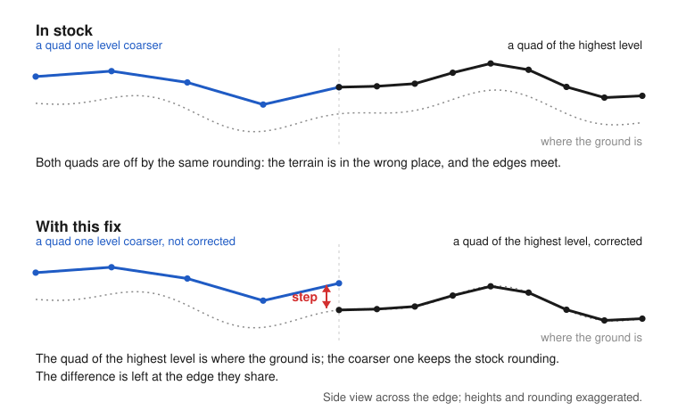
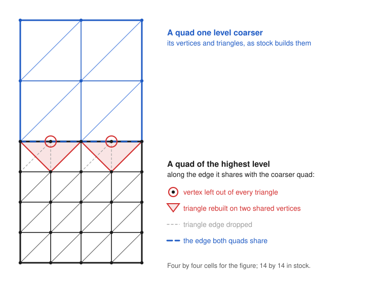

# The seam between subdivision levels

Part of [Terrain Precision Fix](../../README.md), one case of [Limits and solutions](../limits-and-solutions.md).

**Status: TBD — read in the code, not measured, and expected to be a real problem.** Stock makes the
edges of two neighbouring quads meet, even when they are not at the same subdivision level. This fix
only corrects the highest level, so where the corrected terrain meets the coarser quads around it, the
two edges are expected not to meet any more: a step, all along the edge of the corrected zone. Visual
only, but possibly large enough to see on a large body.

## What goes wrong

The quads of the highest subdivision level cover the ground around the craft, and they are the only
ones this fix corrects (see [Only where a craft can stand](../the-fix-this-mod-proposes.md#only-where-a-craft-can-stand)).
Further away, the terrain is made of coarser quads, which stock builds and places as it always has.

In stock, every quad is placed off by the rounding this mod corrects. But two neighbouring quads are
off by the same amount, so their edges meet. With this fix, the quad of the highest level is where the
ground is, while its coarser neighbour is still off by the whole stock rounding, and the difference is
left at the edge they share:



The step is expected to be of the order of the correction this fix applies to a quad. That correction
grows with the body, since a float's step does: 62.5 mm on Kerbin, 500 mm on Earth under Real Solar
System, where the largest correction read so far is close to two metres (see
[What this mod corrected](rescaled-systems-real-solar-system.md#what-this-mod-corrected)).

It stays visual: the quads below the highest level have no collider (see
[Colliders below the highest subdivision level](colliders-below-the-highest-subdivision-level.md)), so
a craft never stands on that edge. It would be seen from the craft, some distance away, never under
it.

The chapters below explain, from the code, why the edges meet in stock and why they would not with this
fix.

## How stock joins two levels

Every quad has the same grid of vertices, 15 by 15 in stock. A quad one level coarser covers twice the
width, so along the edge they share, the finer quad has twice as many vertices: every other one has no
counterpart on the coarser edge, and would leave a crack.

Stock does not move those vertices. It changes the triangles of the finer quad along that edge:
`PQ.GetEdgeState` marks each side whose neighbour has a lower subdivision level, and the quad takes one
of sixteen precomputed lists of triangles, one per combination of marked sides (`PQS.cacheIndices`).
Along a marked side, each pair of cells gets three triangles instead of four, and the vertex between
them is left out of all of them:



The finer edge then runs along the same segments as the coarser one — provided the vertices both quads
share land on the same point.

## Why the shared vertices meet in stock

Stock places every terrain vertex in two steps, in `PQS.BuildVertexSurfaceRelative` (the whole method,
and why it rounds, is in [The culprit](../the-culprit.md)):

```csharp
planetRel = base.transform.TransformPoint(vertRel);
buildQuad.verts[vertexIndex] = buildQuad.transform.InverseTransformPoint(planetRel);
```

The first line takes the vertex from the centre of the body to the world, through the matrix of the
terrain sphere: its result depends on the vertex and on that matrix, not on the quad. The second line
expresses that world position relative to the quad's own `Transform`, as rounded: whatever the rounding
of the quad's position, the vertex is placed back on the same world point.

So two quads built in the same frame of the sphere put a vertex they share on exactly the same point.
That point is off by the whole stock rounding — it is the defect this mod corrects — but it is off by
the same amount on both sides, and the edges meet. What happens when the frame changes between the
builds of two neighbours, as on a floating origin shift, is still to read.

## What this fix changes

This fix places each vertex of the highest level from double-precision values, without going through
the matrix of the sphere (see [Doing the arithmetic in double](../the-fix-this-mod-proposes.md#doing-the-arithmetic-in-double)).
Its coarser neighbour is left to stock: the vertices it shares with the corrected quad are still where
the matrix of the sphere puts them.

Part of the stock rounding is common to every quad of the body: it comes from the rotation and the
position of the sphere, held in float, which are what change at every load (see
[Why it is different at every load](../the-culprit.md#why-it-is-different-at-every-load)). Between two
stock quads, that part cancels out. Between a corrected quad and a stock one, it does not: it is the
step, and it is the same all along the edge of the corrected zone.

The coarser quads cannot be corrected the same way: they hang from the terrain sphere, whose origin is
the centre of the body, and Unity would store any precise position given to them as a 600 km float
again (see [Only where a craft can stand](../the-fix-this-mod-proposes.md#only-where-a-craft-can-stand)).

## A possible solution

Not written, not tried: an idea to work on if the step is confirmed. It is read in the code of the game,
of KSP Community Fixes, of Kopernicus and of Parallax; what reading cannot tell is listed at the end.

### Leave the vertices, change what the edge triangles rest on

Moving the vertices of the corrected quad along the edge, to where stock would put them, would close the
step, but those vertices are also the ones of its collider, which would get the stock rounding back.
The idea goes the other way: the vertices of the corrected quad are never touched, and only the
triangles along a marked side — the ones stock rebuilds already — rest on the vertices of the coarser
neighbour instead of its own.

A triangle can only point to vertices of its own mesh, and the neighbour is another object, with its
own mesh and its own `Transform`. So the edge vertices of the neighbour have to be copied into the
corrected quad, expressed in its own frame, and the edge triangles point to the copies. Two places can
hold them:

- **A. The quad's own mesh**, as extra vertices after its 225. The lists of triangles can stay shared
  and precomputed, like stock's sixteen, if each copy has a fixed index.
- **B. A small mesh of its own**, one per marked side: a strip of triangles from the second row of
  vertices of the corrected quad to the copies, the first row of the quad being left out by lists of
  triangles of this fix. The quad's mesh keeps its 225 vertices, but each marked side adds an object,
  drawn with the quad's material, that Parallax would not know about where it replaces the meshes and
  materials of the quads near the camera.

A is the cleaner of the two, and the one this chapter looks at. Either way, the step does not vanish,
it is spread out: the first row of cells goes from the corrected vertices, a cell in, to the copies on
the edge — a slope over a fourteenth of the quad's width, in place of a step.

### Who writes the mesh of a quad

Unity refuses any array of vertex data whose size is not the vertex count of the mesh, and the mesh of a
quad is written with arrays of 225:

| When | Who | Writes |
|---|---|---|
| building the quad | `PQS.BuildQuad`, and what it calls through `Mod_OnMeshBuild` | `vertices`, `triangles`, `normals`, `tangents`, `colors`, `uv` to `uv4` |
| at the end of the build | `PQSMod_QuadMeshColliders.OnQuadBuilt` | the collider: `sharedMesh = quad.mesh`, with 225 vertices and every triangle |
| when a neighbour changes level | `PQ.UpdateVisibility` | `triangles` only, then it queues the quad for its normals |
| right after | `PQS.UpdateEdgeNormals` | `normals`, then `tangents` through `PQS.BuildTangents` |
| in that same call, with KSP Community Fixes | its prefix on `PQS.BuildTangents` | reads `normals`, writes `tangents` |

Kopernicus and Parallax never write the mesh of a quad; Parallax copies it, for the quads near the
camera only.

So the mesh cannot stay larger than 225 vertices: every one of these writes would fail, and a rebuild
too, since `mesh.vertices` cannot shrink below the vertices its triangles point to. But the writes
always come in the same order, and the copies are only needed in between:

- **after `UpdateEdgeNormals`**, grow the mesh: append the copies, extend every vertex array (a copy
  takes the normal, colour, UVs and tangent of the edge vertex it stands for), and set the triangles of
  this fix;
- **before `UpdateEdgeNormals` and before `BuildQuad`**, shrink it back, stock triangles first, then the
  225 vertices and their arrays, so that stock and KSP Community Fixes find the mesh they expect;
- `UpdateVisibility` needs neither: triangles that point below 225 are valid on a larger mesh.

The mesh is rewritten when a neighbour changes level, which is rare next to the building of quads, not
at every frame. What else it takes:

- **Finding the neighbour's vertices.** Two neighbours can belong to two faces of the cube the sphere is
  built from, with grids turned relative to each other; stock matches them already for its edge normals
  (`PQ.GetEdge`, `PQ.GetEdgeQuads`).
- **Keeping the copies fresh.** On a floating origin shift, the coarser neighbour is rounded again by the
  new matrix of the sphere, and the copies have to follow, from `PQ.PreciseUpdateSubQuadsPosition`,
  which this fix patches already.
- **A larger fix.** Four more patches, the matching of edges and the refresh: this fix would grow well
  beyond what it is today.

### The collider

The collider is given the mesh once, at the end of the build, when it has its 225 vertices and every
triangle, and those vertices are never moved. Whether it stays fully corrected then depends on one thing
the code of the game cannot show: that Unity does not rebuild a `MeshCollider` when its mesh changes
without being assigned again. If it holds, only the drawn surface differs from the collider, along the
first row of cells of a marked side. If it does not, the collider takes the edge triangles, and the stock
rounding along that row.

Either way, it should not matter to a landed craft. A landed craft only gets physics within 200 m of the
active craft: it is loaded at 2 250 m, but held in place without physics ("packed") until 200 m
(`VesselRanges` in `Physics.cfg`). The highest level reaches much further. A quad is built at that level
when its distance to the active craft, counted along the ground and multiplied by 1.3
(`PQ.UpdateTargetRelativity`), plus the height of the craft above the ground, falls below the threshold
given in [Only where a craft can stand](../the-fix-this-mod-proposes.md#only-where-a-craft-can-stand):
at ground level, the zone reaches about 4.8 km around the craft on the Mun and 7.2 km on Kerbin. It
follows the active craft, so a landed craft that gets physics is always well inside it.

The exception is a craft that lands while another one is active. In flight, a craft gets physics from
2 000 m and keeps it up to 25 000 m, so a dropped stage, or a capsule under parachutes while the player
flies something else, can touch down on a quad at the edge of the zone:

- with the collider left corrected, it rests on the corrected ground, and only looks a little above or
  below the drawn one until the zone comes over it;
- with a collider that took the edge triangles, it rests on the stock rounding, as it does in stock,
  and is saved there; the next time the player comes close, the ground under it is corrected, and it
  moves once by that rounding, as in [Existing saves](existing-saves.md): a few centimetres on Kerbin,
  up to about two metres on Earth under Real Solar System.

Beyond the zone, stock gives such a craft no terrain collider at all.

### The corners of the zone

Where the corrected zone turns inwards, a coarser quad meets two corrected quads of the same level, and
their common corner cannot be at the stock position and at the corrected one at once. A small crack,
one cell long, would stay there, in place of a step along the whole edge.

### To check, if this solution is taken

- First, since it costs almost nothing and decides between A and moving the vertices: that changing the
  mesh of a quad leaves its collider as it is — a raycast onto the quad, before and after.
- That no mod beyond those read here writes the mesh of a quad at other times.
- The reach of the zone on the smallest stock body, Gilly, and on the bodies of a planet pack; with the
  lower terrain presets, since the thresholds come from the player's terrain settings.
- A craft landing near the edge of the zone while another one is active.
- The cracks at the corners of the zone, and the cost of rewriting the mesh.

## Parallax

Parallax draws the terrain with shaders of its own, on the meshes stock builds. Read in its source, it
should neither create the step nor hide it. Its tessellation computes the factor of each triangle edge
from the two ends of that edge, which only avoids cracks where both sides share those ends, and it stops
a short distance from the camera. Its displacement samples a texture in world coordinates: two vertices
on the same point move the same way, two vertices apart stay apart.

*To test:* for every quad of the highest level that has a coarser neighbour, the distance between the
world positions of the vertices they share, and its largest value, with and without this fix, before
and after a floating origin shift — on Earth under Real Solar System first, where the step should be
largest, then on Kerbin. Expected, if the reading above is right: close to zero on stock before any
shift, and of the order of the correction with this fix. Then a screenshot of the edge of the corrected
zone, with and without this fix.
