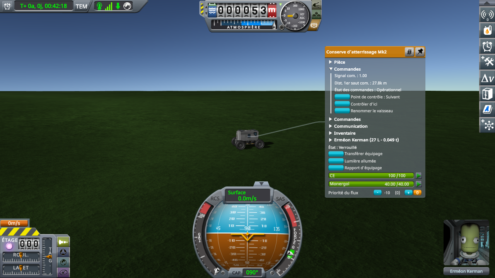
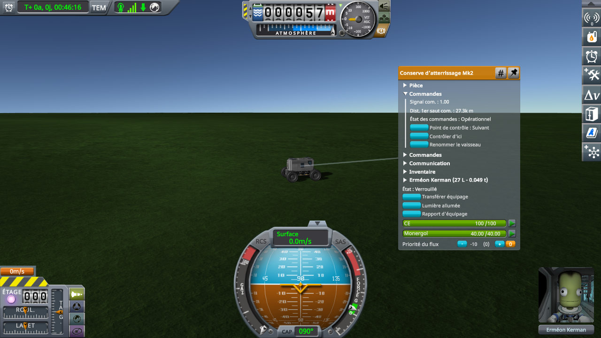

# A CommNet ground station from a planet pack

Part of [Terrain Precision Fix](../../README.md), one test of [Non-regression tests: the statics](../non-regression-statics.md).

**Status: checked, no problem — the CommNet ground station of Kourou, added by Real Solar System, is taken
out of its sphere when a craft comes within 27.5 km of it and put back without error, and CommNet keeps
linking the craft to it.** The distance of that link holds still while the craft stands, and goes down by
the distance the craft drives, across the moment this mod takes the station out.

## Why

Kopernicus lets a planet pack add statics of its own to a body: a `City2` node in the `Mods` of a body's
`PQS` builds a stock `PQSCity2` under the body's terrain sphere (`Configuration/ModLoader/City2.cs`), the
kind of static the sites of Making History are. A `City2Extended` node builds a `PQSCity2Extended`, which
overrides only `OnSetup` and `OnUpdateFinished`, both calling the stock ones first, so the patches of this
mod on the methods of `PQSCity2` run on it too.

Real Solar System adds 63 of them to Earth (`RSS_CommNet_Stations.cfg`): its CommNet ground stations, such
as Woomera, Jiuquan or Kourou, each with `commnetStation = True`. In flight, this mod takes such a static out
of its sphere as it does the KSC ([The fix: the statics](../the-fix-statics.md)): when a craft comes within
27.5 km of it, that is the largest distance at which KSP keeps a craft loaded, 22.5 km, plus 5 km for the
extent of the largest statics. It puts it back under its sphere beyond 30.25 km, 10 % farther, when the
flight scene closes, or when the body's terrain sphere is turned off.

## What a player sees of it

Nothing on screen. The model Real Solar System gives these stations, `BUILTIN/Dish` at a tenth of its size,
turns out to be a tiny part of about 6 × 7 × 6 cm, and the station of Kourou stands 0.9 m below the ground
around it. What shows it is the craft's CommNet link: in the part action window of a crewed cabin, under
*Command*, the distance of the first hop of the signal is the distance to the station, the nearest one.
That window does not refresh by itself: close it and open it again to read the distance anew.

That distance shows that CommNet still finds the station, not where the station stands: CommNet places a
ground station from the latitude, longitude and altitude it read once, when the station was created
(`CommNetHome.CreateNode`), and works out its position from them at every update of the network
(`CommNetHome.OnNetworkPreUpdate`), whatever the static it belongs to does afterwards. Where the station's own object stands is not at stake
here: no player sees it or touches it, and CommNet, the one thing it does for a player, does not use it.

## The save

[`diag/station-kourou-rss.sfs`](../../diag/station-kourou-rss.sfs): a rover on Earth, landed at latitude
5.23899°, longitude −53.01984°, facing east, 27.83 km due west of the ground station of Kourou (latitude
5.23938°, longitude −52.768487°), so a little beyond the 27.5 km at which this mod takes the station out.

It was made in four steps: a rover launched from the launch site of Kourou, which
[KSCSwitcher](https://github.com/KSP-RO/KSCSwitcher) offers with Real Solar System; moved about 28.9 km
due west with `Alt+F12 → Cheats → Set Position`; driven north, near the latitude of the station, then
east to 27.83 km; saved. Without KSCSwitcher, the KSC goes back to Cape Canaveral when the save is loaded, and the
station of Kourou is the only static near the rover.

## The protocol

KSP 1.12.5 with Harmony, ModuleManager, KSP Community Fixes 1.41.1, Kopernicus 248, Modular Flight
Integrator, KSPTextureLoader, Real Solar System 20.1.3.0 and its textures, and this mod with
`logLevel = Debug` in its settings, so that `KSP.log` shows each static it takes out of its sphere and puts
back.

1. Copy `station-kourou-rss.sfs` into the folder of a game under `saves`, and load it.
2. Open the part action window of the rover's cabin and read the distance of the first CommNet hop.
3. Drive the rover due east, a little more than 500 m, to 27.3 km of the station; by hand, or with
   [`diag/automation/run-station-approach.py`](../../diag/automation/run-station-approach.py), which
   drives it there at 2 m/s through [KSP-MCPServer](https://github.com/lhervier/KSP-MCPServer) and prints
   the length of the first hop before and after.
4. Stopped, open the part action window again and read the distance; open it once more a little later.

*What should happen.*

- When the save is loaded, `KSP.log` says nothing of the station: at 27.83 km, it stays under its sphere.
- Somewhere around 27.5 km, `KSP.log` shows it taken out:

  ```
  [TerrainPrecisionFix] [DEBUG] Earth static 'LaunchSiteTrackingStation': out of its sphere, corrected by 111.51 mm
  ```

  The name is that of every ground station of Real Solar System; Kourou is the only one within reach. The
  correction is how far the station's rounded position was from where it belongs, and changes from one
  session to the next with the floating origin: 111.51 mm and 619.24 mm in the two sessions below.
- The first hop reads 27.8 km at the start and 27.3 km at the end: it goes down by the distance driven,
  and the stopped rover reads the same distance twice.
- When the game leaves the flight, `KSP.log` shows the station put back:

  ```
  [TerrainPrecisionFix] [DEBUG] Earth static 'LaunchSiteTrackingStation': back under its sphere
  ```

| At the start, 27.8 km | At the end, 27.3 km |
|---|---|
|  |  |

## The readings

Two sessions with this mod. The distance is the one the part action window of the rover's cabin shows for
the first hop, rounded to 100 m. The station is under its sphere before the rover crosses 27.5 km, and out
of it after. Log: [`diag/runs/station-kourou-rss-fix.log`](../../diag/runs/station-kourou-rss-fix.log).

### The published save and script

[`station-kourou-rss.sfs`](../../diag/station-kourou-rss.sfs) loaded, then
[`run-station-approach.py`](../../diag/automation/run-station-approach.py) run: about 530 m driven east.
The station was taken out on the way, corrected by 111.51 mm. The floating origin shifted once on that
leg, about 30 m before the end, so while the station was out.

| Step | Station | First hop |
|---|---|---|
| Before the crossing, at the start | under its sphere | 27.8 km |
| After the crossing, at the end | out of it | 27.3 km |
| After five minutes of game time standing | out of it | 27.3 km |

### Driven in 500 m legs from 28.9 km

By the `drive_to` tool of KSP-MCPServer, the rover stopped at the end of each leg. The station was taken
out on the last leg, corrected by 619.24 mm.

| Step | Station | First hop |
|---|---|---|
| Before the crossing, stopped at the start | under its sphere | 28.9 km |
| Before the crossing, after the first leg | under its sphere | 28.4 km |
| Before the crossing, after the second leg | under its sphere | 27.8 km |
| After the crossing, after the third leg | out of it | 27.3 km |

*Not covered:* a static added by a planet pack that a player sees or touches, with a real model or
colliders, where this mod would also have to keep the static in its place: none is known so far; the
station put back beyond 30.25 km while driving away (only seen when the flight scene closes); and the
CommNet link without this mod, which this test does not need: it checks that this mod breaks nothing.
