# Kerbal Konstructs: a ground station opened in flight

Part of [Terrain Precision Fix](../../../README.md), one test of [Non-regression tests](../../non-regression.md), on [Kerbal Konstructs](../../non-regression.md#kerbal-konstructs).

**Status: checked, no problem — a CommNet ground station of Kerbal Konstructs, opened in flight beside a
craft while its static is out of its sphere, finds its body, and CommNet links the craft to it.**

## Why

A CommNet ground station is a stock component, `CommNetHome`. It finds its body once, in its `Start`, as
the `CelestialBody` among its parents, and places itself in the network from it. A static out of its
sphere has no body among its parents: this mod lends the static back to its sphere for the time of that
call ([The fix: the statics](../../the-fix-statics.md#lending-the-static-back-to-stock-code-that-expects-it-under-its-sphere)).

In stock, that call comes before this mod takes anything out. The ground stations of stock start with
their statics, while the flight scene loads; the KSC's is a component of the KSC itself, and starts
before this mod takes the KSC out, even in a game that goes from the main menu straight into flight.
With this mod at `logLevel = Debug`, KSP started, then *Training → Flight Basics* from the main menu:
`KSP.log` shows the KSC taken out of its sphere once, with no `back under its sphere` before the scene
is left, so nothing was lent back
([`diag/runs/flight-basics-fix.log`](../../../diag/runs/flight-basics-fix.log)).

[Kerbal Konstructs](https://github.com/KSP-RO/Kerbal-Konstructs) adds ground stations of its own, later.
Each group of its statics hangs from a stock `PQSCity` of its own, which this mod takes out of its sphere
in flight, near a craft, like the KSC. In a career, a static of Kerbal Konstructs can be a ground station,
closed until the player pays to open it; that can be done in flight, from the window a click on the
static opens. Kerbal Konstructs then adds a `CommNetHome` to the static
(`ConnectionManager.AttachGroundStation`, in `Modules/RemoteNet/ConnectionManager.cs`), whose `Start`
runs at the next frame: in flight, near the craft, while the group is out of its sphere. That is the case
this test plays.

## What a player sees of it

The craft's CommNet link. In the part action window of a crewed cabin, under *Command*, the first hop of
the signal goes to the nearest ground station, with its distance. That window does not refresh by itself:
close it and open it again to read it anew. On the launchpad, the first hop goes to the KSC; once a
station of Kerbal Konstructs is open a few tens of metres away, it goes to that station.

## The save

[`diag/kk-ground-station.sfs`](../../../diag/kk-ground-station.sfs): a career game, a Mk1 pod on the
launchpad of the KSC. CommNet is on, and so is *Enable CommNet GroundStations*, in the difficulty options
of Kerbal Konstructs, off by default: without it, Kerbal Konstructs adds no ground station. In the same
options, *Open everything* is off: it would open every station at once. The other options are left as
they come.

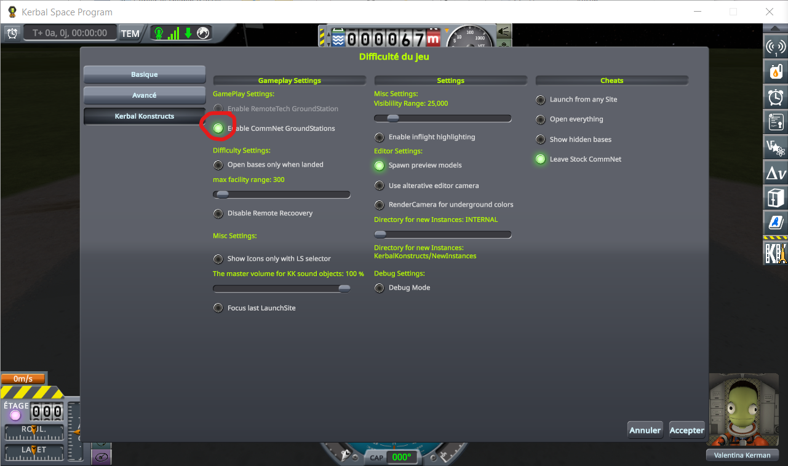

## The protocol

KSP 1.12.5 with Harmony, ModuleManager, KSP Community Fixes 1.41.1,
[Kerbal Konstructs](https://github.com/KSP-RO/Kerbal-Konstructs) 1.12.3 and CustomPreLaunchChecks 1.8.1,
which it requires, and this mod with `logLevel = Debug` in its settings, so that `KSP.log` shows each
static it takes out of its sphere and puts back.

1. Copy `kk-ground-station.sfs` into the folder of a game under `saves`, and load it.
2. Open the part action window of the pod and read the first hop of the signal: the KSC.
3. Open the statics editor of Kerbal Konstructs (`Ctrl+K`). Under *Edit Groups*, *Spawn new Group*
   creates `NewGroup` at the pod and opens its group editor: *Save&Close*. *Set Active Group*: choose
   `Kerbin:NewGroup`, then *OK*.
4. Under *Spawn New*, choose `KSC_WaterTower`, in the *Tanks* category: it appears on the pod, and its
   instance editor opens.
5. In the instance editor, *Facility Type: None* opens the facility editor. Choose *GroundStation*, set
   *Open Cost* to 1000, leave *Default State* on *Closed*, set *Antenna Range* to 1 (any value but 0),
   then *Save Facility*.
6. In the instance editor, move the water tower 31 m aside (*Left / Right*), then *Save&Close*. In the
   statics editor, *Save*, then close it.
7. Click the water tower: the facility manager of Kerbal Konstructs opens. Click *Open for 1000 funds*,
   then close the window.
8. Close the part action window of the pod, open it again, and read the first hop.

*What should happen.*

- At the click on *Open*, `KSP.log` shows Kerbal Konstructs adding the station, then, in the same
  moment, this mod lending the group back to its sphere and taking it out again:

  ```
  KK: [ConnectionManager] AddCommNetStation: Adding Groundstation: NewGroup
  [TerrainPrecisionFix] [DEBUG] Kerbin static 'NewGroup': back under its sphere
  [TerrainPrecisionFix] [DEBUG] Kerbin static 'NewGroup': out of its sphere, corrected by 28.92 mm
  ```

  The static named is the `PQSCity` of the group, named after it. The correction is how far the group's
  rounded position was from where it belongs, and changes from one session to the next.
- No exception follows in `KSP.log`.
- The first hop goes from the KSC, a few hundred metres away, to the new station, at the distance of the
  water tower.

<details>
<summary>The station made step by step, in pictures</summary>

| Step 3: a new group at the pod | Step 3: the group made active |
|---|---|
| 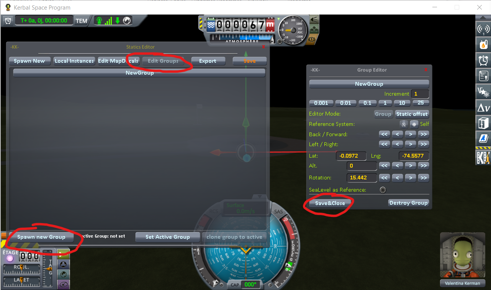 | 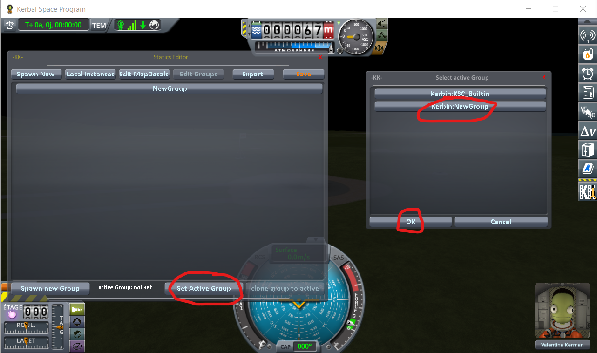 |

| Step 4: the water tower spawned | Step 5: the type of facility |
|---|---|
| 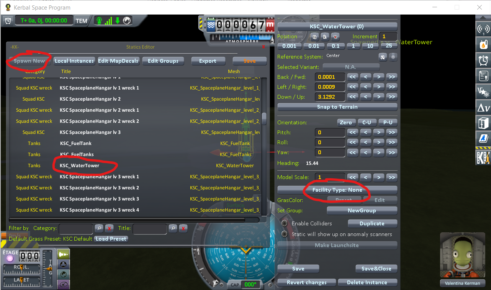 | 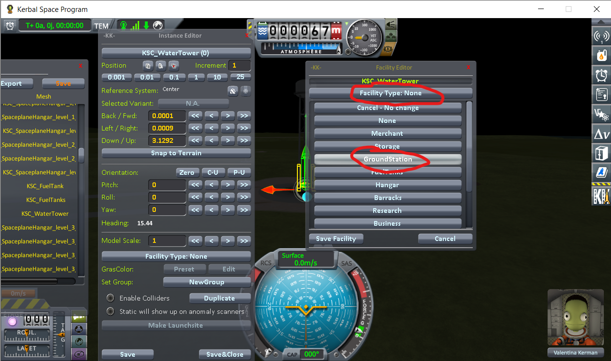 |

| Step 5: the ground station set up | Step 6: moved aside |
|---|---|
| 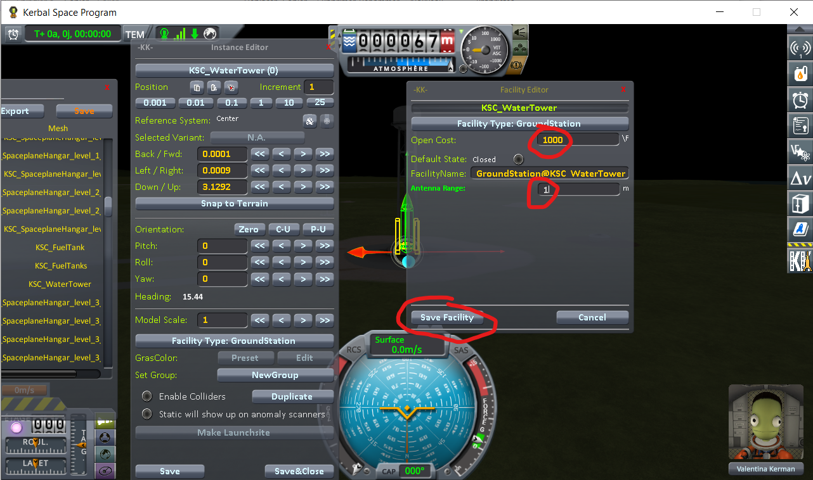 | 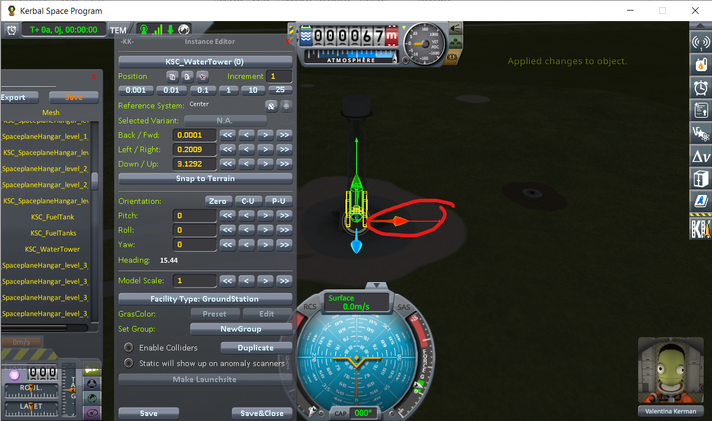 |

| Step 6: 31 m aside, saved | Step 6: the statics editor saved and closed |
|---|---|
| 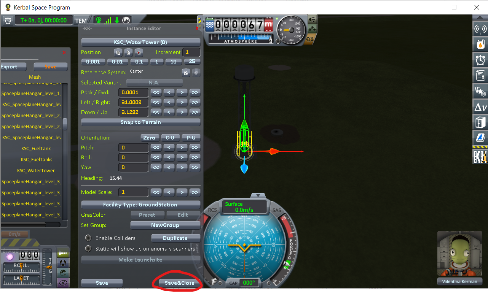 | 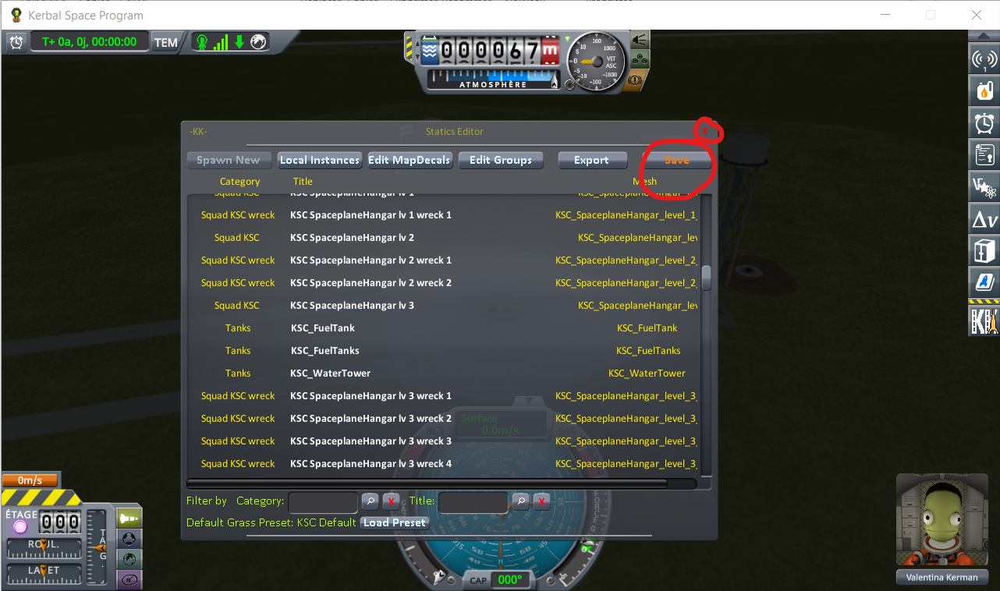 |

| Step 7: the facility manager | Step 7: the station open |
|---|---|
| 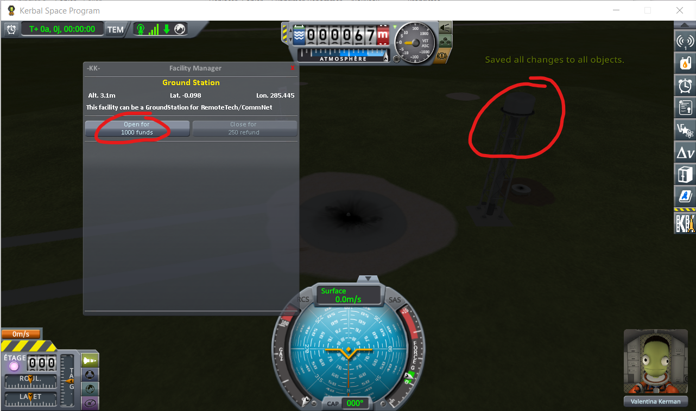 | 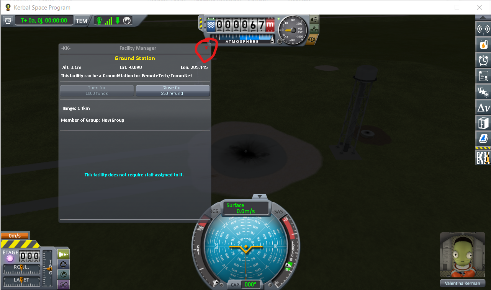 |

</details>

## The readings

Played as above from the published save, with this mod. The distance is the one the part action window
of the pod shows for the first hop. Log:
[`diag/runs/kk-ground-station-fix.log`](../../../diag/runs/kk-ground-station-fix.log); earlier in the
same session, it also holds a first run of the same steps, whose lines are the same.

| Step | First hop |
|---|---|
| Before the station is opened (step 2) | 447 m |
| Once it is open (step 8) | 30.9 m |

| Before, step 2 | After, step 8 |
|---|---|
| 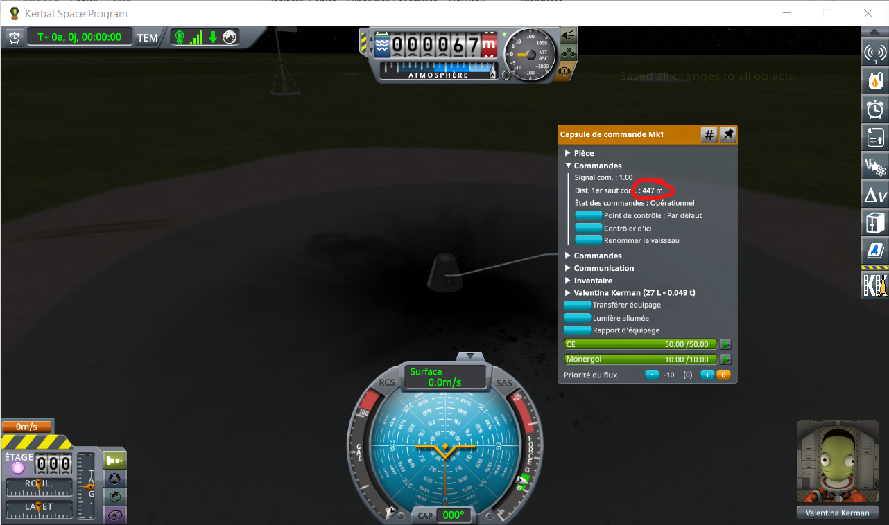 | 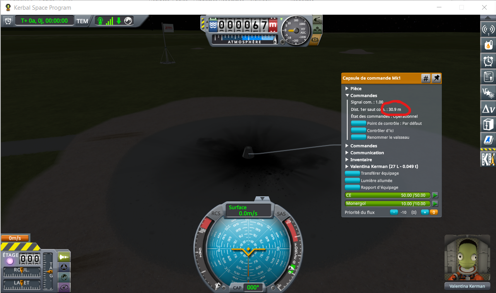 |

At the click on *Open*, the log shows the three lines above, within the same millisecond, and no
exception after them.
</content>
</invoke>
