# Real Solar System: the runway fix

Part of [Terrain Precision Fix](../../../README.md), one test of [Non-regression tests](../../non-regression.md), on [Real Solar System](../../non-regression.md#real-solar-system).

**Status: checked on Earth — with this mod, a craft finds the runway of the KSC where it is drawn, with
no step on it, and the runway no longer moves when the floating origin does; so neither half of Real
Solar System's runway fix has anything left to correct for this defect.** The runway is a static, placed like the buildings of the KSC
([The culprit: the statics](../../the-culprit-statics.md)), and this mod places it in double while a
craft is near ([The fix: the statics](../../the-fix-statics.md)).

## What Real Solar System does

Real Solar System ships a component of its own for the runway of the KSC, `RSSRunwayFix`
([its source, release 20.1.3.0](https://github.com/KSP-RO/RealSolarSystem/blob/v20.1.3.0/Source/RSSRunwayFix.cs)).
It does two things:

- **It turns off the colliders of the runway's sections.** Stock builds the runway in sections, each
  with a deck and a collider of its own, and gives the whole runway one more collider, `runway_collider`,
  in one piece (`RunwayCollisionHandler`). Once the sections are loaded, Real Solar System turns their
  colliders off, and leaves `runway_collider` alone to hold a craft.
- **It holds the floating origin while a craft rolls on the runway.** While the active craft is landed
  or in prelaunch, and a ray cast down from it hits `runway_collider`, it raises the distance at which
  KSP moves the floating origin back onto the craft to 2,700 m, and calls
  `FloatingOrigin.SetSafeToEngage(false)` every 25 physics frames: the origin does not move.

No setting turns either half off.

## What the runway does without it

The decks and colliders of the runway are separate objects hanging from the KSC, and each is placed
through a float `Transform` at planet scale, so each is rounded on its own — on Earth, by up to a float
step of 500 mm at that distance from the centre. Each is rounded twice, too: once where the game draws
it, once where the physics places it, two computations of the same position that do not round the same
way. Both change at every load. Depending on the load, a craft on the runway then finds:

- **the runway it touches above or below the runway it sees**: it rests in the air above the deck, or
  with its wheels sunk into it;
- **a step between the colliders of two sections**, which a wheel climbs;
- **a step between the decks of two sections** whose colliders line up: seen, not felt.

Turning the sections' colliders off removes the step a wheel climbs: only `runway_collider` is left, in
one piece. It cannot bring that piece back to the deck the game draws, nor line the decks up.

## Seeing it

In KSP 1.12.5 with Harmony, ModuleManager, KSP Community Fixes 1.41.1 and
[Real Solar System](https://github.com/KSP-RO/RealSolarSystem) 20.1.3.0 with what it requires (Kopernicus
248, Modular Flight Integrator, KSPTextureLoader, the RSS textures).
[KSP Diag - Colliders](https://github.com/lhervier/KSP-Diag-Colliders) draws the
colliders around the active craft where the physics places them, each in a colour of its own, and lists
them by name. The craft is the rover of KSP Diag - Terrain Height,
[`Diag2-Rover.craft`](https://github.com/lhervier/KSP-Diag-TerrainHeight/blob/main/craft/Diag2-Rover.craft),
launched from the SPH onto the runway at Cape Canaveral.

To see the runway without the runway fix, Real Solar System is built from the sources of its release
20.1.3.0 with `RSSRunwayFix` kept from doing anything: it returns at the top of its `Start`, so it
leaves the sections as stock does, never touches the floating origin, and never holds it. The version
of the assembly is set to that of the release
([`rss-20.1.3-without-its-runway-fix.diff`](https://github.com/lhervier/KSP-Diag-TerrainHeight/blob/main/diag/rss-20.1.3-without-its-runway-fix.diff)).
In every session below, the colliders of the sections were on at every load.

**Real Solar System as released, without this mod.** The rover, launched from the SPH, rests in the air
above the deck, `runway_collider` being the only collider left under it.

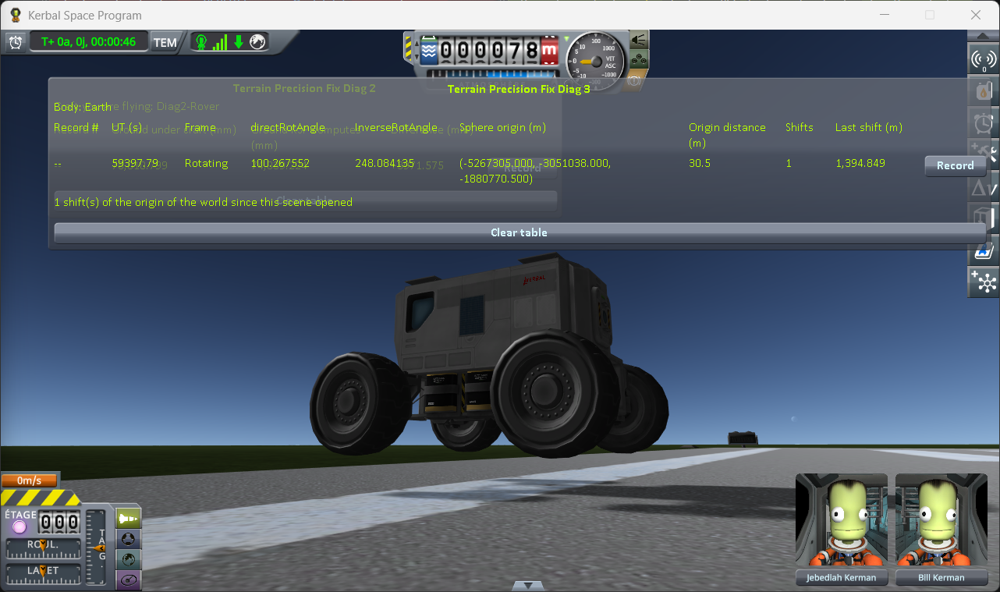

*Real Solar System as released, without this mod: the rover 46 seconds after its launch from the SPH.*

**Without the runway fix, without this mod.** One session, the rover launched from the SPH several
times, and reloaded many times between, until each case showed; 23 entries in flight, logged in
[`runway-earth-rss-without-runway-fix.log`](../../../diag/non-regression/real-solar-system/the-runway-fix/runway-earth-rss-without-runway-fix.log).
The views from below the deck were taken with the flight camera moved under it.

*Sunk into the deck.* One load, the rover just launched:

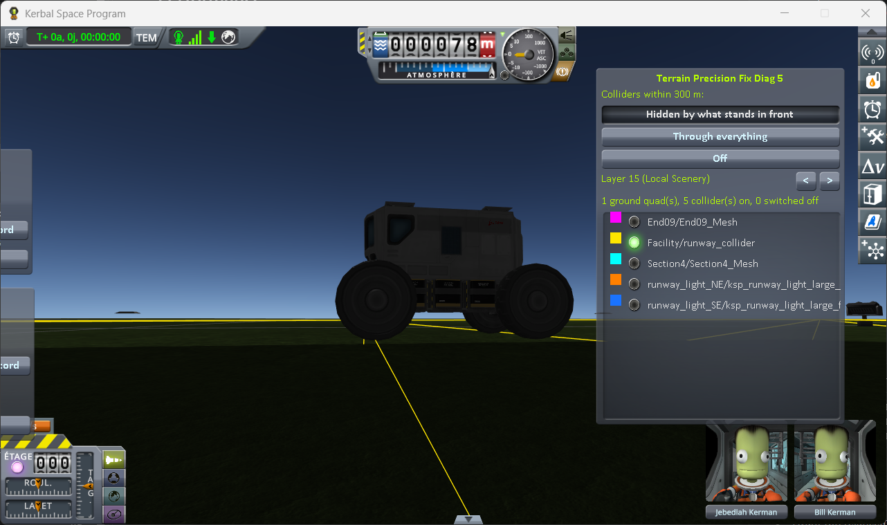

*Without the runway fix, without this mod, Diag Colliders: the rover just launched, seen from beside it with
the camera below the deck, `runway_collider` (yellow) alone drawn.*

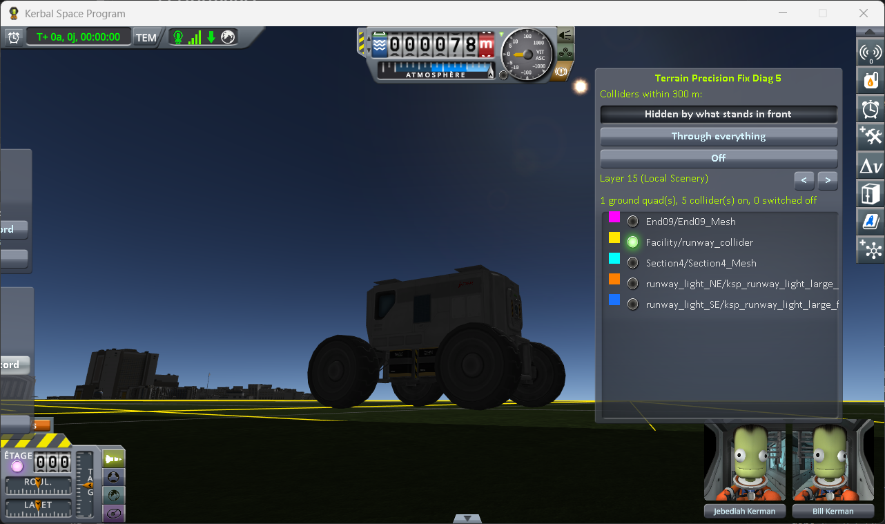

*The same, seen from three quarters behind.*

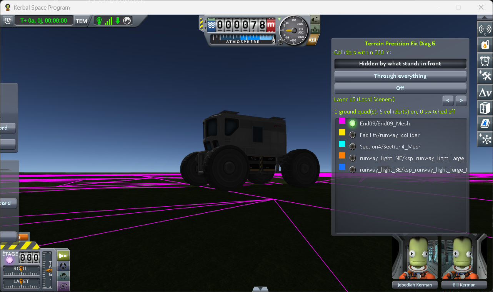

*The same, `End09_Mesh` (magenta), the end of the runway, alone drawn.*

*A step a wheel climbs.* The same load, the rover driven from the end of the runway onto its fourth
section:

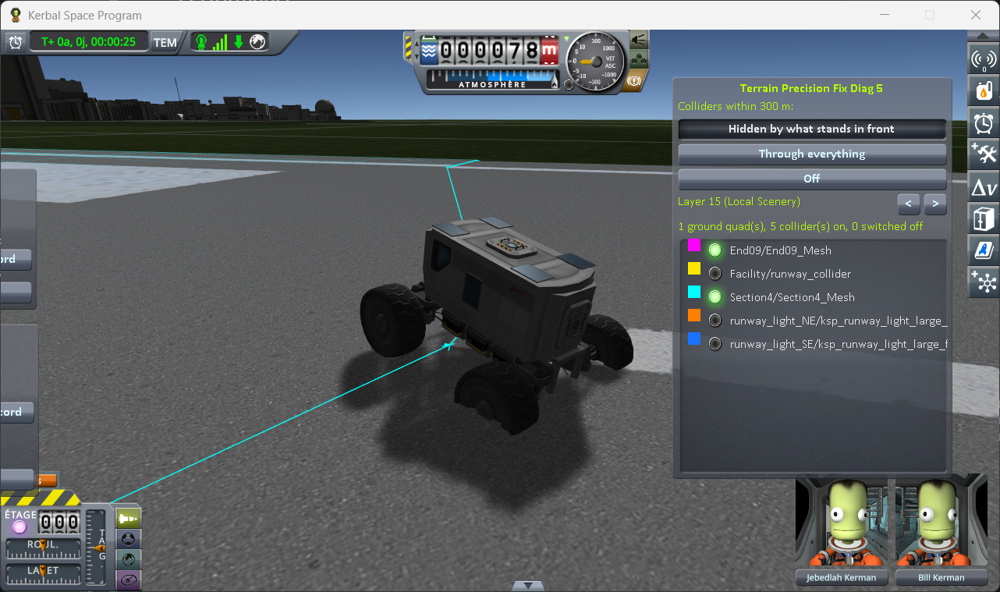

*The same load, the rover at the edge of the fourth section, `End09_Mesh` (magenta) and
`Section4_Mesh` (cyan) drawn.*

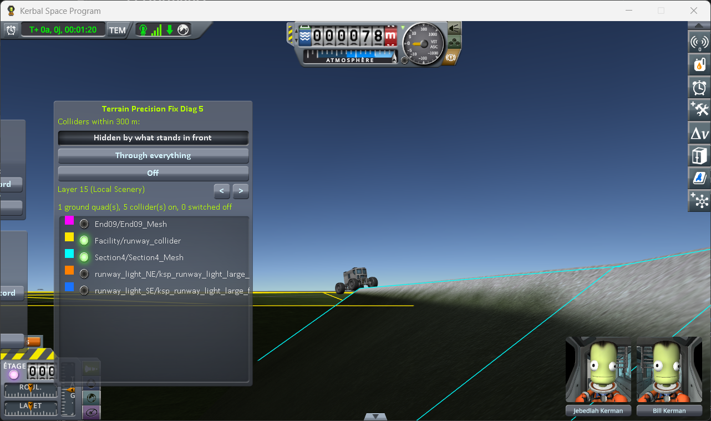

*The same, from below the deck, `runway_collider` (yellow) and `Section4_Mesh` (cyan) drawn.*

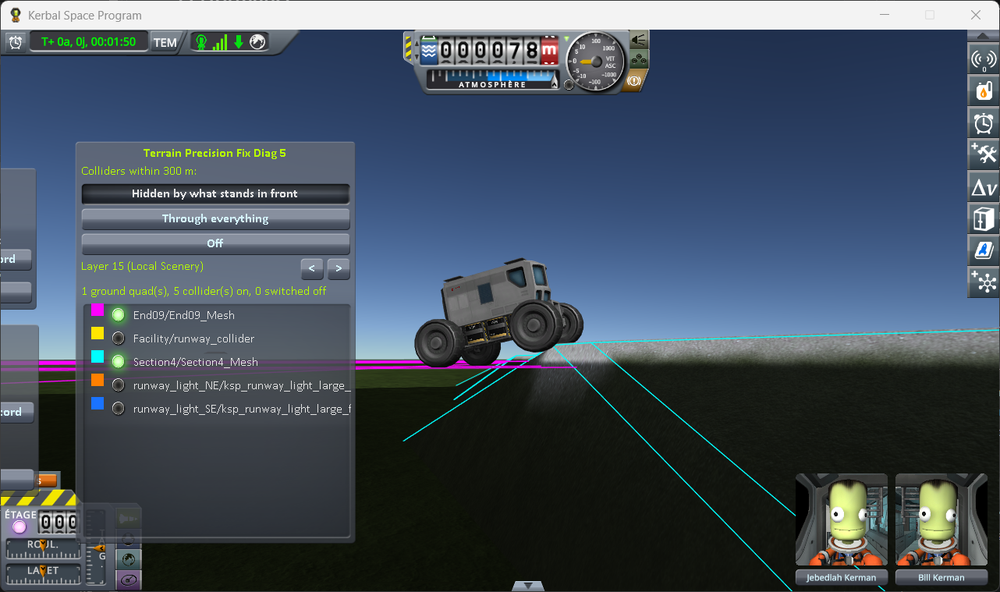

*The same, the rover driven onto the fourth section, `End09_Mesh` (magenta) and `Section4_Mesh` (cyan)
drawn.*

*In the air above the deck.* Another load, the rover just launched:

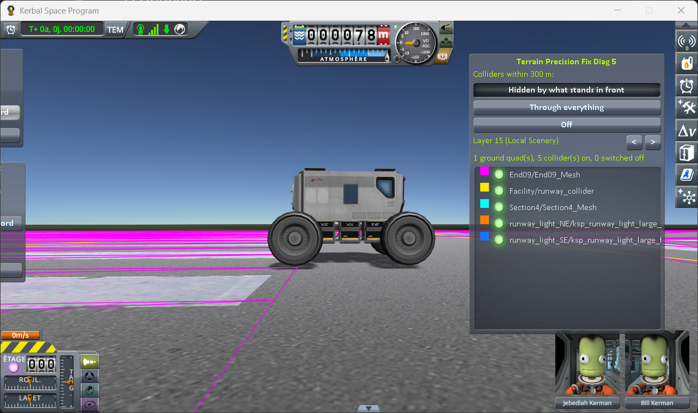

*Without the runway fix, without this mod, Diag Colliders: the rover just launched, seen from beside it, every
collider drawn.*

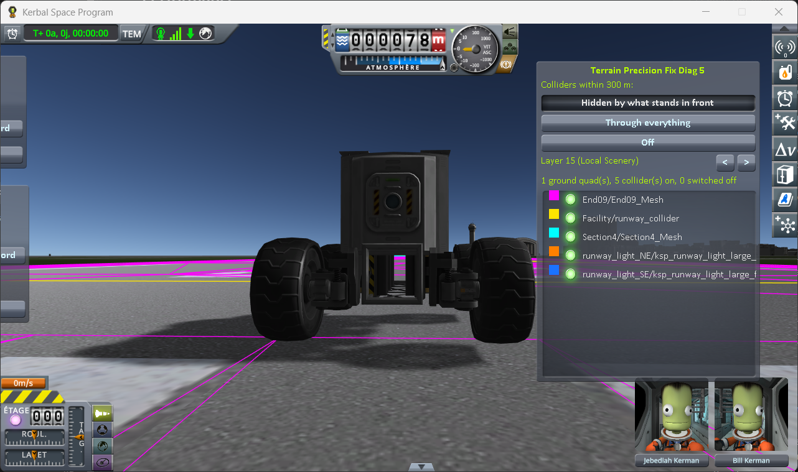

*The same, from the front.*

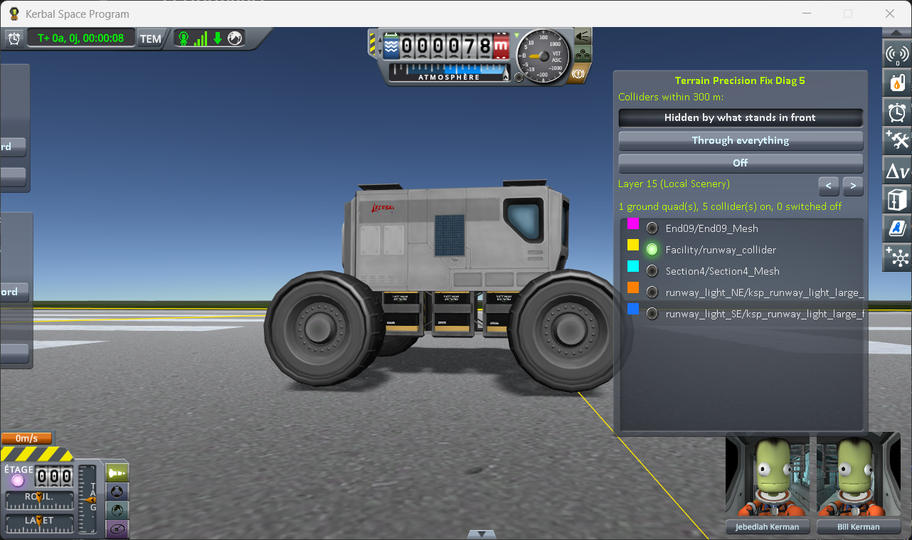

*The same, from beside it, `runway_collider` (yellow) alone drawn.*

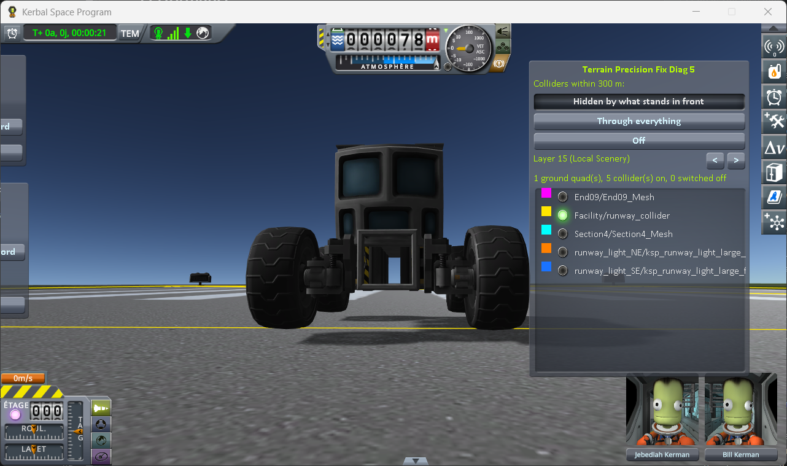

*The same, from the front.*

*A step only seen.* The same load, the rover driven to the fourth section:

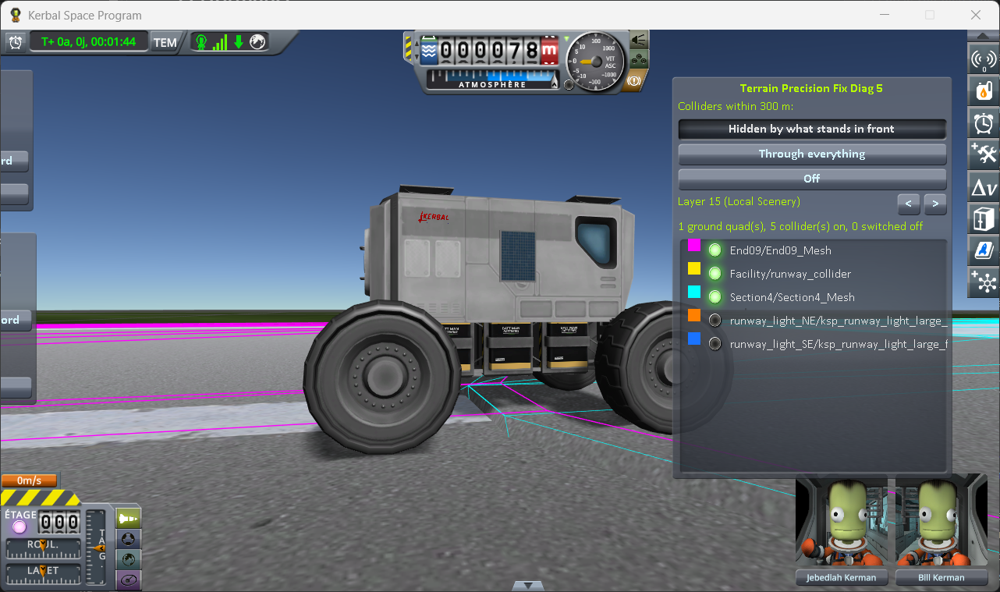

*The same load, the rover at the edge of the fourth section, `End09_Mesh` (magenta), `runway_collider`
(yellow) and `Section4_Mesh` (cyan) drawn.*

**Without the runway fix, with this mod**, at its defaults with `logLevel = Debug`. One session, logged
in
[`runway-earth-rss-without-runway-fix-fix.log`](../../../diag/non-regression/real-solar-system/the-runway-fix/runway-earth-rss-without-runway-fix-fix.log):

1. Launch the rover from the SPH, and save (F5); load that save five times (F9).
2. Drive the rover to just before the fourth section, drawn in cyan by Diag Colliders; stop, and save.
3. Load that save ten times. At each load, look at the wheels from beside the rover, then drive onto
   the fourth section, watching the navball for a jolt.
4. Recover the rover, launch it again from the SPH, and do 2 and 3 again; then a third time.

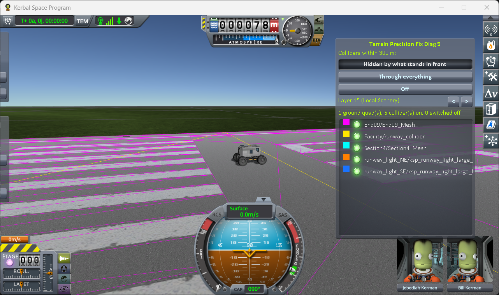

*Without the runway fix, with this mod, Diag Colliders: step 1, the rover just launched, every collider drawn.*

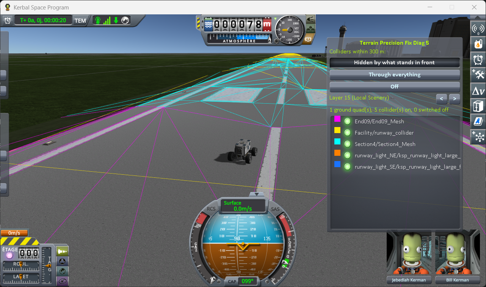

*The same: step 2, the rover stopped just before the fourth section.*

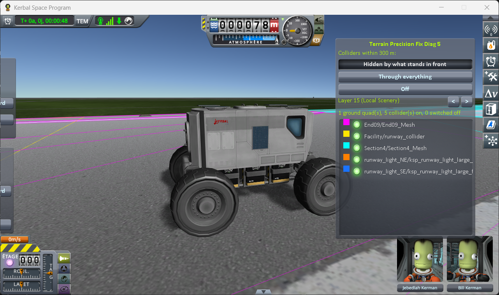

*The same: step 3, the wheels seen from beside the rover.*

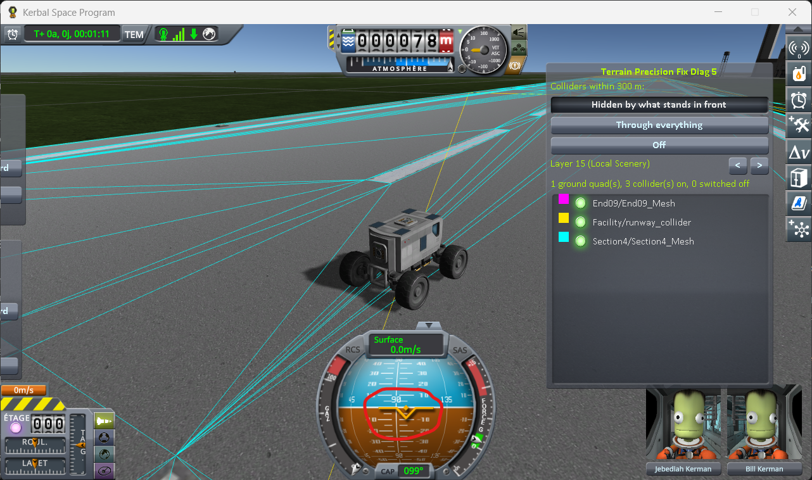

*The same: step 3, the rover driven onto the fourth section; the navball shows no jolt.*

At every load, the wheels stood on the deck, the colliders lay on the deck, and the rover drove onto
the fourth section without a jolt and without a step to see. The log shows the KSC taken out of its
sphere at each of the 37 entries in flight, corrected by 68 mm to 1.54 m depending on the load.

## What the results show

**Without this mod, the runway is not where it is drawn, and not in the same place twice.** As
released, with only `runway_collider` left, a craft can still rest in the air above the deck; without
the runway fix, it can also rest sunk into it, climb a step between two sections, or roll past a step
it only sees. The runway fix removes the one step a wheel can climb, the only part of the defect it
can reach.

**With this mod, the runway is where it is drawn, in one piece.** The KSC and everything under it are
placed in double while a craft is near, so what the game draws and what the physics touches come from
the same position, and the sections line up. For this defect, the half of the runway fix that turns the
sections' colliders off has nothing left to correct. It may have other uses, outside the scope of this
fix.

**The hold on the floating origin: with this mod, a move of the origin moves nothing.** A rover alone by
the runway, Real Solar System built without its runway fix, reads a spot on the deck and a spot on the
grass beside it just before and just after each move of the origin, two moves a run, with the protocol
of the runway and the grass while the world moves of KSP Diag - Terrain Height. Without this mod, the
deck moves by −231.84 and +33.84 mm, together with the grass: what the runway fix holds the origin
against. With this mod, the deck moves by 0.034 mm at most, and the grass by 0.119 mm, within the spread
of the lines taken at the same spot. The readings are in
[Checking the culprit: driving on while the world moves](../../checking-the-culprit-driving.md#on-earth).
For this defect, the hold has nothing left to correct either.
