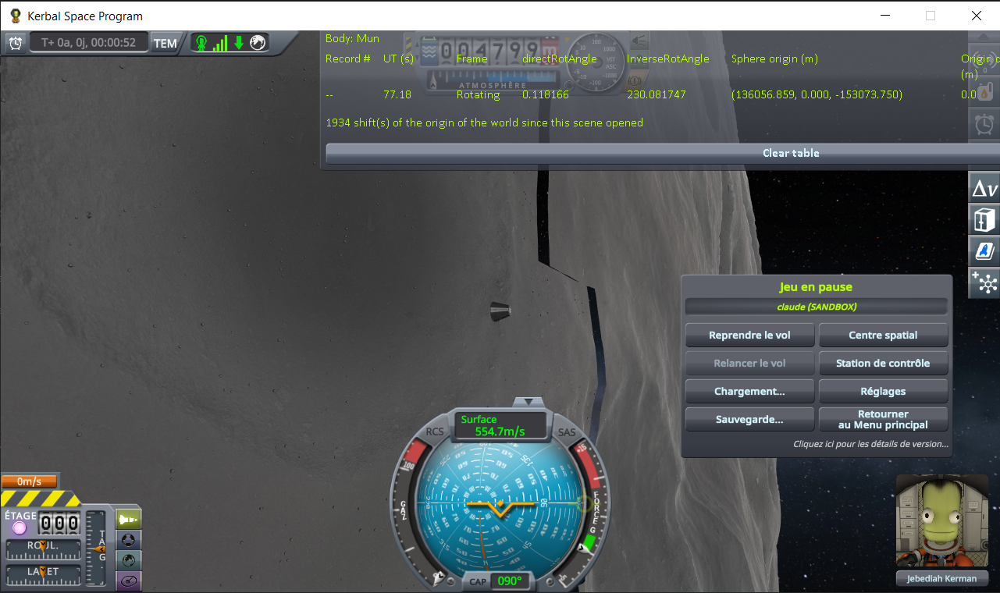

# A static turning with its body

Part of [Terrain Precision Fix](../../../README.md), one test of [Non-regression tests](../../non-regression.md), on [stock](../../non-regression.md#stock).

**Status: cannot happen on stock, in Real Solar System or with Outer Planets Mod.**

*Why.* Low over a body, KSP turns the world around the craft, and the body stays still in the game's
world (`OrbitPhysicsManager.checkReferenceFrame`). Above an altitude set for each body, KSP turns the body instead.
A static under its sphere turns with it on its own; a static this mod has taken out of its sphere does
not, and this mod has to turn it
([Keeping a static out of its sphere in place](../../the-fix-statics.md#keeping-a-static-out-of-its-sphere-in-place)).
If it failed to, the static would slide over the ground, by some 9 m every second at the Mun's equator.

*When it could be tested.* Two conditions at once: a static out of its sphere, so within 27.5 km of the
craft, where this mod takes it out, and no farther than 30.25 km, where it puts it back
([The fix: the statics](../../the-fix-statics.md)); and the craft above the altitude where KSP turns the
body. A test needs a body that KSP turns from less than 30 km up.

*The readings.* That altitude was read body by body, without this mod, with
[KSP Diag - Floating Origin](https://github.com/lhervier/KSP-Diag-FloatingOrigin), whose *Frame* column
says whether KSP turns the world (*Rotating*) or the body (*Inertial*): a craft is put in a circular
equatorial orbit with `Alt+F12 → Cheats → Set Orbit`, first above the body's relief and the top of its
atmosphere, then twice as high until the frame is inertial, never past the body's sphere of influence,
then halving the interval down to 500 m. The script
[`run-rotation-threshold.py`](../../../diag/automation/run-rotation-threshold.py) plays these steps through
[KSP-MCPServer](https://github.com/lhervier/KSP-MCPServer); what it printed is in
[`rotation-thresholds.txt`](../../../diag/non-regression/stock/a-static-turning-with-its-body/rotation-thresholds.txt). Stock, then Real Solar System
20.1.3.0, then Outer Planets Mod 2.2.12:

- **no body turns lower than 100 km.** Every solid body without an atmosphere that was read turns from
  100 km; Earth in Real Solar System from 145 km;
- **a body with an atmosphere never turns below its top**: KSP does not let that altitude go lower
  (`CelestialBody.SetupConstants`). Venus, Mars, Titan, Triton and Pluto in Real Solar System were already
  inertial 2 km above it;
- **the smallest moons never turn while a craft is around them**: on Phobos and Deimos in Real Solar
  System, Hale and Ovok in Outer Planets Mod, the world still turns at the edge of their sphere of
  influence, past which the craft is around their planet.

Real Solar System loads asteroids from farther away than stock, craft by craft (its
`Harmony/Vessel.cs`); the ranges every other craft gets, which this mod reads, stay as they are.

<details>
<summary>The readings, body by body</summary>

| system | body | KSP turns the body from |
|---|---|---|
| stock | the Mun | between 99.92 and 100.00 km |
| stock | Minmus | between 99.80 and 100.20 km |
| stock | Gilly | between 99.84 and 100.00 km |
| stock | Moho, Ike, Dres, Tylo, Vall, Bop, Pol, Eeloo | above 30 km: still rotating there, one reading each |
| stock | Kerbin, Eve, Duna, Laythe | not read: at least the top of their atmosphere |
| Real Solar System | the Moon, Mercury, Vesta | between 99.84 and 100.31 km |
| Real Solar System | Ceres, Io, Europa, Ganymede, Callisto, Mimas, Enceladus, Tethys, Dione, Rhea, Iapetus, Miranda, Ariel, Umbriel, Titania, Oberon, Charon | between 99.69 and 100.00 km |
| Real Solar System | Earth | between 144.77 and 145.05 km |
| Real Solar System | Venus | between 145 km, the top of its atmosphere, and 147 km |
| Real Solar System | Mars | between 125 km, the top of its atmosphere, and 127 km |
| Real Solar System | Titan | between 600 km, the top of its atmosphere, and 602 km |
| Real Solar System | Triton, Pluto | between 110 km, the top of their atmosphere, and 112 km |
| Real Solar System | Phobos, Deimos | never: still rotating at 38 km, the edge of their sphere of influence is 39.5 to 39.8 km up |
| Outer Planets Mod | Slate, Eeloo, Wal, Nissee, Plock, Karen | between 99.69 and 100.00 km |
| Outer Planets Mod | Polta, Priax | between 99.61 and 100.00 km |
| Outer Planets Mod | Tekto | between 99.65 and 100.03 km, above its 95 km of atmosphere |
| Outer Planets Mod | Thatmo | between 99.73 and 100.02 km |
| Outer Planets Mod | Tal | between 99.69 and 100.16 km |
| Outer Planets Mod | Hale | never: still rotating at 33 km, the edge of its sphere of influence is 35 km up |
| Outer Planets Mod | Ovok | never: still rotating at 65 km, the edge of its sphere of influence is 68 km up |

The gas giants and the Sun, where nothing stands, were not read.

</details>

*Why that altitude is so high.* It has to be: KSP never turns the terrain quads of the highest level.
It keeps them out of the sphere, as this mod does with a static, and only ever moves them along
(`PQ.FastUpdateSubQuadsPosition`), or places them again without touching how they are turned (`PQ.PreciseUpdateSubQuadsPosition`). Were KSP to turn
the body while they are there, they would stay as they were while the rest of the body turned, and the
ground would tear apart. KSP keeps the world turning with the body as long as the craft is low enough
for them to exist. A body set to turn lower is therefore no way to test this mod: stock breaks first.
Kopernicus can set that altitude for a body; with it installed, this ModuleManager patch makes KSP turn
the Mun from 5 km up:

```
@Kopernicus:AFTER[Kopernicus]
{
	@Body[Mun]
	{
		@Properties
		{
			inverseRotThresholdAltitude = 5000
		}
	}
}
```



*KSP 1.12.5 with Harmony, ModuleManager, KSP Community Fixes 1.41.1, Kopernicus 248 and the patch above,
KSP Diag - Floating Origin at the top, without this mod: a craft moved from orbit to orbit of the Mun
with Set Orbit, 8, 5.2 and 5.05 km up for a few seconds each, where KSP turns the Mun, then 4.95 and
4.8 km up, where it turns the world again; the game paused at 4.8 km.*
