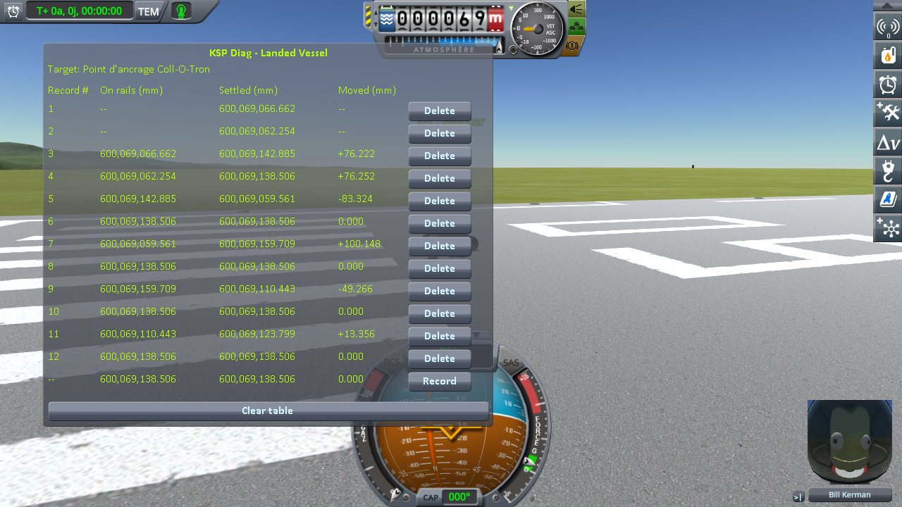
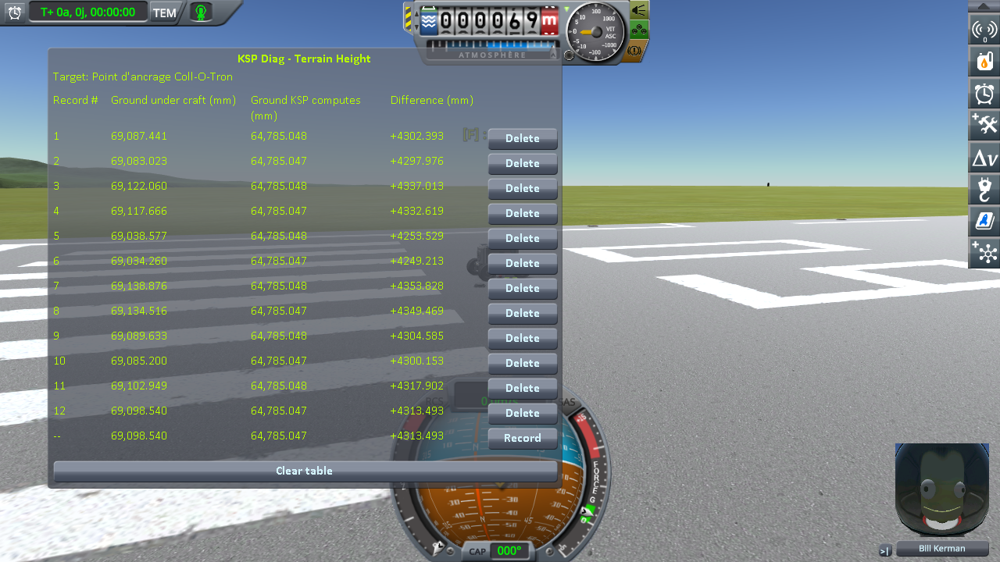
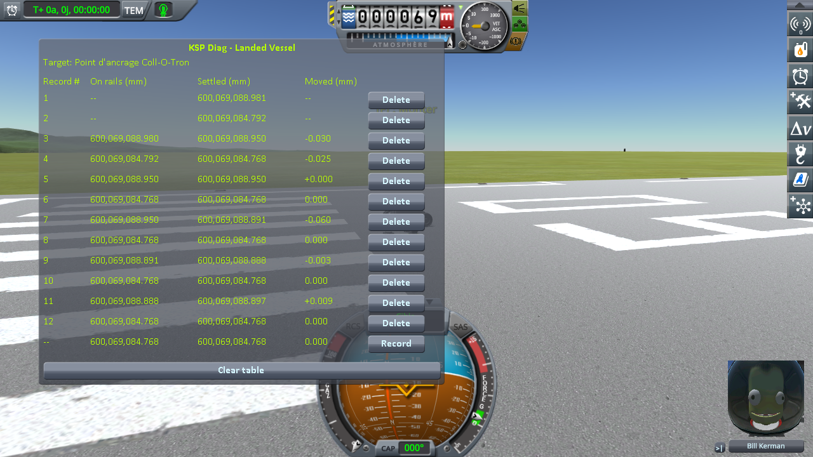
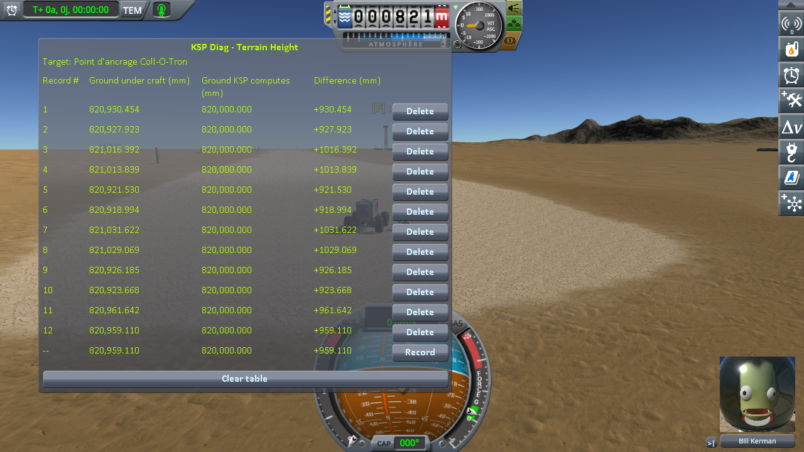
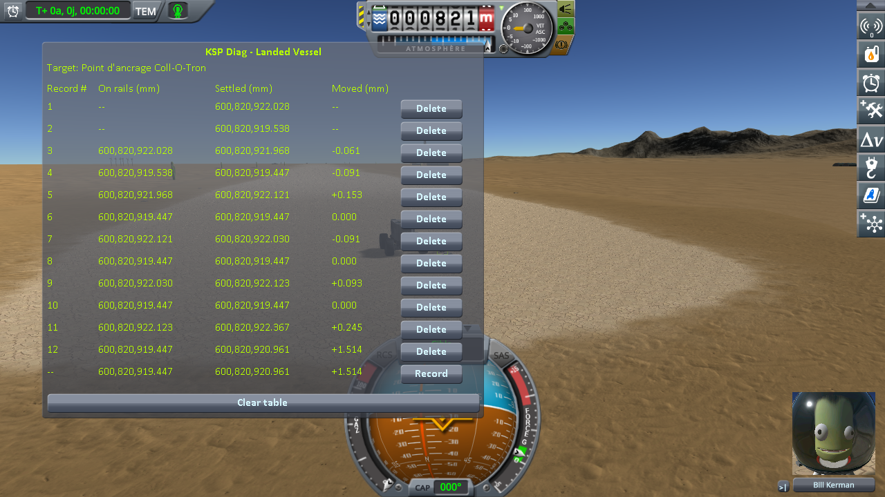
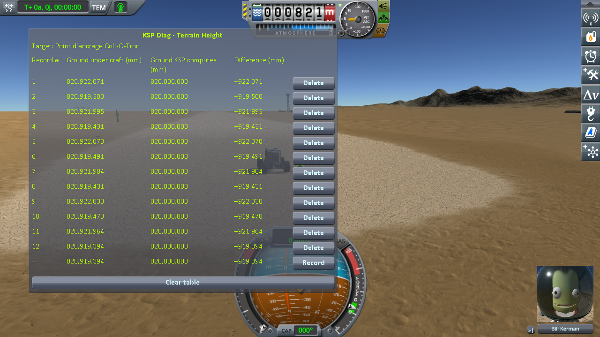

# An anchor on a static

Part of [Terrain Precision Fix](../../../README.md), one test of [Non-regression tests](../../non-regression.md), on [stock](../../non-regression.md#stock).

**Status: checked on Kerbin, on the runway of the KSC and on the runway of the Desert Airfield.** An anchor
placed alone, and an anchor with a battery on it, on each runway: with this mod, both stay within 0.15 mm
of the runway, as placed and over five loads, but for one load on the Desert Airfield, 1.6 mm. Without
it, the runway comes back up to 110 mm apart from load to load, and the anchor with a battery, which KSP
leaves where it was saved, ends up to 116 mm above it.

*Why.* KSP rivets an anchor to whatever it rests on, a static as well as the terrain: it freezes the anchor
where it stands. [The fix of the ground anchor](../../the-fix-ground-anchor.md) loads an anchored vessel
where it was saved, which only holds if what it stands on comes back where it was too. On a runway, that is
a static, which this mod takes out of its terrain sphere in flight
([The fix: the statics](../../the-fix-statics.md)). The statics come in two kinds, placed by stock code of
their own: the KSC is a `PQSCity`, and the launch sites of Making History, the Desert Airfield among them,
are `PQSCity2`. The test checks one runway of each.

## The test

A new sandbox game, with
[`diag/craft/Diag3-Rover-Two-Anchors.craft`](../../../diag/craft/Diag3-Rover-Two-Anchors.craft) in its
`Ships/SPH` folder: the rover of [anchoring a base](../../checking-the-culprit-anchoring.md), with two ground
anchors in the inventory of its cabin. It is launched from the Space Plane Hangar onto the runway of the
KSC, Bill Kerman alone aboard, his inventory emptied in the crew panel of the editor: with his parachute and
his jetpack in it, there is no room left for an anchor. Its brakes are put on. Then, by hand:

1. Bill goes on EVA and takes the two anchors out of the cabin's inventory;
2. in EVA construction, he places the first anchor on the runway, alone, then the second, and attaches one
   of the rover's batteries on top of it; wait until the screws have gone in, and leave EVA construction;
3. set the anchor alone as target, *Record* in both instruments; then the same for the anchor with the
   battery;
4. quicksave, quickload, and the readings of step 3; five times.

Then the same in another sandbox game, the rover launched onto the runway of the Desert Airfield.

Two instruments take the readings, as in [anchoring a base](../../checking-the-culprit-anchoring.md): both
read the target. [KSP Diag - Landed Vessel](https://github.com/lhervier/KSP-Diag-LandedVessel) reads
*Settled*, the distance from the centre of the body to the anchor's origin once physics runs, and *Moved*,
how far physics took it from where the load put it. [KSP Diag - Terrain Height](https://github.com/lhervier/KSP-Diag-TerrainHeight)
reads *Ground under craft*, the collider the anchor rests on: here the runway. The height of the anchor
above the runway, in the tables below, is *Settled*, less the radius of Kerbin, 600,000,000 mm, less
*Ground under craft*.

KSP 1.12.5 with Harmony, ModuleManager, KSP Community Fixes 1.41.1, the two instruments, and this mod with
its defaults at `logLevel = Debug`. Then the same without this mod.

*Played by a script.* The anchors are placed by hand; [KSP-MCPServer](https://github.com/lhervier/KSP-MCPServer)
plays the rest. It launches the rover, Bill aboard with his inventory emptied, through its tool
`launch_vessel`; once the anchors are placed, [`diag/automation/run-anchor-on-a-static.py`](../../../diag/automation/run-anchor-on-a-static.py)
takes the readings, quicksaves and quickloads. Every step is one a player can take: the test plays just as
well by hand.

## The result

Heights in mm. Each table of the instruments holds twelve records: the anchor alone, then the anchor with
the battery, as placed, then at each load.

### The runway of the KSC

| | | anchor alone above the runway | anchor with a battery above the runway | *Moved*, with a battery | *Ground under craft*, under it |
|---|---|---|---|---|---|
| **without this mod** | placed | −20.779 | −20.769 | | 69,083.023 |
| | 1st load | +20.824 | +20.840 | +76.252 | 69,117.666 |
| | 2nd load | +20.984 | **+104.246** | 0.000 | 69,034.260 |
| | 3rd load | +20.833 | +3.989 | 0.000 | 69,134.516 |
| | 4th load | +20.810 | +53.306 | 0.000 | 69,085.200 |
| | 5th load | +20.850 | +39.966 | 0.000 | 69,098.540 |
| **with this mod** | placed | +0.122 | +0.149 | | 69,084.643 |
| | 1st load | −0.142 | −0.099 | −0.025 | 69,084.866 |
| | 2nd load | +0.058 | +0.026 | 0.000 | 69,084.741 |
| | 3rd load | −0.020 | +0.069 | 0.000 | 69,084.698 |
| | 4th load | −0.062 | +0.031 | 0.000 | 69,084.737 |
| | 5th load | −0.039 | +0.066 | 0.000 | 69,084.702 |

*Ground KSP computes* reads 64,785.047 mm under the anchors: the runway stands 4.3 m above it.

| | KSP Diag - Landed Vessel | KSP Diag - Terrain Height |
|---|---|---|
| **without this mod** |  |  |
| **with this mod** |  |  |

### The runway of the Desert Airfield

| | | anchor alone above the runway | anchor with a battery above the runway | *Moved*, with a battery | *Ground under craft*, under it |
|---|---|---|---|---|---|
| **without this mod** | placed | −20.787 | −20.777 | | 820,927.923 |
| | 1st load | +20.769 | +20.740 | +127.433 | 821,013.839 |
| | 2nd load | +20.834 | **+115.585** | 0.000 | 820,918.994 |
| | 3rd load | +20.871 | +5.510 | 0.000 | 821,029.069 |
| | 4th load | +20.861 | **+110.911** | 0.000 | 820,923.668 |
| | 5th load | +20.795 | +75.469 | 0.000 | 820,959.110 |
| **with this mod** | placed | −0.042 | +0.039 | | 820,919.500 |
| | 1st load | −0.028 | +0.016 | −0.091 | 820,919.431 |
| | 2nd load | +0.051 | −0.044 | 0.000 | 820,919.491 |
| | 3rd load | +0.046 | +0.017 | 0.000 | 820,919.431 |
| | 4th load | +0.084 | −0.023 | 0.000 | 820,919.470 |
| | 5th load | +0.403 | +1.568 | +1.514 | 820,919.394 |

*Ground KSP computes* reads 820,000.000 mm under the anchors: the runway stands 0.9 m above it.

| | KSP Diag - Landed Vessel | KSP Diag - Terrain Height |
|---|---|---|
| **without this mod** |  |  |
| **with this mod** |  |  |

### The log

Without this mod, `KSP.log` holds a `Moving Vessel` line of `Vessel.CheckGroundCollision` for the anchor
alone at each load, and for the anchor with the battery at the first load only. With this mod, after each
arrival, it shows the static taken out of its sphere (`static 'KSC': out of its sphere`,
`static 'Desert_Airfield': out of its sphere`), and the line of this mod for each anchor at each load,
loaded at its saved altitude, *which stock would have raised by 0.0 mm*: both runways stand above the
height KSP computes, which never raises the anchors here.

At each load, `ModuleCargoPart` logs each anchor riveting to the ground, with its speed. It reads less than
10⁻¹² m/s at every load of this test, but one: at the fifth load on the Desert Airfield with this mod,
0.002 and 0.004 m/s, the load at which the anchor with the battery came back 1.5 mm higher.

The logs, what the script printed and every reading of the instruments are in
[`diag/runs/`](../../../diag/README.md#the-anchor-on-a-static-protocol).

## What the results say

**Without this mod, the base stands on a runway that moves under it.** The runway, a static, comes back
100 mm apart over the loads at the KSC, and 110 mm on the Desert Airfield: the culprit of
[the statics](../../the-culprit-statics.md). KSP puts the anchor alone back on it at every load, 20.8 mm
above it, the anchor's own culprit ([the anchor's model](../../the-culprit-ground-anchor.md#the-anchors-model)).
The anchor with the battery, a vessel of two parts, it puts back at its first load only: then it leaves it
where it was saved, *Moved* at zero, and the runway comes back elsewhere under it: 4 to 104 mm below it at
the KSC, 6 to 116 mm on the Desert Airfield.

**With this mod, the anchors stay where they were placed, on both kinds of statics.** The runway comes back
within 0.22 mm at the KSC and 0.11 mm on the Desert Airfield, and the anchors, alone or with the battery,
within 0.15 mm of it, as placed and at every load. Once, at the fifth load on the Desert Airfield, the anchor
with the battery came back 1.5 mm higher, riveted while still moving, the anchor alone 0.4 mm.
