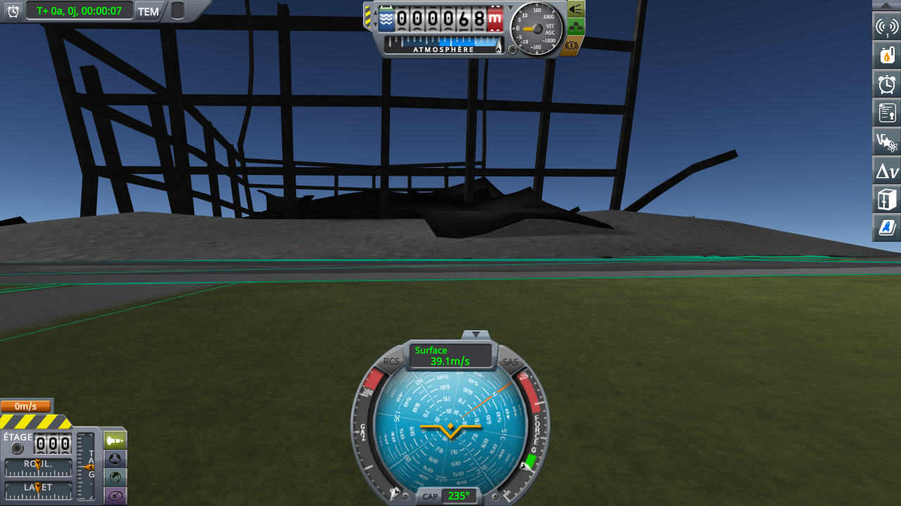
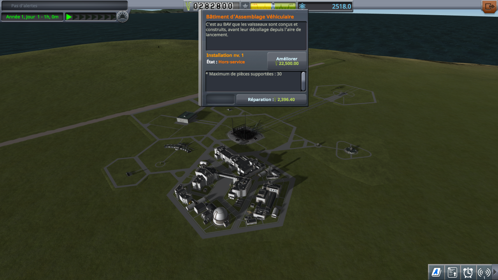
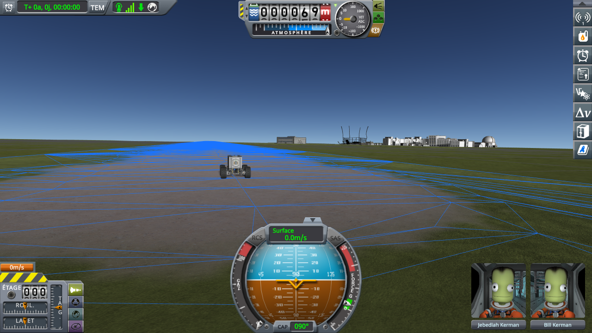
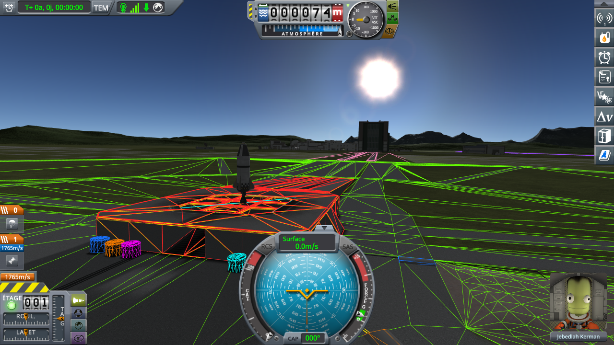

# Destroyed buildings

Part of [Terrain Precision Fix](../../../README.md), one test of [Non-regression tests](../../non-regression.md), on [stock](../../non-regression.md#stock).

**Status: checked on Kerbin.** The VAB, brought down in flight while this mod has the KSC out of its terrain
sphere, collapses, shows as destroyed at the space centre, stays in ruins in the next flights, and stands
again once repaired, as without this mod. Through it all, the launchpad and the runway stay within 0.2 mm;
without this mod, the launchpad moves by 53 mm.

*Why.* KSP finds a destructible building of the KSC by its path from the `SpaceCenter` object of the KSC down
to it (`HierarchyUtil.CompileID`), and saves its state under that path. This mod changes the parent of the
KSC in flight, not what hangs below it ([The fix: the statics](../../the-fix-statics.md)). The test checks
that nothing else depends on where the KSC hangs: a building hit while the KSC is out of its sphere, its
collapse cut short by the KSC going back under it, and its state carried to the space centre, through a
quickload, and through its repairs.

## The test

A new career at the Custom difficulty: the largest starting funds and science (500 000 and 5 000); funds
penalties at 10 %, for the upgrades below; *Bypass Entry Purchase After Research* on; and the largest
building impact damage multiplier, 1: at the Normal difficulty, the drop below does not bring the VAB down.
The Research and Development upgraded twice, to its last level, and the nodes the craft below need
researched; the launchpad upgraded once, to its second level, the first that takes 54 t. That career, before
the upgrade of the launchpad, is [`career-with-the-parts.sfs`](../../../diag/non-regression/stock/destroyed-buildings/career-with-the-parts.sfs):
copied as `persistent.sfs` into a new folder of `saves`, it opens at the space centre. Then:

1. the menu of the VAB, at the space centre: no repairs needed;
2. [`VAB-Dropper.craft`](../../../diag/non-regression/stock/destroyed-buildings/VAB-Dropper.craft), a probe on three full Rockomax X200-32
   tanks, launched from the VAB onto the launchpad, then moved 350 m above the terrain over the middle of
   the roof of the VAB (`Alt+F12 → Cheats → Set Position`, latitude −0.0964, longitude −74.6237): it falls
   onto the roof. A second after the impact, the VAB collapsing, *Revert to Launch*;
3. the same drop, the VAB left to collapse; then the space centre, and the menu of the VAB;
4. the VAB being out of use, the Space Plane Hangar entered through its building, and
   [`Diag3-Rover.craft`](https://github.com/lhervier/KSP-Diag-FloatingOrigin/blob/main/craft/Diag3-Rover.craft)
   launched onto the runway, its brakes put on at once; a quicksave (F5), then a quickload of it (F9);
   *Recover*;
5. the VAB repaired from its menu (*Repair*), the VAB entered through its building, and
   [`Diag3-Rocket.craft`](https://github.com/lhervier/KSP-Diag-FloatingOrigin/blob/main/craft/Diag3-Rocket.craft)
   launched onto the launchpad.

At each arrival, once the craft has settled,
[KSP Diag - Colliders](https://github.com/lhervier/KSP-Diag-Colliders) logs the colliders under it (its
button *Log the colliders under each craft*): the launchpad's or the runway's, with its height above the
terrain the game computes there. A screenshot looks towards the VAB: from the launchpad, 650 m to the west,
or from the runway, 1 km to the south-east.

KSP 1.12.5 with Harmony, ModuleManager, KSP Community Fixes 1.41.1, KSP Diag - Colliders, and this mod
with its defaults at `logLevel = Debug`. Then the same without this mod.

*Played by a script.* [KSP-MCPServer](https://github.com/lhervier/KSP-MCPServer) plays the test through
[`diag/automation/run-destroyed-buildings.py`](../../../diag/automation/run-destroyed-buildings.py), the two
rockets in the `Ships/VAB` folder of the game and the rover in its `Ships/SPH` folder: it starts and sets up the career itself from the main
menu, and closes the guide of a new career wherever it shows. Every step is one a player can take: the
test plays just as well by hand.

## The result

The VAB collapses at the first drop, with this mod as without it. In the log with this mod, the KSC is out
of its sphere when the dropper hits it, and goes back under it for *Revert to Launch*, while the VAB is
still collapsing. Stripped of the rest:

```
[TerrainPrecisionFix] [DEBUG] Kerbin static 'KSC': out of its sphere, corrected by 10.92 mm
Rockomax32.BW Exploded!! - blast awesomeness: 0.5
[TerrainPrecisionFix] [DEBUG] Kerbin static 'KSC': back under its sphere
[HighLogic]: =========================== Scene Change : From FLIGHT to FLIGHT =====================
```

Back on the launchpad, the VAB stands again, both ways: a *Revert to Launch* made while it collapses puts
it back. The second drop brings it down for good, the KSC out of its sphere again:



At the space centre, its menu asks for its repairs, 2 396 funds at these funds penalties, both ways:



From the runway, the next flight shows the VAB in ruins, and so does the quickload; once repaired, it
stands again, both ways:





The height of the facility under the craft, lowest and highest over its arrivals: three on the launchpad
(the dropper at its launch and after the revert, the rocket from the repaired VAB), two on the runway (the rover, then its quickload):

| | without this mod | with this mod |
|---|---|---|
| launchpad | 4 909.820 to 4 962.602 mm (52.782 mm) | 4 954.392 to 4 954.529 mm (0.137 mm) |
| runway | 4 095.323 to 4 101.326 mm (6.003 mm) | 4 063.931 to 4 064.102 mm (0.171 mm) |

The logs with this mod show no error that the logs without it do not show.

The logs, what the script printed and every reading of KSP Diag - Colliders, for both sessions, are in
[`diag/non-regression/stock/destroyed-buildings/`](../../../diag/README.md#the-destroyed-buildings-protocol).
