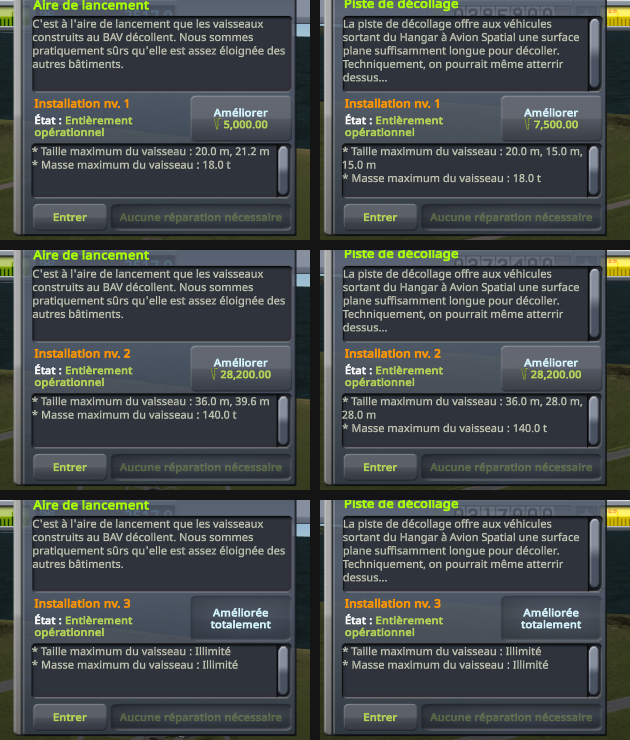

# Facility levels

Part of [Terrain Precision Fix](../../../README.md), one test of [Non-regression tests](../../non-regression.md), on [stock](../../non-regression.md#stock).

**Status: checked on Kerbin.** At each of their three levels, a craft launched onto the launchpad stands on
the launchpad of that level, and one launched onto the runway on the runway of that level, as without this
mod. With it, each stays within 0.25 mm through its arrivals; without it, they move by up to 145 mm.

*Why.* KSP finds an upgradeable facility by its path below the KSC, as it does a destructible building, and
builds each level by replacing the model of the facility below the KSC, which this mod moves out of its
terrain sphere in flight ([The fix: the statics](../../the-fix-statics.md)). The levels have models of their
own, colliders included, at heights of their own: the test checks that each level comes in place, and that
the craft arrives on it where it did, level by level.

## The test

A new career at the Custom difficulty: the largest starting funds and science (500 000 and 5 000), funds
penalties at 10 %, for the upgrades below, and *Bypass Entry Purchase After Research* on. The Research and
Development upgraded twice, to its last level, and the nodes the craft below need researched. That career is
[`diag/career-with-the-parts.sfs`](../../../diag/career-with-the-parts.sfs): copied as `persistent.sfs` into
a new folder of `saves`, it opens at the space centre. Its building impact damage multiplier is at 1, the
largest, for [Destroyed buildings](destroyed-buildings.md); it changes nothing here. Then, at each level of
the launchpad and the runway, starting from the first, the one a new career starts with:

1. the menus of the launchpad and the runway, opened for their level;
2. the Vehicle Assembly Building entered through its building, and
   [`Diag3-Rocket.craft`](https://github.com/lhervier/KSP-Diag-FloatingOrigin/blob/main/craft/Diag3-Rocket.craft)
   launched onto the launchpad; *Revert to Launch*, twice; a quicksave (F5), then a quickload of it (F9);
   *Recover*;
3. the Space Plane Hangar entered through its building, and
   [`Diag3-Rover.craft`](https://github.com/lhervier/KSP-Diag-FloatingOrigin/blob/main/craft/Diag3-Rover.craft)
   launched onto the runway, its brakes put on at once, and again after each revert; the same reverts,
   quicksave and quickload; *Recover*;
4. the launchpad and the runway upgraded from their menus (*Upgrade*), for the next level.

That makes four arrivals on each of the three launchpads and the three runways. At each one, once the
craft has settled, [KSP Diag - Colliders](https://github.com/lhervier/KSP-Diag-Colliders) logs the
colliders under it (its button *Log the colliders under each craft*): the facility's, with its height above
the terrain the game computes there.

KSP 1.12.5 with Harmony, ModuleManager, KSP Community Fixes 1.41.1, KSP Diag - Colliders, and this mod
with its defaults at `logLevel = Debug`. Then the same without this mod.

*Played by a script.* [KSP-MCPServer](https://github.com/lhervier/KSP-MCPServer) plays the test through
[`diag/automation/run-facility-levels.py`](../../../diag/automation/run-facility-levels.py), the rocket in the
`Ships/VAB` folder of the game and the rover in its `Ships/SPH` folder: it starts and sets up the career
itself from the main menu, and closes the guide of a new career wherever it shows. Every step is one a
player can take: the test plays just as well by hand.

## The result

The menus show each facility at each level, with this mod as without it (launchpad on the left, runway on
the right):

At each level, the collider under the craft is the one of the model of that level, the same with this mod
and without it: `LP_lev2/collider`, `LP_lev3 1/LP_barsAlpha` and `launchpad/Launch Pad` for the launchpad,
`Facility/runway_lev1_v2`, then `Facility/runway_collider` for the runway (at its two last levels, the end of
the runway, `End09`, lies under the rover too).

The height of the facility under the craft, lowest and highest over its arrivals:

| | without this mod | with this mod |
|---|---|---|
| launchpad, level 1 | 2 695.250 to 2 717.082 mm (21.832 mm) | 2 747.132 to 2 747.212 mm (0.080 mm) |
| launchpad, level 2 | 4 894.831 to 5 039.569 mm (144.738 mm) | 4 954.407 to 4 954.445 mm (0.038 mm) |
| launchpad, level 3 | 7 619.376 to 7 664.255 mm (44.878 mm) | 7 628.951 to 7 629.070 mm (0.119 mm) |
| runway, level 1 | 4 060.587 to 4 180.585 mm (119.998 mm) | 4 064.050 to 4 064.212 mm (0.162 mm) |
| runway, level 2 | 4 113.730 to 4 175.263 mm (61.534 mm) | 4 116.592 to 4 116.831 mm (0.239 mm) |
| runway, level 3 | 4 283.828 to 4 363.766 mm (79.938 mm) | 4 300.969 to 4 301.201 mm (0.233 mm) |

Before every exit from the flight, the log with this mod shows the KSC put back under its sphere, and
after every arrival, taken out again: 24 times each. The logs with this mod show no error that the logs
without it do not show.

The logs, what the script printed and every reading of KSP Diag - Colliders, for both sessions, are in
[`diag/runs/`](../../../diag/README.md#the-facility-levels-protocol).
