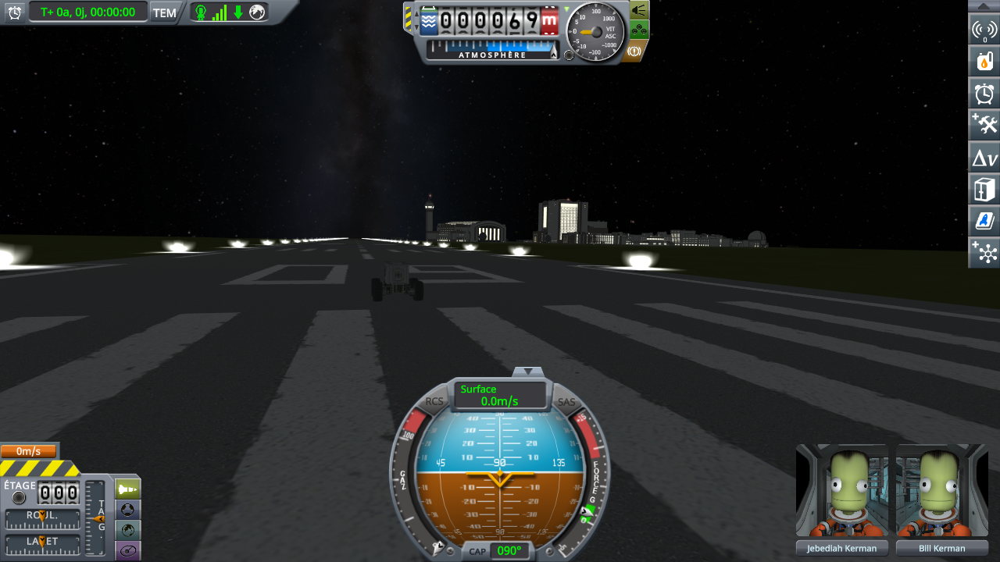
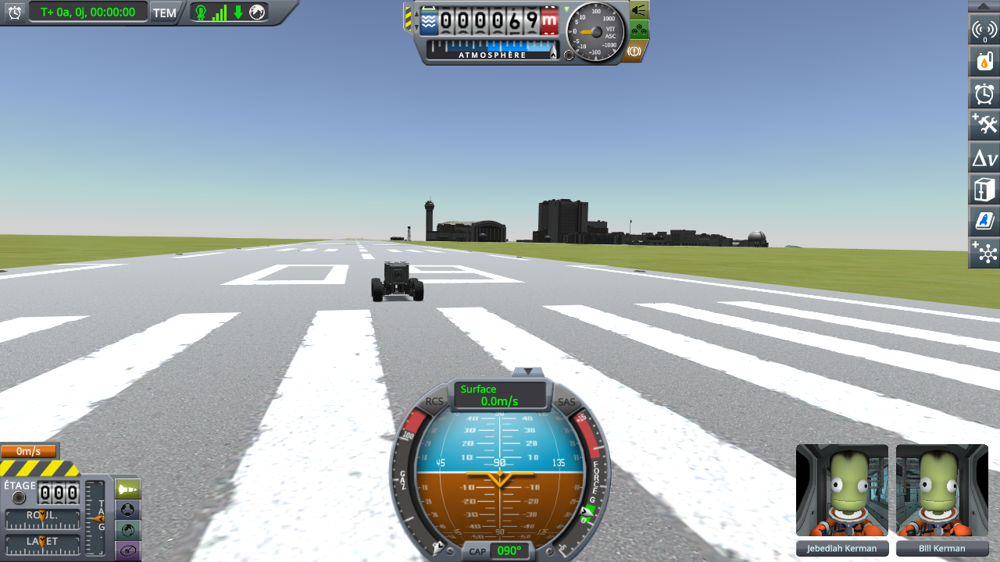

# The lights of the KSC

Part of [Terrain Precision Fix](../../../README.md), one test of [Non-regression tests](../../non-regression.md), on [stock](../../non-regression.md#stock).

**Status: checked on Kerbin.** In flight, the KSC out of its sphere, the lights of the runway and the
windows of the buildings come on at night and go off by day, as without this mod.

*Why.* The lights of the KSC are switched on and off by a component of their own,
`DayNightGameObjectSwitch`, which finds its body among the parents of its first object, once, in its
`Setup`, then reads the time of day where it stands every ten seconds. Out of its sphere, the KSC has no
body among its parents, so this mod lends it back to stock for the time of that `Setup`
([Lending the static back to stock code that expects it under its sphere](../../the-fix-statics.md#lending-the-static-back-to-stock-code-that-expects-it-under-its-sphere)).
Read in the code, the switches of the KSC are set up as the flight scene loads, before this mod takes the
KSC out; the patch covers a switch set up later. The test checks what a player sees: a night and a day
at the KSC while it is out of its sphere.

## The test

The test of [Time warp](time-warp.md), which ends with a night and a day: a rover on the runway, three
days of time warp at the highest rate, then *Warp To* the night at the KSC, nine tenths into its day, and
*Warp To* the next noon. A screenshot after each *Warp To*, twelve seconds later, once the switches have
read the time; it looks along the runway, the VAB 1 km to the south-east, with KSP Diag - Colliders
drawing nothing (its mode *Off*).

KSP 1.12.5 with Harmony, ModuleManager, KSP Community Fixes 1.41.1, KSP Diag - Colliders, and this mod
with its defaults at `logLevel = Debug`. Then the same without this mod.

*Played by a script*, the one of [Time warp](time-warp.md):
[`diag/automation/run-time-warp.py`](../../../diag/automation/run-time-warp.py).

## The result

At night, with this mod, the KSC out of its sphere since the rover arrived on the runway: the lights along
the runway are on, and so are the windows of the VAB and of the buildings beside it.

At noon, they are off:

Without this mod, the same screenshots show the same lights on at night and off at noon.

The logs, what the script printed and every reading of KSP Diag - Colliders, for both sessions, are in
[`diag/runs/`](../../../diag/README.md#the-time-warp-protocol).
