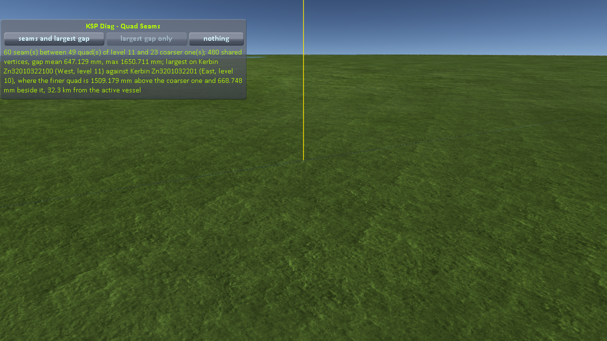
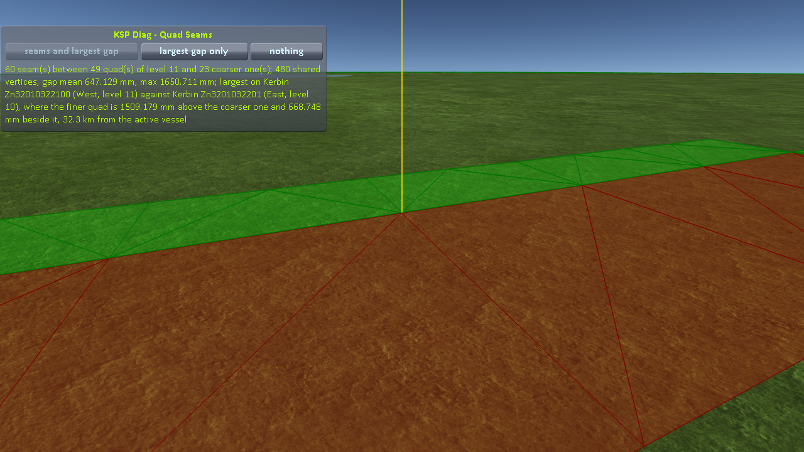
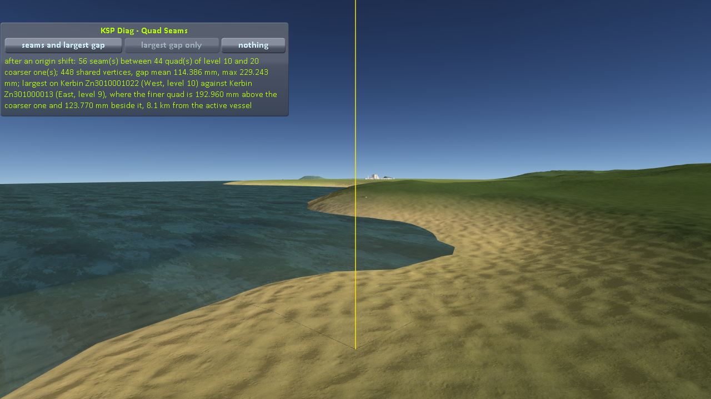
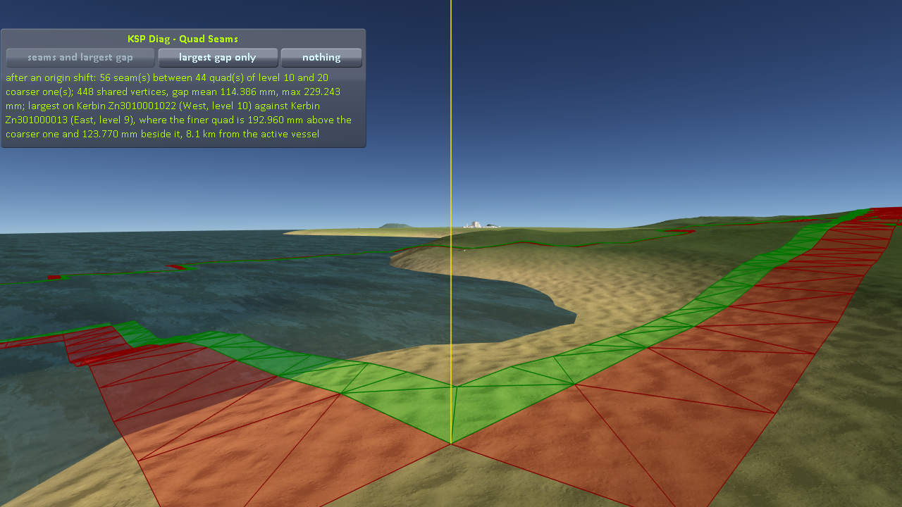
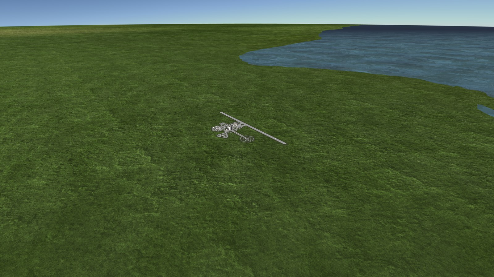

# The seam between subdivision levels

Part of [Terrain Precision Fix](../../README.md), one test of [Non-regression tests: the ground](../non-regression-ground.md).

**Status: checked on Earth under Real Solar System and on Kerbin, no problem of its own — this mod does
not open the seam, but widens a stock crack.** Where a quad of the highest subdivision level meets a
coarser one, the vertices the two are supposed to share are already apart in stock, by up to two and a
half metres on Earth and a third of a metre on Kerbin, and the crack along the seam can be seen. This
mod corrects the finer side only, and the gap gets wider: for the median of the largest gap of a load,
about 1.9 m instead of 1.3 m on Earth, about 225 mm instead of 157 mm on Kerbin. Visual only, since the
coarser quads have no collider. A separate mod could close it, in stock and with this one (see
[A possible solution](#a-possible-solution)).

## What goes wrong

The quads of the highest subdivision level cover the ground around the craft, and they are the only
ones this fix corrects (see [Only where a craft can stand](../the-fix-ground.md#only-where-a-craft-can-stand)).
Further away, the terrain is made of coarser quads, which stock builds and places as it always has.
Where the two meet, the edge of the finer quad is meant to run along the edge of the coarser one (see
[How stock joins two levels](#how-stock-joins-two-levels)).

It does not quite: the vertices the two quads share are not at the same place, in stock already, and
the terrain has a crack along the seam. This fix places the finer side where the ground is and leaves
the coarser side where stock puts it, so it adds its own correction to that gap.

It stays visual: the quads below the highest level have no collider (see
[Colliders below the highest subdivision level](colliders-below-the-highest-subdivision-level.md)), so
a craft never stands on that edge. It is seen from the craft, some distance away, never under it (see
[What a player sees, on Earth](#what-a-player-sees-on-earth)).

## How stock joins two levels

A quad one level coarser covers twice the width, so along the edge two quads share, the finer one has
twice as many vertices. Stock does not move the extra ones: it changes the triangles of the finer quad
along that side (`PQ.GetEdgeState`, `PQS.cacheIndices`), so that its edge runs on every other vertex,
along the same segments as the coarser edge — provided the vertices both quads share land on the same
point. [What it shows](https://github.com/lhervier/KSP-Diag-TerrainQuads/blob/master/docs/what-it-shows.md#the-seam),
in KSP Diag - Terrain Quads, shows how, with a figure.

## The shared vertices do not meet, even in stock

Stock places every terrain vertex in two steps, in `PQS.BuildVertexSurfaceRelative` (the whole method,
and why it rounds, is in [The culprit: the ground](../the-culprit-ground.md)):

```csharp
planetRel = base.transform.TransformPoint(vertRel);
buildQuad.verts[vertexIndex] = buildQuad.transform.InverseTransformPoint(planetRel);
```

The first line takes the vertex from the centre of the body to the world, through the matrix of the
terrain sphere: its result depends on the vertex and on that matrix, not on the quad. The second line
expresses that world position relative to the quad's own `Transform`, as rounded. Read alone, this
says that two quads built in the same frame of the sphere put a vertex they share on the same point.

Measured, they do not. [KSP Diag - Terrain Quads](https://github.com/lhervier/KSP-Diag-TerrainQuads)
finds every seam around the craft and measures, in double precision, the distance between the places
where the two quads draw each vertex they share. On Earth under Real Solar System, **without this
mod**, over 79 loads of a craft on the launchpad at Cape Canaveral, the largest gap of a load went
from 0.76 m to 2.82 m, and the mean over all shared vertices from 0.28 m to 2.08 m
([the measurements](https://github.com/lhervier/KSP-Diag-TerrainQuads/blob/master/docs/the-measurements-seam.md#case-1-real-solar-system)); on Kerbin, over seven loads at the Space
Center, from 118 mm to 312 mm, and the mean from 46 mm to 225 mm
([the measurements](https://github.com/lhervier/KSP-Diag-TerrainQuads/blob/master/docs/the-measurements-seam.md#case-2-stock-ksp)).
The gap changes from one load to the next, and so does its direction: the finer quad above the coarser
one, or below.

Why the two quads do not share the frame the code above assumes has not been traced. The world origin
is far from the craft when a scene loads, and moved onto it early; quads built on either side of that
move, or of any later floating origin shift, are not placed through the same matrix. That fits what
was measured, but is not checked.

## What this fix changes

This fix places each vertex of the highest level from double-precision values, without going through
the matrix of the sphere (see [Doing the arithmetic in double](../the-fix-ground.md#doing-the-arithmetic-in-double)).
Its coarser neighbour is left to stock: the vertices it shares with the corrected quad are still where
the matrix of the sphere puts them.

Part of the stock rounding is common to every quad of the body: it comes from the rotation and the
position of the sphere, held in float, which are what change at every load (see
[Why it is different at every load](../the-culprit-ground.md#why-it-is-different-at-every-load)). Between two
stock quads built in the same frame, that part cancels out; between a corrected quad and a stock one,
it does not, and it adds to whatever gap stock already leaves.

The coarser quads cannot be corrected the same way: they hang from the terrain sphere, whose origin is
the centre of the body, and Unity would store any precise position given to them as a 600 km float
again (see [Only where a craft can stand](../the-fix-ground.md#only-where-a-craft-can-stand)).

How much wider the seam gets is measured in [The seam with this mod](#the-seam-with-this-mod).

## The seam with this mod

The same measurement as without this mod, with this mod installed: the two cases of
[the protocol of KSP Diag - Terrain Quads](https://github.com/lhervier/KSP-Diag-TerrainQuads/blob/master/docs/the-protocol-seam.md),
played by its script, `run-revert.py`, through [KSP-MCPServer](https://github.com/lhervier/KSP-MCPServer),
in the installs of [its measurements](https://github.com/lhervier/KSP-Diag-TerrainQuads/blob/master/docs/the-measurements-seam.md), this mod added; the craft is `Diag3-Rocket`. The
script reverts to launch until the first load where the finer quad is above the coarser one at the
largest gap, on land, with a step of at least 0.5 m on Earth and 50 mm on Kerbin, and takes two
screenshots there, at the size of the window, 1280 × 720, the camera some 50 m beyond the foot of the
yellow line and 20 m above it, looking back towards the craft: the yellow line only, then everything.
The last line of the log of KSP Diag - Terrain Quads after each load, the first load being the launch
itself. The logs, what the script printed and every reading are in
[the runs](../../diag/README.md#the-seam-between-subdivision-levels).

**On Earth**, Real Solar System 20.1.3.0 as released, launched at UT 64,800 s for daylight. Every load
ended with 60 seams between 49 quads of level 11 and 23 quads of level 10, 480 shared vertices. In
metres:

| Load | Gap, mean | Gap, max | Finer quad at the largest gap | Beside | From the craft | Largest gap |
|---:|---:|---:|---|---:|---:|---|
| 1 | 0.89 | 1.87 | 1.52 above | 1.09 | 36.7 km | under the sea |
| 2 | 2.68 | 3.92 | 3.43 below | 1.89 | 41.0 km | on land |
| 3 | 1.13 | 2.30 | 1.98 below | 1.16 | 34.4 km | under the sea |
| 4 | 0.81 | 1.91 | 1.61 below | 1.04 | 34.6 km | under the sea |
| 5 | 0.61 | 1.57 | 1.41 above | 0.68 | 38.8 km | under the sea |
| 6 | 0.89 | 1.95 | 1.74 above | 0.89 | 36.0 km | under the sea |
| 7 | 0.81 | 1.88 | 1.60 below | 0.99 | 34.6 km | under the sea |
| 8 | 1.60 | 2.63 | 2.28 below | 1.32 | 37.3 km | under the sea |
| 9 | 0.65 | 1.65 | 1.51 above | 0.67 | 32.3 km | on land |

**Load 9, the finer quad 1.51 m above**, the camera 33.3 km from the craft:





*With this mod, on Real Solar System as released: the craft on the launchpad at Cape Canaveral, load 9,
the camera beyond the seam and looking back towards the craft; KSP Diag - Terrain Quads drawing the yellow
line only, then the triangles of the coarser quad in red and of the finer one in green.*

**On Kerbin**, stock KSP, launched at UT 3,600 s for daylight. Every load ended with 56 seams between
44 quads of level 10 and 20 quads of level 9, 448 shared vertices. In millimetres:

| Load | Gap, mean | Gap, max | Finer quad at the largest gap | Beside | From the craft | Largest gap |
|---:|---:|---:|---|---:|---:|---|
| 1 | 80.9 | 202.7 | 150.5 below | 135.8 | 6.5 km | under the sea |
| 2 | 261.8 | 393.5 | 392.0 below | 34.7 | 6.6 km | on land |
| 3 | 52.5 | 189.0 | 179.1 below | 60.4 | 7.9 km | on land |
| 4 | 124.5 | 233.9 | 222.9 below | 71.0 | 7.5 km | under the sea |
| 5 | 65.4 | 165.5 | 160.4 below | 40.8 | 7.2 km | under the sea |
| 6 | 290.7 | 395.1 | 388.1 below | 74.2 | 7.8 km | under the sea |
| 7 | 51.6 | 161.0 | 142.7 below | 74.5 | 8.3 km | under the sea |
| 8 | 121.2 | 219.8 | 216.1 below | 40.2 | 6.1 km | on land |
| 9 | 211.2 | 318.2 | 300.6 below | 104.3 | 7.7 km | under the sea |
| 10 | 114.4 | 229.2 | 193.0 above | 123.8 | 8.1 km | on land |

**Load 10, the finer quad 193 mm above**, the camera 8.4 km from the craft:





*With this mod, on stock KSP: the craft on the launchpad at the Space Center, load 10, the same way.*

Next to the same measurements without this mod
([KSP Diag - Terrain Quads](https://github.com/lhervier/KSP-Diag-TerrainQuads/blob/master/docs/the-measurements-seam.md)):

| | Loads | Gap, max | Median of the gap max | Gap, mean | Finer quad above |
|---|---:|---|---:|---|---:|
| Earth, without this mod | 79 | 0.76 to 2.82 m | about 1.3 m | 0.28 to 2.08 m | 24 of 79 |
| Earth, with this mod | 9 | 1.57 to 3.92 m | about 1.9 m | 0.61 to 2.68 m | 4 of 9 |
| Kerbin, without this mod | 7 | 118 to 312 mm | about 157 mm | 46 to 225 mm | 1 of 7 |
| Kerbin, with this mod | 10 | 161 to 395 mm | about 225 mm | 52 to 291 mm | 1 of 10 |

The ranges overlap: a load with this mod can leave a smaller gap than a load without it, but on the
whole the seam is wider, on both bodies. Where the finer quad was above, on land, the screenshot shows
a crack at the foot of the yellow line: on Earth without this mod, clearly at one load of the eight such
loads among 79, for a step of 1.26 m, and less clearly at the others; with it, clearly at the first such
load, for 1.51 m; on Kerbin, clearly at the first such load both times, for 131 and 193 mm.

## What a player sees, on Earth

The seam runs along the edge of the zone of the highest level, which follows the active craft: it is
always some distance away from the camera, never under the craft. On Earth under Real Solar System,
where it is largest, that distance is large.

On a launch from Cape Canaveral with this mod, on Real Solar System as released plus MechJeb (the
session is [`runs/launch-earth-rss-fix.log`](../../diag/runs/launch-earth-rss-fix.log), at
`logLevel = Debug`), the quads of the highest level placed around the launchpad were 180, 14 wide by
16 long, each about 5 km across: the edge of the corrected zone ran 25 to 35 km from the pad. Seen from
high above the craft, a gap of a metre or two that far away is a fraction of a pixel, even in a
screenshot of 7680 × 4320 with the stock field of view of 60°, and nothing shows in this one:

[](../../imgs/seam-between-levels/launchpad-earth-fix-8k.png)

*With this mod, on Real Solar System as released: a small rocket on the launchpad at Cape Canaveral,
the camera zoomed out, screenshot taken at 7680 × 4320 (`SCREENSHOT_SUPERSIZE = 4` in `settings.cfg`,
on a 1920 × 1080 window). Click it for the full resolution.*

The camera can be brought close to the seam, though: pulled back from the craft far enough to stand
just beyond it, and turned back towards the craft. From there, the gap shows as a thin dark line along
the seam, where the terrain is open and what lies behind it shows through; best when the finer quad,
the one further from the camera, is the higher. In stock:


*Without this mod, on Real Solar System as released: a craft on the launchpad at Cape Canaveral, the
camera beyond the seam, 37.0 km from the craft, at the 12th of 79 loads; two screenshots at 1280 × 720
from the same camera, with
KSP Diag - Terrain Quads drawing, first, only a yellow line on the vertex of the largest gap, then
the triangles of the coarser quad in red and of the finer one in green.*

It takes looking for: without this mod, of the eight loads among 79 where the finer quad was above, on
land, the crack showed clearly at this one only, for a step of 1.26 m, and as a dashed or dotted line at
most others
([what the measurements show](https://github.com/lhervier/KSP-Diag-TerrainQuads/blob/master/docs/what-the-measurements-show-seam.md));
with this mod, wider, it shows more readily (see [The seam with this mod](#the-seam-with-this-mod)).

## A possible solution

Not written, not tried: ideas to close the seam. They are read in the code of the
game, of KSP Community Fixes, of Kopernicus and of Parallax; what reading cannot tell is listed with
each. Three ways were looked at. The third one, moving the vertices of the coarser quad, is the one this
page leans to, and comes first; the two others leave every vertex where it is and change the triangles
instead.

### Move the vertices of the coarser quad

The corrected quad is left exactly as this fix builds it, collider included. Along each seam, the
vertices the coarser quad shares with it are moved onto the corrected ones, each expressed in the frame
of the coarser quad:

```csharp
coarseVertex = coarse.transform.InverseTransformPoint(corrected.transform.TransformPoint(correctedVertex));
```

Only the edge moves. The rest of the coarser quad stays where stock puts it, so its first row of cells
leans by the size of the step over the width of a cell: a metre or two over several hundred metres on
Earth. The step becomes a slope nobody can see, and the crack along the seam closes.

**Why the coarser side.** Below the highest level, a quad has no collider where the offset of the
colliders is 0 (see [Colliders below the highest subdivision level](colliders-below-the-highest-subdivision-level.md)):
moving its vertices changes what is drawn, and nothing a craft can touch. The corrected quad, on the
other side, is the one a craft stands on: its vertices and its collider are never touched.

**Precision.** The vertices of a quad are stored relative to the quad's own position, a few kilometres at
most, where a float is precise to a fraction of a millimetre: the two edges meet to that precision,
without the rounding of a position hundreds of kilometres from the origin of the world.

**Nothing changes size.** The mesh keeps its 225 vertices and stock's lists of triangles: none of the
writes listed in [Who writes the mesh of a quad](#who-writes-the-mesh-of-a-quad) fails. The vertices of a
quad are only written when it is built (`PQS.BuildQuad`, `PQS.cs:2516`); after a move, they are given
back to the mesh, and its bounds recomputed.

**When to move them again.** A moved vertex stays right only as long as nothing around it changes:

- when the coarser quad is built again, stock gives it its own vertices back;
- when the corrected quad is built again, its correction changes;
- when the zone of the highest level moves, a side that is no longer a seam has to get its stock
  vertices back, or it opens a crack with its new neighbour: the stock vertices have to be kept;
- at every floating origin shift, the coarser quad follows the new rounding of the matrix of the sphere,
  while the corrected quad keeps its own (`PQ.PreciseUpdateSubQuadsPosition`, which this fix patches
  already): the step changes, and KSP Diag - Terrain Quads shows it changing at every
  shift.

The simplest answer to all four is not to follow each event, but to reconcile: a few times a second,
and right after every shift, find the seams the way KSP Diag - Terrain Quads does, move
the shared vertices, give their stock vertices back to the sides that are no longer seams, and hand the
changed vertices to the meshes. A few dozen quads are concerned; at worst, a crack shows for one frame
after a shift.

**The corners.** A corner of the coarser quad is also the corner of the coarser quads around it, some of
which only touch it there, at the corners of the zone. Moving that vertex alone would open a crack between
two stock quads: every quad that holds the point has to move with it. Where the zone turns inwards, the
two corrected quads that meet the coarser one at a corner do not put that corner at quite the same place,
but only by millimetres: either will do.

**One mod more.** This would be a separate mod, as [Rock Precision Fix](https://github.com/lhervier/KSP-RockPrecisionFix)
is for the rocks. It closes the seam whatever its size, so it would close the crack stock already leaves
as well as the wider one this mod leaves, and it reads nothing this mod does not already rely on.

**To check, if this solution is taken:**

- that the coarser quads have no collider on the bodies it is meant for, Earth under Real Solar System
  first (the offset of the colliders is only read on Kerbin and on the Mun);
- the edge normals: stock computes them from the vertices of both neighbours (`PQS.UpdateEdgeNormals`),
  after a neighbour changes level, and a moved edge could shade a little differently from the rest;
- that no mod reads the vertices of a coarser quad for anything else: Parallax copies the meshes of the
  quads near the camera only, and the coarser ones are far from it;
- with KSP Diag - Terrain Quads: the gaps down to a fraction of a millimetre, and staying
  there across a floating origin shift, a move of the zone, and the reverts of a craft on the launchpad.

### Leave the vertices, change what the edge triangles rest on

Moving the vertices of the corrected quad along the edge, to where stock would put them, would close the
step, but those vertices are also the ones of its collider, which would get the stock rounding back.
The idea goes the other way: the vertices of the corrected quad are never touched, and only the
triangles along a marked side — the ones stock rebuilds already — rest on the vertices of the coarser
neighbour instead of its own.

A triangle can only point to vertices of its own mesh, and the neighbour is another object, with its
own mesh and its own `Transform`. So the edge vertices of the neighbour have to be copied into the
corrected quad, expressed in its own frame, and the edge triangles point to the copies. Two places can
hold them:

- **A. The quad's own mesh**, as extra vertices after its 225. The lists of triangles can stay shared
  and precomputed, like stock's sixteen, if each copy has a fixed index.
- **B. A small mesh of its own**, one per marked side: a strip of triangles from the second row of
  vertices of the corrected quad to the copies, the first row of the quad being left out by lists of
  triangles of this fix. The quad's mesh keeps its 225 vertices, but each marked side adds an object,
  drawn with the quad's material, that Parallax would not know about where it replaces the meshes and
  materials of the quads near the camera.

A is the cleaner of the two, and the one this chapter looks at. Either way, the step does not vanish,
it is spread out: the first row of cells goes from the corrected vertices, a cell in, to the copies on
the edge — a slope over a fourteenth of the quad's width, in place of a step.

### Who writes the mesh of a quad

Unity refuses any array of vertex data whose size is not the vertex count of the mesh, and the mesh of a
quad is written with arrays of 225:

| When | Who | Writes |
|---|---|---|
| building the quad | `PQS.BuildQuad`, and what it calls through `Mod_OnMeshBuild` | `vertices`, `triangles`, `normals`, `tangents`, `colors`, `uv` to `uv4` |
| at the end of the build | `PQSMod_QuadMeshColliders.OnQuadBuilt` | the collider: `sharedMesh = quad.mesh`, with 225 vertices and every triangle |
| when a neighbour changes level | `PQ.UpdateVisibility` | `triangles` only, then it queues the quad for its normals |
| right after | `PQS.UpdateEdgeNormals` | `normals`, then `tangents` through `PQS.BuildTangents` |
| in that same call, with KSP Community Fixes | its prefix on `PQS.BuildTangents` | reads `normals`, writes `tangents` |

Kopernicus and Parallax never write the mesh of a quad; Parallax copies it, for the quads near the
camera only.

So the mesh cannot stay larger than 225 vertices: every one of these writes would fail, and a rebuild
too, since `mesh.vertices` cannot shrink below the vertices its triangles point to. But the writes
always come in the same order, and the copies are only needed in between:

- **after `UpdateEdgeNormals`**, grow the mesh: append the copies, extend every vertex array (a copy
  takes the normal, colour, UVs and tangent of the edge vertex it stands for), and set the triangles of
  this fix;
- **before `UpdateEdgeNormals` and before `BuildQuad`**, shrink it back, stock triangles first, then the
  225 vertices and their arrays, so that stock and KSP Community Fixes find the mesh they expect;
- `UpdateVisibility` needs neither: triangles that point below 225 are valid on a larger mesh.

The mesh is rewritten when a neighbour changes level, which is rare next to the building of quads, not
at every frame. What else it takes:

- **Finding the neighbour's vertices.** Two neighbours can belong to two faces of the cube the sphere is
  built from, with grids turned relative to each other; stock matches them already for its edge normals
  (`PQ.GetEdge`, `PQ.GetEdgeQuads`).
- **Keeping the copies fresh.** On a floating origin shift, the coarser neighbour is rounded again by the
  new matrix of the sphere, and the copies have to follow, from `PQ.PreciseUpdateSubQuadsPosition`,
  which this fix patches already.
- **A larger fix.** Four more patches, the matching of edges and the refresh: this fix would grow well
  beyond what it is today.

### The collider

The collider is given the mesh once, at the end of the build, when it has its 225 vertices and every
triangle, and those vertices are never moved. Whether it stays fully corrected then depends on one thing
the code of the game cannot show: that Unity does not rebuild a `MeshCollider` when its mesh changes
without being assigned again. If it holds, only the drawn surface differs from the collider, along the
first row of cells of a marked side. If it does not, the collider takes the edge triangles, and the stock
rounding along that row.

Either way, it should not matter to a landed craft. A landed craft only gets physics within 200 m of the
active craft: it is loaded at 2 250 m, but held in place without physics ("packed") until 200 m
(`VesselRanges` in `Physics.cfg`). The highest level reaches much further. A quad is built at that level
when its distance to the active craft, counted along the ground and multiplied by 1.3
(`PQ.UpdateTargetRelativity`), plus the height of the craft above the ground, falls below the threshold
given in [Only where a craft can stand](../the-fix-ground.md#only-where-a-craft-can-stand):
at ground level, the zone reaches about 4.8 km around the craft on the Mun and 7.2 km on Kerbin. It
follows the active craft, so a landed craft that gets physics is always well inside it.

The exception is a craft that lands while another one is active. In flight, a craft gets physics from
2 000 m and keeps it up to 25 000 m, so a dropped stage, or a capsule under parachutes while the player
flies something else, can touch down on a quad at the edge of the zone:

- with the collider left corrected, it rests on the corrected ground, and only looks a little above or
  below the drawn one until the zone comes over it;
- with a collider that took the edge triangles, it rests on the stock rounding, as it does in stock,
  and is saved there; the next time the player comes close, the ground under it is corrected, and it
  moves once by that rounding, as in [Existing saves](existing-saves.md): a few centimetres on Kerbin,
  up to about two metres on Earth under Real Solar System.

Beyond the zone, stock gives such a craft no terrain collider at all.

### The corners of the zone

Where the corrected zone turns inwards, a coarser quad meets two corrected quads of the same level, and
their common corner cannot be at the stock position and at the corrected one at once. A small crack,
one cell long, would stay there, in place of a step along the whole edge.

### To check, if this solution is taken

- First, since it costs almost nothing and decides between A and moving the vertices: that changing the
  mesh of a quad leaves its collider as it is — a raycast onto the quad, before and after.
- That no mod beyond those read here writes the mesh of a quad at other times.
- The reach of the zone on the smallest stock body, Gilly, and on the bodies of a planet pack; with the
  lower terrain presets, since the thresholds come from the player's terrain settings.
- A craft landing near the edge of the zone while another one is active.
- The cracks at the corners of the zone, and the cost of rewriting the mesh.

## Parallax

Parallax draws the terrain with shaders of its own, on the meshes stock builds. Read in its source, it
should neither create the step nor hide it. Its tessellation computes the factor of each triangle edge
from the two ends of that edge, which only avoids cracks where both sides share those ends, and it stops
a short distance from the camera. Its displacement samples a texture in world coordinates: two vertices
on the same point move the same way, two vertices apart stay apart. Not measured.

## Still to test

- **The other bodies of stock KSP, with this mod**: Kerbin is measured (see
  [The seam with this mod](#the-seam-with-this-mod)); the Mun, Minmus and the others are not. The gap
  should be smaller there, since a float's step is.
- **Why the shared vertices do not meet in stock**: which builds, which shifts of the world origin, put
  the two quads of a seam in different frames.
- **A floating origin shift**: the gap changes when the origin of the world moves, which KSP Diag -
  Terrain Quads logs at every shift; not measured in a series yet.
